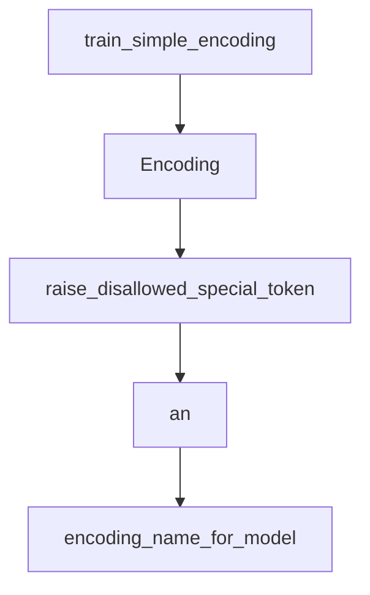

# Chapter 5: Optimization Strategies

Welcome to **Chapter 5: Optimization Strategies**. In this part of **tiktoken Tutorial: OpenAI Token Encoding & Optimization**, you will build an intuitive mental model first, then move into concrete implementation details and practical production tradeoffs.


This chapter focuses on performance and operational optimization for token-heavy systems.

## Strategy 1: Reuse Encoders

```python
import tiktoken

ENC = tiktoken.encoding_for_model("gpt-4.1-mini")

def count_tokens(text: str) -> int:
    return len(ENC.encode(text))
```

## Strategy 2: Cache Common Counts

```python
from functools import lru_cache

@lru_cache(maxsize=20000)
def cached_count(text: str) -> int:
    return len(ENC.encode(text))
```

## Strategy 3: Batch Counting

```python
def count_many(texts):
    return [len(ENC.encode(t)) for t in texts]
```

## Strategy 4: Guardrails in CI

- Add tests for max prompt token budget.
- Fail builds when prompt templates exceed limits.
- Track token deltas for prompt changes.

## Production Checklist

- Fixed encoding strategy per model.
- Centralized counting utility in shared library.
- Caching for repeated templates.
- Alerting for sudden token-cost spikes.

## Final Summary

You now have a complete tiktoken workflow from basics to production optimization.

Next: [Chapter 6: ChatML and Tool Call Accounting](06-chatml-and-tool-calls.md)

Related:
- [OpenAI Python SDK Tutorial](../openai-python-sdk-tutorial/)
- [LangChain Tutorial](../langchain-tutorial/)
- [LlamaIndex Tutorial](../llamaindex-tutorial/)

## What Problem Does This Solve?

Most teams struggle here because the hard part is not writing more code, but deciding clear boundaries for `text`, `encode`, `tiktoken` so behavior stays predictable as complexity grows.

In practical terms, this chapter helps you avoid three common failures:

- coupling core logic too tightly to one implementation path
- missing the handoff boundaries between setup, execution, and validation
- shipping changes without clear rollback or observability strategy

After working through this chapter, you should be able to reason about `Chapter 5: Optimization Strategies` as an operating subsystem inside **tiktoken Tutorial: OpenAI Token Encoding & Optimization**, with explicit contracts for inputs, state transitions, and outputs.

Use the implementation notes around `lru_cache`, `texts`, `encoding_for_model` as your checklist when adapting these patterns to your own repository.

## How it Works Under the Hood

Under the hood, `Chapter 5: Optimization Strategies` usually follows a repeatable control path:

1. **Context bootstrap**: initialize runtime config and prerequisites for `text`.
2. **Input normalization**: shape incoming data so `encode` receives stable contracts.
3. **Core execution**: run the main logic branch and propagate intermediate state through `tiktoken`.
4. **Policy and safety checks**: enforce limits, auth scopes, and failure boundaries.
5. **Output composition**: return canonical result payloads for downstream consumers.
6. **Operational telemetry**: emit logs/metrics needed for debugging and performance tuning.

When debugging, walk this sequence in order and confirm each stage has explicit success/failure conditions.

## Source Walkthrough

Use the following upstream sources to verify implementation details while reading this chapter:

- [tiktoken repository](https://github.com/openai/tiktoken)
  Why it matters: authoritative reference on `tiktoken repository` (github.com).

Suggested trace strategy:
- search upstream code for `text` and `encode` to map concrete implementation paths
- compare docs claims against actual runtime/config code before reusing patterns in production

## Chapter Connections

- [Tutorial Index](README.md)
- [Previous Chapter: Chapter 4: Educational Module](04-educational-module.md)
- [Next Chapter: Chapter 6: ChatML and Tool Call Accounting](06-chatml-and-tool-calls.md)
- [Main Catalog](../../README.md#-tutorial-catalog)
- [A-Z Tutorial Directory](../../discoverability/tutorial-directory.md)

## Source Code Walkthrough

### `tiktoken/_educational.py`

The `train_simple_encoding` function in [`tiktoken/_educational.py`](https://github.com/openai/tiktoken/blob/HEAD/tiktoken/_educational.py) handles a key part of this chapter's functionality:

```py


def train_simple_encoding():
    gpt2_pattern = (
        r"""'s|'t|'re|'ve|'m|'ll|'d| ?[\p{L}]+| ?[\p{N}]+| ?[^\s\p{L}\p{N}]+|\s+(?!\S)|\s+"""
    )
    with open(__file__) as f:
        data = f.read()

    enc = SimpleBytePairEncoding.train(data, vocab_size=600, pat_str=gpt2_pattern)

    print("This is the sequence of merges performed in order to encode 'hello world':")
    tokens = enc.encode("hello world")
    assert enc.decode(tokens) == "hello world"
    assert enc.decode_bytes(tokens) == b"hello world"
    assert enc.decode_tokens_bytes(tokens) == [b"hello", b" world"]

    return enc

```

This function is important because it defines how tiktoken Tutorial: OpenAI Token Encoding & Optimization implements the patterns covered in this chapter.

### `tiktoken/core.py`

The `Encoding` class in [`tiktoken/core.py`](https://github.com/openai/tiktoken/blob/HEAD/tiktoken/core.py) handles a key part of this chapter's functionality:

```py


class Encoding:
    def __init__(
        self,
        name: str,
        *,
        pat_str: str,
        mergeable_ranks: dict[bytes, int],
        special_tokens: dict[str, int],
        explicit_n_vocab: int | None = None,
    ):
        """Creates an Encoding object.

        See openai_public.py for examples of how to construct an Encoding object.

        Args:
            name: The name of the encoding. It should be clear from the name of the encoding
                what behaviour to expect, in particular, encodings with different special tokens
                should have different names.
            pat_str: A regex pattern string that is used to split the input text.
            mergeable_ranks: A dictionary mapping mergeable token bytes to their ranks. The ranks
                must correspond to merge priority.
            special_tokens: A dictionary mapping special token strings to their token values.
            explicit_n_vocab: The number of tokens in the vocabulary. If provided, it is checked
                that the number of mergeable tokens and special tokens is equal to this number.
        """
        self.name = name

        self._pat_str = pat_str
        self._mergeable_ranks = mergeable_ranks
        self._special_tokens = special_tokens
```

This class is important because it defines how tiktoken Tutorial: OpenAI Token Encoding & Optimization implements the patterns covered in this chapter.

### `tiktoken/core.py`

The `raise_disallowed_special_token` function in [`tiktoken/core.py`](https://github.com/openai/tiktoken/blob/HEAD/tiktoken/core.py) handles a key part of this chapter's functionality:

```py
                disallowed_special = frozenset(disallowed_special)
            if match := _special_token_regex(disallowed_special).search(text):
                raise_disallowed_special_token(match.group())

        try:
            return self._core_bpe.encode(text, allowed_special)
        except UnicodeEncodeError:
            # BPE operates on bytes, but the regex operates on unicode. If we pass a str that is
            # invalid UTF-8 to Rust, it will rightfully complain. Here we do a quick and dirty
            # fixup for any surrogate pairs that may have sneaked their way into the text.
            # Technically, this introduces a place where encode + decode doesn't roundtrip a Python
            # string, but given that this is input we want to support, maybe that's okay.
            # Also we use errors="replace" to handle weird things like lone surrogates.
            text = text.encode("utf-16", "surrogatepass").decode("utf-16", "replace")
            return self._core_bpe.encode(text, allowed_special)

    def encode_to_numpy(
        self,
        text: str,
        *,
        allowed_special: Literal["all"] | AbstractSet[str] = set(),  # noqa: B006
        disallowed_special: Literal["all"] | Collection[str] = "all",
    ) -> npt.NDArray[np.uint32]:
        """Encodes a string into tokens, returning a numpy array.

        Avoids the overhead of copying the token buffer into a Python list.
        """
        if allowed_special == "all":
            allowed_special = self.special_tokens_set
        if disallowed_special == "all":
            disallowed_special = self.special_tokens_set - allowed_special
        if disallowed_special:
```

This function is important because it defines how tiktoken Tutorial: OpenAI Token Encoding & Optimization implements the patterns covered in this chapter.

### `tiktoken/core.py`

The `an` interface in [`tiktoken/core.py`](https://github.com/openai/tiktoken/blob/HEAD/tiktoken/core.py) handles a key part of this chapter's functionality:

```py
from __future__ import annotations

import functools
from concurrent.futures import ThreadPoolExecutor
from typing import TYPE_CHECKING, AbstractSet, Collection, Literal, NoReturn, Sequence

from tiktoken import _tiktoken

if TYPE_CHECKING:
    import re

    import numpy as np
    import numpy.typing as npt


class Encoding:
    def __init__(
        self,
        name: str,
        *,
        pat_str: str,
        mergeable_ranks: dict[bytes, int],
        special_tokens: dict[str, int],
        explicit_n_vocab: int | None = None,
    ):
        """Creates an Encoding object.

        See openai_public.py for examples of how to construct an Encoding object.

        Args:
```

This interface is important because it defines how tiktoken Tutorial: OpenAI Token Encoding & Optimization implements the patterns covered in this chapter.


## How These Components Connect


