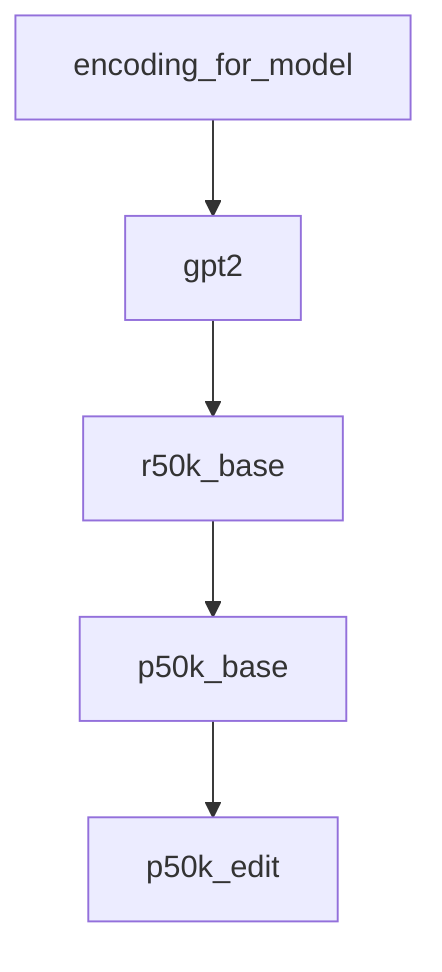

# Chapter 6: ChatML and Tool Call Accounting

Welcome to **Chapter 6: ChatML and Tool Call Accounting**. In this part of **tiktoken Tutorial: OpenAI Token Encoding & Optimization**, you will build an intuitive mental model first, then move into concrete implementation details and practical production tradeoffs.


Accurate token accounting for chat and tools is essential for reliability and cost predictability.

## Where Underestimation Happens

Teams often count only user-visible text and miss:

- role/message wrapper overhead
- tool schema tokens
- serialized tool arguments/results
- retry-induced duplicate token spend

## Accounting Strategy

1. tokenize each message with the exact target encoding
2. add fixed wrapper overhead expected by your request format
3. account for tool payloads separately
4. include response-token guardband for retries/replans

## Example Helper

```python
def estimate_chat_tokens(messages, encoding, fixed_overhead=0):
    total = fixed_overhead
    for m in messages:
        total += len(encoding.encode(m.get("content", "")))
    return total
```

For tool flows, create separate counters for:

- tool call request payload
- tool response payload
- assistant synthesis after tool result

## Operational Use

- preflight estimate before API call
- reject or compress if over budget
- log estimate vs actual for calibration

## Summary

You can now estimate chat/tool token usage with fewer hidden-cost surprises.

Next: [Chapter 7: Multilingual Tokenization](07-multilingual-tokenization.md)

## What Problem Does This Solve?

Most teams struggle here because the hard part is not writing more code, but deciding clear boundaries for `total`, `messages`, `encoding` so behavior stays predictable as complexity grows.

In practical terms, this chapter helps you avoid three common failures:

- coupling core logic too tightly to one implementation path
- missing the handoff boundaries between setup, execution, and validation
- shipping changes without clear rollback or observability strategy

After working through this chapter, you should be able to reason about `Chapter 6: ChatML and Tool Call Accounting` as an operating subsystem inside **tiktoken Tutorial: OpenAI Token Encoding & Optimization**, with explicit contracts for inputs, state transitions, and outputs.

Use the implementation notes around `fixed_overhead`, `estimate_chat_tokens`, `encode` as your checklist when adapting these patterns to your own repository.

## How it Works Under the Hood

Under the hood, `Chapter 6: ChatML and Tool Call Accounting` usually follows a repeatable control path:

1. **Context bootstrap**: initialize runtime config and prerequisites for `total`.
2. **Input normalization**: shape incoming data so `messages` receives stable contracts.
3. **Core execution**: run the main logic branch and propagate intermediate state through `encoding`.
4. **Policy and safety checks**: enforce limits, auth scopes, and failure boundaries.
5. **Output composition**: return canonical result payloads for downstream consumers.
6. **Operational telemetry**: emit logs/metrics needed for debugging and performance tuning.

When debugging, walk this sequence in order and confirm each stage has explicit success/failure conditions.

## Source Walkthrough

Use the following upstream sources to verify implementation details while reading this chapter:

- [tiktoken repository](https://github.com/openai/tiktoken)
  Why it matters: authoritative reference on `tiktoken repository` (github.com).

Suggested trace strategy:
- search upstream code for `total` and `messages` to map concrete implementation paths
- compare docs claims against actual runtime/config code before reusing patterns in production

## Chapter Connections

- [Tutorial Index](README.md)
- [Previous Chapter: Chapter 5: Optimization Strategies](05-optimization-strategies.md)
- [Next Chapter: Chapter 7: Multilingual Tokenization](07-multilingual-tokenization.md)
- [Main Catalog](../../README.md#-tutorial-catalog)
- [A-Z Tutorial Directory](../../discoverability/tutorial-directory.md)

## Source Code Walkthrough

### `tiktoken/model.py`

The `encoding_for_model` function in [`tiktoken/model.py`](https://github.com/openai/tiktoken/blob/HEAD/tiktoken/model.py) handles a key part of this chapter's functionality:

```py


def encoding_for_model(model_name: str) -> Encoding:
    """Returns the encoding used by a model.

    Raises a KeyError if the model name is not recognised.
    """
    return get_encoding(encoding_name_for_model(model_name))

```

This function is important because it defines how tiktoken Tutorial: OpenAI Token Encoding & Optimization implements the patterns covered in this chapter.

### `tiktoken_ext/openai_public.py`

The `gpt2` function in [`tiktoken_ext/openai_public.py`](https://github.com/openai/tiktoken/blob/HEAD/tiktoken_ext/openai_public.py) handles a key part of this chapter's functionality:

```py


def gpt2():
    mergeable_ranks = data_gym_to_mergeable_bpe_ranks(
        vocab_bpe_file="https://openaipublic.blob.core.windows.net/gpt-2/encodings/main/vocab.bpe",
        encoder_json_file="https://openaipublic.blob.core.windows.net/gpt-2/encodings/main/encoder.json",
        vocab_bpe_hash="1ce1664773c50f3e0cc8842619a93edc4624525b728b188a9e0be33b7726adc5",
        encoder_json_hash="196139668be63f3b5d6574427317ae82f612a97c5d1cdaf36ed2256dbf636783",
    )
    return {
        "name": "gpt2",
        "explicit_n_vocab": 50257,
        "pat_str": r50k_pat_str,
        "mergeable_ranks": mergeable_ranks,
        "special_tokens": {ENDOFTEXT: 50256},
    }


def r50k_base():
    mergeable_ranks = load_tiktoken_bpe(
        "https://openaipublic.blob.core.windows.net/encodings/r50k_base.tiktoken",
        expected_hash="306cd27f03c1a714eca7108e03d66b7dc042abe8c258b44c199a7ed9838dd930",
    )
    return {
        "name": "r50k_base",
        "explicit_n_vocab": 50257,
        "pat_str": r50k_pat_str,
        "mergeable_ranks": mergeable_ranks,
        "special_tokens": {ENDOFTEXT: 50256},
    }


```

This function is important because it defines how tiktoken Tutorial: OpenAI Token Encoding & Optimization implements the patterns covered in this chapter.

### `tiktoken_ext/openai_public.py`

The `r50k_base` function in [`tiktoken_ext/openai_public.py`](https://github.com/openai/tiktoken/blob/HEAD/tiktoken_ext/openai_public.py) handles a key part of this chapter's functionality:

```py


def r50k_base():
    mergeable_ranks = load_tiktoken_bpe(
        "https://openaipublic.blob.core.windows.net/encodings/r50k_base.tiktoken",
        expected_hash="306cd27f03c1a714eca7108e03d66b7dc042abe8c258b44c199a7ed9838dd930",
    )
    return {
        "name": "r50k_base",
        "explicit_n_vocab": 50257,
        "pat_str": r50k_pat_str,
        "mergeable_ranks": mergeable_ranks,
        "special_tokens": {ENDOFTEXT: 50256},
    }


def p50k_base():
    mergeable_ranks = load_tiktoken_bpe(
        "https://openaipublic.blob.core.windows.net/encodings/p50k_base.tiktoken",
        expected_hash="94b5ca7dff4d00767bc256fdd1b27e5b17361d7b8a5f968547f9f23eb70d2069",
    )
    return {
        "name": "p50k_base",
        "explicit_n_vocab": 50281,
        "pat_str": r50k_pat_str,
        "mergeable_ranks": mergeable_ranks,
        "special_tokens": {ENDOFTEXT: 50256},
    }


def p50k_edit():
    mergeable_ranks = load_tiktoken_bpe(
```

This function is important because it defines how tiktoken Tutorial: OpenAI Token Encoding & Optimization implements the patterns covered in this chapter.

### `tiktoken_ext/openai_public.py`

The `p50k_base` function in [`tiktoken_ext/openai_public.py`](https://github.com/openai/tiktoken/blob/HEAD/tiktoken_ext/openai_public.py) handles a key part of this chapter's functionality:

```py


def p50k_base():
    mergeable_ranks = load_tiktoken_bpe(
        "https://openaipublic.blob.core.windows.net/encodings/p50k_base.tiktoken",
        expected_hash="94b5ca7dff4d00767bc256fdd1b27e5b17361d7b8a5f968547f9f23eb70d2069",
    )
    return {
        "name": "p50k_base",
        "explicit_n_vocab": 50281,
        "pat_str": r50k_pat_str,
        "mergeable_ranks": mergeable_ranks,
        "special_tokens": {ENDOFTEXT: 50256},
    }


def p50k_edit():
    mergeable_ranks = load_tiktoken_bpe(
        "https://openaipublic.blob.core.windows.net/encodings/p50k_base.tiktoken",
        expected_hash="94b5ca7dff4d00767bc256fdd1b27e5b17361d7b8a5f968547f9f23eb70d2069",
    )
    special_tokens = {ENDOFTEXT: 50256, FIM_PREFIX: 50281, FIM_MIDDLE: 50282, FIM_SUFFIX: 50283}
    return {
        "name": "p50k_edit",
        "pat_str": r50k_pat_str,
        "mergeable_ranks": mergeable_ranks,
        "special_tokens": special_tokens,
    }


def cl100k_base():
    mergeable_ranks = load_tiktoken_bpe(
```

This function is important because it defines how tiktoken Tutorial: OpenAI Token Encoding & Optimization implements the patterns covered in this chapter.


## How These Components Connect


