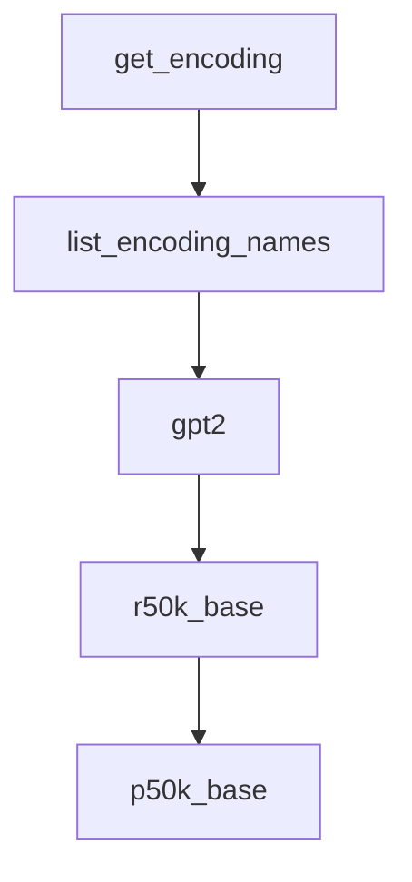

# Chapter 7: Multilingual Tokenization

Welcome to **Chapter 7: Multilingual Tokenization**. In this part of **tiktoken Tutorial: OpenAI Token Encoding & Optimization**, you will build an intuitive mental model first, then move into concrete implementation details and practical production tradeoffs.


Token-per-character ratios vary widely across scripts and languages, so multilingual systems need language-aware budgeting.

## Why It Matters

A prompt that fits comfortably in one language can exceed context limits in another after localization.

High-variance contributors include:

- script differences (Latin vs CJK vs mixed scripts)
- emoji and symbolic characters
- transliterated names and technical terms

## Benchmarking Pattern

Create a multilingual benchmark set with representative prompts per target locale.

For each locale, track:

- input token count distribution
- output token distribution
- truncation/cutoff rate

## Release Guardrails

| Guardrail | Purpose |
|:----------|:--------|
| locale-specific token budgets | prevent hidden overages |
| pre-release localization token tests | catch oversized prompts early |
| fallback compression strategy | preserve essential context under limits |

## Practical Mitigations

- shorten verbose system text in high-token locales
- move repeated instructions to reusable templates
- summarize long retrieved context before generation

## Summary

You can now design multilingual prompt systems that are budget-aware and resilient across languages.

Next: [Chapter 8: Cost Governance](08-cost-governance.md)

## What Problem Does This Solve?

Most teams struggle here because the hard part is not writing more code, but deciding clear boundaries for core abstractions in this chapter so behavior stays predictable as complexity grows.

In practical terms, this chapter helps you avoid three common failures:

- coupling core logic too tightly to one implementation path
- missing the handoff boundaries between setup, execution, and validation
- shipping changes without clear rollback or observability strategy

After working through this chapter, you should be able to reason about `Chapter 7: Multilingual Tokenization` as an operating subsystem inside **tiktoken Tutorial: OpenAI Token Encoding & Optimization**, with explicit contracts for inputs, state transitions, and outputs.

Use the implementation notes around execution and reliability details as your checklist when adapting these patterns to your own repository.

## How it Works Under the Hood

Under the hood, `Chapter 7: Multilingual Tokenization` usually follows a repeatable control path:

1. **Context bootstrap**: initialize runtime config and prerequisites for `core component`.
2. **Input normalization**: shape incoming data so `execution layer` receives stable contracts.
3. **Core execution**: run the main logic branch and propagate intermediate state through `state model`.
4. **Policy and safety checks**: enforce limits, auth scopes, and failure boundaries.
5. **Output composition**: return canonical result payloads for downstream consumers.
6. **Operational telemetry**: emit logs/metrics needed for debugging and performance tuning.

When debugging, walk this sequence in order and confirm each stage has explicit success/failure conditions.

## Source Walkthrough

Use the following upstream sources to verify implementation details while reading this chapter:

- [tiktoken repository](https://github.com/openai/tiktoken)
  Why it matters: authoritative reference on `tiktoken repository` (github.com).

Suggested trace strategy:
- search upstream code for `Multilingual` and `Tokenization` to map concrete implementation paths
- compare docs claims against actual runtime/config code before reusing patterns in production

## Chapter Connections

- [Tutorial Index](README.md)
- [Previous Chapter: Chapter 6: ChatML and Tool Call Accounting](06-chatml-and-tool-calls.md)
- [Next Chapter: Chapter 8: Cost Governance](08-cost-governance.md)
- [Main Catalog](../../README.md#-tutorial-catalog)
- [A-Z Tutorial Directory](../../discoverability/tutorial-directory.md)

## Depth Expansion Playbook

## Source Code Walkthrough

### `tiktoken/registry.py`

The `get_encoding` function in [`tiktoken/registry.py`](https://github.com/openai/tiktoken/blob/HEAD/tiktoken/registry.py) handles a key part of this chapter's functionality:

```py


def get_encoding(encoding_name: str) -> Encoding:
    if not isinstance(encoding_name, str):
        raise ValueError(f"Expected a string in get_encoding, got {type(encoding_name)}")

    if encoding_name in ENCODINGS:
        return ENCODINGS[encoding_name]

    with _lock:
        if encoding_name in ENCODINGS:
            return ENCODINGS[encoding_name]

        if ENCODING_CONSTRUCTORS is None:
            _find_constructors()
            assert ENCODING_CONSTRUCTORS is not None

        if encoding_name not in ENCODING_CONSTRUCTORS:
            raise ValueError(
                f"Unknown encoding {encoding_name}.\n"
                f"Plugins found: {_available_plugin_modules()}\n"
                f"tiktoken version: {tiktoken.__version__} (are you on latest?)"
            )

        constructor = ENCODING_CONSTRUCTORS[encoding_name]
        enc = Encoding(**constructor())
        ENCODINGS[encoding_name] = enc
        return enc


def list_encoding_names() -> list[str]:
    with _lock:
```

This function is important because it defines how tiktoken Tutorial: OpenAI Token Encoding & Optimization implements the patterns covered in this chapter.

### `tiktoken/registry.py`

The `list_encoding_names` function in [`tiktoken/registry.py`](https://github.com/openai/tiktoken/blob/HEAD/tiktoken/registry.py) handles a key part of this chapter's functionality:

```py


def list_encoding_names() -> list[str]:
    with _lock:
        if ENCODING_CONSTRUCTORS is None:
            _find_constructors()
            assert ENCODING_CONSTRUCTORS is not None
        return list(ENCODING_CONSTRUCTORS)

```

This function is important because it defines how tiktoken Tutorial: OpenAI Token Encoding & Optimization implements the patterns covered in this chapter.

### `tiktoken_ext/openai_public.py`

The `gpt2` function in [`tiktoken_ext/openai_public.py`](https://github.com/openai/tiktoken/blob/HEAD/tiktoken_ext/openai_public.py) handles a key part of this chapter's functionality:

```py


def gpt2():
    mergeable_ranks = data_gym_to_mergeable_bpe_ranks(
        vocab_bpe_file="https://openaipublic.blob.core.windows.net/gpt-2/encodings/main/vocab.bpe",
        encoder_json_file="https://openaipublic.blob.core.windows.net/gpt-2/encodings/main/encoder.json",
        vocab_bpe_hash="1ce1664773c50f3e0cc8842619a93edc4624525b728b188a9e0be33b7726adc5",
        encoder_json_hash="196139668be63f3b5d6574427317ae82f612a97c5d1cdaf36ed2256dbf636783",
    )
    return {
        "name": "gpt2",
        "explicit_n_vocab": 50257,
        "pat_str": r50k_pat_str,
        "mergeable_ranks": mergeable_ranks,
        "special_tokens": {ENDOFTEXT: 50256},
    }


def r50k_base():
    mergeable_ranks = load_tiktoken_bpe(
        "https://openaipublic.blob.core.windows.net/encodings/r50k_base.tiktoken",
        expected_hash="306cd27f03c1a714eca7108e03d66b7dc042abe8c258b44c199a7ed9838dd930",
    )
    return {
        "name": "r50k_base",
        "explicit_n_vocab": 50257,
        "pat_str": r50k_pat_str,
        "mergeable_ranks": mergeable_ranks,
        "special_tokens": {ENDOFTEXT: 50256},
    }


```

This function is important because it defines how tiktoken Tutorial: OpenAI Token Encoding & Optimization implements the patterns covered in this chapter.

### `tiktoken_ext/openai_public.py`

The `r50k_base` function in [`tiktoken_ext/openai_public.py`](https://github.com/openai/tiktoken/blob/HEAD/tiktoken_ext/openai_public.py) handles a key part of this chapter's functionality:

```py


def r50k_base():
    mergeable_ranks = load_tiktoken_bpe(
        "https://openaipublic.blob.core.windows.net/encodings/r50k_base.tiktoken",
        expected_hash="306cd27f03c1a714eca7108e03d66b7dc042abe8c258b44c199a7ed9838dd930",
    )
    return {
        "name": "r50k_base",
        "explicit_n_vocab": 50257,
        "pat_str": r50k_pat_str,
        "mergeable_ranks": mergeable_ranks,
        "special_tokens": {ENDOFTEXT: 50256},
    }


def p50k_base():
    mergeable_ranks = load_tiktoken_bpe(
        "https://openaipublic.blob.core.windows.net/encodings/p50k_base.tiktoken",
        expected_hash="94b5ca7dff4d00767bc256fdd1b27e5b17361d7b8a5f968547f9f23eb70d2069",
    )
    return {
        "name": "p50k_base",
        "explicit_n_vocab": 50281,
        "pat_str": r50k_pat_str,
        "mergeable_ranks": mergeable_ranks,
        "special_tokens": {ENDOFTEXT: 50256},
    }


def p50k_edit():
    mergeable_ranks = load_tiktoken_bpe(
```

This function is important because it defines how tiktoken Tutorial: OpenAI Token Encoding & Optimization implements the patterns covered in this chapter.


## How These Components Connect


