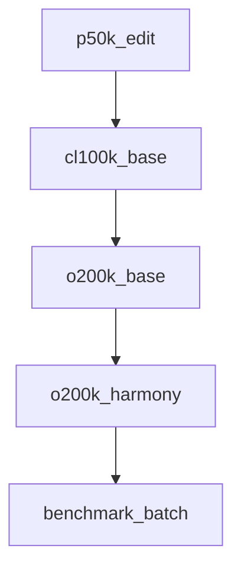

# Chapter 8: Cost Governance

Welcome to **Chapter 8: Cost Governance**. In this part of **tiktoken Tutorial: OpenAI Token Encoding & Optimization**, you will build an intuitive mental model first, then move into concrete implementation details and practical production tradeoffs.


This chapter closes with FinOps controls that keep token spend aligned with product value.

## Governance Framework

1. define spend budgets by tenant and feature
2. map each workflow to an expected token envelope
3. monitor real-time variance from baseline
4. trigger alerts and automated controls on anomalies

## Core Controls

- per-tenant hard and soft token limits
- model tiering by task complexity
- prompt-change reviews for high-cost workflows
- cache and reuse deterministic intermediate outputs

## Cost Attribution

Track spend by:

- feature/workflow
- customer/tenant
- model tier
- environment (dev/stage/prod)

Without attribution, optimization efforts become guesswork.

## Response Controls

When cost spikes occur:

- reduce output length caps
- switch low-priority flows to cheaper model tier
- enable aggressive context compression
- require explicit approval for expensive workflows

## Final Summary

You now have an end-to-end cost-governance playbook for operating tokenized AI systems at scale.

Related:
- [OpenAI Python SDK Tutorial](../openai-python-sdk-tutorial/)
- [LangChain Tutorial](../langchain-tutorial/)

## What Problem Does This Solve?

Most teams struggle here because the hard part is not writing more code, but deciding clear boundaries for core abstractions in this chapter so behavior stays predictable as complexity grows.

In practical terms, this chapter helps you avoid three common failures:

- coupling core logic too tightly to one implementation path
- missing the handoff boundaries between setup, execution, and validation
- shipping changes without clear rollback or observability strategy

After working through this chapter, you should be able to reason about `Chapter 8: Cost Governance` as an operating subsystem inside **tiktoken Tutorial: OpenAI Token Encoding & Optimization**, with explicit contracts for inputs, state transitions, and outputs.

Use the implementation notes around execution and reliability details as your checklist when adapting these patterns to your own repository.

## How it Works Under the Hood

Under the hood, `Chapter 8: Cost Governance` usually follows a repeatable control path:

1. **Context bootstrap**: initialize runtime config and prerequisites for `core component`.
2. **Input normalization**: shape incoming data so `execution layer` receives stable contracts.
3. **Core execution**: run the main logic branch and propagate intermediate state through `state model`.
4. **Policy and safety checks**: enforce limits, auth scopes, and failure boundaries.
5. **Output composition**: return canonical result payloads for downstream consumers.
6. **Operational telemetry**: emit logs/metrics needed for debugging and performance tuning.

When debugging, walk this sequence in order and confirm each stage has explicit success/failure conditions.

## Source Walkthrough

Use the following upstream sources to verify implementation details while reading this chapter:

- [tiktoken repository](https://github.com/openai/tiktoken)
  Why it matters: authoritative reference on `tiktoken repository` (github.com).

Suggested trace strategy:
- search upstream code for `Cost` and `Governance` to map concrete implementation paths
- compare docs claims against actual runtime/config code before reusing patterns in production

## Chapter Connections

- [Tutorial Index](README.md)
- [Previous Chapter: Chapter 7: Multilingual Tokenization](07-multilingual-tokenization.md)
- [Main Catalog](../../README.md#-tutorial-catalog)
- [A-Z Tutorial Directory](../../discoverability/tutorial-directory.md)

## Depth Expansion Playbook

## Source Code Walkthrough

### `tiktoken_ext/openai_public.py`

The `p50k_edit` function in [`tiktoken_ext/openai_public.py`](https://github.com/openai/tiktoken/blob/HEAD/tiktoken_ext/openai_public.py) handles a key part of this chapter's functionality:

```py


def p50k_edit():
    mergeable_ranks = load_tiktoken_bpe(
        "https://openaipublic.blob.core.windows.net/encodings/p50k_base.tiktoken",
        expected_hash="94b5ca7dff4d00767bc256fdd1b27e5b17361d7b8a5f968547f9f23eb70d2069",
    )
    special_tokens = {ENDOFTEXT: 50256, FIM_PREFIX: 50281, FIM_MIDDLE: 50282, FIM_SUFFIX: 50283}
    return {
        "name": "p50k_edit",
        "pat_str": r50k_pat_str,
        "mergeable_ranks": mergeable_ranks,
        "special_tokens": special_tokens,
    }


def cl100k_base():
    mergeable_ranks = load_tiktoken_bpe(
        "https://openaipublic.blob.core.windows.net/encodings/cl100k_base.tiktoken",
        expected_hash="223921b76ee99bde995b7ff738513eef100fb51d18c93597a113bcffe865b2a7",
    )
    special_tokens = {
        ENDOFTEXT: 100257,
        FIM_PREFIX: 100258,
        FIM_MIDDLE: 100259,
        FIM_SUFFIX: 100260,
        ENDOFPROMPT: 100276,
    }
    return {
        "name": "cl100k_base",
        "pat_str": r"""'(?i:[sdmt]|ll|ve|re)|[^\r\n\p{L}\p{N}]?+\p{L}++|\p{N}{1,3}+| ?[^\s\p{L}\p{N}]++[\r\n]*+|\s++$|\s*[\r\n]|\s+(?!\S)|\s""",
        "mergeable_ranks": mergeable_ranks,
```

This function is important because it defines how tiktoken Tutorial: OpenAI Token Encoding & Optimization implements the patterns covered in this chapter.

### `tiktoken_ext/openai_public.py`

The `cl100k_base` function in [`tiktoken_ext/openai_public.py`](https://github.com/openai/tiktoken/blob/HEAD/tiktoken_ext/openai_public.py) handles a key part of this chapter's functionality:

```py


def cl100k_base():
    mergeable_ranks = load_tiktoken_bpe(
        "https://openaipublic.blob.core.windows.net/encodings/cl100k_base.tiktoken",
        expected_hash="223921b76ee99bde995b7ff738513eef100fb51d18c93597a113bcffe865b2a7",
    )
    special_tokens = {
        ENDOFTEXT: 100257,
        FIM_PREFIX: 100258,
        FIM_MIDDLE: 100259,
        FIM_SUFFIX: 100260,
        ENDOFPROMPT: 100276,
    }
    return {
        "name": "cl100k_base",
        "pat_str": r"""'(?i:[sdmt]|ll|ve|re)|[^\r\n\p{L}\p{N}]?+\p{L}++|\p{N}{1,3}+| ?[^\s\p{L}\p{N}]++[\r\n]*+|\s++$|\s*[\r\n]|\s+(?!\S)|\s""",
        "mergeable_ranks": mergeable_ranks,
        "special_tokens": special_tokens,
    }


def o200k_base():
    mergeable_ranks = load_tiktoken_bpe(
        "https://openaipublic.blob.core.windows.net/encodings/o200k_base.tiktoken",
        expected_hash="446a9538cb6c348e3516120d7c08b09f57c36495e2acfffe59a5bf8b0cfb1a2d",
    )
    special_tokens = {ENDOFTEXT: 199999, ENDOFPROMPT: 200018}
    # This regex could be made more efficient. If I was the one working on this encoding, I would
    # have done a few other things differently too, e.g. I think you can allocate tokens more
    # efficiently across languages.
    pat_str = "|".join(
```

This function is important because it defines how tiktoken Tutorial: OpenAI Token Encoding & Optimization implements the patterns covered in this chapter.

### `tiktoken_ext/openai_public.py`

The `o200k_base` function in [`tiktoken_ext/openai_public.py`](https://github.com/openai/tiktoken/blob/HEAD/tiktoken_ext/openai_public.py) handles a key part of this chapter's functionality:

```py


def o200k_base():
    mergeable_ranks = load_tiktoken_bpe(
        "https://openaipublic.blob.core.windows.net/encodings/o200k_base.tiktoken",
        expected_hash="446a9538cb6c348e3516120d7c08b09f57c36495e2acfffe59a5bf8b0cfb1a2d",
    )
    special_tokens = {ENDOFTEXT: 199999, ENDOFPROMPT: 200018}
    # This regex could be made more efficient. If I was the one working on this encoding, I would
    # have done a few other things differently too, e.g. I think you can allocate tokens more
    # efficiently across languages.
    pat_str = "|".join(
        [
            r"""[^\r\n\p{L}\p{N}]?[\p{Lu}\p{Lt}\p{Lm}\p{Lo}\p{M}]*[\p{Ll}\p{Lm}\p{Lo}\p{M}]+(?i:'s|'t|'re|'ve|'m|'ll|'d)?""",
            r"""[^\r\n\p{L}\p{N}]?[\p{Lu}\p{Lt}\p{Lm}\p{Lo}\p{M}]+[\p{Ll}\p{Lm}\p{Lo}\p{M}]*(?i:'s|'t|'re|'ve|'m|'ll|'d)?""",
            r"""\p{N}{1,3}""",
            r""" ?[^\s\p{L}\p{N}]+[\r\n/]*""",
            r"""\s*[\r\n]+""",
            r"""\s+(?!\S)""",
            r"""\s+""",
        ]
    )
    return {
        "name": "o200k_base",
        "pat_str": pat_str,
        "mergeable_ranks": mergeable_ranks,
        "special_tokens": special_tokens,
    }


def o200k_harmony():
    base_enc = o200k_base()
```

This function is important because it defines how tiktoken Tutorial: OpenAI Token Encoding & Optimization implements the patterns covered in this chapter.

### `tiktoken_ext/openai_public.py`

The `o200k_harmony` function in [`tiktoken_ext/openai_public.py`](https://github.com/openai/tiktoken/blob/HEAD/tiktoken_ext/openai_public.py) handles a key part of this chapter's functionality:

```py


def o200k_harmony():
    base_enc = o200k_base()
    name = "o200k_harmony"
    pat_str = base_enc["pat_str"]
    mergeable_ranks = base_enc["mergeable_ranks"]
    special_tokens = {
        **base_enc["special_tokens"],
        "<|startoftext|>": 199998,
        "<|endoftext|>": 199999,
        "<|reserved_200000|>": 200000,
        "<|reserved_200001|>": 200001,
        "<|return|>": 200002,
        "<|constrain|>": 200003,
        "<|reserved_200004|>": 200004,
        "<|channel|>": 200005,
        "<|start|>": 200006,
        "<|end|>": 200007,
        "<|message|>": 200008,
        "<|reserved_200009|>": 200009,
        "<|reserved_200010|>": 200010,
        "<|reserved_200011|>": 200011,
        "<|call|>": 200012,
    } | {f"<|reserved_{i}|>": i for i in range(200013, 201088)}
    return {
        "name": name,
        "pat_str": pat_str,
        "mergeable_ranks": mergeable_ranks,
        "special_tokens": special_tokens,
    }

```

This function is important because it defines how tiktoken Tutorial: OpenAI Token Encoding & Optimization implements the patterns covered in this chapter.


## How These Components Connect


