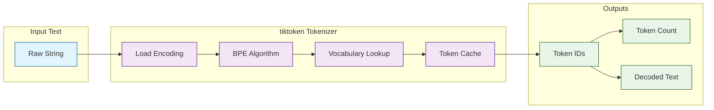

# tiktoken Tutorial: OpenAI Token Encoding & Optimization

> Master tiktoken, OpenAI's fast BPE tokenizer, to accurately count tokens, optimize prompts, and reduce API costs.

[](https://github.com/openai/tiktoken)
[](https://opensource.org/licenses/MIT)
[](https://github.com/openai/tiktoken)

## 🎯 What is tiktoken?

**tiktoken** is a fast Byte Pair Encoding (BPE) tokenizer library created by OpenAI for use with their models. It's 3-6x faster than comparable tokenizers and provides accurate token counting for GPT models, enabling precise cost estimation and context management.

### Key Features

| Feature | Description |
|:--------|:------------|
| **Fast Performance** | 3-6x faster than alternatives, written in Rust |
| **Accurate Counting** | Exact token counts for GPT-3.5, GPT-4, embeddings |
| **Multiple Encodings** | cl100k_base (GPT-4), p50k_base (GPT-3.5), r50k_base (legacy) |
| **Educational** | Includes `tiktoken._educational` for learning BPE |
| **Reversible** | Lossless encoding/decoding of any text |
| **Efficient** | ~4 bytes per token on average, excellent compression |

## Architecture Overview



## Tutorial Structure

| Chapter | Topic | What You'll Learn |
|:--------|:------|:------------------|
| [1. Getting Started](01-getting-started.md) | Basics | Installation, first encoding, BPE fundamentals |
| [2. Tokenization Mechanics](02-tokenization-mechanics.md) | Deep Dive | How BPE works, encoding algorithms, vocabulary |
| [3. Practical Applications](03-practical-applications.md) | Use Cases | Token counting, cost estimation, prompt optimization |
| [4. Educational Module](04-educational-module.md) | Learning | Training custom tokenizers, visualization tools |
| [5. Optimization Strategies](05-optimization-strategies.md) | Performance | Caching, batch processing, performance tuning |
| [6. ChatML and Tool Call Accounting](06-chatml-and-tool-calls.md) | Chat Workloads | Message-format overhead and tool payload budgeting |
| [7. Multilingual Tokenization](07-multilingual-tokenization.md) | Localization | Cross-language token variance and budget planning |
| [8. Cost Governance](08-cost-governance.md) | Operations | Token spend controls and production FinOps |

## Tech Stack

| Component | Technology |
|:----------|:-----------|
| **Core Library** | Rust (for performance) |
| **Python Bindings** | PyO3 |
| **Algorithm** | Byte Pair Encoding (BPE) |
| **Supported Encodings** | cl100k_base, p50k_base, r50k_base, p50k_edit, gpt2 |
| **Installation** | pip (pre-compiled wheels) |

## What You'll Learn

By the end of this tutorial, you'll be able to:

- **Count Tokens Accurately** for any GPT model before making API calls
- **Understand BPE** and how tokenization affects model behavior
- **Optimize Prompts** to stay within context limits and reduce costs
- **Estimate API Costs** precisely using token counts
- **Handle Edge Cases** like special tokens, Unicode, and rare characters
- **Build Custom Tokenizers** using the educational module
- **Integrate with Applications** for real-time token management

## Prerequisites

- **Python** programming experience
- **Basic understanding** of strings and encoding
- **OpenAI API** usage helpful but not required
- **pip** for package installation

## Related Tutorials

**Prerequisites:**
- None - this is a foundational utility tutorial

**Complementary:**
- [OpenAI Python SDK Tutorial](../openai-python-sdk-tutorial/) - Using tiktoken with OpenAI API
- [LangChain Tutorial](../langchain-tutorial/) - Token counting in LLM frameworks
- [LlamaIndex Tutorial](../llamaindex-tutorial/) - Token management in RAG systems

**Next Steps:**
- Prompt optimization techniques
- Context window management
- Cost-effective API usage patterns

## Why Token Counting Matters

### Cost Estimation
```python
import tiktoken

enc = tiktoken.encoding_for_model("gpt-4")
tokens = enc.encode("Your prompt here")
cost = len(tokens) * 0.00003  # GPT-4 Turbo pricing
print(f"Estimated cost: ${cost:.6f}")
```

### Context Management
```python
max_tokens = 8192  # GPT-4 context limit
prompt_tokens = len(enc.encode(prompt))
max_response = max_tokens - prompt_tokens
```

### Chunking for RAG
```python
def chunk_text(text, max_tokens=500):
    tokens = enc.encode(text)
    chunks = [tokens[i:i+max_tokens] for i in range(0, len(tokens), max_tokens)]
    return [enc.decode(chunk) for chunk in chunks]
```

## Supported Encodings

| Encoding | Models | Vocabulary Size | Use Case |
|:---------|:-------|:----------------|:---------|
| **cl100k_base** | GPT-4, GPT-3.5 Turbo, text-embedding-3 | 100,256 | Current production models |
| **p50k_base** | GPT-3 (Davinci, Curie) | 50,281 | Legacy GPT-3 models |
| **r50k_base** | GPT-2, early GPT-3 | 50,257 | Legacy/research |
| **p50k_edit** | text-davinci-edit-001 | 50,281 | Edit models |
| **gpt2** | GPT-2 | 50,257 | Research/compatibility |

---

Ready to begin? Start with [Chapter 1: Getting Started](01-getting-started.md).

---

*Built with insights from the [tiktoken repository](https://github.com/openai/tiktoken) and OpenAI tokenization documentation.*

## Navigation & Backlinks

- [Start Here: Chapter 1: Getting Started](01-getting-started.md)
- [Back to Main Catalog](../../README.md#-tutorial-catalog)
- [Browse A-Z Tutorial Directory](../../discoverability/tutorial-directory.md)
- [Search by Intent](../../discoverability/query-hub.md)
- [Explore Category Hubs](../../README.md#category-hubs)

## Full Chapter Map

1. [Chapter 1: Getting Started](01-getting-started.md)
2. [Chapter 2: Tokenization Mechanics](02-tokenization-mechanics.md)
3. [Chapter 3: Practical Applications](03-practical-applications.md)
4. [Chapter 4: Educational Module](04-educational-module.md)
5. [Chapter 5: Optimization Strategies](05-optimization-strategies.md)
6. [Chapter 6: ChatML and Tool Call Accounting](06-chatml-and-tool-calls.md)
7. [Chapter 7: Multilingual Tokenization](07-multilingual-tokenization.md)
8. [Chapter 8: Cost Governance](08-cost-governance.md)

## Source References

- [tiktoken repository](https://github.com/openai/tiktoken)

*Generated by [AI Codebase Knowledge Builder](https://github.com/The-Pocket/Tutorial-Codebase-Knowledge)*
