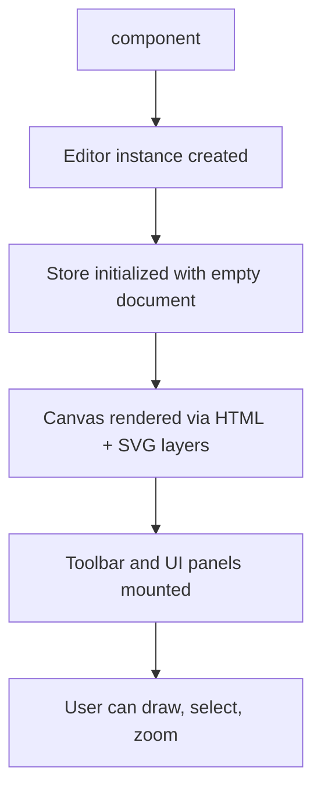
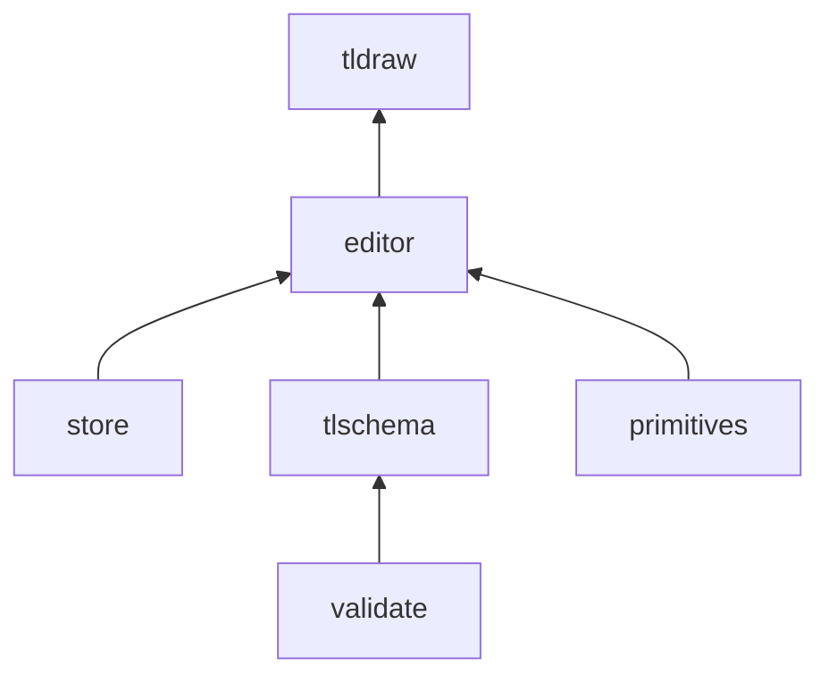
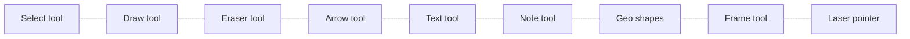

# Chapter 1: Getting Started

Welcome to **Chapter 1: Getting Started**. In this part of **tldraw Tutorial: Infinite Canvas SDK with AI-Powered "Make Real" App Generation**, you will install tldraw, render your first infinite canvas, and understand the project structure well enough to navigate the codebase confidently.

tldraw is a React-based infinite canvas library that provides a complete whiteboard experience out of the box — drawing, shapes, text, images, arrow connectors, and more. It is both a standalone application and an embeddable SDK, making it the foundation for dozens of commercial products.

## What Problem Does This Solve?

Building an infinite canvas from scratch requires solving dozens of hard problems: viewport transformations, shape hit-testing, selection management, undo/redo, clipboard handling, and accessible keyboard interactions. tldraw solves all of these so you can focus on your application-specific logic. This chapter gives you a working setup in under five minutes.

## Learning Goals

- install tldraw in a new or existing React project
- render the default canvas component and understand what ships out of the box
- explore the monorepo structure to locate key packages
- use the Editor API to programmatically add shapes
- configure basic options like dark mode, read-only mode, and initial data

## Prerequisites

- **Node.js** >= 18.x
- **npm**, **yarn**, or **pnpm**
- Basic familiarity with React and TypeScript

## Step 1: Create a New Project

The fastest path is to scaffold a new Vite + React + TypeScript project and add tldraw:

```bash
# Scaffold a new project
npm create vite@latest my-canvas-app -- --template react-ts
cd my-canvas-app

# Install tldraw
npm install tldraw

# Start the dev server
npm run dev
```

## Step 2: Render the Canvas

Replace the contents of `src/App.tsx` with the minimal tldraw setup:

```typescript
// src/App.tsx
import { Tldraw } from 'tldraw'
import 'tldraw/tldraw.css'

export default function App() {
  return (
    <div style={{ position: 'fixed', inset: 0 }}>
      <Tldraw />
    </div>
  )
}
```

The `<Tldraw />` component renders the full canvas experience: toolbar, shape tools, selection, zoom controls, and the infinite drawing surface. The wrapping `div` with `position: fixed; inset: 0` ensures the canvas fills the viewport.



## Step 3: Understand the Monorepo Structure

If you clone the tldraw repository to explore the source code:

```bash
git clone https://github.com/tldraw/tldraw.git
cd tldraw
```

The monorepo is organized into these key areas:

```
tldraw/
├── packages/
│   ├── tldraw/           # Main package — the full editor component
│   ├── editor/           # Core editor engine — state, shapes, tools
│   ├── store/            # Reactive record store with undo/redo
│   ├── tlschema/         # Shape and record type definitions
│   ├── primitives/       # Geometry utilities — vectors, beziers, intersections
│   └── validate/         # Runtime type validation
├── apps/
│   ├── dotcom/           # tldraw.com production application
│   ├── examples/         # Interactive examples and recipes
│   └── docs/             # Documentation site
└── scripts/              # Build and release tooling
```

### Package Dependency Flow



The `tldraw` package re-exports everything from `editor`, `store`, and `tlschema`, so most applications only need to depend on `tldraw` directly.

## Step 4: Access the Editor Programmatically

The `<Tldraw />` component exposes the Editor instance through an `onMount` callback:

```typescript
import { Tldraw, Editor } from 'tldraw'
import 'tldraw/tldraw.css'

export default function App() {
  const handleMount = (editor: Editor) => {
    // Programmatically create a rectangle
    editor.createShape({
      type: 'geo',
      x: 100,
      y: 100,
      props: {
        w: 200,
        h: 150,
        geo: 'rectangle',
        color: 'blue',
        fill: 'solid',
      },
    })

    // Create a text shape
    editor.createShape({
      type: 'text',
      x: 130,
      y: 160,
      props: {
        text: 'Hello, tldraw!',
        color: 'white',
        size: 'm',
      },
    })

    // Zoom to fit all shapes
    editor.zoomToFit()
  }

  return (
    <div style={{ position: 'fixed', inset: 0 }}>
      <Tldraw onMount={handleMount} />
    </div>
  )
}
```

The `editor` object is the central API surface. You will explore it in depth in [Chapter 2: Editor Architecture](02-editor-architecture.md).

## Step 5: Configure Basic Options

tldraw accepts several props for common configuration:

```typescript
import { Tldraw } from 'tldraw'
import 'tldraw/tldraw.css'

export default function App() {
  return (
    <div style={{ position: 'fixed', inset: 0 }}>
      <Tldraw
        // Start in dark mode
        inferDarkMode

        // Persist to browser localStorage
        persistenceKey="my-canvas"

        // Hide the debug panel
        hideUi={false}

        // Provide initial shapes via a snapshot
        // snapshot={mySnapshot}
      />
    </div>
  )
}
```

### Key Configuration Props

| Prop | Purpose |
|:-----|:--------|
| `persistenceKey` | Persist canvas data to localStorage under this key |
| `inferDarkMode` | Auto-detect dark mode from the host page |
| `snapshot` | Load an initial document snapshot |
| `onMount` | Callback with the Editor instance after initialization |
| `components` | Override built-in UI components (toolbar, panels, etc.) |
| `shapeUtils` | Register custom shape types (see [Chapter 3](03-shape-system.md)) |
| `tools` | Register custom tools (see [Chapter 4](04-tools-and-interactions.md)) |

## Step 6: Explore the Default Tools

Out of the box, tldraw provides these tools in the toolbar:



Each tool is a state machine that handles pointer events, keyboard shortcuts, and rendering previews. You will build your own custom tools in [Chapter 4: Tools and Interactions](04-tools-and-interactions.md).

## Under the Hood

When `<Tldraw />` mounts, the following sequence occurs:

1. A `Store` instance is created, containing an empty document with one page
2. An `Editor` instance is created, binding the store to the DOM container
3. The rendering pipeline sets up two layers: an HTML layer for shape components and an SVG layer for overlays (selection, handles, brush)
4. The toolbar and UI panels are mounted as React components that read from the Editor's reactive state
5. Event listeners are attached for pointer, keyboard, wheel, and touch events
6. If `persistenceKey` is provided, the store loads any persisted data from localStorage

This initialization takes roughly 50-100ms on modern hardware, producing a fully interactive canvas.

## Summary

You now have a working tldraw canvas in a React application. You can programmatically create shapes, configure the editor, and navigate the source code monorepo. In the next chapter, you will dive into the Editor architecture to understand how state, rendering, and interaction are orchestrated.

---

**Next**: [Chapter 2: Editor Architecture](02-editor-architecture.md)

---

[Back to tldraw Tutorial](README.md) | [Chapter 2: Editor Architecture](02-editor-architecture.md)
