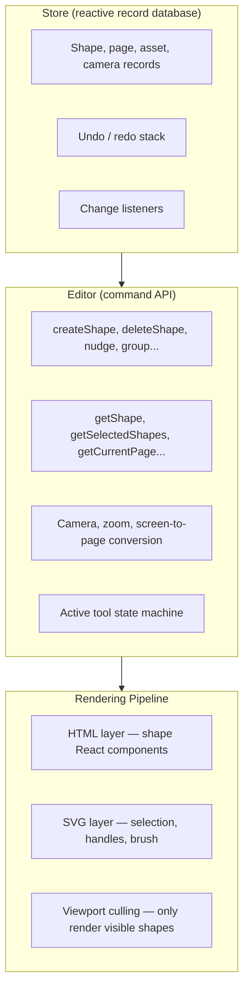
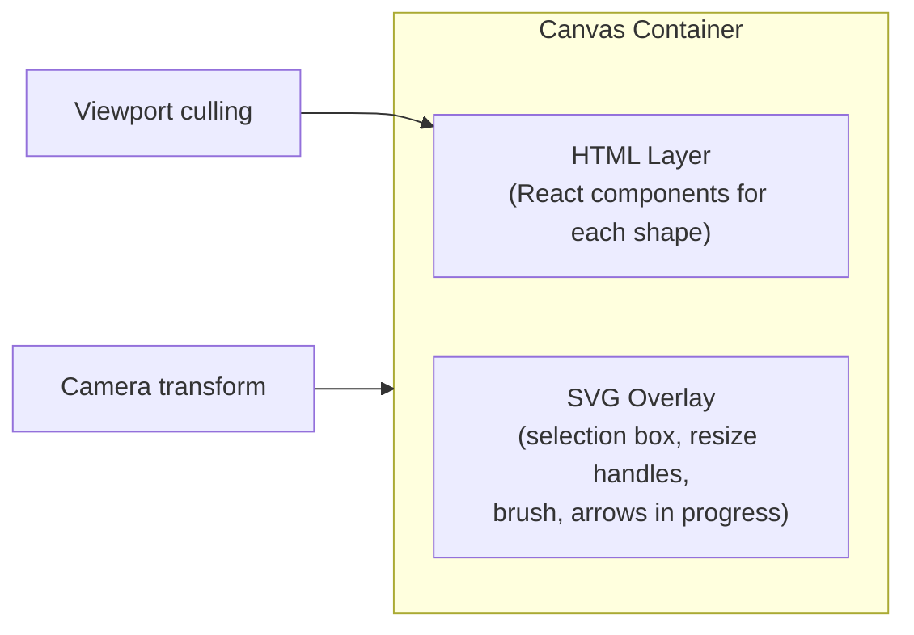
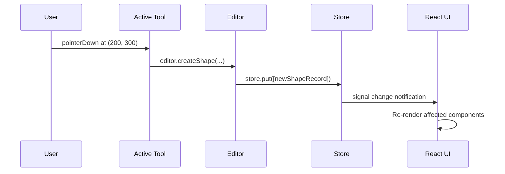
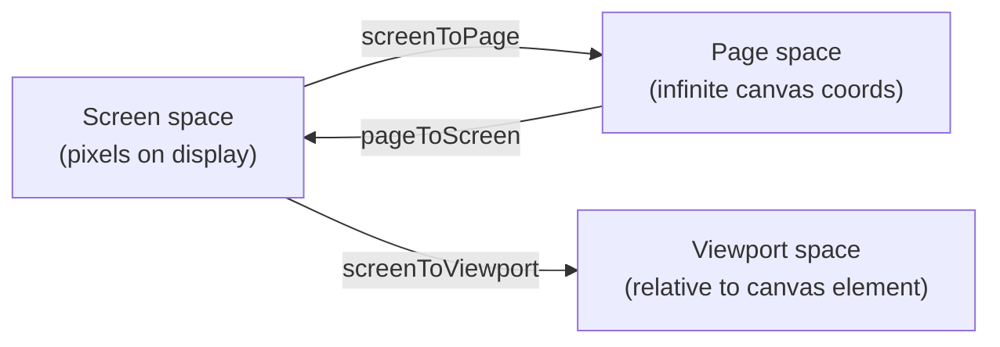

# Chapter 2: Editor Architecture

Welcome to **Chapter 2: Editor Architecture**. In this part of **tldraw Tutorial**, you will learn how the Editor class, the reactive Store, and the rendering pipeline work together to deliver a responsive infinite canvas experience.

In [Chapter 1](01-getting-started.md), you rendered a canvas and used `onMount` to access the Editor instance. Now you will understand what that Editor actually is and how it coordinates every aspect of the application.

## What Problem Does This Solve?

An infinite canvas must handle dozens of interrelated concerns — shape records, viewport state, selection, undo/redo, tool state, rendering, and persistence — all while maintaining 60fps interactivity. The Editor architecture solves this by layering a reactive state system (the Store) beneath a command-oriented API (the Editor) that drives a declarative rendering pipeline.

## Learning Goals

- understand the relationship between Editor, Store, and TLSchema
- learn how reactive signals drive efficient re-rendering
- trace the flow from user input to state change to rendered output
- use the Editor API for viewport manipulation, selection, and history

## The Three Pillars



### 1. The Store

The Store is a reactive, in-memory database of typed records. Every piece of tldraw state — shapes, pages, assets, the camera position, instance settings — lives as a record in the Store.

```typescript
import { createTLStore, defaultShapeUtils } from 'tldraw'

// Create a store with the default shape definitions
const store = createTLStore({
  shapeUtils: defaultShapeUtils,
})

// The store holds typed records keyed by ID
// Each record has a typeName and an id
// Examples of record types:
//   shape   — every shape on the canvas
//   page    — each page in the document
//   asset   — uploaded images, videos
//   camera  — viewport position per page
//   instance — editor instance state (selected tool, etc.)
```

The Store uses **signals** (reactive primitives) so that any code reading a value automatically subscribes to changes. When a record changes, only the components that depend on it re-render:

```typescript
// Reading from the store is reactive
// This hook re-renders only when the specific shape changes
import { useEditor, useValue } from 'tldraw'

function ShapeLabel({ shapeId }: { shapeId: string }) {
  const editor = useEditor()

  const label = useValue(
    'shape label',
    () => {
      const shape = editor.getShape(shapeId)
      if (shape?.type === 'geo') {
        return shape.props.text
      }
      return ''
    },
    [editor, shapeId]
  )

  return <div>{label}</div>
}
```

### 2. The Editor

The Editor is the primary API surface. It wraps the Store and provides high-level methods for every canvas operation:

```typescript
// The Editor class — core API categories

// -- Shape CRUD --
editor.createShape({ type: 'geo', x: 0, y: 0, props: { w: 100, h: 100 } })
editor.updateShape({ id: shapeId, type: 'geo', props: { color: 'red' } })
editor.deleteShapes([shapeId])

// -- Selection --
editor.select(shapeId)
editor.selectAll()
editor.getSelectedShapes()       // returns TLShape[]
editor.getSelectedShapeIds()     // returns TLShapeId[]

// -- Viewport / Camera --
editor.zoomToFit()
editor.zoomIn()
editor.zoomOut()
editor.setCamera({ x: 0, y: 0, z: 1 })
editor.screenToPage({ x: 500, y: 300 })  // convert screen coords to canvas

// -- History --
editor.undo()
editor.redo()
editor.mark('before-my-operation')  // set a history mark
editor.bail()                        // bail to the last mark

// -- Grouping --
editor.groupShapes(editor.getSelectedShapeIds())
editor.ungroupShapes(editor.getSelectedShapeIds())

// -- Pages --
editor.createPage({ name: 'Page 2' })
editor.setCurrentPage(pageId)
editor.getPages()
```

### 3. The Rendering Pipeline

tldraw renders shapes using a dual-layer approach:



Each shape type has a React component (defined in its ShapeUtil) that renders the shape's visual representation. The HTML layer applies CSS transforms based on the camera position, achieving smooth panning and zooming without re-rendering shapes.

```typescript
// Simplified shape rendering flow
// 1. The store holds shape records
// 2. The editor computes which shapes are in the viewport
// 3. For each visible shape, the corresponding ShapeUtil.component() renders
// 4. A CSS transform positions the shape: translate(x, y) scale(zoom)

// The culling system skips shapes entirely outside the viewport:
const culledShapeIds = editor.getCulledShapes() // Set of shape IDs not rendered
```

## Reactive State Flow

Understanding how state flows through the system is critical for building extensions:



### Signals in Practice

The Editor exposes many computed values as reactive signals. These recalculate only when their dependencies change:

```typescript
import { useEditor, useValue } from 'tldraw'

function ZoomIndicator() {
  const editor = useEditor()

  // This re-renders only when the zoom level changes
  const zoomLevel = useValue('zoom', () => editor.getZoomLevel(), [editor])

  return <span>Zoom: {Math.round(zoomLevel * 100)}%</span>
}

function SelectionCount() {
  const editor = useEditor()

  // This re-renders only when the selection changes
  const count = useValue(
    'selection count',
    () => editor.getSelectedShapeIds().length,
    [editor]
  )

  return <span>{count} selected</span>
}
```

## Viewport and Coordinate Systems

tldraw distinguishes between three coordinate systems:



```typescript
// Convert between coordinate systems
const pagePoint = editor.screenToPage({ x: event.clientX, y: event.clientY })
const screenPoint = editor.pageToScreen({ x: 100, y: 200 })

// The camera determines the transform
const camera = editor.getCamera() // { x, y, z } where z is zoom level

// Viewport bounds in page space
const viewportBounds = editor.getViewportPageBounds()
// Returns a Box object: { x, y, w, h }
```

## History and Undo/Redo

The Store maintains a stack of changes that supports undo and redo. The Editor uses **marks** to group related operations into a single undoable unit:

```typescript
// Group multiple operations into one undo step
editor.mark('move-and-recolor')
editor.updateShape({ id: shapeId, type: 'geo', x: 200, y: 200 })
editor.updateShape({ id: shapeId, type: 'geo', props: { color: 'red' } })
// Now editor.undo() reverts both changes at once

// Bail reverts to the last mark without creating a redo entry
editor.mark('tentative-operation')
editor.createShape({ type: 'geo', x: 0, y: 0, props: { w: 50, h: 50 } })
editor.bail() // shape is removed, no redo entry created
```

## Under the Hood

The Editor class is approximately 4,000 lines of code in `packages/editor/src/lib/editor/Editor.ts`. It is instantiated once per canvas and holds references to:

- the Store instance
- the active tool (a StateNode in a hierarchical state machine)
- all registered ShapeUtils (one per shape type)
- the DOM container element and its resize observer
- computed caches for viewport culling, shape sorting, and hit-testing

The constructor initializes the rendering pipeline, attaches event listeners, and restores persisted state. When the component unmounts, `editor.dispose()` cleans up all subscriptions and listeners.

## Summary

The Editor is the orchestrator. The Store provides reactive state. The rendering pipeline efficiently paints only what is visible. Signals ensure that UI components update precisely when their data changes, avoiding unnecessary work. In the next chapter, you will use this architecture to understand and build custom shapes.

---

**Previous**: [Chapter 1: Getting Started](01-getting-started.md) | **Next**: [Chapter 3: Shape System](03-shape-system.md)

---

[Back to tldraw Tutorial](README.md)
