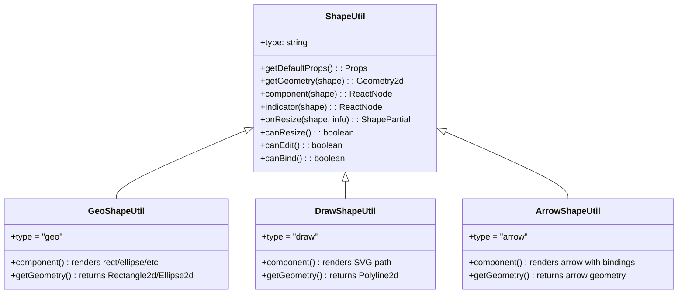
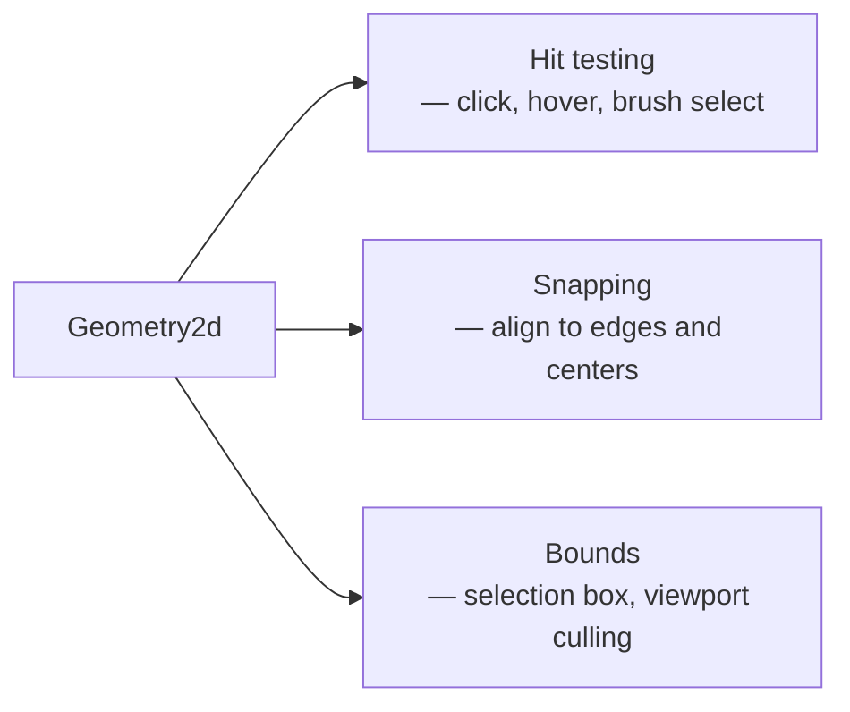

# Chapter 3: Shape System

Welcome to **Chapter 3: Shape System**. In this part of **tldraw Tutorial**, you will learn how tldraw defines, stores, renders, and hit-tests shapes — and how to create your own custom shape types.

In [Chapter 2](02-editor-architecture.md), you learned that the Store holds shape records and the Editor provides the API to manipulate them. Now you will look inside those records and the ShapeUtil classes that bring them to life on the canvas.

## What Problem Does This Solve?

Every canvas application needs shapes — rectangles, ellipses, arrows, freehand lines, text, images, and more. Each shape type needs its own rendering logic, geometry for hit-testing and snapping, migration strategy for schema changes, and indicator rendering for selection states. The tldraw shape system provides a unified pattern for defining all of this in a single ShapeUtil class.

## Learning Goals

- understand TLShape records and their structure
- learn the ShapeUtil base class and its required methods
- create a custom shape with rendering, geometry, and indicators
- register custom shapes with the Tldraw component

## Shape Records

Every shape in tldraw is a record in the Store with this structure:

```typescript
// The base shape record type
interface TLShape {
  id: TLShapeId           // unique identifier, e.g. "shape:abc123"
  type: string             // shape type name, e.g. "geo", "draw", "arrow"
  x: number                // position in page space
  y: number                // position in page space
  rotation: number         // rotation in radians
  index: string            // fractional index for z-ordering
  parentId: TLParentId     // page ID or group shape ID
  isLocked: boolean        // whether the shape is locked
  opacity: number          // 0 to 1
  props: Record<string, unknown>  // type-specific properties
  meta: Record<string, unknown>   // arbitrary metadata
}

// Example: a "geo" shape (rectangle, ellipse, etc.)
const geoShape = {
  id: 'shape:rect1',
  type: 'geo',
  x: 100,
  y: 200,
  rotation: 0,
  index: 'a1',
  parentId: 'page:page1',
  isLocked: false,
  opacity: 1,
  props: {
    w: 300,
    h: 200,
    geo: 'rectangle',    // or 'ellipse', 'triangle', 'diamond', etc.
    color: 'black',
    fill: 'none',        // or 'solid', 'semi', 'pattern'
    dash: 'draw',        // or 'solid', 'dashed', 'dotted'
    size: 'm',           // or 's', 'l', 'xl'
    text: '',
    font: 'draw',
    labelColor: 'black',
  },
  meta: {},
}
```

## The ShapeUtil Class

Each shape type has a corresponding ShapeUtil that defines its behavior:



### Key Methods

| Method | Purpose |
|:-------|:--------|
| `getDefaultProps()` | Returns default property values when creating a new shape |
| `getGeometry(shape)` | Returns a Geometry2d object for hit-testing, snapping, and bounds |
| `component(shape)` | Returns the React element that renders the shape on the canvas |
| `indicator(shape)` | Returns the SVG element shown when the shape is selected or hovered |
| `onResize(shape, info)` | Returns updated shape partial when the shape is resized |
| `canResize()` | Whether the shape supports resize handles |
| `canEdit()` | Whether double-clicking enters edit mode (e.g., for text) |
| `canBind()` | Whether arrows can bind to this shape |

## Creating a Custom Shape

Let us build a **Card** shape — a rounded rectangle with a title and body text:

### Step 1: Define the Shape Type

```typescript
// src/shapes/CardShape.ts
import { TLBaseShape } from 'tldraw'

// Define the shape's props type
type CardShapeProps = {
  w: number
  h: number
  title: string
  body: string
  color: string
}

// Create the shape type using TLBaseShape
export type CardShape = TLBaseShape<'card', CardShapeProps>
```

### Step 2: Create the ShapeUtil

```typescript
// src/shapes/CardShapeUtil.tsx
import {
  ShapeUtil,
  HTMLContainer,
  Rectangle2d,
  TLOnResizeHandler,
  resizeBox,
} from 'tldraw'
import { CardShape } from './CardShape'

export class CardShapeUtil extends ShapeUtil<CardShape> {
  static override type = 'card' as const

  // Default props for new card shapes
  getDefaultProps(): CardShape['props'] {
    return {
      w: 280,
      h: 180,
      title: 'New Card',
      body: 'Card description...',
      color: '#3b82f6',
    }
  }

  // Geometry for hit-testing and bounds calculation
  getGeometry(shape: CardShape) {
    return new Rectangle2d({
      width: shape.props.w,
      height: shape.props.h,
      isFilled: true,
    })
  }

  // The React component that renders the shape
  component(shape: CardShape) {
    return (
      <HTMLContainer
        style={{
          width: shape.props.w,
          height: shape.props.h,
          borderRadius: 12,
          backgroundColor: 'white',
          border: `3px solid ${shape.props.color}`,
          padding: 16,
          display: 'flex',
          flexDirection: 'column',
          gap: 8,
          overflow: 'hidden',
          pointerEvents: 'all',
        }}
      >
        <div
          style={{
            fontSize: 16,
            fontWeight: 'bold',
            color: shape.props.color,
          }}
        >
          {shape.props.title}
        </div>
        <div style={{ fontSize: 13, color: '#666', lineHeight: 1.4 }}>
          {shape.props.body}
        </div>
      </HTMLContainer>
    )
  }

  // The SVG indicator shown when selected
  indicator(shape: CardShape) {
    return (
      <rect
        width={shape.props.w}
        height={shape.props.h}
        rx={12}
        ry={12}
      />
    )
  }

  // Support resizing
  canResize() {
    return true
  }

  override onResize: TLOnResizeHandler<CardShape> = (shape, info) => {
    return resizeBox(shape, info)
  }

  // Allow arrows to bind to this shape
  canBind() {
    return true
  }
}
```

### Step 3: Register the Custom Shape

```typescript
// src/App.tsx
import { Tldraw } from 'tldraw'
import 'tldraw/tldraw.css'
import { CardShapeUtil } from './shapes/CardShapeUtil'

// Register custom shapes via shapeUtils prop
const customShapeUtils = [CardShapeUtil]

export default function App() {
  return (
    <div style={{ position: 'fixed', inset: 0 }}>
      <Tldraw
        shapeUtils={customShapeUtils}
        onMount={(editor) => {
          // Create a card shape programmatically
          editor.createShape({
            type: 'card',
            x: 200,
            y: 200,
            props: {
              title: 'Architecture',
              body: 'Editor + Store + Rendering pipeline',
              color: '#8b5cf6',
            },
          })
        }}
      />
    </div>
  )
}
```

## Geometry System

The geometry returned by `getGeometry()` is critical for three operations:



tldraw provides several built-in geometry classes:

```typescript
import {
  Rectangle2d,
  Ellipse2d,
  Polyline2d,
  Polygon2d,
  Circle2d,
  Group2d,
} from 'tldraw'

// Rectangle with optional fill for point-in-shape testing
new Rectangle2d({ width: 200, height: 100, isFilled: true })

// Ellipse centered in its bounds
new Ellipse2d({ width: 200, height: 100, isFilled: true })

// Polyline from a series of points (no fill)
new Polyline2d({ points: [{ x: 0, y: 0 }, { x: 100, y: 50 }, { x: 200, y: 0 }] })

// Polygon — closed polyline with optional fill
new Polygon2d({
  points: [{ x: 0, y: 100 }, { x: 50, y: 0 }, { x: 100, y: 100 }],
  isFilled: true,
})

// Composite geometry — combine multiple geometries
new Group2d({ children: [rectGeometry, circleGeometry] })
```

## Built-in Shape Types

tldraw ships with these shape types by default:

| Type | Description | Key Props |
|:-----|:------------|:----------|
| `geo` | Geometric shapes (rect, ellipse, triangle, diamond, etc.) | `w`, `h`, `geo`, `color`, `fill` |
| `draw` | Freehand drawing strokes | `segments`, `color`, `size` |
| `arrow` | Arrows with optional bindings to other shapes | `start`, `end`, `bend`, `arrowheadStart`, `arrowheadEnd` |
| `text` | Text labels | `text`, `size`, `font`, `color` |
| `note` | Sticky notes | `text`, `color`, `size` |
| `frame` | Grouping frames | `w`, `h`, `name` |
| `image` | Raster images | `w`, `h`, `assetId` |
| `video` | Video embeds | `w`, `h`, `assetId` |
| `embed` | Iframe embeds (YouTube, Figma, etc.) | `url`, `w`, `h` |
| `bookmark` | URL bookmarks with previews | `url`, `assetId` |
| `highlight` | Highlighter strokes | `segments`, `color`, `size` |
| `line` | Straight lines with waypoints | `points`, `color` |

## Under the Hood

When the Editor renders shapes, it follows this pipeline:

1. **Sort** — shapes are sorted by their `index` property (fractional indexing for z-order)
2. **Cull** — shapes outside the viewport bounds are excluded
3. **Transform** — each shape's position is computed relative to the camera: `translate(x - cam.x, y - cam.y) scale(cam.z) rotate(rotation)`
4. **Render** — the ShapeUtil's `component()` method is called for each visible shape
5. **Overlay** — selected shapes get their `indicator()` rendered in the SVG overlay layer

The geometry objects returned by `getGeometry()` are cached and only recomputed when the shape's props change. This caching is critical for performance — hit-testing runs on every pointer move event and must be fast.

## Summary

Shapes are records in the Store, and ShapeUtils bring them to life with rendering, geometry, and behavior. You now know how to create custom shapes with their own visual appearance, hit-testing geometry, and resize behavior. In the next chapter, you will learn how tools handle user input to create and manipulate these shapes.

---

**Previous**: [Chapter 2: Editor Architecture](02-editor-architecture.md) | **Next**: [Chapter 4: Tools and Interactions](04-tools-and-interactions.md)

---

[Back to tldraw Tutorial](README.md)
