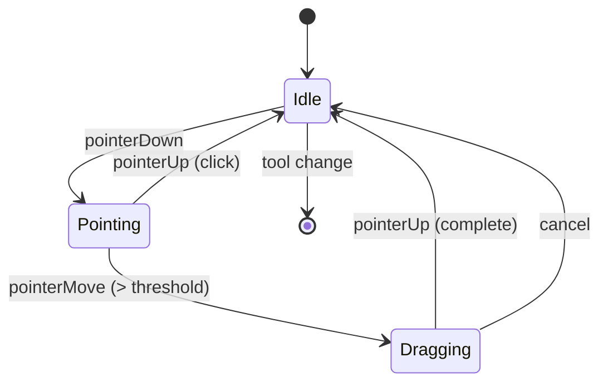
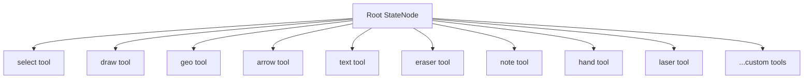
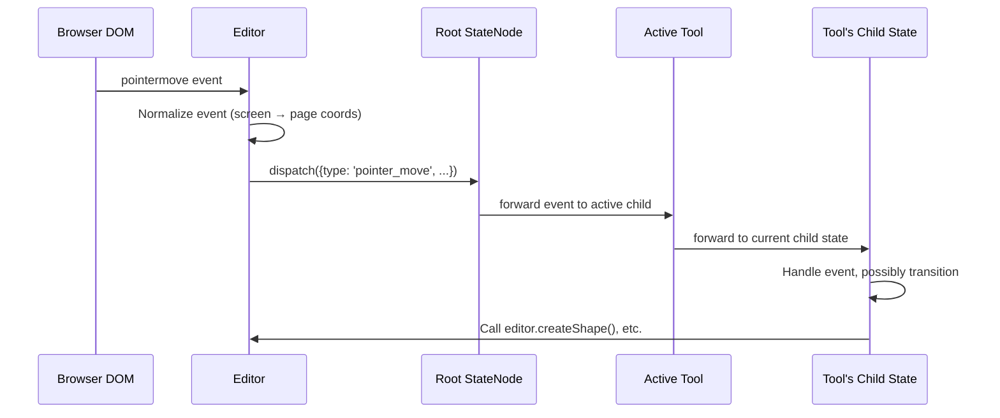
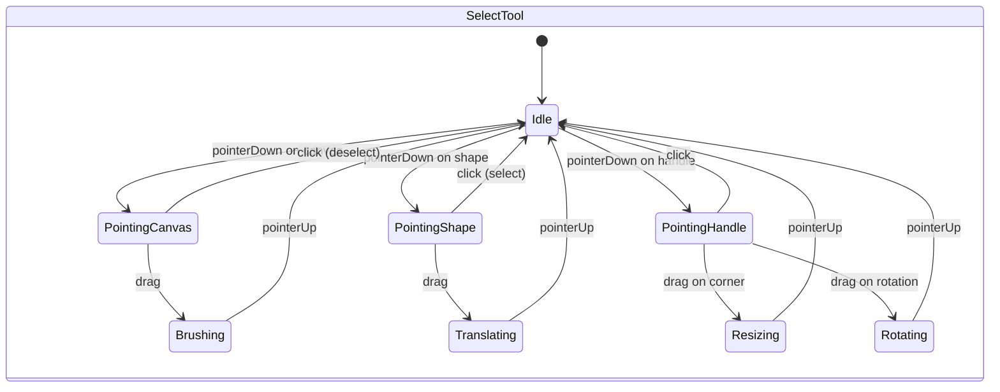

# Chapter 4: Tools and Interactions

Welcome to **Chapter 4: Tools and Interactions**. In this part of **tldraw Tutorial**, you will learn how tldraw handles user input through a hierarchical state machine of tools, and how to build your own custom tools.

In [Chapter 3](03-shape-system.md), you defined shapes and their ShapeUtils. Now you will learn how tools orchestrate the creation and manipulation of those shapes in response to pointer, keyboard, and gesture events.

## What Problem Does This Solve?

A drawing tool must handle complex, multi-step interactions: clicking to start a shape, dragging to size it, shift-holding to constrain proportions, escape-pressing to cancel, and double-clicking to edit. These interactions have many states and transitions. tldraw solves this with a **hierarchical state machine** pattern where each tool is a state node that can have child states.

## Learning Goals

- understand the StateNode hierarchy and how tools are structured
- trace the flow of input events through the tool state machine
- build a custom tool for creating card shapes (from [Chapter 3](03-shape-system.md))
- register custom tools and add them to the toolbar

## The Tool State Machine

Every tool in tldraw is a `StateNode` — a class that receives events and can transition between child states:



### The Root State Machine

The Editor itself has a root state machine that manages which tool is active:



```typescript
// Switch between tools
editor.setCurrentTool('select')
editor.setCurrentTool('draw')
editor.setCurrentTool('geo')

// Check the current tool
editor.getCurrentToolId() // e.g. 'select'

// The current tool is a StateNode instance
const currentTool = editor.getCurrentTool()
```

## How Events Flow

When the user interacts with the canvas, events flow through the state machine:



### Input Event Types

tldraw normalizes browser events into a consistent set:

```typescript
// Pointer events
type PointerEvent = {
  type: 'pointer_down' | 'pointer_move' | 'pointer_up'
  point: Vec          // page-space coordinates
  shiftKey: boolean
  altKey: boolean
  ctrlKey: boolean
  target: 'canvas' | 'shape' | 'handle' | 'selection'
}

// Keyboard events
type KeyboardEvent = {
  type: 'key_down' | 'key_up' | 'key_repeat'
  key: string
  code: string
}

// Other events
// 'wheel' — scroll/zoom
// 'pinch' — touch pinch gestures
// 'complete' — finish current interaction
// 'cancel' — abort current interaction
```

## Anatomy of the Select Tool

The select tool is the most complex tool, with many child states:



Each child state is a separate class that handles its specific interaction:

```typescript
// Simplified structure of the Select tool
class SelectTool extends StateNode {
  static override id = 'select'
  static override children = () => [
    IdleState,
    PointingCanvasState,
    PointingShapeState,
    TranslatingState,
    BrushingState,
    ResizingState,
    RotatingState,
    // ... more states
  ]
}

class IdleState extends StateNode {
  static override id = 'idle'

  override onPointerDown(info: TLPointerEventInfo) {
    if (info.target === 'canvas') {
      this.parent.transition('pointing_canvas', info)
    } else if (info.target === 'shape') {
      this.parent.transition('pointing_shape', info)
    }
  }
}
```

## Building a Custom Tool

Let us create a tool for placing the Card shapes from [Chapter 3](03-shape-system.md). The user clicks on the canvas to place a card:

```typescript
// src/tools/CardTool.ts
import { StateNode, TLEventHandlers, createShapeId } from 'tldraw'

// Idle state — waiting for the user to click
class CardToolIdle extends StateNode {
  static override id = 'idle'

  override onPointerDown: TLEventHandlers['onPointerDown'] = (info) => {
    this.parent.transition('pointing', info)
  }

  override onCancel = () => {
    this.editor.setCurrentTool('select')
  }
}

// Pointing state — user has pressed down, waiting for release
class CardToolPointing extends StateNode {
  static override id = 'pointing'

  override onPointerUp: TLEventHandlers['onPointerUp'] = () => {
    const { currentPagePoint } = this.editor.inputs

    // Create a card shape at the click position
    this.editor.createShape({
      id: createShapeId(),
      type: 'card',
      x: currentPagePoint.x - 140,  // center the card on click
      y: currentPagePoint.y - 90,
      props: {
        title: 'New Card',
        body: 'Click to edit...',
        color: '#3b82f6',
      },
    })

    // Return to the select tool after placing
    this.editor.setCurrentTool('select')
  }

  override onCancel = () => {
    this.parent.transition('idle')
  }
}

// The main tool — a state machine with idle and pointing states
export class CardTool extends StateNode {
  static override id = 'card'
  static override initial = 'idle'
  static override children = () => [CardToolIdle, CardToolPointing]
}
```

## Registering the Custom Tool

Register the tool and add a toolbar button:

```typescript
// src/App.tsx
import { Tldraw, TldrawUiMenuItem, DefaultToolbar, useTools } from 'tldraw'
import 'tldraw/tldraw.css'
import { CardShapeUtil } from './shapes/CardShapeUtil'
import { CardTool } from './tools/CardTool'

const customShapeUtils = [CardShapeUtil]
const customTools = [CardTool]

// Custom toolbar component that adds the card tool button
function CustomToolbar() {
  const tools = useTools()
  return (
    <DefaultToolbar>
      <TldrawUiMenuItem {...tools['card']} />
    </DefaultToolbar>
  )
}

export default function App() {
  return (
    <div style={{ position: 'fixed', inset: 0 }}>
      <Tldraw
        shapeUtils={customShapeUtils}
        tools={customTools}
        components={{
          Toolbar: CustomToolbar,
        }}
      />
    </div>
  )
}
```

## Keyboard Shortcuts

Tools can define keyboard shortcuts for activation:

```typescript
export class CardTool extends StateNode {
  static override id = 'card'
  static override initial = 'idle'
  static override children = () => [CardToolIdle, CardToolPointing]

  // Press 'c' to activate this tool
  override onKeyDown: TLEventHandlers['onKeyDown'] = (info) => {
    // Handle key events within the tool
  }
}

// Register the shortcut when setting up the tool
// In the overrides:
const customOverrides = {
  tools(editor, tools) {
    tools.card = {
      id: 'card',
      icon: 'card-icon',
      label: 'Card',
      kbd: 'c',           // keyboard shortcut
      onSelect: () => {
        editor.setCurrentTool('card')
      },
    }
    return tools
  },
}
```

## Drag-to-Create Pattern

Many tools use a drag pattern where the user presses down, drags to size the shape, and releases. Here is a more advanced version of the card tool that supports this:

```typescript
class CardToolDragging extends StateNode {
  static override id = 'dragging'

  private shapeId = '' as any

  override onEnter = (info: { shapeId: string }) => {
    this.shapeId = info.shapeId
  }

  override onPointerMove: TLEventHandlers['onPointerMove'] = () => {
    const { originPagePoint, currentPagePoint } = this.editor.inputs

    const w = Math.abs(currentPagePoint.x - originPagePoint.x)
    const h = Math.abs(currentPagePoint.y - originPagePoint.y)
    const x = Math.min(currentPagePoint.x, originPagePoint.x)
    const y = Math.min(currentPagePoint.y, originPagePoint.y)

    this.editor.updateShape({
      id: this.shapeId,
      type: 'card',
      x,
      y,
      props: { w: Math.max(w, 50), h: Math.max(h, 50) },
    })
  }

  override onPointerUp: TLEventHandlers['onPointerUp'] = () => {
    this.editor.setCurrentTool('select')
  }

  override onCancel = () => {
    this.editor.deleteShapes([this.shapeId])
    this.parent.transition('idle')
  }
}
```

## Under the Hood

The state machine implementation lives in `packages/editor/src/lib/editor/tools/StateNode.ts`. Key implementation details:

- **Event bubbling** — if a child state does not handle an event, it bubbles up to the parent
- **Transition** — `this.parent.transition('state-id', info)` exits the current state and enters the target
- **onEnter / onExit** — lifecycle hooks called when entering or exiting a state
- **inputs** — `this.editor.inputs` provides the current pointer position, pressed keys, and drag distance
- **Drag threshold** — tldraw uses a 4px drag threshold to distinguish clicks from drags

The select tool alone has over 15 child states, handling translation, rotation, resizing, cropping, brushing, and more. Each state is a focused, testable unit of interaction logic.

## Summary

Tools are hierarchical state machines that handle user input through well-defined state transitions. Each state handles specific events and delegates to the Editor API for state changes. You now know how to build custom tools with click-to-place and drag-to-create patterns. In the next chapter, you will explore tldraw's most innovative feature — the AI-powered make-real pipeline.

---

**Previous**: [Chapter 3: Shape System](03-shape-system.md) | **Next**: [Chapter 5: AI Make-Real Feature](05-ai-make-real.md)

---

[Back to tldraw Tutorial](README.md)
