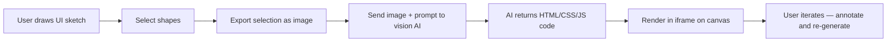
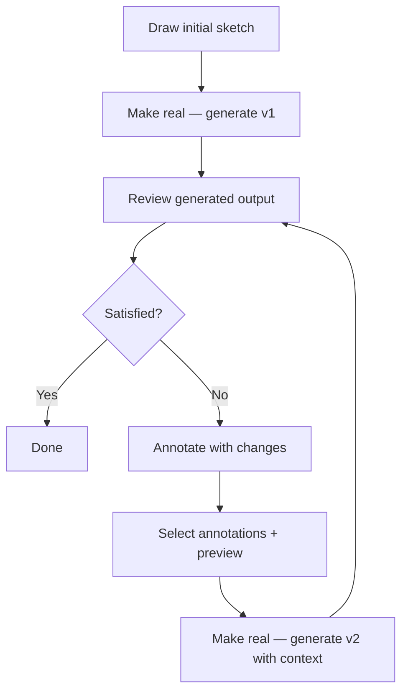

# Chapter 5: AI Make-Real Feature

Welcome to **Chapter 5: AI Make-Real Feature**. In this part of **tldraw Tutorial**, you will learn how tldraw's groundbreaking "make-real" feature captures whiteboard sketches and converts them into working HTML/CSS/JavaScript applications using vision AI models.

In [Chapter 4](04-tools-and-interactions.md), you learned how tools handle user interactions. Now you will see how those interactions combine with AI to create one of the most compelling demos in the creative coding space — drawing a UI sketch on the canvas and watching it become a real, interactive application.

## What Problem Does This Solve?

The gap between design and implementation is one of the most persistent problems in software development. A designer sketches a wireframe, then a developer manually translates it into code. "Make real" collapses this gap: you draw what you want on the tldraw canvas, and an AI vision model generates the working implementation. This pattern applies far beyond UI prototyping — it works for diagrams, flowcharts, data visualizations, and any visual-to-code transformation.

## Learning Goals

- understand the make-real pipeline from canvas capture to code generation
- learn how tldraw exports selected shapes as an image for the AI model
- build a make-real integration using OpenAI's vision API
- render the generated output back into the tldraw canvas as an embedded frame
- handle iteration — using previous outputs as context for refinements

## The Make-Real Pipeline



## Step 1: Capture the Canvas Selection

The first step is exporting the selected shapes as an image that the AI model can interpret:

```typescript
import { Editor, exportToBlob } from 'tldraw'

async function captureSelection(editor: Editor): Promise<string> {
  const selectedIds = editor.getSelectedShapeIds()

  if (selectedIds.length === 0) {
    throw new Error('No shapes selected')
  }

  // Export the selected shapes as a PNG blob
  const blob = await exportToBlob({
    editor,
    ids: selectedIds,
    format: 'png',
    opts: {
      background: true,
      padding: 16,
      scale: 2,  // 2x resolution for better AI interpretation
    },
  })

  // Convert to base64 for the API request
  const arrayBuffer = await blob.arrayBuffer()
  const base64 = btoa(
    new Uint8Array(arrayBuffer).reduce(
      (data, byte) => data + String.fromCharCode(byte),
      ''
    )
  )

  return `data:image/png;base64,${base64}`
}
```

## Step 2: Build the AI Prompt

The prompt is critical to getting good results. The make-real approach uses a system prompt that instructs the model to generate a single HTML file:

```typescript
const SYSTEM_PROMPT = `You are an expert web developer who specializes in building working website prototypes from low-fidelity wireframes and sketches.
Your job is to accept a wireframe sketch drawn on a whiteboard and turn it into a working HTML page.

RULES:
- Return ONLY a single HTML file with inline CSS and JavaScript
- Use Tailwind CSS via CDN for styling
- Make the design responsive and polished — go beyond the sketch with good UX
- Include realistic placeholder content (not lorem ipsum)
- Use appropriate semantic HTML elements
- If the sketch includes interactive elements (buttons, forms, modals), make them functional with JavaScript
- The HTML should be complete and self-contained — it must work when opened directly in a browser
- Do NOT include any markdown, backticks, or explanations — return ONLY the HTML code`

const USER_PROMPT = `Turn this wireframe sketch into a working HTML page. Be creative with the design while staying faithful to the layout and components shown in the sketch.`
```

## Step 3: Call the Vision AI Model

```typescript
async function generateFromSketch(
  imageDataUrl: string,
  previousHtml?: string
): Promise<string> {
  const messages: any[] = [
    { role: 'system', content: SYSTEM_PROMPT },
  ]

  // If we have previous output, include it for iteration
  if (previousHtml) {
    messages.push({
      role: 'user',
      content: [
        {
          type: 'text',
          text: 'Here is the previous version of the page. The user has annotated it with changes they want. Update the HTML accordingly.',
        },
        {
          type: 'text',
          text: previousHtml,
        },
      ],
    })
  }

  // Add the current sketch image
  messages.push({
    role: 'user',
    content: [
      { type: 'text', text: USER_PROMPT },
      {
        type: 'image_url',
        image_url: {
          url: imageDataUrl,
          detail: 'high',
        },
      },
    ],
  })

  const response = await fetch('https://api.openai.com/v1/chat/completions', {
    method: 'POST',
    headers: {
      'Content-Type': 'application/json',
      Authorization: `Bearer ${process.env.OPENAI_API_KEY}`,
    },
    body: JSON.stringify({
      model: 'gpt-4o',
      messages,
      max_tokens: 4096,
      temperature: 0,
    }),
  })

  const data = await response.json()
  return data.choices[0].message.content
}
```

## Step 4: Render the Output on the Canvas

The generated HTML is displayed in an iframe embedded as a shape on the tldraw canvas, positioned next to the original sketch:

```typescript
async function makeReal(editor: Editor) {
  // Mark for undo
  editor.mark('make-real')

  // Step 1: Capture the selection
  const imageDataUrl = await captureSelection(editor)

  // Step 2: Get the bounds of the selection for positioning
  const selectionBounds = editor.getSelectionPageBounds()
  if (!selectionBounds) return

  // Step 3: Check for existing generated HTML (for iteration)
  const previousHtml = getPreviousOutput(editor)

  // Step 4: Call the AI
  const html = await generateFromSketch(imageDataUrl, previousHtml)

  // Step 5: Create a shape to display the result
  // Position it to the right of the selection
  const resultX = selectionBounds.maxX + 60
  const resultY = selectionBounds.y

  // Create an HTML shape that renders the output in an iframe
  editor.createShape({
    type: 'frame',
    x: resultX,
    y: resultY,
    props: {
      w: selectionBounds.w,
      h: selectionBounds.h,
      name: 'Generated UI',
    },
  })

  // Use a custom "preview" shape to render the iframe
  editor.createShape({
    type: 'preview',
    x: resultX,
    y: resultY,
    props: {
      w: Math.max(selectionBounds.w, 400),
      h: Math.max(selectionBounds.h, 300),
      html: html,
    },
  })
}
```

## The Preview Shape

To render generated HTML, create a custom shape that displays an iframe:

```typescript
// src/shapes/PreviewShapeUtil.tsx
import { ShapeUtil, HTMLContainer, Rectangle2d, TLBaseShape } from 'tldraw'

type PreviewShapeProps = {
  w: number
  h: number
  html: string
}

type PreviewShape = TLBaseShape<'preview', PreviewShapeProps>

export class PreviewShapeUtil extends ShapeUtil<PreviewShape> {
  static override type = 'preview' as const

  getDefaultProps(): PreviewShape['props'] {
    return { w: 400, h: 300, html: '' }
  }

  getGeometry(shape: PreviewShape) {
    return new Rectangle2d({
      width: shape.props.w,
      height: shape.props.h,
      isFilled: true,
    })
  }

  component(shape: PreviewShape) {
    return (
      <HTMLContainer
        style={{
          width: shape.props.w,
          height: shape.props.h,
          pointerEvents: 'all',
          overflow: 'hidden',
          borderRadius: 8,
          boxShadow: '0 2px 12px rgba(0,0,0,0.15)',
        }}
      >
        <iframe
          srcDoc={shape.props.html}
          style={{
            width: '100%',
            height: '100%',
            border: 'none',
          }}
          sandbox="allow-scripts"
          title="Generated preview"
        />
      </HTMLContainer>
    )
  }

  indicator(shape: PreviewShape) {
    return <rect width={shape.props.w} height={shape.props.h} rx={8} ry={8} />
  }

  canResize() {
    return true
  }
}
```

## Iteration: The Feedback Loop

The real power of make-real is the iteration loop. After the first generation, the user can:

1. Annotate the generated output with drawings and text notes
2. Select both the annotations and the preview shape
3. Run make-real again — the AI sees the current output plus the annotations



```typescript
function getPreviousOutput(editor: Editor): string | undefined {
  const selectedShapes = editor.getSelectedShapes()

  // Look for an existing preview shape in the selection
  const previewShape = selectedShapes.find(
    (shape) => shape.type === 'preview'
  )

  if (previewShape && 'html' in previewShape.props) {
    return previewShape.props.html as string
  }

  return undefined
}
```

## Adding the Make-Real Button

Wire everything together with a UI button:

```typescript
import { Tldraw, track, useEditor } from 'tldraw'
import 'tldraw/tldraw.css'

const MakeRealButton = track(() => {
  const editor = useEditor()
  const hasSelection = editor.getSelectedShapeIds().length > 0

  return (
    <button
      onClick={() => makeReal(editor)}
      disabled={!hasSelection}
      style={{
        position: 'absolute',
        top: 12,
        right: 12,
        zIndex: 1000,
        padding: '8px 16px',
        borderRadius: 8,
        border: 'none',
        background: hasSelection ? '#3b82f6' : '#ccc',
        color: 'white',
        fontWeight: 'bold',
        cursor: hasSelection ? 'pointer' : 'default',
      }}
    >
      Make Real
    </button>
  )
})

export default function App() {
  return (
    <div style={{ position: 'fixed', inset: 0 }}>
      <Tldraw
        shapeUtils={[PreviewShapeUtil]}
        persistenceKey="make-real-demo"
      >
        <MakeRealButton />
      </Tldraw>
    </div>
  )
}
```

## Under the Hood

The original make-real demo (at [github.com/tldraw/make-real](https://github.com/tldraw/make-real)) uses these specific techniques:

- **SVG export** — the selection is exported as SVG rather than PNG in some variants, preserving text content for the AI to read
- **Annotation detection** — the system distinguishes between the original sketch and annotation shapes added for iteration
- **HTML sanitization** — the generated HTML is cleaned before embedding to prevent XSS in the iframe
- **Streaming** — the AI response can be streamed to show progressive generation
- **Model selection** — while originally using GPT-4V, the pattern works with any vision-capable model (Claude, Gemini, etc.)

The make-real pattern has inspired dozens of derivative projects: generating React components, Figma designs, database schemas, and even game levels from whiteboard sketches. The core architecture — capture, prompt, generate, embed — is the same in all cases.

## Summary

The make-real pipeline captures canvas content as an image, sends it to a vision AI model with a carefully crafted prompt, and renders the generated HTML back on the canvas in an iframe. The iteration loop lets users refine outputs by annotating and re-generating. This pattern extends to any visual-to-code transformation. In the next chapter, you will learn how to add multiplayer collaboration to your tldraw application.

---

**Previous**: [Chapter 4: Tools and Interactions](04-tools-and-interactions.md) | **Next**: [Chapter 6: Collaboration and Sync](06-collaboration-and-sync.md)

---

[Back to tldraw Tutorial](README.md)
