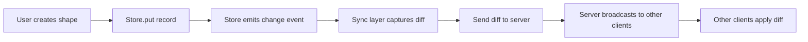
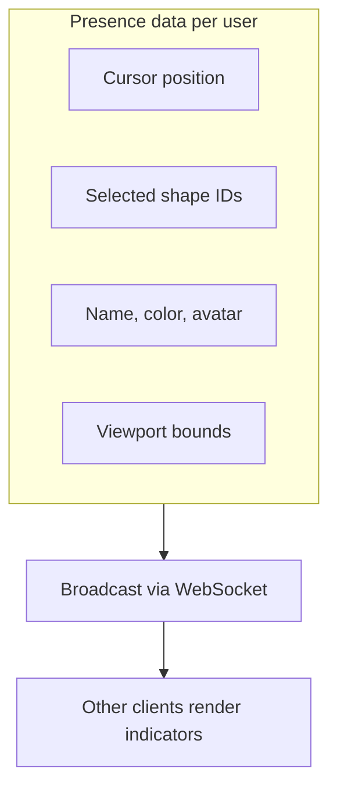
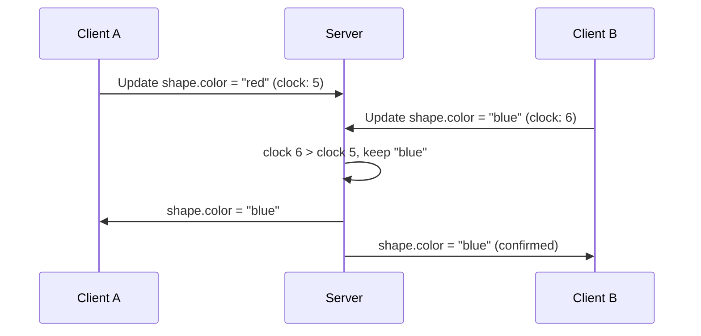

# Chapter 6: Collaboration and Sync

Welcome to **Chapter 6: Collaboration and Sync**. In this part of **tldraw Tutorial**, you will learn how tldraw's Store supports real-time multiplayer collaboration and how to implement different sync strategies for your application.

In [Chapter 5](05-ai-make-real.md), you used the canvas for AI-powered generation. Now you will make the canvas collaborative — multiple users drawing, selecting, and editing shapes simultaneously.

## What Problem Does This Solve?

Real-time collaboration on a shared canvas is a deceptively hard problem. Multiple users can create, move, and delete shapes concurrently, leading to conflicts. Cursor positions must be shared with low latency. Undo/redo must be scoped to each user. The tldraw Store provides a change-tracking system that makes it possible to build collaborative experiences on top of any transport layer — WebSockets, WebRTC, or even a shared database.

## Learning Goals

- understand the Store's change tracking and diff system
- implement a basic WebSocket sync server for multiplayer
- handle presence data — cursors, selections, and user names
- manage conflicts and operational ordering
- use the `TLSocketRoom` class from tldraw's sync package

## Store Change Tracking

The Store emits fine-grained change records whenever data is modified:



```typescript
import { createTLStore, defaultShapeUtils } from 'tldraw'

const store = createTLStore({ shapeUtils: defaultShapeUtils })

// Listen for all changes
store.listen((entry) => {
  // entry.changes contains:
  //   added: Record<string, TLRecord>    — new records
  //   updated: Record<string, [before, after]> — changed records
  //   removed: Record<string, TLRecord>  — deleted records

  const { added, updated, removed } = entry.changes

  console.log('Added:', Object.keys(added).length)
  console.log('Updated:', Object.keys(updated).length)
  console.log('Removed:', Object.keys(removed).length)

  // entry.source is 'user' for local changes, 'remote' for applied diffs
  if (entry.source === 'user') {
    // Send this diff to the server
    sendToServer(entry.changes)
  }
}, { source: 'all', scope: 'document' })
```

## Store Snapshots and Diffs

The Store supports full snapshots and incremental diffs:

```typescript
// Get a full snapshot of all records
const snapshot = store.getStoreSnapshot()
// snapshot contains all shape, page, asset records

// Load a snapshot (replaces all data)
store.loadStoreSnapshot(snapshot)

// Apply a diff from another client
store.mergeRemoteChanges(() => {
  // Inside this callback, changes are marked as 'remote'
  // and do not trigger the listener with source: 'user'
  for (const record of Object.values(diff.added)) {
    store.put([record])
  }
  for (const [_before, after] of Object.values(diff.updated)) {
    store.put([after])
  }
  for (const record of Object.values(diff.removed)) {
    store.remove([record.id])
  }
})
```

## Basic WebSocket Sync

Here is a minimal sync implementation with a WebSocket server:

### Server

```typescript
// server.ts
import { WebSocketServer } from 'ws'

const wss = new WebSocketServer({ port: 8080 })

// In-memory document state
let documentRecords: Record<string, any> = {}
const clients = new Set<any>()

wss.on('connection', (ws) => {
  clients.add(ws)

  // Send current state to the new client
  ws.send(JSON.stringify({
    type: 'init',
    snapshot: documentRecords,
  }))

  ws.on('message', (data) => {
    const message = JSON.parse(data.toString())

    if (message.type === 'diff') {
      // Apply diff to server state
      const { added, updated, removed } = message.changes

      for (const [id, record] of Object.entries(added)) {
        documentRecords[id] = record
      }
      for (const [id, [_before, after]] of Object.entries(updated as any)) {
        documentRecords[id] = after
      }
      for (const id of Object.keys(removed)) {
        delete documentRecords[id]
      }

      // Broadcast to all other clients
      for (const client of clients) {
        if (client !== ws && client.readyState === 1) {
          client.send(JSON.stringify({
            type: 'diff',
            changes: message.changes,
          }))
        }
      }
    }
  })

  ws.on('close', () => {
    clients.delete(ws)
  })
})
```

### Client

```typescript
// src/useSync.ts
import { useEffect } from 'react'
import { Editor } from 'tldraw'

export function useSync(editor: Editor, roomId: string) {
  useEffect(() => {
    const ws = new WebSocket(`ws://localhost:8080?room=${roomId}`)

    ws.onmessage = (event) => {
      const message = JSON.parse(event.data)

      if (message.type === 'init') {
        // Load initial state
        editor.store.loadStoreSnapshot(message.snapshot)
      }

      if (message.type === 'diff') {
        // Apply remote changes
        editor.store.mergeRemoteChanges(() => {
          const { added, updated, removed } = message.changes

          const recordsToAdd = [
            ...Object.values(added),
            ...Object.values(updated).map(([_, after]: any) => after),
          ]

          if (recordsToAdd.length > 0) {
            editor.store.put(recordsToAdd as any[])
          }

          const idsToRemove = Object.keys(removed)
          if (idsToRemove.length > 0) {
            editor.store.remove(idsToRemove as any[])
          }
        })
      }
    }

    // Send local changes to the server
    const unlisten = editor.store.listen((entry) => {
      if (entry.source === 'user') {
        ws.send(JSON.stringify({
          type: 'diff',
          changes: entry.changes,
        }))
      }
    }, { source: 'user', scope: 'document' })

    return () => {
      unlisten()
      ws.close()
    }
  }, [editor, roomId])
}
```

## Presence: Cursors and User Awareness

Multiplayer canvases need to show where other users are and what they are doing:



```typescript
// The Store has a special 'presence' scope for ephemeral data
// Instance-level records (cursor position, selected tool, etc.)
// are scoped to the instance and can be shared as presence

// Listen for presence changes specifically
editor.store.listen((entry) => {
  if (entry.source === 'user') {
    // Send presence data: cursor position, selection, viewport
    const presence = {
      cursor: editor.inputs.currentPagePoint,
      selectedIds: editor.getSelectedShapeIds(),
      userName: 'Alice',
      color: '#3b82f6',
    }
    ws.send(JSON.stringify({ type: 'presence', data: presence }))
  }
}, { source: 'user', scope: 'session' })

// Render other users' cursors as a React component
function CollaboratorCursors({ collaborators }: { collaborators: any[] }) {
  return (
    <>
      {collaborators.map((c) => (
        <div
          key={c.id}
          style={{
            position: 'absolute',
            left: c.cursor.x,
            top: c.cursor.y,
            pointerEvents: 'none',
            transform: 'translate(-2px, -2px)',
          }}
        >
          <svg width="16" height="16" viewBox="0 0 16 16">
            <path d="M0 0 L0 14 L4 10 L8 14 L10 12 L6 8 L12 8 Z" fill={c.color} />
          </svg>
          <span
            style={{
              background: c.color,
              color: 'white',
              padding: '2px 6px',
              borderRadius: 4,
              fontSize: 11,
              whiteSpace: 'nowrap',
            }}
          >
            {c.userName}
          </span>
        </div>
      ))}
    </>
  )
}
```

## Using tldraw's Built-in Sync

tldraw provides a `@tldraw/sync` package with production-ready sync infrastructure:

```typescript
import { useSyncDemo } from '@tldraw/sync'
import { Tldraw } from 'tldraw'
import 'tldraw/tldraw.css'

// The simplest way to get multiplayer — tldraw's demo sync server
function App() {
  const store = useSyncDemo({ roomId: 'my-room-123' })

  return (
    <div style={{ position: 'fixed', inset: 0 }}>
      <Tldraw store={store} />
    </div>
  )
}
```

For production use with your own server, use `useSync`:

```typescript
import { useSync } from '@tldraw/sync'
import { Tldraw, defaultShapeUtils, defaultBindingUtils } from 'tldraw'
import 'tldraw/tldraw.css'

function App() {
  const store = useSync({
    uri: `wss://your-sync-server.com/connect/my-room`,
    shapeUtils: defaultShapeUtils,
    bindingUtils: defaultBindingUtils,
  })

  return (
    <div style={{ position: 'fixed', inset: 0 }}>
      <Tldraw store={store} />
    </div>
  )
}
```

## Conflict Resolution

The tldraw sync model uses **last-writer-wins** (LWW) semantics at the record level:



This is simpler than CRDT-based approaches (as used in [AFFiNE](../affine-tutorial/)) but sufficient for canvas use cases where:

- shapes are typically edited by one user at a time
- concurrent edits to the same property are rare
- the visual nature makes conflicts immediately visible

## Under the Hood

The `@tldraw/sync` package implements a room-based sync protocol:

1. **Connect** — client sends a `connect` message with its last known clock value
2. **Init** — server responds with all records newer than the client's clock
3. **Push** — client sends diffs to the server as the user makes changes
4. **Patch** — server broadcasts diffs to all other clients in the room
5. **Presence** — ephemeral data (cursors, selections) flows through a separate channel with no persistence

The server can be backed by any storage — SQLite for small deployments, PostgreSQL for production, or a key-value store like Redis for high-throughput scenarios.

## Summary

The Store's change tracking system makes it straightforward to build collaborative tldraw applications. You can use the built-in `@tldraw/sync` package for turnkey multiplayer or build custom sync on top of the Store's listener API. Presence data flows through a separate ephemeral channel for cursor and selection sharing. In the next chapter, you will learn how to embed tldraw into production applications.

---

**Previous**: [Chapter 5: AI Make-Real Feature](05-ai-make-real.md) | **Next**: [Chapter 7: Embedding and Integration](07-embedding-and-integration.md)

---

[Back to tldraw Tutorial](README.md)
