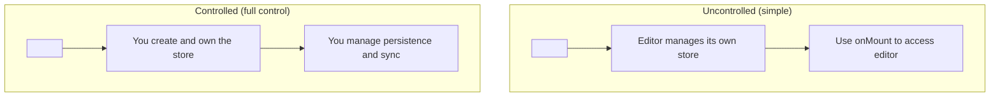
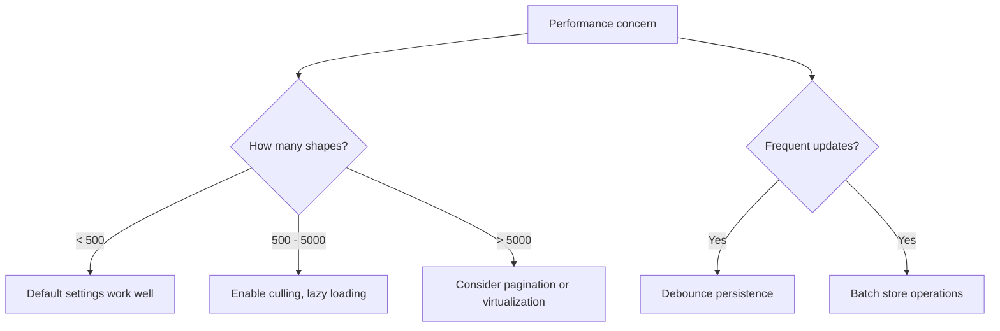

# Chapter 7: Embedding and Integration

Welcome to **Chapter 7: Embedding and Integration**. In this part of **tldraw Tutorial**, you will learn how to embed tldraw into production applications with custom UI, controlled state, persistence strategies, and framework integration patterns.

In [Chapter 6](06-collaboration-and-sync.md), you added multiplayer sync. Now you will learn the patterns for integrating tldraw as a component within larger applications — whether that is a SaaS product, an Electron desktop app, or a documentation tool.

## What Problem Does This Solve?

Embedding a complex canvas component into an existing application raises many questions: How do you control the editor state from outside? How do you persist documents to your backend? How do you customize the UI to match your application's design? How do you handle routing when the canvas is one view among many? This chapter answers all of these.

## Learning Goals

- embed tldraw with controlled and uncontrolled state patterns
- customize the UI by overriding built-in components
- persist documents to a backend API
- integrate with React routing and application state
- handle performance considerations for production deployments

## Controlled vs. Uncontrolled

tldraw supports both patterns, similar to React form inputs:



### Uncontrolled (Default)

The simplest pattern — tldraw creates and manages its own store:

```typescript
import { Tldraw, Editor } from 'tldraw'
import 'tldraw/tldraw.css'

function Canvas() {
  const handleMount = (editor: Editor) => {
    // Store a reference if needed
    // The editor manages its own state
  }

  return (
    <div style={{ width: '100%', height: 600 }}>
      <Tldraw
        onMount={handleMount}
        persistenceKey="my-document"  // auto-persist to localStorage
      />
    </div>
  )
}
```

### Controlled (External Store)

When you need full control over the store — for custom sync, persistence, or state management:

```typescript
import { Tldraw, createTLStore, defaultShapeUtils, TLStoreSnapshot } from 'tldraw'
import 'tldraw/tldraw.css'
import { useEffect, useState } from 'react'

function Canvas({ documentId }: { documentId: string }) {
  const [store] = useState(() =>
    createTLStore({ shapeUtils: defaultShapeUtils })
  )

  // Load document from your API
  useEffect(() => {
    async function loadDocument() {
      const response = await fetch(`/api/documents/${documentId}`)
      const snapshot: TLStoreSnapshot = await response.json()
      store.loadStoreSnapshot(snapshot)
    }
    loadDocument()
  }, [documentId, store])

  // Save changes to your API
  useEffect(() => {
    const unlisten = store.listen(
      async () => {
        const snapshot = store.getStoreSnapshot()
        await fetch(`/api/documents/${documentId}`, {
          method: 'PUT',
          headers: { 'Content-Type': 'application/json' },
          body: JSON.stringify(snapshot),
        })
      },
      { source: 'user', scope: 'document' }
    )
    return unlisten
  }, [documentId, store])

  return (
    <div style={{ width: '100%', height: 600 }}>
      <Tldraw store={store} />
    </div>
  )
}
```

## Customizing the UI

tldraw lets you override almost every UI component:

```typescript
import {
  Tldraw,
  DefaultToolbar,
  DefaultMainMenu,
  TldrawUiMenuGroup,
  TldrawUiMenuItem,
  useEditor,
} from 'tldraw'
import 'tldraw/tldraw.css'

// Custom toolbar — add or remove tools
function CustomToolbar() {
  return (
    <DefaultToolbar>
      {/* Default tools are included automatically */}
      {/* Add custom tool buttons here */}
    </DefaultToolbar>
  )
}

// Custom main menu — add application-specific actions
function CustomMainMenu() {
  const editor = useEditor()

  return (
    <DefaultMainMenu>
      <TldrawUiMenuGroup id="custom-actions">
        <TldrawUiMenuItem
          id="export-pdf"
          label="Export as PDF"
          onSelect={() => {
            // Your export logic
            console.log('Exporting...')
          }}
        />
        <TldrawUiMenuItem
          id="share"
          label="Share Canvas"
          onSelect={() => {
            // Your sharing logic
          }}
        />
      </TldrawUiMenuGroup>
    </DefaultMainMenu>
  )
}

// Custom quick actions panel
function CustomSharePanel() {
  return (
    <div style={{ padding: 8 }}>
      <button>Share Link</button>
      <button>Invite Collaborator</button>
    </div>
  )
}

function App() {
  return (
    <div style={{ position: 'fixed', inset: 0 }}>
      <Tldraw
        components={{
          Toolbar: CustomToolbar,
          MainMenu: CustomMainMenu,
          SharePanel: CustomSharePanel,
          // Hide components by setting them to null
          HelpMenu: null,
          DebugPanel: null,
        }}
      />
    </div>
  )
}
```

### Overridable Components

| Component | Description |
|:----------|:------------|
| `Toolbar` | The main tool selection bar |
| `MainMenu` | The hamburger menu |
| `StylePanel` | Shape style controls (color, fill, etc.) |
| `PageMenu` | Page navigation and management |
| `NavigationPanel` | Minimap and zoom controls |
| `HelpMenu` | Help and keyboard shortcuts |
| `SharePanel` | Sharing controls |
| `DebugPanel` | Debug info (hidden in production) |
| `TopPanel` | Custom content above the canvas |
| `ContextMenu` | Right-click context menu |
| `ActionsMenu` | Actions dropdown |

## Theming

Customize the visual appearance to match your application:

```typescript
import { Tldraw } from 'tldraw'
import 'tldraw/tldraw.css'

// Override CSS custom properties for theming
const customThemeStyles = `
  .tl-theme__light {
    --color-accent: #8b5cf6;
    --color-selected: #8b5cf6;
    --color-selection-stroke: #8b5cf6;
    --color-background: #fafafa;
  }

  .tl-theme__dark {
    --color-accent: #a78bfa;
    --color-selected: #a78bfa;
    --color-selection-stroke: #a78bfa;
    --color-background: #1a1a2e;
  }
`

function App() {
  return (
    <>
      <style>{customThemeStyles}</style>
      <div style={{ position: 'fixed', inset: 0 }}>
        <Tldraw inferDarkMode />
      </div>
    </>
  )
}
```

## Backend Persistence

For production applications, you need robust persistence. Here is a debounced save pattern:

```typescript
import { Editor, TLStoreSnapshot } from 'tldraw'
import { useEffect, useRef } from 'react'

function usePersistence(editor: Editor | null, documentId: string) {
  const saveTimeoutRef = useRef<NodeJS.Timeout>()

  useEffect(() => {
    if (!editor) return

    const unlisten = editor.store.listen(
      () => {
        // Debounce saves — wait 1 second after the last change
        if (saveTimeoutRef.current) {
          clearTimeout(saveTimeoutRef.current)
        }

        saveTimeoutRef.current = setTimeout(async () => {
          const snapshot = editor.store.getStoreSnapshot()

          try {
            await fetch(`/api/documents/${documentId}`, {
              method: 'PUT',
              headers: { 'Content-Type': 'application/json' },
              body: JSON.stringify(snapshot),
            })
          } catch (error) {
            console.error('Failed to save:', error)
            // Implement retry logic or show user notification
          }
        }, 1000)
      },
      { source: 'user', scope: 'document' }
    )

    return () => {
      unlisten()
      if (saveTimeoutRef.current) {
        clearTimeout(saveTimeoutRef.current)
      }
    }
  }, [editor, documentId])
}
```

## Image and Asset Handling

tldraw supports image and video uploads. In production, you need to configure where assets are stored:

```typescript
import { Tldraw, MediaHelpers, TLAssetStore } from 'tldraw'
import 'tldraw/tldraw.css'

// Custom asset store that uploads to your backend
const customAssetStore: TLAssetStore = {
  async upload(asset, file) {
    // Upload the file to your storage service
    const formData = new FormData()
    formData.append('file', file)

    const response = await fetch('/api/assets/upload', {
      method: 'POST',
      body: formData,
    })

    const { url } = await response.json()
    return url
  },

  resolve(asset) {
    // Return the URL for an asset
    // This is called when rendering images/videos
    return asset.props.src ?? ''
  },
}

function App() {
  return (
    <div style={{ position: 'fixed', inset: 0 }}>
      <Tldraw assets={customAssetStore} />
    </div>
  )
}
```

## Embedding in an Application Layout

When tldraw is one component within a larger application:

```typescript
import { Tldraw, Editor } from 'tldraw'
import 'tldraw/tldraw.css'
import { useState, useCallback } from 'react'

function AppLayout() {
  const [editor, setEditor] = useState<Editor | null>(null)
  const [selectedDocId, setSelectedDocId] = useState('doc-1')

  const handleExport = useCallback(async () => {
    if (!editor) return
    const svg = await editor.getSvgString(editor.getSelectedShapeIds())
    // Use the SVG string for export
  }, [editor])

  return (
    <div style={{ display: 'flex', height: '100vh' }}>
      {/* Sidebar */}
      <div style={{ width: 240, borderRight: '1px solid #eee', padding: 16 }}>
        <h3>Documents</h3>
        <button onClick={() => setSelectedDocId('doc-1')}>Design A</button>
        <button onClick={() => setSelectedDocId('doc-2')}>Design B</button>
        <hr />
        <button onClick={handleExport}>Export SVG</button>
      </div>

      {/* Canvas area */}
      <div style={{ flex: 1 }}>
        <Tldraw
          key={selectedDocId}  // Force remount on document change
          persistenceKey={selectedDocId}
          onMount={setEditor}
          components={{
            HelpMenu: null,
            DebugPanel: null,
          }}
        />
      </div>
    </div>
  )
}
```

## Performance Considerations



Key performance tips:

- **Viewport culling** is enabled by default — shapes outside the visible area are not rendered
- **Batch operations** when creating many shapes: use `editor.createShapes([...])` instead of multiple `createShape()` calls
- **Debounce persistence** to avoid saving on every keystroke
- **Lazy-load assets** — images and videos should load on demand as they enter the viewport
- **Use `key` prop** to force clean remount when switching between unrelated documents

## Under the Hood

The `<Tldraw />` component is a composition of several internal components:

1. `TldrawEditor` — the core canvas and editor engine
2. `TldrawUi` — the toolbar, menus, and panels
3. `TldrawHandles` — shape manipulation handles
4. `TldrawScribble` — the scribble/eraser visual feedback
5. `TldrawSelectionForeground` — selection indicators

When you pass `components` overrides, you are replacing specific pieces of the `TldrawUi` layer. The editor engine remains unchanged. This separation means you can build a completely custom UI on top of the editor core if needed.

## Summary

tldraw provides flexible embedding patterns — from zero-config uncontrolled usage to fully controlled stores with custom persistence and UI. You can override any UI component, theme the canvas, handle assets, and integrate with application routing. In the next chapter, you will build custom extensions that add entirely new capabilities to the canvas.

---

**Previous**: [Chapter 6: Collaboration and Sync](06-collaboration-and-sync.md) | **Next**: [Chapter 8: Custom Extensions](08-custom-extensions.md)

---

[Back to tldraw Tutorial](README.md)
