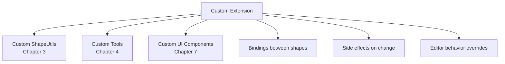
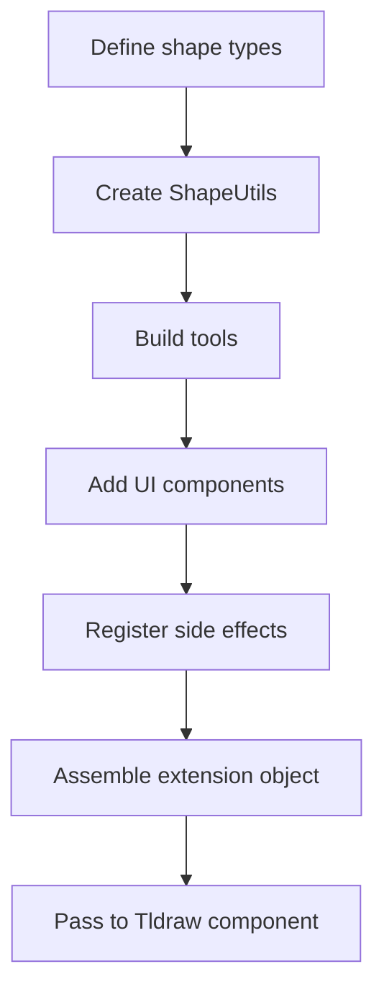

# Chapter 8: Custom Extensions

Welcome to **Chapter 8: Custom Extensions**. In this final part of **tldraw Tutorial**, you will learn how to build comprehensive extensions that combine custom shapes, tools, UI components, and editor behaviors into cohesive features that extend the canvas far beyond its defaults.

In [Chapter 7](07-embedding-and-integration.md), you learned how to embed and configure tldraw in production applications. Now you will bring together everything from the previous chapters to build full-featured extensions.

## What Problem Does This Solve?

tldraw's built-in features cover general-purpose drawing and diagramming. But real applications need domain-specific capabilities: a database schema designer, a flowchart builder with validation, a mind-mapping tool, or an annotation layer for documents. Building these as extensions — combining shapes, tools, UI, and behaviors — lets you create specialized experiences on top of the robust tldraw platform.

## Learning Goals

- architect an extension that combines multiple custom components
- build a flowchart extension with custom nodes, edges, and validation
- add custom context menus, panels, and keyboard shortcuts
- use bindings to create relationships between shapes
- implement side effects that respond to shape changes

## Extension Architecture

A complete extension typically consists of:



## Example: Flowchart Extension

Let us build a flowchart extension with custom node shapes, connection validation, and an auto-layout feature.

### Step 1: Define the Flowchart Node Shape

```typescript
// src/extensions/flowchart/FlowchartNodeShape.ts
import { TLBaseShape } from 'tldraw'

export type FlowchartNodeType = 'process' | 'decision' | 'start-end' | 'io'

export type FlowchartNodeProps = {
  w: number
  h: number
  nodeType: FlowchartNodeType
  label: string
  color: string
}

export type FlowchartNodeShape = TLBaseShape<'flowchart-node', FlowchartNodeProps>
```

### Step 2: Create the ShapeUtil

```typescript
// src/extensions/flowchart/FlowchartNodeShapeUtil.tsx
import {
  ShapeUtil,
  HTMLContainer,
  Rectangle2d,
  Ellipse2d,
  Polygon2d,
  Geometry2d,
  TLOnResizeHandler,
  resizeBox,
} from 'tldraw'
import { FlowchartNodeShape, FlowchartNodeType } from './FlowchartNodeShape'

const NODE_COLORS: Record<FlowchartNodeType, string> = {
  'process': '#3b82f6',
  'decision': '#f59e0b',
  'start-end': '#10b981',
  'io': '#8b5cf6',
}

export class FlowchartNodeShapeUtil extends ShapeUtil<FlowchartNodeShape> {
  static override type = 'flowchart-node' as const

  getDefaultProps(): FlowchartNodeShape['props'] {
    return {
      w: 180,
      h: 80,
      nodeType: 'process',
      label: 'Process',
      color: NODE_COLORS['process'],
    }
  }

  getGeometry(shape: FlowchartNodeShape): Geometry2d {
    const { w, h, nodeType } = shape.props

    switch (nodeType) {
      case 'decision':
        // Diamond shape for decisions
        return new Polygon2d({
          points: [
            { x: w / 2, y: 0 },
            { x: w, y: h / 2 },
            { x: w / 2, y: h },
            { x: 0, y: h / 2 },
          ],
          isFilled: true,
        })
      case 'start-end':
        // Rounded — use ellipse
        return new Ellipse2d({ width: w, height: h, isFilled: true })
      default:
        return new Rectangle2d({ width: w, height: h, isFilled: true })
    }
  }

  component(shape: FlowchartNodeShape) {
    const { w, h, nodeType, label, color } = shape.props

    const borderRadius = nodeType === 'start-end' ? h / 2
      : nodeType === 'process' ? 8
      : 0

    const clipPath = nodeType === 'decision'
      ? `polygon(50% 0%, 100% 50%, 50% 100%, 0% 50%)`
      : undefined

    return (
      <HTMLContainer
        style={{
          width: w,
          height: h,
          display: 'flex',
          alignItems: 'center',
          justifyContent: 'center',
          backgroundColor: 'white',
          border: `2px solid ${color}`,
          borderRadius,
          clipPath,
          fontSize: 14,
          fontWeight: 500,
          color: '#333',
          pointerEvents: 'all',
          overflow: 'hidden',
        }}
      >
        {label}
      </HTMLContainer>
    )
  }

  indicator(shape: FlowchartNodeShape) {
    const { w, h, nodeType } = shape.props

    if (nodeType === 'decision') {
      return (
        <polygon
          points={`${w / 2},0 ${w},${h / 2} ${w / 2},${h} 0,${h / 2}`}
        />
      )
    }

    if (nodeType === 'start-end') {
      return <ellipse cx={w / 2} cy={h / 2} rx={w / 2} ry={h / 2} />
    }

    return <rect width={w} height={h} rx={8} ry={8} />
  }

  canResize() { return true }
  canBind() { return true }
  canEdit() { return true }

  override onResize: TLOnResizeHandler<FlowchartNodeShape> = (shape, info) => {
    return resizeBox(shape, info)
  }
}
```

### Step 3: Create the Flowchart Tool

```typescript
// src/extensions/flowchart/FlowchartNodeTool.ts
import { StateNode, TLEventHandlers, createShapeId } from 'tldraw'
import { FlowchartNodeType } from './FlowchartNodeShape'

class Idle extends StateNode {
  static override id = 'idle'

  override onPointerDown: TLEventHandlers['onPointerDown'] = () => {
    this.parent.transition('pointing')
  }

  override onCancel = () => {
    this.editor.setCurrentTool('select')
  }
}

class Pointing extends StateNode {
  static override id = 'pointing'

  override onPointerUp: TLEventHandlers['onPointerUp'] = () => {
    const { currentPagePoint } = this.editor.inputs

    // Read the selected node type from the tool's context
    const nodeType = (this.parent as FlowchartNodeTool).nodeType

    const id = createShapeId()
    this.editor.createShape({
      id,
      type: 'flowchart-node',
      x: currentPagePoint.x - 90,
      y: currentPagePoint.y - 40,
      props: {
        nodeType,
        label: nodeType === 'decision' ? 'Yes / No?' : 'New Step',
      },
    })

    this.editor.select(id)
    this.editor.setCurrentTool('select')
  }

  override onCancel = () => {
    this.parent.transition('idle')
  }
}

export class FlowchartNodeTool extends StateNode {
  static override id = 'flowchart-node'
  static override initial = 'idle'
  static override children = () => [Idle, Pointing]

  nodeType: FlowchartNodeType = 'process'

  setNodeType(type: FlowchartNodeType) {
    this.nodeType = type
  }
}
```

### Step 4: Add Bindings Between Shapes

Bindings represent relationships between shapes — like arrows connecting flowchart nodes:

```typescript
// Bindings allow shapes to reference each other
// Arrows already support bindings natively in tldraw

// Create a flowchart connection using the built-in arrow shape
function connectNodes(
  editor: any,
  fromShapeId: string,
  toShapeId: string,
  label?: string
) {
  const arrow = editor.createShape({
    id: createShapeId(),
    type: 'arrow',
    props: {
      text: label ?? '',
      start: {
        type: 'binding',
        boundShapeId: fromShapeId,
        normalizedAnchor: { x: 0.5, y: 1 }, // bottom center
        isExact: false,
      },
      end: {
        type: 'binding',
        boundShapeId: toShapeId,
        normalizedAnchor: { x: 0.5, y: 0 }, // top center
        isExact: false,
      },
    },
  })

  return arrow
}
```

### Step 5: Implement Side Effects

Side effects let you react to store changes — for example, validating the flowchart:

```typescript
// src/extensions/flowchart/flowchartSideEffects.ts
import { Editor } from 'tldraw'

export function registerFlowchartSideEffects(editor: Editor) {
  // React when shapes are created
  editor.sideEffects.registerAfterCreateHandler('shape', (shape) => {
    if (shape.type === 'flowchart-node') {
      console.log(`Flowchart node created: ${shape.props.label}`)
      // Could trigger validation, update a sidebar panel, etc.
    }
  })

  // React when shapes are deleted
  editor.sideEffects.registerAfterDeleteHandler('shape', (shape) => {
    if (shape.type === 'flowchart-node') {
      // Clean up any arrows connected to this node
      const bindings = editor.getBindingsToShape(shape.id, 'arrow')
      if (bindings.length > 0) {
        editor.deleteShapes(bindings.map((b) => b.fromId))
      }
    }
  })

  // React when shapes change
  editor.sideEffects.registerAfterChangeHandler('shape', (prev, next) => {
    if (next.type === 'flowchart-node') {
      // Validate: decision nodes must have exactly 2 outgoing arrows
      if (next.props.nodeType === 'decision') {
        validateDecisionNode(editor, next.id)
      }
    }
  })
}

function validateDecisionNode(editor: Editor, nodeId: string) {
  const outgoingArrows = editor
    .getBindingsFromShape(nodeId, 'arrow')

  if (outgoingArrows.length > 2) {
    console.warn(`Decision node ${nodeId} has more than 2 outgoing connections`)
    // Could highlight the node with an error indicator
  }
}
```

### Step 6: Custom Context Menu

Add flowchart-specific actions to the right-click menu:

```typescript
// src/extensions/flowchart/FlowchartContextMenu.tsx
import {
  DefaultContextMenu,
  TldrawUiMenuGroup,
  TldrawUiMenuItem,
  useEditor,
} from 'tldraw'

export function FlowchartContextMenu() {
  const editor = useEditor()

  const selectedShapes = editor.getSelectedShapes()
  const hasFlowchartNodes = selectedShapes.some(
    (s) => s.type === 'flowchart-node'
  )

  return (
    <DefaultContextMenu>
      {hasFlowchartNodes && (
        <TldrawUiMenuGroup id="flowchart-actions">
          <TldrawUiMenuItem
            id="set-process"
            label="Set as Process"
            onSelect={() => {
              editor.updateShapes(
                selectedShapes
                  .filter((s) => s.type === 'flowchart-node')
                  .map((s) => ({
                    id: s.id,
                    type: 'flowchart-node',
                    props: { nodeType: 'process' },
                  }))
              )
            }}
          />
          <TldrawUiMenuItem
            id="set-decision"
            label="Set as Decision"
            onSelect={() => {
              editor.updateShapes(
                selectedShapes
                  .filter((s) => s.type === 'flowchart-node')
                  .map((s) => ({
                    id: s.id,
                    type: 'flowchart-node',
                    props: { nodeType: 'decision' },
                  }))
              )
            }}
          />
          <TldrawUiMenuItem
            id="auto-layout"
            label="Auto Layout"
            onSelect={() => autoLayoutFlowchart(editor)}
          />
        </TldrawUiMenuGroup>
      )}
    </DefaultContextMenu>
  )
}

function autoLayoutFlowchart(editor: Editor) {
  // Simple top-to-bottom layout
  const nodes = editor
    .getSelectedShapes()
    .filter((s) => s.type === 'flowchart-node')
    .sort((a, b) => a.y - b.y)

  const startX = nodes[0]?.x ?? 0
  let currentY = nodes[0]?.y ?? 0
  const spacing = 120

  editor.mark('auto-layout')

  nodes.forEach((node, i) => {
    editor.updateShape({
      id: node.id,
      type: 'flowchart-node',
      x: startX,
      y: currentY,
    })
    currentY += (node.props as any).h + spacing
  })
}
```

### Step 7: Assemble the Extension

Bring everything together in a single registration function:

```typescript
// src/extensions/flowchart/index.ts
import { FlowchartNodeShapeUtil } from './FlowchartNodeShapeUtil'
import { FlowchartNodeTool } from './FlowchartNodeTool'
import { FlowchartContextMenu } from './FlowchartContextMenu'
import { registerFlowchartSideEffects } from './flowchartSideEffects'

export const flowchartExtension = {
  shapeUtils: [FlowchartNodeShapeUtil],
  tools: [FlowchartNodeTool],
  components: {
    ContextMenu: FlowchartContextMenu,
  },
  onMount: registerFlowchartSideEffects,
}

// Usage in App.tsx:
import { Tldraw } from 'tldraw'
import { flowchartExtension } from './extensions/flowchart'

export default function App() {
  return (
    <div style={{ position: 'fixed', inset: 0 }}>
      <Tldraw
        shapeUtils={flowchartExtension.shapeUtils}
        tools={flowchartExtension.tools}
        components={flowchartExtension.components}
        onMount={flowchartExtension.onMount}
      />
    </div>
  )
}
```

## Custom Panels

Add a sidebar panel that lists all flowchart nodes:

```typescript
// src/extensions/flowchart/FlowchartPanel.tsx
import { useEditor, useValue, track } from 'tldraw'

export const FlowchartPanel = track(() => {
  const editor = useEditor()

  const nodes = useValue(
    'flowchart-nodes',
    () =>
      editor
        .getCurrentPageShapes()
        .filter((s) => s.type === 'flowchart-node')
        .map((s) => ({
          id: s.id,
          label: (s.props as any).label,
          nodeType: (s.props as any).nodeType,
        })),
    [editor]
  )

  return (
    <div
      style={{
        position: 'absolute',
        top: 60,
        right: 12,
        width: 220,
        background: 'white',
        borderRadius: 8,
        boxShadow: '0 2px 8px rgba(0,0,0,0.12)',
        padding: 12,
        zIndex: 1000,
      }}
    >
      <h4 style={{ margin: '0 0 8px' }}>Flowchart Nodes</h4>
      {nodes.length === 0 && (
        <p style={{ color: '#999', fontSize: 13 }}>No nodes yet</p>
      )}
      {nodes.map((node) => (
        <div
          key={node.id}
          onClick={() => {
            editor.select(node.id)
            editor.zoomToSelection()
          }}
          style={{
            padding: '6px 8px',
            marginBottom: 4,
            borderRadius: 4,
            cursor: 'pointer',
            fontSize: 13,
            background: '#f5f5f5',
          }}
        >
          <strong>{node.label}</strong>
          <span style={{ color: '#999', marginLeft: 8 }}>{node.nodeType}</span>
        </div>
      ))}
    </div>
  )
})
```

## Extension Pattern Summary



The extension pattern works for any domain-specific canvas application:

| Extension | Custom Shapes | Custom Tools | Side Effects |
|:----------|:-------------|:-------------|:-------------|
| Flowchart builder | Node types, connectors | Node placement, connection drawing | Validation, auto-layout |
| Database designer | Table shapes, field rows | Table creation, relationship drawing | FK validation, SQL generation |
| Mind map | Topic nodes, branches | Topic placement, branch extension | Auto-arrange, export |
| Annotation layer | Comment pins, highlights | Pin placement, highlight drawing | Thread sync, notification |
| Circuit designer | Components, wires | Component placement, wire routing | Simulation, DRC |

## Under the Hood

Extensions work because tldraw's architecture is composable at every layer:

- **ShapeUtils** are registered in an array and looked up by type string — the editor does not know or care about specific shape types
- **Tools** are StateNodes registered in the root state machine — they receive the same events as built-in tools
- **UI components** are swapped via React component overrides — the editor engine is decoupled from the UI
- **Side effects** are hooks into the Store's change pipeline — they run synchronously after each transaction

This composability means you can build extensions that are as powerful as the built-in features, with full access to the Editor API, Store, and rendering pipeline. The extension pattern also composes — multiple extensions can be combined in the same application.

## Summary

You have now completed the tldraw tutorial. Across eight chapters, you learned how to set up tldraw ([Chapter 1](01-getting-started.md)), understand its Editor and Store architecture ([Chapter 2](02-editor-architecture.md)), create custom shapes ([Chapter 3](03-shape-system.md)), build interaction tools ([Chapter 4](04-tools-and-interactions.md)), integrate AI-powered generation ([Chapter 5](05-ai-make-real.md)), add multiplayer collaboration ([Chapter 6](06-collaboration-and-sync.md)), embed in production applications ([Chapter 7](07-embedding-and-integration.md)), and build comprehensive extensions (this chapter).

The tldraw platform gives you a complete infinite canvas foundation. What you build on top of it is limited only by your imagination.

---

**Previous**: [Chapter 7: Embedding and Integration](07-embedding-and-integration.md)

---

[Back to tldraw Tutorial](README.md)
