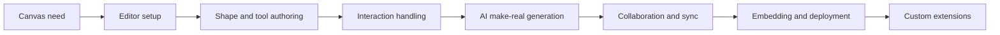

# tldraw Tutorial: Infinite Canvas SDK with AI-Powered "Make Real" App Generation

> Learn how to use `tldraw/tldraw` to build, customize, and extend an infinite canvas — from embedding the editor and creating custom shapes to integrating the "make-real" AI feature that generates working applications from whiteboard sketches.

## Why This Track Matters

tldraw is one of the most popular open-source infinite canvas libraries, used by teams building collaborative whiteboards, diagramming tools, design prototyping surfaces, and AI-powered visual applications. With approximately 46,000 GitHub stars, it has become the de facto SDK for embedding a canvas experience into web applications.

This track is particularly relevant for developers who:

- want to embed an infinite canvas into a React application with minimal setup
- need to understand how modern canvas rendering and interaction systems are architected
- are building AI-augmented tools and want to study the "make-real" pattern of generating working apps from sketches
- plan to create custom shapes, tools, and extensions on top of the tldraw platform
- need real-time collaborative canvas features with multiplayer sync

This track focuses on:

- understanding the tldraw editor architecture and its reactive state management
- mastering the shape system for creating custom visual primitives
- learning the tool and interaction model for pointer, keyboard, and gesture handling
- integrating the "make-real" AI pipeline that converts drawings to working HTML/CSS/JS
- implementing collaboration and multiplayer sync with the tldraw store
- embedding tldraw into production applications with custom configurations
- building extensions that add new capabilities to the canvas

## Current Snapshot (auto-updated)

- repository: [`tldraw/tldraw`](https://github.com/tldraw/tldraw)
- stars: about **46.2k**
- latest release: [`v4.5.7`](https://github.com/tldraw/tldraw/releases/tag/v4.5.7) (published 2026-04-03)

## Mental Model

## Chapter Guide

| Chapter | Key Question | Outcome |
|:--------|:-------------|:--------|
| [01 - Getting Started](01-getting-started.md) | How do I set up tldraw and render my first canvas? | Working dev environment with embedded canvas |
| [02 - Editor Architecture](02-editor-architecture.md) | How does the Editor, Store, and rendering pipeline fit together? | Clear mental model of the internal architecture |
| [03 - Shape System](03-shape-system.md) | How do shapes work and how do I create custom ones? | Ability to define and render custom shapes |
| [04 - Tools and Interactions](04-tools-and-interactions.md) | How do tools handle pointer, keyboard, and gesture input? | Understanding of the interaction state machine |
| [05 - AI Make-Real Feature](05-ai-make-real.md) | How does make-real turn sketches into working apps? | Ability to build AI-powered canvas features |
| [06 - Collaboration and Sync](06-collaboration-and-sync.md) | How does multiplayer sync work with the tldraw store? | Multiplayer collaboration readiness |
| [07 - Embedding and Integration](07-embedding-and-integration.md) | How do I embed tldraw into production applications? | Production embedding patterns |
| [08 - Custom Extensions](08-custom-extensions.md) | How do I extend tldraw with new capabilities? | Extension development skills |

## What You Will Learn

- how tldraw's Editor class orchestrates rendering, state, and user interaction on an infinite canvas
- how the reactive Store manages shape records and enables undo/redo, persistence, and sync
- how the shape system allows you to define custom geometries, rendering, and hit-testing
- how tools implement a state machine pattern for handling complex multi-step interactions
- how the make-real AI feature captures canvas content, sends it to a vision model, and renders generated applications
- how the sync layer enables real-time multiplayer collaboration using operational records
- how to embed and configure tldraw in React applications with controlled and uncontrolled patterns
- how to build plugins and extensions that add new tools, shapes, and UI panels

## Source References

- [tldraw Repository](https://github.com/tldraw/tldraw)
- [README](https://github.com/tldraw/tldraw/blob/main/README.md)
- [tldraw Documentation](https://tldraw.dev)
- [make-real Repository](https://github.com/tldraw/make-real)
- [Examples](https://github.com/tldraw/tldraw/tree/main/apps/examples)

## Related Tutorials

- [AFFiNE Tutorial](../affine-tutorial/) — AI workspace with whiteboard canvas built on BlockSuite
- [Onlook Tutorial](../onlook-tutorial/) — Visual-first design tool for building web applications
- [bolt.diy Tutorial](../bolt-diy-tutorial/) — AI-powered full-stack app generation from prompts

---

Start with [Chapter 1: Getting Started](01-getting-started.md).

## Navigation & Backlinks

- [Start Here: Chapter 1: Getting Started](01-getting-started.md)
- [Back to Main Catalog](../../README.md#-tutorial-catalog)
- [Browse A-Z Tutorial Directory](../../discoverability/tutorial-directory.md)
- [Search by Intent](../../discoverability/query-hub.md)
- [Explore Category Hubs](../../README.md#category-hubs)

## Full Chapter Map

1. [Chapter 1: Getting Started](01-getting-started.md)
2. [Chapter 2: Editor Architecture](02-editor-architecture.md)
3. [Chapter 3: Shape System](03-shape-system.md)
4. [Chapter 4: Tools and Interactions](04-tools-and-interactions.md)
5. [Chapter 5: AI Make-Real Feature](05-ai-make-real.md)
6. [Chapter 6: Collaboration and Sync](06-collaboration-and-sync.md)
7. [Chapter 7: Embedding and Integration](07-embedding-and-integration.md)
8. [Chapter 8: Custom Extensions](08-custom-extensions.md)

*Generated by [AI Codebase Knowledge Builder](https://github.com/The-Pocket/Tutorial-Codebase-Knowledge)*
