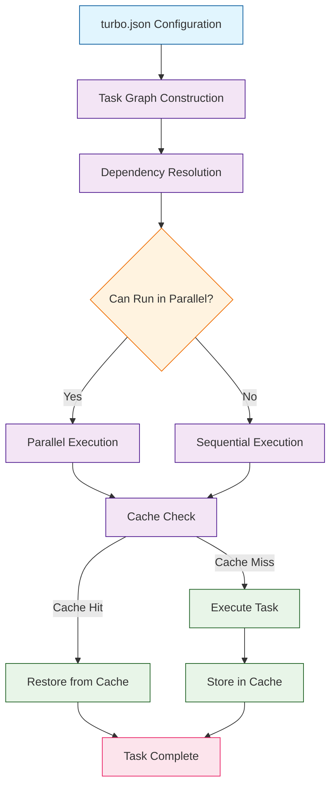
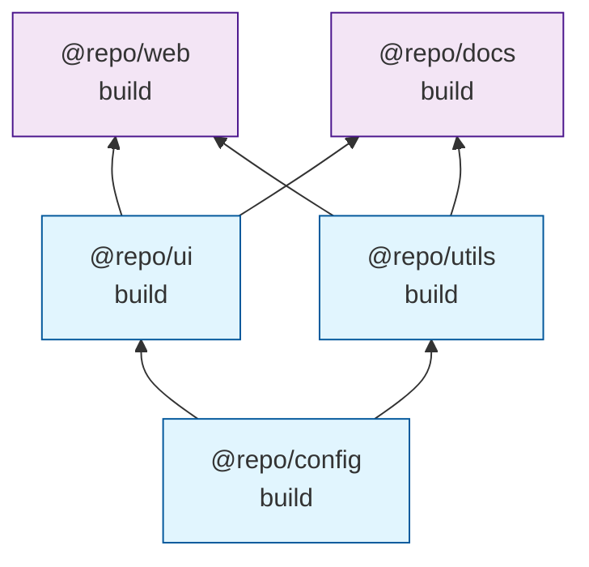
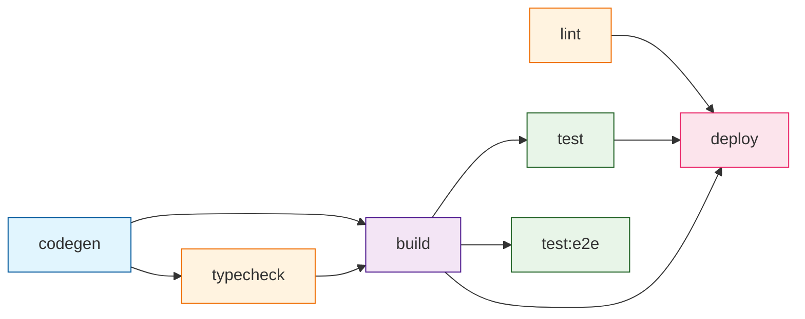
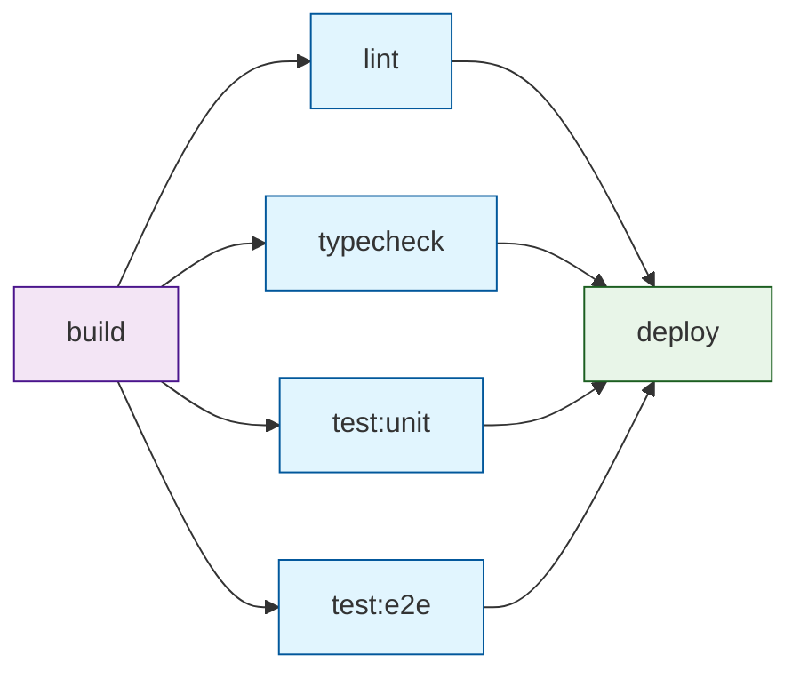

# Chapter 3: Task Pipelines

Master Turborepo's task pipeline system for efficient build orchestration and dependency management. Task pipelines are the heart of Turborepo -- they define what runs, in what order, and how tasks relate to each other across your monorepo. A well-designed pipeline ensures that builds are fast, correct, and reproducible.

## How Task Pipelines Work

Turborepo uses your `turbo.json` configuration to build a **directed acyclic graph (DAG)** of tasks. This graph determines the optimal execution order, which tasks can run in parallel, and which must wait for dependencies to complete.



### Task Definition Anatomy

Every task in `turbo.json` is defined under the `tasks` key. Each task can specify dependencies, inputs, outputs, environment variables, and behavioral flags.

```json
// turbo.json
{
  "$schema": "https://turbo.build/schema.json",
  "tasks": {
    "build": {
      "dependsOn": ["^build"],
      "inputs": ["src/**", "package.json", "tsconfig.json"],
      "outputs": ["dist/**"],
      "env": ["NODE_ENV"],
      "persistent": false,
      "cache": true
    }
  }
}
```

| Property | Type | Description |
|----------|------|-------------|
| `dependsOn` | `string[]` | Tasks or topological dependencies that must complete first |
| `inputs` | `string[]` | Files that affect the task hash (determines cache validity) |
| `outputs` | `string[]` | Files produced by the task (stored in cache) |
| `env` | `string[]` | Environment variables that affect the task hash |
| `persistent` | `boolean` | Whether the task is long-running (e.g., dev servers) |
| `cache` | `boolean` | Whether to cache the task output (default: `true`) |
| `outputLogs` | `string` | Controls log output: `full`, `hash-only`, `new-only`, `errors-only`, `none` |
| `interruptible` | `boolean` | Whether a persistent task can be restarted in watch mode |

## Dependency Types

Understanding dependency syntax is critical for building correct pipelines. Turborepo supports three distinct dependency patterns.

### Topological Dependencies (`^`)

The caret prefix (`^`) means "run this task in all dependency packages first." This follows the package dependency graph defined in your `package.json` files.

```json
{
  "tasks": {
    "build": {
      "dependsOn": ["^build"]
    }
  }
}
```



In this diagram, `@repo/web` depends on `@repo/ui` and `@repo/utils`, which both depend on `@repo/config`. Turborepo ensures `@repo/config` builds first, then `@repo/ui` and `@repo/utils` in parallel, and finally `@repo/web` and `@repo/docs`.

### Same-Package Dependencies

Without the caret, a dependency refers to another task within the same package.

```json
{
  "tasks": {
    "build": {
      "dependsOn": ["codegen", "typecheck"]
    },
    "codegen": {},
    "typecheck": {
      "dependsOn": ["codegen"]
    }
  }
}
```

This ensures that within every package, `codegen` runs first, then `typecheck`, and finally `build`.

### Cross-Package Task Dependencies

You can also reference specific tasks in specific packages using the `package#task` syntax.

```json
{
  "tasks": {
    "build": {
      "dependsOn": ["@repo/config#build", "^build"]
    },
    "deploy": {
      "dependsOn": ["@repo/web#build", "@repo/api#build"]
    }
  }
}
```

| Dependency Syntax | Meaning | Example |
|-------------------|---------|---------|
| `^taskname` | Run `taskname` in all dependency packages first | `"^build"` |
| `taskname` | Run `taskname` in the same package first | `"codegen"` |
| `pkg#taskname` | Run `taskname` in a specific package first | `"@repo/ui#build"` |

## Building Real-World Pipelines

### Standard Web Application Pipeline

A typical full-stack monorepo might have this pipeline structure:

```json
// turbo.json
{
  "$schema": "https://turbo.build/schema.json",
  "globalDependencies": [
    "**/.env.*local",
    "tsconfig.base.json"
  ],
  "globalEnv": ["CI", "NODE_ENV"],
  "tasks": {
    "codegen": {
      "dependsOn": ["^codegen"],
      "inputs": ["schema/**", "graphql/**"],
      "outputs": ["src/generated/**"]
    },
    "typecheck": {
      "dependsOn": ["codegen", "^build"],
      "inputs": ["src/**/*.ts", "src/**/*.tsx", "tsconfig.json"],
      "outputs": []
    },
    "lint": {
      "dependsOn": ["^build"],
      "inputs": [
        "src/**/*.ts",
        "src/**/*.tsx",
        ".eslintrc.*",
        "eslint.config.*"
      ],
      "outputs": []
    },
    "build": {
      "dependsOn": ["codegen", "typecheck", "^build"],
      "inputs": ["src/**", "package.json", "tsconfig.json"],
      "outputs": ["dist/**", ".next/**", "!.next/cache/**"]
    },
    "test": {
      "dependsOn": ["build"],
      "inputs": [
        "src/**/*.ts",
        "src/**/*.tsx",
        "test/**",
        "__tests__/**",
        "jest.config.*",
        "vitest.config.*"
      ],
      "outputs": ["coverage/**"]
    },
    "test:e2e": {
      "dependsOn": ["build"],
      "inputs": ["e2e/**", "playwright.config.*"],
      "outputs": ["test-results/**"],
      "env": ["PLAYWRIGHT_BASE_URL"]
    },
    "dev": {
      "cache": false,
      "persistent": true
    },
    "deploy": {
      "dependsOn": ["build", "test", "lint"],
      "outputs": [],
      "env": ["VERCEL_TOKEN", "DEPLOY_ENV"]
    }
  }
}
```



### Microfrontend Pipeline

For monorepos with multiple frontend applications sharing components:

```json
{
  "tasks": {
    "build": {
      "dependsOn": ["^build"],
      "outputs": ["dist/**", ".next/**", "!.next/cache/**"]
    },
    "build:storybook": {
      "dependsOn": ["^build"],
      "inputs": ["src/**", "stories/**", ".storybook/**"],
      "outputs": ["storybook-static/**"]
    },
    "dev": {
      "cache": false,
      "persistent": true
    },
    "dev:storybook": {
      "cache": false,
      "persistent": true,
      "dependsOn": ["^build"]
    }
  }
}
```

### Library Publishing Pipeline

For monorepos that publish packages to npm:

```json
{
  "tasks": {
    "build": {
      "dependsOn": ["^build"],
      "outputs": ["dist/**"]
    },
    "test": {
      "dependsOn": ["build"],
      "outputs": ["coverage/**"]
    },
    "lint": {
      "dependsOn": ["^build"]
    },
    "typecheck": {
      "dependsOn": ["^build"]
    },
    "version": {
      "dependsOn": ["build", "test", "lint", "typecheck"]
    },
    "publish": {
      "dependsOn": ["version"],
      "env": ["NPM_TOKEN"],
      "cache": false
    }
  }
}
```

## Running Tasks with Filters

Turborepo provides powerful filtering to run tasks on specific subsets of your monorepo.

### Filter Syntax

```bash
# Run build in a specific package
turbo build --filter=@repo/web

# Run build in a package and all its dependencies
turbo build --filter=@repo/web...

# Run build for all packages a specific package depends on
turbo build --filter=...@repo/web

# Run build only for packages changed since main
turbo build --filter=...[main]

# Run build for packages changed in the last commit
turbo build --filter=...[HEAD^1]

# Run build for packages in a specific directory
turbo build --filter="./apps/*"

# Combine filters (intersection)
turbo build --filter=@repo/web...  --filter=...[main]

# Exclude packages
turbo build --filter="!@repo/docs"
```

| Filter Pattern | Description |
|----------------|-------------|
| `@repo/web` | Exact package match |
| `@repo/web...` | Package and all its dependencies (downstream) |
| `...@repo/web` | Package and all its dependents (upstream) |
| `...[ref]` | All packages changed since git ref |
| `./apps/*` | Packages matching directory glob |
| `!@repo/docs` | Exclude a specific package |
| `{./apps/*}[HEAD^1]` | Changed packages matching a directory pattern since last commit |

### Practical Filter Examples

```bash
# Development: Run dev server for web app and its dependencies
turbo dev --filter=@repo/web...

# CI: Only build and test what changed on this PR
turbo build test lint --filter=...[origin/main]

# Release: Build a specific package and everything it depends on
turbo build --filter=@repo/ui...

# Debugging: Dry-run to see what would execute
turbo build --filter=@repo/web... --dry-run=json
```

## Persistent Tasks and Watch Mode

### Development Servers

Persistent tasks are long-running processes like dev servers that never "complete." They must be marked with `persistent: true` so Turborepo knows not to treat them as blocking other tasks.

```json
{
  "tasks": {
    "dev": {
      "cache": false,
      "persistent": true,
      "dependsOn": ["^build"]
    },
    "dev:css": {
      "cache": false,
      "persistent": true
    }
  }
}
```

### Watch Mode

Turborepo's watch mode re-runs tasks when source files change:

```bash
# Watch for changes and rebuild
turbo watch build

# Watch specific packages
turbo watch build --filter=@repo/ui

# Watch with the terminal UI
turbo watch build test
```

### Sidecar Tasks (v2.5+)

Sidecar tasks run persistent processes alongside your main tasks using the `with` property:

```json
{
  "tasks": {
    "dev": {
      "cache": false,
      "persistent": true
    },
    "dev:css": {
      "cache": false,
      "persistent": true,
      "with": ["dev"]
    }
  }
}
```

## Per-Package Task Configuration

You can override global task configuration on a per-package basis by creating a `turbo.json` inside any workspace package.

```json
// apps/web/turbo.json
{
  "$schema": "https://turbo.build/schema.json",
  "extends": ["//"],
  "tasks": {
    "build": {
      "inputs": [
        "src/**",
        "public/**",
        "next.config.js",
        "tailwind.config.ts"
      ],
      "outputs": [".next/**", "!.next/cache/**"],
      "env": ["NEXT_PUBLIC_API_URL", "NEXT_PUBLIC_GA_ID"]
    },
    "test:e2e": {
      "dependsOn": ["^build"],
      "inputs": ["e2e/**", "playwright.config.ts"],
      "outputs": ["test-results/**", "playwright-report/**"],
      "env": ["PLAYWRIGHT_BASE_URL", "E2E_USER", "E2E_PASSWORD"]
    }
  }
}
```

The `"extends": ["//"]` directive tells Turborepo to inherit from the root `turbo.json` and apply overrides only for this package.

### When to Use Per-Package Configuration

| Scenario | Root `turbo.json` | Package `turbo.json` |
|----------|-------------------|----------------------|
| Default build outputs | `"outputs": ["dist/**"]"` | `"outputs": [".next/**"]"` for Next.js apps |
| Package-specific env vars | Global env vars only | `"env": ["NEXT_PUBLIC_*"]"` |
| Custom inputs | Generic inputs | Framework-specific config files |
| Different test runners | Common test config | Package-specific test config |

## Dry Runs and Pipeline Debugging

### Inspecting the Task Graph

```bash
# Text summary of what would run
turbo build --dry-run

# JSON output for programmatic analysis
turbo build --dry-run=json

# Visualize the task graph (outputs to a file)
turbo build --graph=graph.html

# Output graph as DOT format for Graphviz
turbo build --graph=graph.dot

# Output graph as JSON
turbo build --graph=graph.json
```

### Reading Dry Run Output

```bash
$ turbo build --dry-run

 Tasks to Run
 @repo/config#build
   Task            = build
   Package         = @repo/config
   Hash            = abc123def
   Cached (Local)  = false
   Cached (Remote) = false
   Directory       = packages/config
   Dependencies    =
   Dependents      = @repo/ui#build, @repo/utils#build

 @repo/ui#build
   Task            = build
   Package         = @repo/ui
   Hash            = def456ghi
   Cached (Local)  = true
   Cached (Remote) = false
   Directory       = packages/ui
   Dependencies    = @repo/config#build
   Dependents      = @repo/web#build
```

### Using `turbo query` (v2.2+)

The `turbo query` command lets you query the task graph using GraphQL:

```bash
# Find all packages that depend on @repo/ui
turbo query "query { packages(filter: { dependsOn: \"@repo/ui\" }) { name } }"

# List all tasks for a specific package
turbo query "query { package(name: \"@repo/web\") { tasks { name } } }"
```

## Task Output and Logging

### Controlling Log Output

```json
{
  "tasks": {
    "build": {
      "dependsOn": ["^build"],
      "outputs": ["dist/**"],
      "outputLogs": "new-only"
    },
    "lint": {
      "outputLogs": "errors-only"
    },
    "test": {
      "dependsOn": ["build"],
      "outputLogs": "full"
    }
  }
}
```

| `outputLogs` Value | Behavior |
|--------------------|----------|
| `full` | Show all output, cached and new |
| `hash-only` | Show only the task hash |
| `new-only` | Show output only for cache misses |
| `errors-only` | Show output only for failed tasks |
| `none` | Suppress all output |

### Log Ordering

```bash
# Stream output as it happens (interleaved)
turbo build --log-order=stream

# Group output by package (default)
turbo build --log-order=grouped

# Use the terminal UI (v2.0+)
turbo build --ui=tui
```

## Common Pipeline Patterns

### The "Quality Gate" Pattern

Ensure all quality checks pass before building:

```json
{
  "tasks": {
    "lint": {},
    "typecheck": { "dependsOn": ["^build"] },
    "test:unit": { "dependsOn": ["^build"] },
    "build": {
      "dependsOn": ["lint", "typecheck", "test:unit", "^build"],
      "outputs": ["dist/**"]
    }
  }
}
```

### The "Build First" Pattern

Build everything, then validate:

```json
{
  "tasks": {
    "build": {
      "dependsOn": ["^build"],
      "outputs": ["dist/**"]
    },
    "lint": { "dependsOn": ["build"] },
    "test": { "dependsOn": ["build"] },
    "typecheck": { "dependsOn": ["build"] }
  }
}
```

### The "Fan-Out/Fan-In" Pattern

Run independent checks in parallel, then merge at a gate:

```json
{
  "tasks": {
    "build": {
      "dependsOn": ["^build"],
      "outputs": ["dist/**"]
    },
    "lint": { "dependsOn": ["^build"] },
    "typecheck": { "dependsOn": ["^build"] },
    "test:unit": { "dependsOn": ["build"] },
    "test:e2e": { "dependsOn": ["build"] },
    "deploy": {
      "dependsOn": ["lint", "typecheck", "test:unit", "test:e2e"],
      "cache": false
    }
  }
}
```



## Summary

Task pipelines are the foundation of Turborepo's power. By defining clear dependency relationships, proper inputs and outputs, and using the right pipeline patterns, you enable Turborepo to execute your monorepo's tasks in the most efficient order possible -- maximizing parallelism while maintaining correctness.

## Key Takeaways

- **Topological dependencies** (`^`) follow your package dependency graph and are essential for cross-package build ordering.
- **Same-package dependencies** (without `^`) enforce ordering between different tasks within a single package.
- **Filters** let you scope task execution to specific packages, directories, or git change sets.
- **Persistent tasks** are for long-running processes like dev servers that should not block other tasks.
- **Per-package `turbo.json`** allows you to customize task behavior for individual workspaces while inheriting global defaults.
- **Dry runs and graph visualization** are indispensable tools for debugging and understanding your pipeline.
- Choose the right **pipeline pattern** (Quality Gate, Build First, or Fan-Out/Fan-In) based on your project's requirements.

## Next Steps

With your task pipelines defined, the next critical optimization is caching. In [Chapter 4: Caching Strategies](04-caching-strategies.md), we will explore how Turborepo's intelligent caching system avoids redundant work, how to configure inputs and outputs for maximum cache hit rates, and how to debug cache misses.

---

*Built with insights from the [Turborepo](https://github.com/vercel/turborepo) project.*
