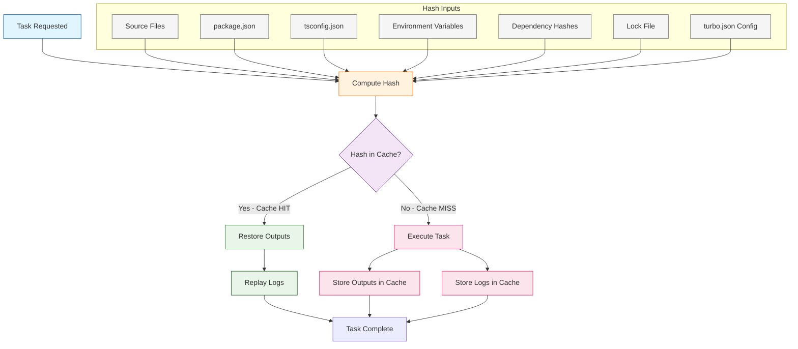
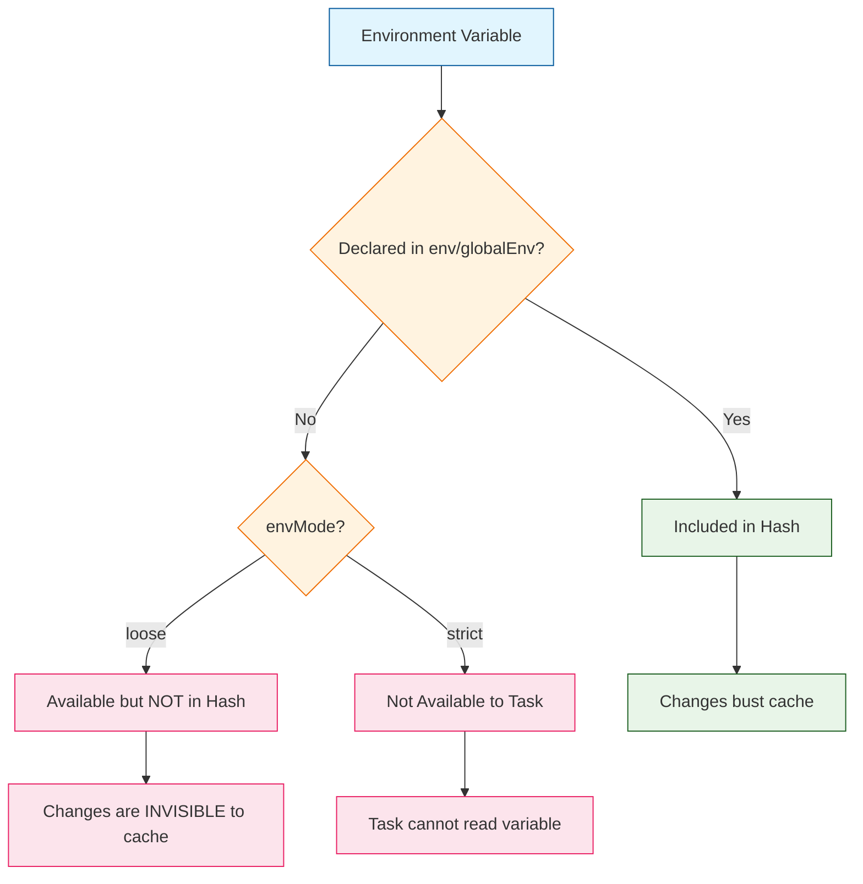

# Chapter 4: Caching Strategies

Welcome to **Chapter 4: Caching Strategies**. In this part of **Turborepo Tutorial: High-Performance Monorepo Build System**, you will build an intuitive mental model first, then move into concrete implementation details and practical production tradeoffs.


Learn Turborepo's intelligent caching system that dramatically speeds up your builds by avoiding redundant work. Caching is the single most impactful feature of Turborepo -- it transforms multi-minute builds into sub-second cache restores by fingerprinting your tasks and storing their outputs.

## How Caching Works

When Turborepo runs a task, it computes a **hash** based on the task's inputs, environment variables, dependencies, and configuration. If a previous run produced the same hash, Turborepo skips execution entirely and restores the cached outputs and logs instead.



### What Goes Into the Hash

Turborepo creates a deterministic hash from multiple sources. Understanding these sources is key to optimizing your cache hit rate.

| Hash Component | Description | Configured By |
|----------------|-------------|---------------|
| Source file contents | Content of files matching the `inputs` glob patterns | `tasks.<task>.inputs` |
| Package dependencies | Hashes of tasks in dependency packages | `tasks.<task>.dependsOn` with `^` |
| Environment variables | Values of specified env vars | `tasks.<task>.env` and `globalEnv` |
| Global dependencies | Content of files affecting all tasks | `globalDependencies` |
| Lock file | Resolved dependency versions | Automatic (detects package manager) |
| Task arguments | Any arguments passed to the task | CLI arguments |
| `turbo.json` config | The task configuration itself | Automatic |

### Cache Storage Location

By default, Turborepo stores cache artifacts locally:

```bash
# Default local cache directory
node_modules/.cache/turbo

# Cache structure
node_modules/.cache/turbo/
├── <hash1>.tar.zst          # Compressed task outputs
├── <hash1>-meta.json        # Task metadata
├── <hash2>.tar.zst
├── <hash2>-meta.json
└── ...
```

You can customize the cache directory:

```json
// turbo.json
{
  "cacheDir": ".turbo/cache"
}
```

## Configuring Inputs

Inputs determine which files affect a task's hash. Getting inputs right is the most important factor for achieving high cache hit rates.

### Default Inputs

When you do not specify `inputs`, Turborepo considers **all files** in the package (excluding those in `.gitignore`) as inputs. This is safe but conservative -- any file change in the package will bust the cache.

### Narrowing Inputs for Better Cache Hits

```json
{
  "tasks": {
    "build": {
      "inputs": [
        "src/**",
        "package.json",
        "tsconfig.json",
        "next.config.js"
      ],
      "outputs": ["dist/**"]
    },
    "lint": {
      "inputs": [
        "src/**/*.ts",
        "src/**/*.tsx",
        ".eslintrc.*",
        "eslint.config.*"
      ],
      "outputs": []
    },
    "test": {
      "inputs": [
        "src/**/*.ts",
        "src/**/*.tsx",
        "test/**",
        "__tests__/**",
        "jest.config.*",
        "vitest.config.*"
      ],
      "outputs": ["coverage/**"]
    }
  }
}
```

### Excluding Files from Inputs

Use the `!` prefix to exclude files from the input set. This is powerful for avoiding cache busts from irrelevant changes.

```json
{
  "tasks": {
    "build": {
      "inputs": [
        "src/**",
        "!src/**/*.test.ts",
        "!src/**/*.test.tsx",
        "!src/**/*.spec.ts",
        "!src/**/*.stories.tsx",
        "!src/**/__mocks__/**",
        "package.json",
        "tsconfig.json"
      ],
      "outputs": ["dist/**"]
    }
  }
}
```

### Input Configuration Strategies

| Strategy | Inputs | Cache Hit Rate | Risk |
|----------|--------|----------------|------|
| No `inputs` (default) | All files | Low | None -- always correct |
| Broad globs | `"src/**"` | Medium | Low -- covers most cases |
| Narrow globs | `"src/**/*.ts"` | High | Medium -- may miss config changes |
| Precise globs with exclusions | `"src/**", "!**/*.test.*"` | Highest | Higher -- requires careful maintenance |

## Configuring Outputs

Outputs tell Turborepo which files to save into the cache and restore on cache hits. If outputs are misconfigured, you may get cache hits that produce broken builds because restored files are incomplete.

### Standard Output Patterns

```json
{
  "tasks": {
    "build": {
      "outputs": ["dist/**"]
    },
    "build:next": {
      "outputs": [
        ".next/**",
        "!.next/cache/**"
      ]
    },
    "build:storybook": {
      "outputs": ["storybook-static/**"]
    },
    "test": {
      "outputs": ["coverage/**"]
    },
    "lint": {
      "outputs": []
    },
    "typecheck": {
      "outputs": []
    }
  }
}
```

### Output Patterns by Framework

| Framework | Build Output | Recommended `outputs` |
|-----------|-------------|----------------------|
| TypeScript (tsc/tsup) | `dist/` | `["dist/**"]` |
| Next.js | `.next/` | `[".next/**", "!.next/cache/**"]` |
| Vite | `dist/` | `["dist/**"]` |
| Remix | `build/`, `public/build/` | `["build/**", "public/build/**"]` |
| Storybook | `storybook-static/` | `["storybook-static/**"]` |
| Jest/Vitest (coverage) | `coverage/` | `["coverage/**"]` |
| esbuild | `out/` | `["out/**"]` |
| Astro | `dist/` | `["dist/**"]` |

### Tasks Without Outputs

Some tasks like `lint` and `typecheck` produce no output files -- they only check for errors. Set `outputs` to an empty array for these tasks. Turborepo will still cache the **log output** and exit code, so re-running will replay the logs instantly.

```json
{
  "tasks": {
    "lint": {
      "outputs": []
    },
    "typecheck": {
      "outputs": []
    }
  }
}
```

## Environment Variables and Cache

Environment variables are a common source of cache invalidation issues. If a task depends on an environment variable but that variable is not listed in the task's `env` or `globalEnv`, changes to it will not bust the cache -- leading to stale builds.

### Task-Level Environment Variables

```json
{
  "tasks": {
    "build": {
      "env": [
        "NODE_ENV",
        "API_URL",
        "SENTRY_DSN"
      ],
      "dependsOn": ["^build"],
      "outputs": ["dist/**"]
    },
    "test": {
      "env": [
        "NODE_ENV",
        "DATABASE_URL",
        "TEST_TIMEOUT"
      ],
      "outputs": ["coverage/**"]
    }
  }
}
```

### Global Environment Variables

Variables that affect all tasks should be declared in `globalEnv`:

```json
{
  "globalEnv": [
    "CI",
    "NODE_ENV",
    "TURBO_TOKEN",
    "TURBO_TEAM"
  ],
  "tasks": {
    "build": {
      "env": ["API_URL"],
      "outputs": ["dist/**"]
    }
  }
}
```

### Wildcard Environment Variables

For frameworks like Next.js that use prefixed env vars:

```json
{
  "tasks": {
    "build": {
      "env": ["NEXT_PUBLIC_*"],
      "outputs": [".next/**", "!.next/cache/**"]
    }
  }
}
```

### Environment Variable Mode

Turborepo v2 introduced strict environment variable handling to prevent accidental cache misses:

```json
// turbo.json
{
  "envMode": "strict"
}
```

| Mode | Behavior |
|------|----------|
| `"strict"` | Only declared env vars are included in hash; undeclared env vars are invisible to tasks |
| `"loose"` (default) | All env vars are available; only declared ones affect hash |



## Global Dependencies

Global dependencies are files that, when changed, invalidate **all** task caches. Use them sparingly for truly global configuration files.

```json
{
  "globalDependencies": [
    "tsconfig.base.json",
    "jest.config.base.js",
    ".eslintrc.base.js",
    "**/.env.*local"
  ]
}
```

### What Should Be a Global Dependency?

| File | Global Dependency? | Reason |
|------|--------------------|--------|
| `tsconfig.base.json` | Yes | Affects all TypeScript compilation |
| `.eslintrc.base.js` | Maybe | Only affects lint tasks (consider per-task input) |
| `package-lock.json` / `pnpm-lock.yaml` | Auto-included | Turborepo detects lock files automatically |
| `.env.local` | Yes | Environment values affect runtime behavior |
| `turbo.json` | Auto-included | Changes always recalculate hashes |
| `README.md` | No | Does not affect build output |
| `jest.preset.js` | Maybe | Only affects test tasks |

## Debugging Cache Misses

Cache misses are the most common performance issue in Turborepo. Here is a systematic approach to diagnosing them.

### Step 1: Run with `--summarize`

```bash
turbo build --summarize
```

This produces a `.turbo/runs/<run-id>.json` file with detailed information about every task, including its hash and the inputs that contributed to it.

### Step 2: Compare Hashes

```bash
# Run the build twice and compare the summaries
turbo build --summarize
# Make a change
turbo build --summarize

# Compare the JSON summaries to find which inputs changed
diff .turbo/runs/<first-run>.json .turbo/runs/<second-run>.json
```

### Step 3: Check for Common Cache-Busting Culprits

```bash
# Check if timestamps or generated files change between runs
turbo build --dry-run=json | jq '.tasks[] | {package, hash, inputs}'
```

### Common Cache Miss Causes and Fixes

| Cause | Symptom | Fix |
|-------|---------|-----|
| Generated files in inputs | Hash changes even with no source changes | Add generated files to `.gitignore` or exclude from `inputs` |
| Missing env var in `env` | Different env values produce same hash | Add variable to `env` or `globalEnv` |
| Timestamp-based files | Cache busts on every run | Exclude timestamp files from `inputs` |
| Unlisted config files | Config changes do not bust cache | Add to `inputs` or `globalDependencies` |
| IDE/editor config | Cache busts from editor temp files | Add to `.gitignore` |
| Non-deterministic outputs | Same inputs produce different outputs | Fix the build tool to produce deterministic output |

### Step 4: Force a Fresh Build

```bash
# Bypass cache entirely to verify build correctness
turbo build --force

# Clean all cached artifacts
turbo clean

# Clean cache for a specific package
turbo clean --filter=@repo/web
```

## Cache Control

### Disabling Cache for Specific Tasks

Some tasks should never be cached, such as dev servers or deploy commands:

```json
{
  "tasks": {
    "dev": {
      "cache": false,
      "persistent": true
    },
    "deploy": {
      "cache": false,
      "dependsOn": ["build", "test"]
    },
    "clean": {
      "cache": false
    }
  }
}
```

### Forcing Cache Bypass

```bash
# Skip cache for this run only
turbo build --force

# Disable remote cache for this run
turbo build --remote-cache-read-only

# Disable remote cache entirely via env
TURBO_REMOTE_CACHE_DISABLED=true turbo build
```

## Cache Performance Metrics

### Build Summary

```bash
# Generate a run summary with timing and cache data
turbo build --summarize

# Example output summary:
#  Tasks:    12 successful, 12 total
#  Cached:   10 cached, 2 not cached
#  Time:     2.3s (estimated without cache: 45.2s)
```

### Measuring Cache Effectiveness

Track these metrics over time to ensure caching is working well:

| Metric | How to Measure | Target |
|--------|---------------|--------|
| Cache hit rate | `Cached / Total` from `--summarize` | > 80% on average CI runs |
| Time saved | `Estimated time - Actual time` | Should grow as repo grows |
| Cache size | `du -sh node_modules/.cache/turbo` | Keep under 10GB locally |
| Cold build time | `turbo build --force` timing | Baseline for comparison |

## Summary

Turborepo's caching system is a content-addressable store that fingerprints tasks by their inputs, environment, and dependencies. By carefully configuring `inputs`, `outputs`, `env`, and `globalDependencies`, you can achieve cache hit rates above 80% in CI and near-instant rebuilds in local development. The key discipline is ensuring that every factor affecting a task's output is declared in its configuration, and that irrelevant files are excluded from inputs.

## Key Takeaways

- **Hashes are deterministic**: The same inputs always produce the same hash, making cache behavior predictable and debuggable.
- **Narrow your inputs**: The more precisely you specify `inputs`, the fewer unnecessary cache busts you will experience.
- **Declare all environment variables**: Any env var that affects task output must be listed in `env` or `globalEnv`, or cache results may be stale.
- **Use `--summarize` to debug**: The run summary is your primary tool for understanding cache behavior and diagnosing misses.
- **Outputs must be complete**: Every file your build produces that downstream tasks or deployment needs must be listed in `outputs`.
- **Global dependencies affect everything**: Use `globalDependencies` sparingly -- changes to these files invalidate all task caches.
- **Tasks without outputs still benefit**: Even `lint` and `typecheck` tasks benefit from caching by replaying logs and exit codes.

## Next Steps

Local caching is powerful, but the real force multiplier is sharing cache artifacts across your entire team and CI infrastructure. In [Chapter 5: Remote Caching](05-remote-caching.md), we will cover setting up Vercel Remote Cache, self-hosted cache servers, cache security, and team-wide caching strategies.

---

*Built with insights from the [Turborepo](https://github.com/vercel/turborepo) project.*

## What Problem Does This Solve?

Most teams struggle here because the hard part is not writing more code, but deciding clear boundaries for `build`, `turbo`, `cache` so behavior stays predictable as complexity grows.

In practical terms, this chapter helps you avoid three common failures:

- coupling core logic too tightly to one implementation path
- missing the handoff boundaries between setup, execution, and validation
- shipping changes without clear rollback or observability strategy

After working through this chapter, you should be able to reason about `Chapter 4: Caching Strategies` as an operating subsystem inside **Turborepo Tutorial: High-Performance Monorepo Build System**, with explicit contracts for inputs, state transitions, and outputs.

Use the implementation notes around `outputs`, `json`, `classDef` as your checklist when adapting these patterns to your own repository.

## How it Works Under the Hood

Under the hood, `Chapter 4: Caching Strategies` usually follows a repeatable control path:

1. **Context bootstrap**: initialize runtime config and prerequisites for `build`.
2. **Input normalization**: shape incoming data so `turbo` receives stable contracts.
3. **Core execution**: run the main logic branch and propagate intermediate state through `cache`.
4. **Policy and safety checks**: enforce limits, auth scopes, and failure boundaries.
5. **Output composition**: return canonical result payloads for downstream consumers.
6. **Operational telemetry**: emit logs/metrics needed for debugging and performance tuning.

When debugging, walk this sequence in order and confirm each stage has explicit success/failure conditions.

## Source Walkthrough

Use the following upstream sources to verify implementation details while reading this chapter:

- [View Repo](https://github.com/vercel/turborepo)
  Why it matters: authoritative reference on `View Repo` (github.com).

Suggested trace strategy:
- search upstream code for `build` and `turbo` to map concrete implementation paths
- compare docs claims against actual runtime/config code before reusing patterns in production

## Chapter Connections

- [Tutorial Index](index.md)
- [Previous Chapter: Chapter 3: Task Pipelines](03-task-pipelines.md)
- [Next Chapter: Chapter 5: Remote Caching](05-remote-caching.md)
- [Main Catalog](../../README.md#-tutorial-catalog)
- [A-Z Tutorial Directory](../../discoverability/tutorial-directory.md)
