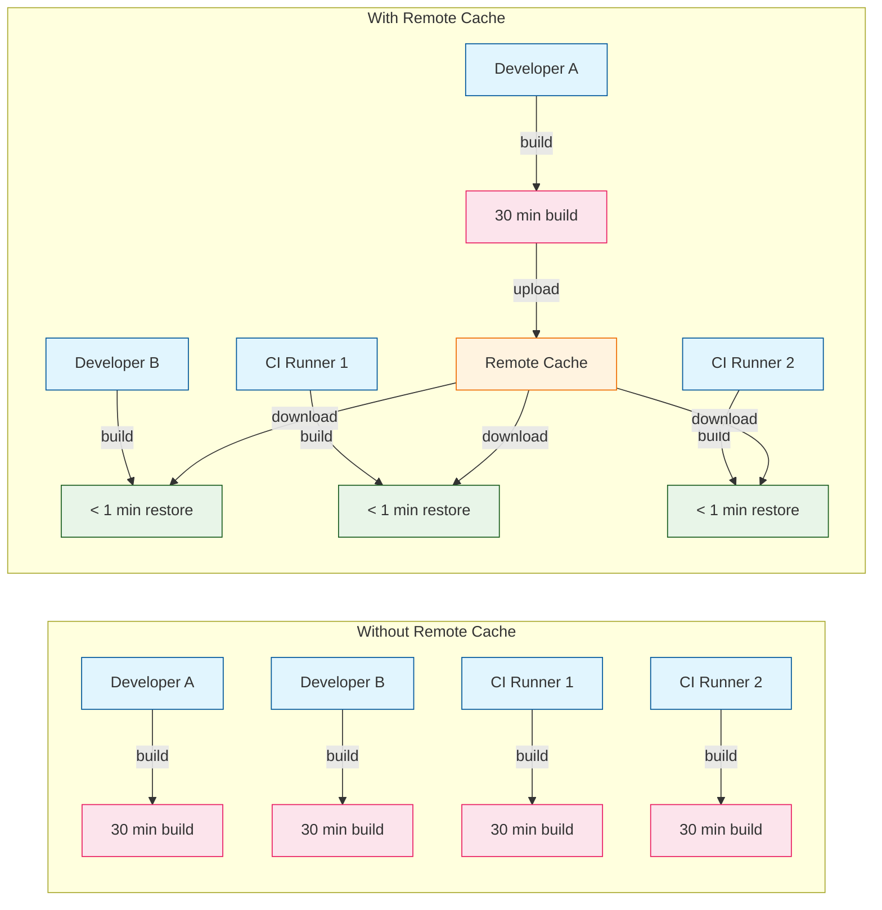
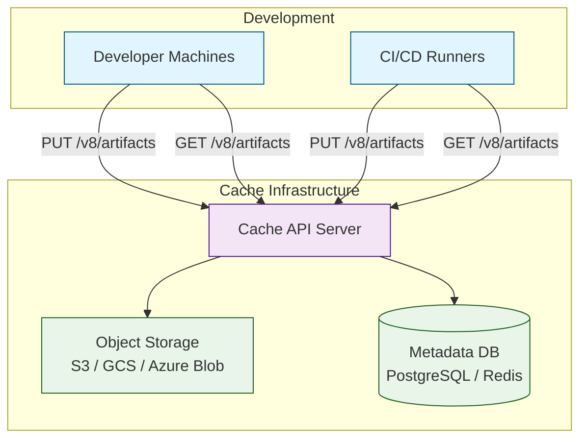
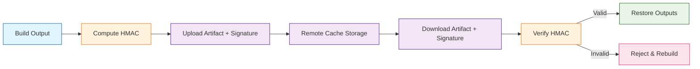

# Chapter 5: Remote Caching

Welcome to **Chapter 5: Remote Caching**. In this part of **Turborepo Tutorial: High-Performance Monorepo Build System**, you will build an intuitive mental model first, then move into concrete implementation details and practical production tradeoffs.


Set up team-wide caching to share build artifacts across your organization and CI/CD pipelines. While local caching eliminates redundant work on a single machine, remote caching extends that benefit across every developer workstation and every CI runner -- so a build that one teammate already completed becomes an instant cache restore for everyone else.

## Why Remote Caching Matters

Without remote caching, every CI run and every developer machine starts from a cold cache. In a large monorepo, this means builds are repeated thousands of times across the organization for identical code.



### Impact at Scale

| Team Size | Daily CI Runs | Without Remote Cache | With Remote Cache | Time Saved |
|-----------|---------------|---------------------|-------------------|------------|
| 5 devs | 20 | 10 hours | 1.5 hours | 85% |
| 20 devs | 80 | 40 hours | 5 hours | 87% |
| 50 devs | 200 | 100 hours | 8 hours | 92% |
| 100 devs | 500+ | 250+ hours | 15 hours | 94% |

## Setting Up Vercel Remote Cache

The fastest way to enable remote caching is through Vercel, the company behind Turborepo. Vercel provides a managed remote cache service that requires minimal configuration.

### Step 1: Authenticate with Vercel

```bash
# Log in to Vercel (opens browser for authentication)
npx turbo login

# Link your repository to a Vercel team/project
npx turbo link
```

### Step 2: Verify Connection

```bash
# Run a build -- outputs should be uploaded to remote cache
turbo build

# Output includes:
#  Remote caching enabled
#  ...
#  Full turbo: 12 tasks, 10 cached, 2 not cached
```

### Step 3: Test Remote Cache on Another Machine

```bash
# On a different machine or CI runner:
turbo build

# Output shows remote cache hits:
#  Remote cache hit: @repo/ui#build
#  Remote cache hit: @repo/utils#build
#  ...
```

### Vercel Configuration Options

```json
// turbo.json
{
  "$schema": "https://turbo.build/schema.json",
  "remoteCache": {
    "enabled": true,
    "signature": true
  },
  "tasks": {
    "build": {
      "dependsOn": ["^build"],
      "outputs": ["dist/**"]
    }
  }
}
```

| Option | Type | Default | Description |
|--------|------|---------|-------------|
| `remoteCache.enabled` | `boolean` | `true` | Enable or disable remote caching |
| `remoteCache.signature` | `boolean` | `false` | Enable artifact signature verification for security |

## Self-Hosted Remote Cache

For teams that need to keep build artifacts within their own infrastructure, Turborepo supports self-hosted remote cache servers through its open API specification.

### Architecture Overview



### Popular Self-Hosted Solutions

| Solution | Language | Storage Backend | License |
|----------|----------|-----------------|---------|
| `turborepo-remote-cache` | Node.js | S3, GCS, Azure, Local | MIT |
| `turbo-cache` | Go | S3, GCS | MIT |
| `ducktape` | Rust | S3 | MIT |
| Custom implementation | Any | Any | N/A |

### Setting Up `turborepo-remote-cache` (Node.js)

```bash
# Install the server
npm install -g turborepo-remote-cache

# Or clone and run directly
git clone https://github.com/ducktors/turborepo-remote-cache
cd turborepo-remote-cache
npm install
npm start
```

Configure the server with environment variables:

```bash
# Server configuration
PORT=3000
TURBO_TOKEN=your-secret-token
STORAGE_PROVIDER=s3

# S3 configuration
S3_ACCESS_KEY=your-access-key
S3_SECRET_KEY=your-secret-key
S3_REGION=us-east-1
S3_ENDPOINT=https://s3.amazonaws.com
S3_BUCKET=turborepo-cache
```

### Connecting Turborepo to a Self-Hosted Cache

Configure your project to use the self-hosted cache via environment variables:

```bash
# Set in your shell profile, .env, or CI environment
export TURBO_API="https://cache.your-company.com"
export TURBO_TOKEN="your-secret-token"
export TURBO_TEAM="your-team-name"
```

Or use CLI flags:

```bash
turbo build --api="https://cache.your-company.com" --token="your-secret-token" --team="your-team-name"
```

### Custom Cache Server API Endpoints

Turborepo's remote cache API follows a simple REST interface. If you want to build your own server, you need to implement these endpoints:

```
PUT  /v8/artifacts/:hash     # Upload a cache artifact
GET  /v8/artifacts/:hash     # Download a cache artifact
HEAD /v8/artifacts/:hash     # Check if artifact exists
POST /v8/artifacts/events    # Record cache events (analytics)
GET  /v8/artifacts/status    # Health check
```

### Minimal Custom Cache Server (TypeScript)

```typescript
import express from "express";
import { createReadStream, createWriteStream, existsSync } from "fs";
import { mkdir } from "fs/promises";
import path from "path";

const app = express();
const CACHE_DIR = "./cache-storage";
const TURBO_TOKEN = process.env.TURBO_TOKEN || "your-secret-token";

// Authentication middleware
function authenticate(
  req: express.Request,
  res: express.Response,
  next: express.NextFunction
) {
  const token = req.headers.authorization?.replace("Bearer ", "");
  if (token !== TURBO_TOKEN) {
    return res.status(401).json({ error: "Unauthorized" });
  }
  next();
}

app.use(authenticate);

// Check if artifact exists
app.head("/v8/artifacts/:hash", (req, res) => {
  const artifactPath = path.join(CACHE_DIR, req.params.hash);
  if (existsSync(artifactPath)) {
    res.status(200).end();
  } else {
    res.status(404).end();
  }
});

// Download artifact
app.get("/v8/artifacts/:hash", (req, res) => {
  const artifactPath = path.join(CACHE_DIR, req.params.hash);
  if (!existsSync(artifactPath)) {
    return res.status(404).json({ error: "Not found" });
  }
  createReadStream(artifactPath).pipe(res);
});

// Upload artifact
app.put("/v8/artifacts/:hash", async (req, res) => {
  await mkdir(CACHE_DIR, { recursive: true });
  const artifactPath = path.join(CACHE_DIR, req.params.hash);
  const writeStream = createWriteStream(artifactPath);
  req.pipe(writeStream);
  writeStream.on("finish", () => {
    res.status(200).json({ urls: [`${req.params.hash}`] });
  });
});

// Record events (analytics)
app.post("/v8/artifacts/events", (_req, res) => {
  res.status(200).json({});
});

app.listen(3000, () => {
  console.log("Cache server running on port 3000");
});
```

## Cache Security

Remote cache artifacts contain your compiled code and build outputs. Securing them is essential, especially for proprietary codebases.

### Artifact Signing

Enable artifact signing to verify that cached artifacts have not been tampered with:

```json
// turbo.json
{
  "remoteCache": {
    "signature": true
  }
}
```

When artifact signing is enabled, Turborepo computes an HMAC signature of each artifact using the `TURBO_REMOTE_CACHE_SIGNATURE_KEY` environment variable and verifies it on download.

```bash
# Set the signing key (must be the same across all machines)
export TURBO_REMOTE_CACHE_SIGNATURE_KEY="your-hmac-secret-key"
```



### Access Control Best Practices

| Practice | Implementation |
|----------|---------------|
| Rotate tokens regularly | Generate new `TURBO_TOKEN` values on a schedule |
| Use team-scoped tokens | Different tokens for different teams/projects |
| Restrict network access | Firewall cache server to VPN/internal network |
| Enable HTTPS | Always use TLS for cache API communication |
| Audit access logs | Monitor who is uploading/downloading artifacts |
| Separate environments | Different cache namespaces for staging/production |

## CI/CD Remote Cache Configuration

### GitHub Actions with Vercel

```yaml
name: CI
on: [push, pull_request]

jobs:
  build:
    runs-on: ubuntu-latest
    steps:
      - uses: actions/checkout@v4

      - uses: pnpm/action-setup@v4
        with:
          version: 9

      - uses: actions/setup-node@v4
        with:
          node-version: 20
          cache: "pnpm"

      - run: pnpm install

      - run: pnpm turbo build test lint
        env:
          TURBO_TOKEN: ${{ secrets.TURBO_TOKEN }}
          TURBO_TEAM: ${{ vars.TURBO_TEAM }}
```

### GitHub Actions with Self-Hosted Cache

```yaml
name: CI
on: [push, pull_request]

jobs:
  build:
    runs-on: ubuntu-latest
    steps:
      - uses: actions/checkout@v4

      - uses: pnpm/action-setup@v4
        with:
          version: 9

      - uses: actions/setup-node@v4
        with:
          node-version: 20
          cache: "pnpm"

      - run: pnpm install

      - run: pnpm turbo build test lint
        env:
          TURBO_API: ${{ secrets.TURBO_API }}
          TURBO_TOKEN: ${{ secrets.TURBO_TOKEN }}
          TURBO_TEAM: ${{ vars.TURBO_TEAM }}
          TURBO_REMOTE_CACHE_SIGNATURE_KEY: ${{ secrets.TURBO_CACHE_SIGNATURE_KEY }}
```

### Docker-Based CI with Remote Cache

```dockerfile
# Dockerfile for CI
FROM node:20-slim AS base
RUN npm install -g pnpm turbo

WORKDIR /app
COPY . .

# Set cache configuration via build args
ARG TURBO_TOKEN
ARG TURBO_TEAM
ARG TURBO_API

ENV TURBO_TOKEN=${TURBO_TOKEN}
ENV TURBO_TEAM=${TURBO_TEAM}
ENV TURBO_API=${TURBO_API}

RUN pnpm install
RUN pnpm turbo build
```

## Cache Management and Maintenance

### Monitoring Cache Usage

```bash
# Check cache status for a build
turbo build --summarize

# View the run summary
cat .turbo/runs/*.json | jq '{
  tasks: .tasks | length,
  cached: [.tasks[] | select(.cache.status == "HIT")] | length,
  remote_hits: [.tasks[] | select(.cache.source == "REMOTE")] | length,
  local_hits: [.tasks[] | select(.cache.source == "LOCAL")] | length
}'
```

### Cache Eviction Strategies

| Strategy | When to Use | Implementation |
|----------|------------|----------------|
| TTL-based | Standard use | Set expiration on S3 objects (e.g., 30 days) |
| Size-based | Limited storage | Evict oldest artifacts when total size exceeds limit |
| Branch-based | Feature branches | Delete cache artifacts when branches are merged/deleted |
| Manual | Troubleshooting | `turbo clean` locally; delete from storage directly |

### S3 Lifecycle Policy for Cache Eviction

```json
{
  "Rules": [
    {
      "ID": "turbo-cache-expiration",
      "Status": "Enabled",
      "Filter": {
        "Prefix": "turborepo-cache/"
      },
      "Expiration": {
        "Days": 30
      }
    },
    {
      "ID": "turbo-cache-multipart-cleanup",
      "Status": "Enabled",
      "Filter": {
        "Prefix": "turborepo-cache/"
      },
      "AbortIncompleteMultipartUpload": {
        "DaysAfterInitiation": 1
      }
    }
  ]
}
```

## Controlling Remote Cache Behavior

### Read-Only Mode

In some scenarios (e.g., local development), you may want to read from the remote cache but not upload to it:

```bash
# Read from remote cache but do not upload new artifacts
turbo build --remote-cache-read-only

# Or via environment variable
TURBO_REMOTE_CACHE_READ_ONLY=true turbo build
```

### Disabling Remote Cache

```bash
# Disable remote cache for a single run
TURBO_REMOTE_CACHE_DISABLED=true turbo build

# Or in turbo.json
```

```json
{
  "remoteCache": {
    "enabled": false
  }
}
```

### Environment Variable Reference

| Variable | Description | Example |
|----------|-------------|---------|
| `TURBO_API` | Remote cache API URL | `https://cache.company.com` |
| `TURBO_TOKEN` | Authentication token | `turbo-token-abc123` |
| `TURBO_TEAM` | Team/scope identifier | `my-team` |
| `TURBO_REMOTE_CACHE_DISABLED` | Disable remote cache | `true` / `false` |
| `TURBO_REMOTE_CACHE_READ_ONLY` | Read-only remote cache | `true` / `false` |
| `TURBO_REMOTE_CACHE_SIGNATURE_KEY` | HMAC signing key | `your-secret-key` |
| `TURBO_PREFLIGHT` | Enable preflight requests | `true` / `false` |

## Troubleshooting Remote Cache

### Common Issues

| Issue | Symptom | Solution |
|-------|---------|----------|
| Authentication failure | `401 Unauthorized` errors | Verify `TURBO_TOKEN` is set correctly |
| Network timeout | Slow builds, timeout errors | Check network connectivity to cache API |
| Signature mismatch | `Artifact signature verification failed` | Ensure `TURBO_REMOTE_CACHE_SIGNATURE_KEY` is the same everywhere |
| Cache misses despite no changes | Unexpected rebuilds | Check if env vars differ between machines |
| Large artifact uploads | Slow uploads on limited bandwidth | Review outputs -- exclude unnecessary files |
| Cache not being used | `0 remote cache hits` | Verify `turbo login` and `turbo link` completed |

### Diagnostic Commands

```bash
# Verify authentication
turbo login --check

# Check remote cache connectivity
turbo build --dry-run --summarize

# View detailed cache information for each task
turbo build --verbosity=2

# Force local execution and upload fresh artifacts
turbo build --force
```

## Summary

Remote caching transforms Turborepo from a local optimization tool into a team-wide infrastructure. By sharing build artifacts across developer machines and CI runners, you eliminate the majority of redundant builds in your organization. Whether you use Vercel's managed service or deploy a self-hosted solution, remote caching delivers the largest return on investment for monorepo build performance at scale.

## Key Takeaways

- **Remote caching shares artifacts across machines**: Once any machine builds a package, every other machine with the same inputs gets an instant cache restore.
- **Vercel provides zero-config remote caching**: Just `turbo login` and `turbo link` to get started.
- **Self-hosted options exist for compliance needs**: Multiple open-source cache servers support S3, GCS, and Azure backends.
- **Security matters**: Enable artifact signing with `TURBO_REMOTE_CACHE_SIGNATURE_KEY` and rotate tokens regularly.
- **CI integration is straightforward**: Set `TURBO_TOKEN` and `TURBO_TEAM` as CI secrets and Turborepo handles the rest.
- **Monitor cache effectiveness**: Use `--summarize` to track cache hit rates and time saved across your organization.
- **Implement cache eviction**: Use TTL-based lifecycle policies to prevent unbounded storage growth.

## Next Steps

With caching optimized both locally and remotely, the next challenge is managing the complex web of dependencies in a monorepo. In [Chapter 6: Dependency Management](06-dependency-management.md), we will cover internal workspace references, external dependency strategies, version management, and the `turbo prune` command for creating lean deployments.

---

*Built with insights from the [Turborepo](https://github.com/vercel/turborepo) project.*

## What Problem Does This Solve?

Most teams struggle here because the hard part is not writing more code, but deciding clear boundaries for `build`, `cache`, `turbo` so behavior stays predictable as complexity grows.

In practical terms, this chapter helps you avoid three common failures:

- coupling core logic too tightly to one implementation path
- missing the handoff boundaries between setup, execution, and validation
- shipping changes without clear rollback or observability strategy

After working through this chapter, you should be able to reason about `Chapter 5: Remote Caching` as an operating subsystem inside **Turborepo Tutorial: High-Performance Monorepo Build System**, with explicit contracts for inputs, state transitions, and outputs.

Use the implementation notes around `artifacts`, `your`, `classDef` as your checklist when adapting these patterns to your own repository.

## How it Works Under the Hood

Under the hood, `Chapter 5: Remote Caching` usually follows a repeatable control path:

1. **Context bootstrap**: initialize runtime config and prerequisites for `build`.
2. **Input normalization**: shape incoming data so `cache` receives stable contracts.
3. **Core execution**: run the main logic branch and propagate intermediate state through `turbo`.
4. **Policy and safety checks**: enforce limits, auth scopes, and failure boundaries.
5. **Output composition**: return canonical result payloads for downstream consumers.
6. **Operational telemetry**: emit logs/metrics needed for debugging and performance tuning.

When debugging, walk this sequence in order and confirm each stage has explicit success/failure conditions.

## Source Walkthrough

Use the following upstream sources to verify implementation details while reading this chapter:

- [View Repo](https://github.com/vercel/turborepo)
  Why it matters: authoritative reference on `View Repo` (github.com).

Suggested trace strategy:
- search upstream code for `build` and `cache` to map concrete implementation paths
- compare docs claims against actual runtime/config code before reusing patterns in production

## Chapter Connections

- [Tutorial Index](index.md)
- [Previous Chapter: Chapter 4: Caching Strategies](04-caching-strategies.md)
- [Next Chapter: Chapter 6: Dependency Management](06-dependency-management.md)
- [Main Catalog](../../README.md#-tutorial-catalog)
- [A-Z Tutorial Directory](../../discoverability/tutorial-directory.md)
