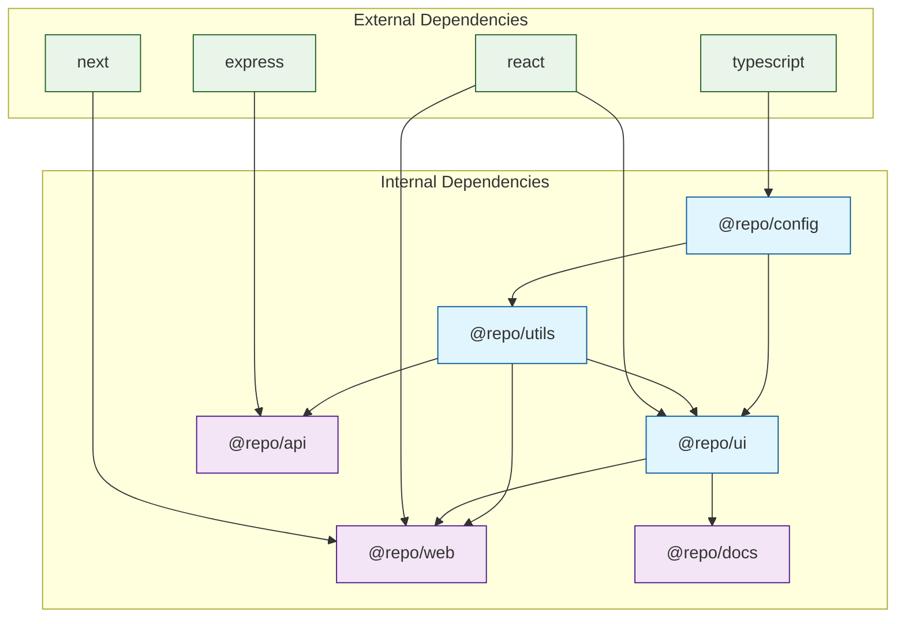
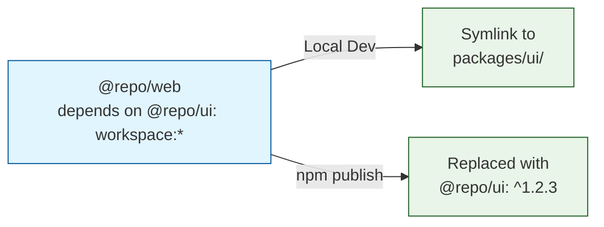
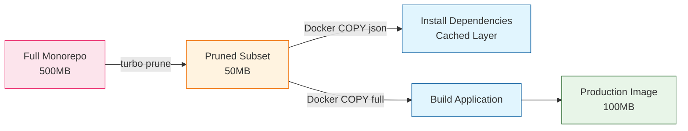
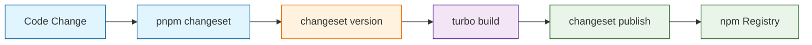

# Chapter 6: Dependency Management

Manage internal and external dependencies efficiently in your Turborepo monorepo. A well-structured dependency graph is the foundation of a healthy monorepo -- it determines build order, affects cache performance, and defines the boundaries between your packages. This chapter covers workspace references, dependency hoisting, version management, and the powerful `turbo prune` command for creating lean, deployable subsets of your monorepo.

## Understanding the Dependency Graph

Every monorepo has two layers of dependencies: **internal** (packages referencing other packages in the same repo) and **external** (packages from npm or other registries). Turborepo uses both to construct its task execution graph.



### Viewing Your Dependency Graph

```bash
# Visualize the package dependency graph
turbo build --graph=graph.html

# Query dependencies using turbo query (v2.2+)
turbo query "query { packages { name, dependencies { name } } }"

# List all packages in the monorepo
turbo ls
```

## Internal Dependencies (Workspace References)

Internal dependencies connect packages within your monorepo. They use the `workspace:` protocol to reference sibling packages instead of pulling from the npm registry.

### Workspace Protocol Syntax

```json
// apps/web/package.json
{
  "name": "@repo/web",
  "dependencies": {
    "@repo/ui": "workspace:*",
    "@repo/utils": "workspace:*",
    "@repo/config": "workspace:*"
  }
}
```

| Protocol | Resolves To | Use Case |
|----------|-------------|----------|
| `workspace:*` | Any version (linked locally) | Most common -- always uses local version |
| `workspace:^` | Caret range on publish | Libraries published to npm |
| `workspace:~` | Tilde range on publish | Libraries needing tight version control |
| `workspace:^1.2.0` | Specific caret range on publish | Published packages with compatibility constraints |

### How Workspace Resolution Works



During local development, your package manager (pnpm, npm, or yarn) resolves `workspace:*` as a symlink to the local package directory. When you publish to npm, the workspace protocol is automatically replaced with the actual version number from the referenced package's `package.json`.

### Setting Up Internal Dependencies

#### Shared UI Library

```json
// packages/ui/package.json
{
  "name": "@repo/ui",
  "version": "1.0.0",
  "main": "./dist/index.js",
  "module": "./dist/index.mjs",
  "types": "./dist/index.d.ts",
  "exports": {
    ".": {
      "import": "./dist/index.mjs",
      "require": "./dist/index.js",
      "types": "./dist/index.d.ts"
    },
    "./button": {
      "import": "./dist/button.mjs",
      "require": "./dist/button.js",
      "types": "./dist/button.d.ts"
    },
    "./styles.css": "./dist/styles.css"
  },
  "scripts": {
    "build": "tsup src/index.ts src/button.ts --format cjs,esm --dts",
    "dev": "tsup src/index.ts src/button.ts --format cjs,esm --dts --watch",
    "lint": "eslint src/",
    "test": "vitest run"
  },
  "dependencies": {
    "@repo/config": "workspace:*",
    "react": "^18.2.0"
  },
  "devDependencies": {
    "tsup": "^8.0.0",
    "typescript": "^5.3.0"
  },
  "peerDependencies": {
    "react": "^18.2.0",
    "react-dom": "^18.2.0"
  }
}
```

#### Shared TypeScript Configuration

```json
// packages/config/package.json
{
  "name": "@repo/config",
  "version": "1.0.0",
  "exports": {
    "./tsconfig/base": "./tsconfig/base.json",
    "./tsconfig/nextjs": "./tsconfig/nextjs.json",
    "./tsconfig/react-library": "./tsconfig/react-library.json",
    "./eslint/base": "./eslint/base.js",
    "./eslint/nextjs": "./eslint/nextjs.js"
  }
}
```

```json
// packages/config/tsconfig/base.json
{
  "compilerOptions": {
    "strict": true,
    "esModuleInterop": true,
    "skipLibCheck": true,
    "forceConsistentCasingInFileNames": true,
    "resolveJsonModule": true,
    "isolatedModules": true,
    "declaration": true,
    "declarationMap": true,
    "sourceMap": true
  }
}
```

```json
// packages/config/tsconfig/react-library.json
{
  "extends": "./base.json",
  "compilerOptions": {
    "lib": ["ES2020", "DOM", "DOM.Iterable"],
    "module": "ESNext",
    "moduleResolution": "bundler",
    "target": "ES2020",
    "jsx": "react-jsx"
  }
}
```

#### Consuming Internal Packages

```json
// apps/web/package.json
{
  "name": "@repo/web",
  "version": "1.0.0",
  "scripts": {
    "build": "next build",
    "dev": "next dev --port 3000",
    "start": "next start"
  },
  "dependencies": {
    "@repo/ui": "workspace:*",
    "@repo/utils": "workspace:*",
    "next": "^14.0.0",
    "react": "^18.2.0",
    "react-dom": "^18.2.0"
  },
  "devDependencies": {
    "@repo/config": "workspace:*",
    "typescript": "^5.3.0"
  }
}
```

```json
// apps/web/tsconfig.json
{
  "extends": "@repo/config/tsconfig/nextjs",
  "compilerOptions": {
    "outDir": "./dist",
    "rootDir": "./src"
  },
  "include": ["src/**/*", "next-env.d.ts"],
  "exclude": ["node_modules", "dist"]
}
```

## External Dependency Management

External dependencies in a monorepo require careful management to avoid version conflicts, reduce install times, and minimize disk usage.

### Dependency Hoisting

Package managers "hoist" shared dependencies to the root `node_modules` directory, so packages sharing the same dependency version only install it once.

```mermaid
flowchart TD
    subgraph "Before Hoisting"
        R1[root]
        R1 --> P1["packages/ui<br/>node_modules/react@18.2.0"]
        R1 --> P2["packages/utils<br/>node_modules/react@18.2.0"]
        R1 --> P3["apps/web<br/>node_modules/react@18.2.0"]
    end

    subgraph "After Hoisting"
        R2[root<br/>node_modules/react@18.2.0]
        R2 --> P4["packages/ui<br/>(uses hoisted react)"]
        R2 --> P5["packages/utils<br/>(uses hoisted react)"]
        R2 --> P6["apps/web<br/>(uses hoisted react)"]
    end

    classDef root fill:#f3e5f5,stroke:#4a148c
    classDef pkg fill:#e1f5fe,stroke:#01579b
    classDef optimized fill:#e8f5e8,stroke:#1b5e20

    class R1 root
    class P1,P2,P3 pkg
    class R2 root
    class P4,P5,P6 optimized
```

### Package Manager Comparison for Monorepos

| Feature | npm Workspaces | Yarn (Berry) | pnpm |
|---------|---------------|--------------|------|
| Hoisting | Automatic | Plug'n'Play or nodeLinker | Strict (no phantom deps) |
| Disk usage | High | Medium | Low (content-addressable) |
| Install speed | Moderate | Fast | Fast |
| Strictness | Loose | Strict (PnP) | Strict (isolated `node_modules`) |
| Workspace protocol | `*` or `file:` | `workspace:*` | `workspace:*` |
| Lockfile | `package-lock.json` | `yarn.lock` | `pnpm-lock.yaml` |
| Turborepo support | Full | Full | Full (recommended) |

### pnpm Configuration for Monorepos

```yaml
# pnpm-workspace.yaml
packages:
  - "apps/*"
  - "packages/*"
  - "tools/*"
```

```ini
# .npmrc (for pnpm)
# Hoist common dependencies for compatibility
public-hoist-pattern[]=*eslint*
public-hoist-pattern[]=*prettier*

# Strict mode (recommended)
strict-peer-dependencies=true
auto-install-peers=true

# Reduce disk usage
dedupe-peer-dependents=true
```

### Managing Shared External Dependencies

Keep shared dependency versions consistent across the monorepo by declaring them at the root:

```json
// Root package.json
{
  "name": "my-monorepo",
  "private": true,
  "packageManager": "pnpm@9.0.0",
  "devDependencies": {
    "turbo": "^2.0.0",
    "typescript": "^5.3.0",
    "prettier": "^3.0.0"
  },
  "pnpm": {
    "overrides": {
      "react": "^18.2.0",
      "react-dom": "^18.2.0",
      "typescript": "^5.3.0"
    }
  }
}
```

| Package Manager | Override Mechanism | Syntax |
|-----------------|-------------------|--------|
| pnpm | `pnpm.overrides` in root `package.json` | `"react": "^18.2.0"` |
| npm | `overrides` in root `package.json` | `"react": "^18.2.0"` |
| yarn | `resolutions` in root `package.json` | `"react": "^18.2.0"` |

## `turbo prune` for Lean Deployments

The `turbo prune` command creates a **sparse subset** of your monorepo containing only the packages needed for a specific workspace. This is invaluable for Docker builds and deployments where you want to minimize the context size.

### Basic Usage

```bash
# Create a pruned output for the web app
turbo prune @repo/web

# Output structure:
# out/
# ├── json/                    # package.json files only
# │   ├── apps/web/package.json
# │   ├── packages/ui/package.json
# │   ├── packages/utils/package.json
# │   └── package.json (root)
# ├── full/                    # Full source code
# │   ├── apps/web/
# │   ├── packages/ui/
# │   ├── packages/utils/
# │   └── package.json (root)
# └── pnpm-lock.yaml           # Pruned lockfile
```

### Using `turbo prune` in Docker

```dockerfile
FROM node:20-slim AS base
RUN npm install -g pnpm turbo
WORKDIR /app

# Stage 1: Prune the monorepo
FROM base AS pruner
COPY . .
RUN turbo prune @repo/web --docker

# Stage 2: Install dependencies
FROM base AS installer
# First install dependencies (for better Docker layer caching)
COPY --from=pruner /app/out/json/ .
COPY --from=pruner /app/out/pnpm-lock.yaml ./pnpm-lock.yaml
RUN pnpm install --frozen-lockfile

# Then copy source code and build
COPY --from=pruner /app/out/full/ .
RUN pnpm turbo build --filter=@repo/web

# Stage 3: Production image
FROM node:20-slim AS runner
WORKDIR /app

COPY --from=installer /app/apps/web/.next/standalone ./
COPY --from=installer /app/apps/web/.next/static ./apps/web/.next/static
COPY --from=installer /app/apps/web/public ./apps/web/public

ENV NODE_ENV=production
CMD ["node", "apps/web/server.js"]
```



### Prune Options

```bash
# Prune with Docker-optimized output (splits json and full)
turbo prune @repo/web --docker

# Prune to a custom output directory
turbo prune @repo/web --out-dir=./deploy

# Prune for Bun package manager (v2.5+)
turbo prune @repo/web --docker
```

| Flag | Description |
|------|-------------|
| `--docker` | Split output into `json/` and `full/` directories for Docker layer caching |
| `--out-dir` | Custom output directory (default: `out/`) |

## Dependency Analysis and Boundaries

### Detecting Circular Dependencies

Circular dependencies in a monorepo can cause build failures and infinite loops in the task graph. Use Turborepo's tools to detect them:

```bash
# Visualize the dependency graph to spot cycles
turbo build --graph=graph.html

# Query for dependency information (v2.2+)
turbo query "query { packages { name, dependencies { name } } }"
```

### Module Boundaries (v2.4+ Experimental)

Turborepo v2.4 introduced experimental boundary enforcement to control which packages can depend on which:

```json
// turbo.json
{
  "boundaries": {
    "tags": {
      "apps/*": ["app"],
      "packages/ui": ["shared", "ui"],
      "packages/utils": ["shared", "util"],
      "packages/config": ["shared", "config"]
    },
    "rules": [
      {
        "allow": ["shared"],
        "from": ["app"]
      },
      {
        "deny": ["app"],
        "from": ["shared"]
      }
    ]
  }
}
```

This enforces that `shared` packages (like `ui` and `utils`) cannot import from `app` packages, preventing unintended coupling.

### Peer Dependencies in Monorepos

Peer dependencies declare that a package expects its consumer to provide a specific dependency. This is essential for avoiding duplicate instances of libraries like React:

```json
// packages/ui/package.json
{
  "name": "@repo/ui",
  "peerDependencies": {
    "react": "^18.2.0",
    "react-dom": "^18.2.0"
  },
  "peerDependenciesMeta": {
    "react-dom": {
      "optional": true
    }
  },
  "devDependencies": {
    "react": "^18.2.0",
    "react-dom": "^18.2.0"
  }
}
```

### Dependency Best Practices

| Practice | Description |
|----------|-------------|
| Use `workspace:*` for internal deps | Ensures you always use the local version |
| Declare peer dependencies | Prevents duplicate React/framework instances |
| Hoist shared dependencies | Reduces install size and avoids version mismatches |
| Pin versions in overrides | Use root-level overrides for consistency |
| Keep `devDependencies` local | Build tools should be per-package, not hoisted |
| Audit regularly | Run `pnpm audit` to check for vulnerabilities |
| Use `catalog:` (pnpm 9+) | Centralize version definitions in `pnpm-workspace.yaml` |

## Version Management with Changesets

For monorepos that publish packages to npm, managing versions across interdependent packages is complex. The `changesets` tool integrates well with Turborepo:

```bash
# Install changesets
pnpm add -D @changesets/cli -w

# Initialize
pnpm changeset init
```

```json
// .changeset/config.json
{
  "$schema": "https://unpkg.com/@changesets/config/schema.json",
  "changelog": "@changesets/cli/changelog",
  "commit": false,
  "fixed": [],
  "linked": [
    ["@repo/ui", "@repo/utils"]
  ],
  "access": "public",
  "baseBranch": "main",
  "updateInternalDependencies": "patch"
}
```

### Publishing Workflow

```bash
# 1. Create a changeset for your changes
pnpm changeset

# 2. Version all affected packages
pnpm changeset version

# 3. Build all packages
turbo build

# 4. Publish to npm
pnpm changeset publish
```



## Summary

Dependency management in a Turborepo monorepo spans internal workspace references, external package management, deployment pruning, and version publication. The workspace protocol (`workspace:*`) creates seamless local development, while `turbo prune` enables lean production deployments. Combining these with consistent version overrides, peer dependency declarations, and tools like changesets gives you a robust foundation for managing even the largest monorepos.

## Key Takeaways

- **Use `workspace:*`** for internal dependencies to always resolve to the local version during development.
- **pnpm is recommended** for monorepos due to its strict node_modules isolation and content-addressable storage.
- **Hoist shared dependencies** to the root to avoid version conflicts and reduce disk usage.
- **`turbo prune` is essential for Docker**: It creates minimal deployment packages that dramatically reduce Docker image sizes and build times.
- **Use the `--docker` flag** with `turbo prune` to optimize Docker layer caching by separating dependency installation from source code copying.
- **Enforce module boundaries** (v2.4+) to prevent unintended coupling between packages.
- **Use changesets** for managing version bumps and publishing across interdependent packages.

## Next Steps

With your dependency graph well-structured and your deployment pipeline streamlined, the next step is integrating Turborepo into your CI/CD workflows. In [Chapter 7: CI/CD Integration](07-cicd-integration.md), we will cover GitHub Actions, GitLab CI, CircleCI, and other platforms, with strategies for maximizing cache hit rates in continuous integration.

---

*Built with insights from the [Turborepo](https://github.com/vercel/turborepo) project.*
