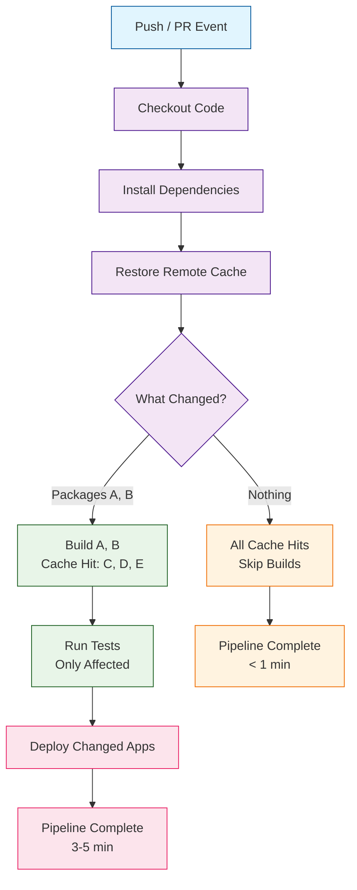
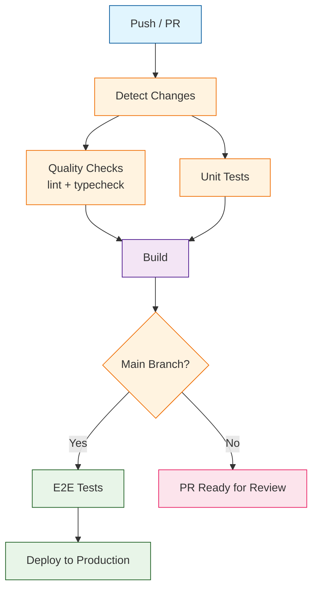
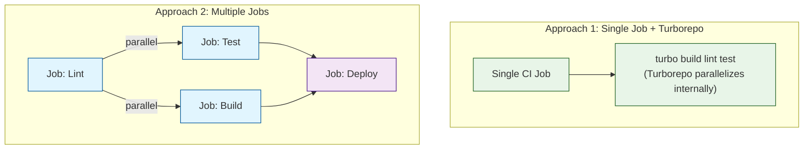

# Chapter 7: CI/CD Integration

Welcome to **Chapter 7: CI/CD Integration**. In this part of **Turborepo Tutorial: High-Performance Monorepo Build System**, you will build an intuitive mental model first, then move into concrete implementation details and practical production tradeoffs.


Integrate Turborepo with your CI/CD pipelines for automated building, testing, and deployment. Continuous integration is where Turborepo's caching and parallel execution deliver the most dramatic improvements -- transforming 30-minute pipeline runs into 3-minute ones by caching previously built packages and only rebuilding what changed.

## CI/CD Strategy Overview

The core principle of Turborepo CI/CD integration is simple: **only build and test what changed**. Combined with remote caching, this means most CI runs restore the majority of their work from cache.



### Key CI/CD Principles with Turborepo

| Principle | Implementation |
|-----------|---------------|
| Only build what changed | Use `--filter=...[origin/main]` to scope to affected packages |
| Cache everything | Enable remote caching with `TURBO_TOKEN` and `TURBO_TEAM` |
| Parallelize across tasks | Turborepo handles this automatically via the task graph |
| Fail fast | Use `--continue` selectively; default stops on first failure |
| Minimize install time | Use package manager caching (`actions/cache`, `pnpm store`) |
| Deterministic builds | Pin package manager version with `packageManager` field |

## GitHub Actions

GitHub Actions is the most common CI platform for Turborepo projects. Here are configurations ranging from simple to production-grade.

### Basic CI Pipeline

```yaml
# .github/workflows/ci.yml
name: CI
on:
  push:
    branches: [main]
  pull_request:
    branches: [main]

env:
  TURBO_TOKEN: ${{ secrets.TURBO_TOKEN }}
  TURBO_TEAM: ${{ vars.TURBO_TEAM }}

jobs:
  build:
    name: Build and Test
    runs-on: ubuntu-latest
    steps:
      - name: Checkout
        uses: actions/checkout@v4
        with:
          fetch-depth: 2  # Needed for change detection

      - name: Setup pnpm
        uses: pnpm/action-setup@v4
        with:
          version: 9

      - name: Setup Node.js
        uses: actions/setup-node@v4
        with:
          node-version: 20
          cache: "pnpm"

      - name: Install dependencies
        run: pnpm install --frozen-lockfile

      - name: Build, lint, and test
        run: pnpm turbo build lint test
```

### Production-Grade CI Pipeline

```yaml
# .github/workflows/ci.yml
name: CI

on:
  push:
    branches: [main, develop]
  pull_request:
    types: [opened, synchronize, reopened]

concurrency:
  group: ci-${{ github.ref }}
  cancel-in-progress: true

env:
  TURBO_TOKEN: ${{ secrets.TURBO_TOKEN }}
  TURBO_TEAM: ${{ vars.TURBO_TEAM }}
  NODE_VERSION: "20"
  PNPM_VERSION: "9"

jobs:
  # Job 1: Determine affected packages
  changes:
    name: Detect Changes
    runs-on: ubuntu-latest
    outputs:
      packages: ${{ steps.filter.outputs.changes }}
      has_changes: ${{ steps.filter.outputs.changes != '[]' }}
    steps:
      - uses: actions/checkout@v4
      - uses: dorny/paths-filter@v3
        id: filter
        with:
          filters: |
            web:
              - 'apps/web/**'
              - 'packages/ui/**'
              - 'packages/utils/**'
            api:
              - 'apps/api/**'
              - 'packages/utils/**'
            docs:
              - 'apps/docs/**'
              - 'packages/ui/**'

  # Job 2: Lint and typecheck (fast feedback)
  quality:
    name: Quality Checks
    needs: changes
    if: needs.changes.outputs.has_changes == 'true'
    runs-on: ubuntu-latest
    steps:
      - uses: actions/checkout@v4
        with:
          fetch-depth: 0

      - uses: pnpm/action-setup@v4
        with:
          version: ${{ env.PNPM_VERSION }}

      - uses: actions/setup-node@v4
        with:
          node-version: ${{ env.NODE_VERSION }}
          cache: "pnpm"

      - run: pnpm install --frozen-lockfile

      - name: Lint
        run: pnpm turbo lint --filter=...[origin/main]

      - name: Type check
        run: pnpm turbo typecheck --filter=...[origin/main]

  # Job 3: Unit tests
  test:
    name: Unit Tests
    needs: changes
    if: needs.changes.outputs.has_changes == 'true'
    runs-on: ubuntu-latest
    steps:
      - uses: actions/checkout@v4
        with:
          fetch-depth: 0

      - uses: pnpm/action-setup@v4
        with:
          version: ${{ env.PNPM_VERSION }}

      - uses: actions/setup-node@v4
        with:
          node-version: ${{ env.NODE_VERSION }}
          cache: "pnpm"

      - run: pnpm install --frozen-lockfile

      - name: Run tests
        run: pnpm turbo test --filter=...[origin/main]

      - name: Upload coverage
        if: always()
        uses: actions/upload-artifact@v4
        with:
          name: coverage
          path: "**/coverage/"

  # Job 4: Build
  build:
    name: Build
    needs: [quality, test]
    runs-on: ubuntu-latest
    steps:
      - uses: actions/checkout@v4
        with:
          fetch-depth: 0

      - uses: pnpm/action-setup@v4
        with:
          version: ${{ env.PNPM_VERSION }}

      - uses: actions/setup-node@v4
        with:
          node-version: ${{ env.NODE_VERSION }}
          cache: "pnpm"

      - run: pnpm install --frozen-lockfile

      - name: Build all packages
        run: pnpm turbo build

      - name: Upload build artifacts
        uses: actions/upload-artifact@v4
        with:
          name: build-output
          path: |
            apps/*/dist
            apps/*/.next
            packages/*/dist

  # Job 5: E2E tests (only on main or when requested)
  e2e:
    name: E2E Tests
    needs: build
    if: github.ref == 'refs/heads/main' || contains(github.event.pull_request.labels.*.name, 'run-e2e')
    runs-on: ubuntu-latest
    steps:
      - uses: actions/checkout@v4

      - uses: pnpm/action-setup@v4
        with:
          version: ${{ env.PNPM_VERSION }}

      - uses: actions/setup-node@v4
        with:
          node-version: ${{ env.NODE_VERSION }}
          cache: "pnpm"

      - run: pnpm install --frozen-lockfile

      - name: Install Playwright
        run: pnpm exec playwright install --with-deps chromium

      - name: Run E2E tests
        run: pnpm turbo test:e2e --filter=@repo/web
        env:
          PLAYWRIGHT_BASE_URL: http://localhost:3000

      - name: Upload E2E results
        if: always()
        uses: actions/upload-artifact@v4
        with:
          name: playwright-report
          path: apps/web/playwright-report/

  # Job 6: Deploy (only on main)
  deploy:
    name: Deploy
    needs: [build, e2e]
    if: github.ref == 'refs/heads/main' && github.event_name == 'push'
    runs-on: ubuntu-latest
    environment: production
    steps:
      - uses: actions/checkout@v4

      - uses: pnpm/action-setup@v4
        with:
          version: ${{ env.PNPM_VERSION }}

      - uses: actions/setup-node@v4
        with:
          node-version: ${{ env.NODE_VERSION }}
          cache: "pnpm"

      - run: pnpm install --frozen-lockfile

      - name: Deploy
        run: pnpm turbo deploy --filter=...[HEAD^1]
        env:
          VERCEL_TOKEN: ${{ secrets.VERCEL_TOKEN }}
```

### CI Pipeline Flow



### Affected Package Detection with `--affected`

Turborepo v2.2+ provides zero-config affected package detection for GitHub workflows:

```yaml
- name: Build only affected packages
  run: pnpm turbo build --affected
  env:
    TURBO_SCM_BASE: ${{ github.event.pull_request.base.sha }}
    TURBO_SCM_HEAD: ${{ github.sha }}
```

## GitLab CI

```yaml
# .gitlab-ci.yml
image: node:20-slim

variables:
  TURBO_TOKEN: ${TURBO_TOKEN}
  TURBO_TEAM: ${TURBO_TEAM}
  PNPM_HOME: /root/.local/share/pnpm

stages:
  - install
  - quality
  - build
  - test
  - deploy

# Cache pnpm store across pipelines
cache:
  key:
    files:
      - pnpm-lock.yaml
  paths:
    - .pnpm-store/

before_script:
  - npm install -g pnpm@9
  - pnpm config set store-dir .pnpm-store

install:
  stage: install
  script:
    - pnpm install --frozen-lockfile
  artifacts:
    paths:
      - node_modules/
      - apps/*/node_modules/
      - packages/*/node_modules/
    expire_in: 1 hour

lint:
  stage: quality
  needs: [install]
  script:
    - pnpm turbo lint --filter=...[${CI_MERGE_REQUEST_DIFF_BASE_SHA:-HEAD~1}]

typecheck:
  stage: quality
  needs: [install]
  script:
    - pnpm turbo typecheck --filter=...[${CI_MERGE_REQUEST_DIFF_BASE_SHA:-HEAD~1}]

build:
  stage: build
  needs: [lint, typecheck]
  script:
    - pnpm turbo build
  artifacts:
    paths:
      - apps/*/dist/
      - apps/*/.next/
      - packages/*/dist/
    expire_in: 1 day

test:unit:
  stage: test
  needs: [build]
  script:
    - pnpm turbo test --filter=...[${CI_MERGE_REQUEST_DIFF_BASE_SHA:-HEAD~1}]
  coverage: '/All files\s*\|\s*(\d+\.?\d*)/'
  artifacts:
    reports:
      coverage_report:
        coverage_format: cobertura
        path: "**/coverage/cobertura-coverage.xml"

test:e2e:
  stage: test
  needs: [build]
  script:
    - npx playwright install --with-deps chromium
    - pnpm turbo test:e2e
  artifacts:
    when: always
    paths:
      - "**/playwright-report/"
    expire_in: 1 week
  rules:
    - if: $CI_COMMIT_BRANCH == "main"
    - if: $CI_PIPELINE_SOURCE == "merge_request_event"
      when: manual

deploy:production:
  stage: deploy
  needs: [build, test:unit]
  script:
    - pnpm turbo deploy
  environment:
    name: production
    url: https://app.example.com
  rules:
    - if: $CI_COMMIT_BRANCH == "main"
```

## CircleCI

```yaml
# .circleci/config.yml
version: 2.1

orbs:
  node: circleci/node@5.2.0

executors:
  default:
    docker:
      - image: cimg/node:20.11
    environment:
      TURBO_TOKEN: ${TURBO_TOKEN}
      TURBO_TEAM: ${TURBO_TEAM}

commands:
  install-pnpm:
    steps:
      - run:
          name: Install pnpm
          command: |
            npm install -g pnpm@9
            pnpm config set store-dir ~/.pnpm-store

  install-deps:
    steps:
      - restore_cache:
          keys:
            - pnpm-store-{{ checksum "pnpm-lock.yaml" }}
            - pnpm-store-
      - run: pnpm install --frozen-lockfile
      - save_cache:
          key: pnpm-store-{{ checksum "pnpm-lock.yaml" }}
          paths:
            - ~/.pnpm-store

jobs:
  quality:
    executor: default
    steps:
      - checkout
      - install-pnpm
      - install-deps
      - run:
          name: Lint
          command: pnpm turbo lint
      - run:
          name: Type check
          command: pnpm turbo typecheck

  build-and-test:
    executor: default
    steps:
      - checkout
      - install-pnpm
      - install-deps
      - run:
          name: Build
          command: pnpm turbo build
      - run:
          name: Test
          command: pnpm turbo test
      - store_test_results:
          path: ./test-results
      - store_artifacts:
          path: ./coverage

  deploy:
    executor: default
    steps:
      - checkout
      - install-pnpm
      - install-deps
      - run:
          name: Build
          command: pnpm turbo build
      - run:
          name: Deploy
          command: pnpm turbo deploy

workflows:
  ci:
    jobs:
      - quality
      - build-and-test:
          requires:
            - quality
      - deploy:
          requires:
            - build-and-test
          filters:
            branches:
              only: main
```

## Azure DevOps Pipelines

```yaml
# azure-pipelines.yml
trigger:
  branches:
    include:
      - main
      - develop

pr:
  branches:
    include:
      - main

pool:
  vmImage: "ubuntu-latest"

variables:
  TURBO_TOKEN: $(TURBO_TOKEN)
  TURBO_TEAM: $(TURBO_TEAM)
  NODE_VERSION: "20.x"
  PNPM_VERSION: "9"

stages:
  - stage: Build
    displayName: "Build and Test"
    jobs:
      - job: BuildAndTest
        displayName: "Build, Lint, and Test"
        steps:
          - task: NodeTool@0
            inputs:
              versionSpec: $(NODE_VERSION)

          - script: npm install -g pnpm@$(PNPM_VERSION)
            displayName: "Install pnpm"

          - task: Cache@2
            inputs:
              key: 'pnpm | "$(Agent.OS)" | pnpm-lock.yaml'
              path: $(Pipeline.Workspace)/.pnpm-store
            displayName: "Cache pnpm store"

          - script: |
              pnpm config set store-dir $(Pipeline.Workspace)/.pnpm-store
              pnpm install --frozen-lockfile
            displayName: "Install dependencies"

          - script: pnpm turbo build lint test
            displayName: "Build, lint, and test"

          - task: PublishTestResults@2
            condition: always()
            inputs:
              testResultsFormat: "JUnit"
              testResultsFiles: "**/junit.xml"

  - stage: Deploy
    displayName: "Deploy"
    dependsOn: Build
    condition: and(succeeded(), eq(variables['Build.SourceBranch'], 'refs/heads/main'))
    jobs:
      - deployment: Production
        environment: production
        strategy:
          runOnce:
            deploy:
              steps:
                - script: pnpm turbo deploy
                  displayName: "Deploy to production"
```

## Optimizing CI Performance

### Dependency Installation Caching

The biggest time saver in CI is caching `node_modules` or the package manager store between runs.

```yaml
# GitHub Actions -- pnpm store caching (handled by setup-node)
- uses: actions/setup-node@v4
  with:
    node-version: 20
    cache: "pnpm"

# Or explicit cache for finer control
- uses: actions/cache@v4
  with:
    path: |
      ~/.pnpm-store
      node_modules/.cache/turbo
    key: turbo-${{ runner.os }}-${{ hashFiles('pnpm-lock.yaml') }}-${{ github.sha }}
    restore-keys: |
      turbo-${{ runner.os }}-${{ hashFiles('pnpm-lock.yaml') }}-
      turbo-${{ runner.os }}-
```

### Fetch Depth for Change Detection

```yaml
# Shallow clone (fast but no change detection)
- uses: actions/checkout@v4
  # Default: fetch-depth: 1

# With change detection (recommended)
- uses: actions/checkout@v4
  with:
    fetch-depth: 0  # Full history for accurate --filter=...[ref]
```

| `fetch-depth` | Change Detection | Clone Speed | Use Case |
|---------------|-----------------|-------------|----------|
| `1` (default) | Not available | Fastest | Simple build-everything pipelines |
| `2` | `...[HEAD^1]` | Fast | Detect changes from last commit |
| `0` (full) | `...[origin/main]` | Slower | Full PR change detection (recommended) |

### Parallel Jobs vs. Turborepo Parallelism



| Approach | Pros | Cons | Best For |
|----------|------|------|----------|
| Single job | Shares remote cache, less overhead, simpler | Single failure point, one runner | Small-medium repos |
| Multiple jobs | Better isolation, parallel runners, partial failure | More CI minutes, cache sharing via remote | Large repos, strict quality gates |

## Docker Deployments in CI

### Multi-Stage Docker Build with Turborepo

```yaml
# .github/workflows/docker.yml
name: Docker Build

on:
  push:
    branches: [main]

jobs:
  docker:
    runs-on: ubuntu-latest
    steps:
      - uses: actions/checkout@v4

      - name: Set up Docker Buildx
        uses: docker/setup-buildx-action@v3

      - name: Login to Container Registry
        uses: docker/login-action@v3
        with:
          registry: ghcr.io
          username: ${{ github.actor }}
          password: ${{ secrets.GITHUB_TOKEN }}

      - name: Build and push
        uses: docker/build-push-action@v5
        with:
          context: .
          push: true
          tags: ghcr.io/${{ github.repository }}/web:${{ github.sha }}
          cache-from: type=gha
          cache-to: type=gha,mode=max
          build-args: |
            TURBO_TOKEN=${{ secrets.TURBO_TOKEN }}
            TURBO_TEAM=${{ vars.TURBO_TEAM }}
```

### Dockerfile Using `turbo prune`

```dockerfile
FROM node:20-slim AS base
RUN npm install -g pnpm turbo
WORKDIR /app

# Prune the monorepo for the target app
FROM base AS pruner
COPY . .
RUN turbo prune @repo/web --docker

# Install dependencies
FROM base AS installer
COPY --from=pruner /app/out/json/ .
COPY --from=pruner /app/out/pnpm-lock.yaml ./pnpm-lock.yaml
RUN pnpm install --frozen-lockfile --prod=false

# Build the application
COPY --from=pruner /app/out/full/ .
RUN pnpm turbo build --filter=@repo/web

# Production image
FROM node:20-slim AS runner
WORKDIR /app
ENV NODE_ENV=production

RUN addgroup --system --gid 1001 nodejs
RUN adduser --system --uid 1001 appuser

COPY --from=installer --chown=appuser:nodejs /app/apps/web/.next/standalone ./
COPY --from=installer --chown=appuser:nodejs /app/apps/web/.next/static ./apps/web/.next/static
COPY --from=installer --chown=appuser:nodejs /app/apps/web/public ./apps/web/public

USER appuser
EXPOSE 3000
CMD ["node", "apps/web/server.js"]
```

## CI/CD Configuration Checklist

| Item | Status | Details |
|------|--------|---------|
| Remote cache enabled | Required | Set `TURBO_TOKEN` and `TURBO_TEAM` as secrets |
| Lockfile frozen | Required | `--frozen-lockfile` prevents unexpected updates |
| Dependency caching | Recommended | Cache pnpm store or node_modules |
| Change detection | Recommended | Use `fetch-depth: 0` with `--filter=...[origin/main]` |
| Concurrency control | Recommended | Cancel duplicate runs with `concurrency` group |
| Artifact uploads | Optional | Upload build outputs, coverage, test reports |
| E2E tests | Optional | Run on main or via manual trigger label |
| Docker layer caching | Optional | Use `turbo prune --docker` for multi-stage builds |

## Summary

CI/CD integration is where Turborepo's caching and intelligent task scheduling deliver their greatest value. By combining remote caching with change-detection filters, you can reduce CI pipeline times by 80-95% compared to building everything from scratch on every push. The configuration patterns in this chapter -- from basic single-job pipelines to production-grade multi-stage workflows -- provide a solid foundation for any CI platform.

## Key Takeaways

- **Remote caching in CI is the highest-impact optimization**: Set `TURBO_TOKEN` and `TURBO_TEAM` as CI secrets to share cache across all runners.
- **Use `--filter=...[origin/main]`** to scope builds to only packages affected by changes in a pull request.
- **Cache dependency installation**: Use your CI platform's cache mechanism for `pnpm-store` or `node_modules` to avoid reinstalling on every run.
- **Use `fetch-depth: 0`** to enable full change detection against the base branch.
- **Use `turbo prune --docker`** for Docker builds to create minimal build contexts and optimize layer caching.
- **Cancel redundant runs** using concurrency groups to avoid wasting CI minutes on superseded commits.
- **Choose between single-job and multi-job pipelines** based on your repo size and quality gate requirements.

## Next Steps

With your CI/CD pipeline fully optimized, the final chapter covers advanced performance techniques. In [Chapter 8: Performance Optimization](08-performance-optimization.md), we will explore profiling build times, optimizing the task graph, scaling to enterprise-size monorepos, and monitoring long-term build health.

---

*Built with insights from the [Turborepo](https://github.com/vercel/turborepo) project.*

## What Problem Does This Solve?

Most teams struggle here because the hard part is not writing more code, but deciding clear boundaries for `pnpm`, `name`, `uses` so behavior stays predictable as complexity grows.

In practical terms, this chapter helps you avoid three common failures:

- coupling core logic too tightly to one implementation path
- missing the handoff boundaries between setup, execution, and validation
- shipping changes without clear rollback or observability strategy

After working through this chapter, you should be able to reason about `Chapter 7: CI/CD Integration` as an operating subsystem inside **Turborepo Tutorial: High-Performance Monorepo Build System**, with explicit contracts for inputs, state transitions, and outputs.

Use the implementation notes around `turbo`, `install`, `build` as your checklist when adapting these patterns to your own repository.

## How it Works Under the Hood

Under the hood, `Chapter 7: CI/CD Integration` usually follows a repeatable control path:

1. **Context bootstrap**: initialize runtime config and prerequisites for `pnpm`.
2. **Input normalization**: shape incoming data so `name` receives stable contracts.
3. **Core execution**: run the main logic branch and propagate intermediate state through `uses`.
4. **Policy and safety checks**: enforce limits, auth scopes, and failure boundaries.
5. **Output composition**: return canonical result payloads for downstream consumers.
6. **Operational telemetry**: emit logs/metrics needed for debugging and performance tuning.

When debugging, walk this sequence in order and confirm each stage has explicit success/failure conditions.

## Source Walkthrough

Use the following upstream sources to verify implementation details while reading this chapter:

- [View Repo](https://github.com/vercel/turborepo)
  Why it matters: authoritative reference on `View Repo` (github.com).

Suggested trace strategy:
- search upstream code for `pnpm` and `name` to map concrete implementation paths
- compare docs claims against actual runtime/config code before reusing patterns in production

## Chapter Connections

- [Tutorial Index](index.md)
- [Previous Chapter: Chapter 6: Dependency Management](06-dependency-management.md)
- [Next Chapter: Chapter 8: Performance Optimization](08-performance-optimization.md)
- [Main Catalog](../../README.md#-tutorial-catalog)
- [A-Z Tutorial Directory](../../discoverability/tutorial-directory.md)
