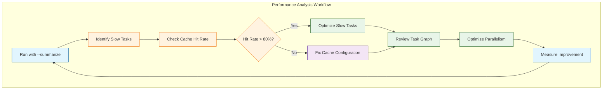
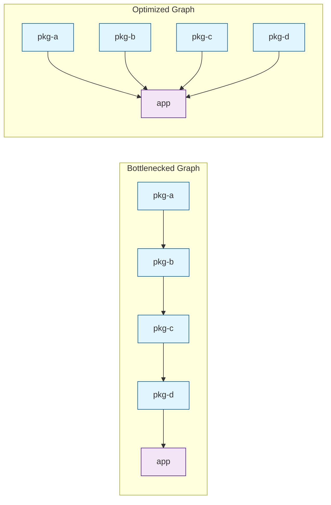
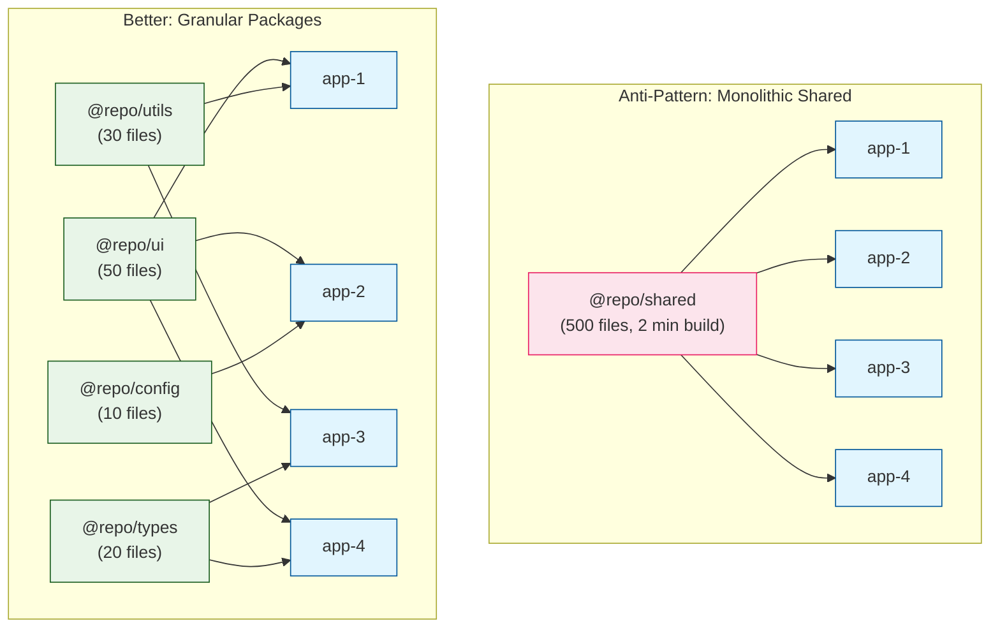
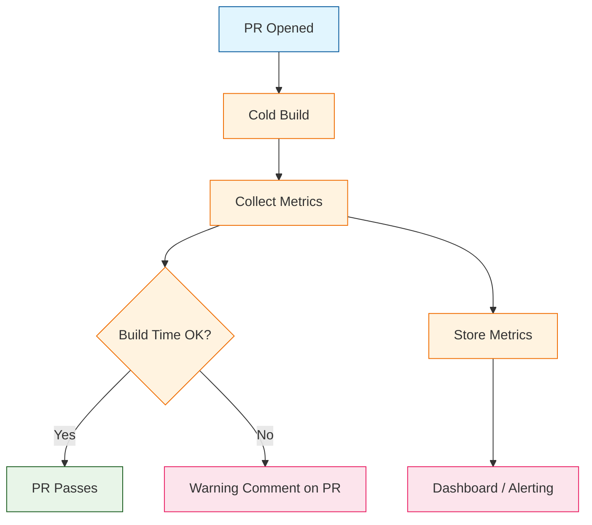

# Chapter 8: Performance Optimization

Welcome to **Chapter 8: Performance Optimization**. In this part of **Turborepo Tutorial: High-Performance Monorepo Build System**, you will build an intuitive mental model first, then move into concrete implementation details and practical production tradeoffs.


Advanced techniques for maximizing Turborepo performance in large-scale monorepos. As your monorepo grows from a handful of packages to hundreds, maintaining fast build times requires deliberate optimization. This chapter covers profiling, parallelism tuning, graph optimization, package architecture, and the monitoring practices that keep your builds fast over time.

## Profiling Build Performance

Before optimizing, you need to measure. Turborepo provides several tools for understanding where time is spent.

### Run Summaries

The `--summarize` flag produces a detailed JSON report of every task, including timing, cache status, and hash information.

```bash
# Generate a run summary
turbo build --summarize

# The summary is saved to .turbo/runs/<run-id>.json
ls .turbo/runs/
```

### Analyzing the Summary

```bash
# Extract task timings from the summary
cat .turbo/runs/*.json | jq '[.tasks[] | {
  package: .package,
  task: .task,
  duration_ms: .execution.duration,
  cache: .cache.status,
  cache_source: .cache.source
}] | sort_by(-.duration_ms) | .[:10]'
```

| Summary Field | Description | Use For |
|---------------|-------------|---------|
| `execution.duration` | Time spent executing the task | Finding slow tasks |
| `cache.status` | `HIT` or `MISS` | Identifying cache problems |
| `cache.source` | `LOCAL`, `REMOTE`, or `null` | Verifying remote cache is working |
| `hash` | The computed task hash | Debugging cache misses |
| `inputs` | Files contributing to the hash | Understanding what triggers rebuilds |
| `environmentVariables` | Env vars in the hash | Diagnosing env-related cache misses |

### Visualizing the Task Graph

```bash
# Generate an HTML visualization
turbo build --graph=graph.html

# Generate DOT format for Graphviz
turbo build --graph=graph.dot
dot -Tpng graph.dot -o graph.png

# Generate JSON for custom analysis
turbo build --graph=graph.json
```



## Controlling Parallelism

Turborepo automatically parallelizes independent tasks, but you can tune the concurrency level to match your hardware.

### Concurrency Settings

```bash
# Use all available CPU cores (default)
turbo build --concurrency=100%

# Use a specific number of cores
turbo build --concurrency=4

# Use a percentage of available cores
turbo build --concurrency=50%

# Single-threaded execution (for debugging)
turbo build --concurrency=1

# Set via environment variable
TURBO_CONCURRENCY=8 turbo build
```

### Choosing the Right Concurrency

| Environment | Recommended Concurrency | Rationale |
|-------------|------------------------|-----------|
| Local development (8 cores) | `100%` or `10` | Maximize speed; other work is minimal |
| CI runner (2-4 cores) | `100%` or `4` | Use all available resources |
| CI runner (16+ cores) | `80%` or `12` | Leave headroom for OS and package manager |
| Low-memory CI runner | `2-4` | Prevent OOM from too many parallel builds |
| Docker build | `100%` | Docker controls CPU allocation |

### Memory Considerations

Each parallel task consumes memory. If you have memory-intensive tasks (TypeScript compilation, webpack bundling), you may need to limit concurrency to prevent out-of-memory errors.

```bash
# Increase Node.js memory limit for individual tasks
# Set in the task's package.json script
{
  "scripts": {
    "build": "NODE_OPTIONS='--max-old-space-size=4096' next build"
  }
}
```

```json
// Or set globally via turbo.json globalPassThroughEnv
{
  "globalPassThroughEnv": ["NODE_OPTIONS"]
}
```

## Optimizing the Task Graph

The structure of your task graph directly impacts build parallelism. A well-structured graph maximizes the number of tasks that can run concurrently.

### Identifying Bottlenecks



The bottlenecked graph forces sequential execution (A -> B -> C -> D -> app), while the optimized graph allows A, B, C, and D to build in parallel.

### Graph Optimization Strategies

| Strategy | Description | Impact |
|----------|-------------|--------|
| Flatten dependency chains | Reduce intermediate dependencies | More parallel execution |
| Split large packages | Break monolithic packages into smaller ones | Better incremental caching |
| Remove unnecessary `^` deps | Only use `^build` when truly needed | Faster task scheduling |
| Use `dependsOn` carefully | Avoid over-specifying dependencies | More parallelism |
| Separate config from code | Config packages build fast and unlock dependents | Faster critical path |

### Reducing Unnecessary Dependencies

```json
// BEFORE: All tasks depend on everything
{
  "tasks": {
    "build": {
      "dependsOn": ["^build", "codegen", "typecheck", "lint"]
    }
  }
}

// AFTER: Only necessary dependencies
{
  "tasks": {
    "build": {
      "dependsOn": ["^build", "codegen"]
    },
    "typecheck": {
      "dependsOn": ["^build"]
    },
    "lint": {}
  }
}
```

In the optimized version, `lint` and `typecheck` can run in parallel with `build` instead of blocking it.

## Package Architecture for Performance

How you structure your packages significantly affects build performance.

### The Inverted Triangle Anti-Pattern

Avoid creating a single large shared package that everything depends on:



| Pattern | Build Impact | Cache Impact |
|---------|-------------|--------------|
| Monolithic shared package | Any change rebuilds everything | Single change busts cache for all apps |
| Granular packages | Only affected packages rebuild | Changes are isolated to specific packages |
| Feature-based packages | Clear ownership, focused builds | High cache hit rate |

### Ideal Package Size Guidelines

| Metric | Guideline | Rationale |
|--------|-----------|-----------|
| Files per package | 20-100 | Large enough to be useful, small enough for good caching |
| Build time per package | < 30 seconds | Long builds block the dependency graph |
| Dependencies per package | < 5 internal | Fewer dependencies = more parallelism |
| Consumers per package | Any | Shared packages can have many consumers |

### Using TypeScript Project References

TypeScript project references enable incremental compilation, which pairs well with Turborepo's caching:

```json
// tsconfig.json (root)
{
  "references": [
    { "path": "packages/config" },
    { "path": "packages/utils" },
    { "path": "packages/ui" },
    { "path": "apps/web" }
  ],
  "files": []
}
```

```json
// packages/ui/tsconfig.json
{
  "extends": "@repo/config/tsconfig/react-library",
  "compilerOptions": {
    "outDir": "./dist",
    "rootDir": "./src",
    "composite": true,
    "declarationMap": true
  },
  "include": ["src/**/*"],
  "references": [
    { "path": "../config" },
    { "path": "../utils" }
  ]
}
```

## Input/Output Optimization

Fine-tuning inputs and outputs has the single largest impact on cache hit rates.

### Minimize Inputs

```json
{
  "tasks": {
    "build": {
      "inputs": [
        "src/**/*.ts",
        "src/**/*.tsx",
        "!src/**/*.test.ts",
        "!src/**/*.test.tsx",
        "!src/**/*.spec.ts",
        "!src/**/*.stories.tsx",
        "!src/**/__tests__/**",
        "!src/**/__mocks__/**",
        "!src/**/__fixtures__/**",
        "package.json",
        "tsconfig.json"
      ],
      "outputs": ["dist/**"]
    },
    "test": {
      "inputs": [
        "src/**/*.ts",
        "src/**/*.tsx",
        "test/**",
        "__tests__/**",
        "jest.config.*",
        "vitest.config.*",
        "!**/*.stories.tsx"
      ],
      "outputs": ["coverage/**"]
    }
  }
}
```

### Minimize Outputs

Only cache what is necessary. Excluding cache directories and temporary files reduces storage and transfer time:

```json
{
  "tasks": {
    "build": {
      "outputs": [
        "dist/**",
        "!dist/**/*.map",
        "!dist/**/*.tsbuildinfo"
      ]
    },
    "build:next": {
      "outputs": [
        ".next/**",
        "!.next/cache/**",
        "!.next/trace"
      ]
    }
  }
}
```

### Measuring Input/Output Impact

```bash
# Check the size of cached artifacts
du -sh node_modules/.cache/turbo/*

# Count files in outputs
find dist -type f | wc -l

# Measure restore time
time turbo build  # Second run should be a cache hit
```

## Watch Mode Optimization

Development speed depends on fast iteration cycles. Turborepo's watch mode and persistent tasks are key to this.

### Configuring Watch Mode

```json
{
  "tasks": {
    "dev": {
      "cache": false,
      "persistent": true,
      "dependsOn": ["^build"]
    },
    "dev:css": {
      "cache": false,
      "persistent": true
    },
    "build": {
      "dependsOn": ["^build"],
      "outputs": ["dist/**"]
    }
  }
}
```

```bash
# Watch mode rebuilds on file changes
turbo watch build

# Run dev server + watch dependent packages
turbo dev --filter=@repo/web...

# Watch with the terminal UI for better visibility
turbo watch build --ui=tui
```

### Interruptible Tasks (v2.0+)

Mark persistent tasks as interruptible so they can be restarted when dependencies change in watch mode:

```json
{
  "tasks": {
    "dev": {
      "cache": false,
      "persistent": true,
      "interruptible": true
    }
  }
}
```

## Scaling to Enterprise Monorepos

### Performance at Scale

| Monorepo Size | Packages | Typical Cold Build | With Turborepo Cache | Optimization Focus |
|---------------|----------|-------------------|---------------------|-------------------|
| Small | 5-15 | 2-5 min | < 30 sec | Basic caching |
| Medium | 15-50 | 5-15 min | 1-3 min | Input/output tuning |
| Large | 50-200 | 15-45 min | 2-5 min | Graph optimization, parallelism |
| Enterprise | 200+ | 45+ min | 3-10 min | Package architecture, distributed caching |

### Monorepo Growth Checklist

| Stage | Actions |
|-------|---------|
| Starting (5-15 packages) | Enable remote caching, configure basic inputs/outputs |
| Growing (15-50 packages) | Optimize inputs for cache hit rate, set up CI with `--filter` |
| Large (50-200 packages) | Split monolithic packages, optimize task graph, tune concurrency |
| Enterprise (200+) | Implement module boundaries, custom cache server, dedicated CI runners |

### Repository Queries for Large Codebases (v2.2+)

```bash
# Find the largest packages by dependency count
turbo query "query {
  packages {
    name
    dependencies { name }
    dependents { name }
  }
}"

# Find packages with no dependents (potential candidates for removal)
turbo query "query {
  packages(filter: { dependentCount: 0 }) {
    name
  }
}"
```

## Build Tool Optimization

The performance of individual build tools within each package directly affects overall monorepo build time.

### Build Tool Comparison

| Tool | Use Case | Speed | Configuration |
|------|----------|-------|---------------|
| tsup | Library bundling | Fast | Minimal |
| esbuild | Bundling (JS/TS) | Very fast | Moderate |
| SWC | TypeScript compilation | Very fast | Minimal |
| tsc | Type checking / declaration files | Moderate | Standard |
| Vite | App bundling + dev server | Fast | Moderate |
| webpack | Complex app bundling | Slower | Complex |
| Next.js (with SWC) | Full-stack React apps | Fast | Framework-managed |

### Optimizing TypeScript Compilation

```json
// tsconfig.json optimizations for speed
{
  "compilerOptions": {
    "incremental": true,
    "tsBuildInfoFile": "./dist/.tsbuildinfo",
    "skipLibCheck": true,
    "isolatedModules": true
  }
}
```

| tsconfig Option | Performance Impact | Trade-off |
|-----------------|-------------------|-----------|
| `incremental: true` | Faster subsequent builds | Stores `.tsbuildinfo` file |
| `skipLibCheck: true` | Skips type checking `.d.ts` files | May miss type errors in dependencies |
| `isolatedModules: true` | Enables parallel file processing | Minor syntax restrictions |
| `composite: true` | Enables project references | Required for project references |

### Using SWC Instead of Babel

```json
// next.config.js -- Next.js uses SWC by default
/** @type {import('next').NextConfig} */
module.exports = {
  swcMinify: true,
  // SWC is used by default for compilation
}
```

```json
// .swcrc for standalone SWC usage
{
  "$schema": "https://json.schemastore.org/swcrc",
  "jsc": {
    "parser": {
      "syntax": "typescript",
      "tsx": true,
      "decorators": true
    },
    "transform": {
      "react": {
        "runtime": "automatic"
      }
    },
    "target": "es2020"
  },
  "module": {
    "type": "es6"
  }
}
```

## Monitoring Long-Term Build Health

### Setting Up Build Metrics

Track these metrics over time to detect performance regressions:

```bash
# Script to collect build metrics
#!/bin/bash
START_TIME=$(date +%s%3N)
turbo build --summarize 2>&1
END_TIME=$(date +%s%3N)

DURATION=$((END_TIME - START_TIME))
SUMMARY=$(cat .turbo/runs/*.json | jq '{
  total_tasks: .tasks | length,
  cached_tasks: [.tasks[] | select(.cache.status == "HIT")] | length,
  cache_hit_rate: (([.tasks[] | select(.cache.status == "HIT")] | length) / (.tasks | length) * 100),
  total_duration_ms: '$DURATION'
}')

echo "$SUMMARY"
# Send to your metrics system (Datadog, Prometheus, etc.)
```

### Key Performance Indicators

| KPI | Target | Warning | Critical |
|-----|--------|---------|----------|
| CI pipeline time (cached) | < 5 min | 5-10 min | > 10 min |
| Cache hit rate (CI) | > 80% | 60-80% | < 60% |
| Cold build time | < 15 min | 15-30 min | > 30 min |
| Install time | < 2 min | 2-5 min | > 5 min |
| Largest package build | < 30 sec | 30-60 sec | > 60 sec |
| Task graph depth | < 5 levels | 5-8 levels | > 8 levels |

### Automated Performance Regression Detection

```yaml
# .github/workflows/perf-check.yml
name: Build Performance Check

on:
  pull_request:
    branches: [main]

jobs:
  perf:
    runs-on: ubuntu-latest
    steps:
      - uses: actions/checkout@v4
        with:
          fetch-depth: 0

      - uses: pnpm/action-setup@v4
        with:
          version: 9

      - uses: actions/setup-node@v4
        with:
          node-version: 20
          cache: "pnpm"

      - run: pnpm install --frozen-lockfile

      - name: Cold build timing
        run: |
          START=$(date +%s)
          pnpm turbo build --force --summarize
          END=$(date +%s)
          DURATION=$((END - START))
          echo "Cold build time: ${DURATION}s"
          if [ $DURATION -gt 900 ]; then
            echo "::warning::Cold build time exceeds 15 minutes (${DURATION}s)"
          fi
        env:
          TURBO_TOKEN: ${{ secrets.TURBO_TOKEN }}
          TURBO_TEAM: ${{ vars.TURBO_TEAM }}

      - name: Upload build summary
        uses: actions/upload-artifact@v4
        with:
          name: build-summary
          path: .turbo/runs/
```



## Advanced Configuration Patterns

### Environment-Specific Builds

```json
// turbo.json
{
  "tasks": {
    "build": {
      "dependsOn": ["^build"],
      "outputs": ["dist/**"],
      "env": ["NODE_ENV", "BUILD_TARGET"]
    }
  }
}
```

```bash
# Development build (fast, no minification)
NODE_ENV=development turbo build

# Production build (optimized, minified)
NODE_ENV=production turbo build

# The different NODE_ENV values produce different hashes,
# so each environment has its own cache entries
```

### Conditional Task Execution

```bash
# Skip E2E tests unless explicitly requested
turbo build test lint

# Run E2E only when the label is present or on main
turbo build test lint test:e2e --filter=...[origin/main]
```

### Using `$TURBO_ROOT$` for Cross-Workspace References (v2.5+)

```json
// packages/ui/turbo.json
{
  "extends": ["//"],
  "tasks": {
    "build": {
      "inputs": [
        "src/**",
        "$TURBO_ROOT$/tsconfig.base.json",
        "$TURBO_ROOT$/tailwind.config.ts"
      ]
    }
  }
}
```

## Performance Optimization Checklist

| Category | Optimization | Impact | Effort |
|----------|-------------|--------|--------|
| Caching | Enable remote caching | Very High | Low |
| Caching | Configure precise `inputs` | High | Medium |
| Caching | Exclude test files from build `inputs` | Medium | Low |
| Caching | Declare all `env` variables | High | Low |
| Parallelism | Remove unnecessary `dependsOn` | High | Medium |
| Parallelism | Tune `--concurrency` for CI | Medium | Low |
| Architecture | Split monolithic packages | Very High | High |
| Architecture | Use TypeScript project references | Medium | Medium |
| Build tools | Switch to SWC/esbuild for compilation | High | Medium |
| Build tools | Enable TypeScript `incremental` | Medium | Low |
| CI/CD | Cache dependency installation | High | Low |
| CI/CD | Use `--filter` for affected packages | Very High | Low |
| CI/CD | Docker multi-stage with `turbo prune` | High | Medium |
| Monitoring | Track cache hit rates over time | Medium | Low |

## Summary

Performance optimization in Turborepo is an ongoing discipline that spans caching configuration, task graph design, package architecture, and build tool selection. The highest-impact optimizations are enabling remote caching, configuring precise inputs, and using change-detection filters in CI. As your monorepo grows, invest in splitting large packages, monitoring build metrics, and automating performance regression detection to keep builds fast at any scale.

## Key Takeaways

- **Measure before optimizing**: Use `--summarize` and `--graph` to understand where time is spent before making changes.
- **Cache hit rate is the primary metric**: Target above 80% in CI; debug misses systematically with hash comparison.
- **Parallelism is bounded by your graph**: Flatten dependency chains and remove unnecessary `dependsOn` to unlock more parallel execution.
- **Package size matters**: Granular packages (20-100 files) produce better caching and parallelism than monolithic ones.
- **Build tool choice affects speed**: Use SWC, esbuild, or tsup instead of slower alternatives like Babel or raw tsc for production builds.
- **Monitor continuously**: Track build times, cache hit rates, and package counts over time to catch regressions early.
- **Invest proportionally**: Small repos need basic caching; enterprise repos need architecture work and dedicated monitoring.

## Your Turborepo Journey

Congratulations on completing the Turborepo tutorial. You have learned to:

1. **Set up and configure** a Turborepo monorepo from scratch
2. **Design workspace structures** with proper package organization
3. **Build task pipelines** with dependency management and parallel execution
4. **Implement caching strategies** for maximum cache hit rates
5. **Deploy remote caching** for team-wide build acceleration
6. **Manage dependencies** across internal and external packages
7. **Integrate with CI/CD** platforms for automated, efficient pipelines
8. **Optimize performance** at every level of the build system

### Where to Go from Here

| Direction | Resources |
|-----------|-----------|
| Stay current | [Turborepo Blog](https://turbo.build/blog) for new releases |
| Deep dive | [Turborepo API Reference](https://turbo.build/repo/docs/reference) |
| Community | [Turborepo GitHub Discussions](https://github.com/vercel/turborepo/discussions) |
| Enterprise | [Vercel Enterprise](https://vercel.com/enterprise) for managed solutions |
| Contribute | [Turborepo Contributing Guide](https://github.com/vercel/turborepo/blob/main/CONTRIBUTING.md) |

---

*Built with insights from the [Turborepo](https://github.com/vercel/turborepo) project.*

## What Problem Does This Solve?

Most teams struggle here because the hard part is not writing more code, but deciding clear boundaries for `build`, `turbo`, `json` so behavior stays predictable as complexity grows.

In practical terms, this chapter helps you avoid three common failures:

- coupling core logic too tightly to one implementation path
- missing the handoff boundaries between setup, execution, and validation
- shipping changes without clear rollback or observability strategy

After working through this chapter, you should be able to reason about `Chapter 8: Performance Optimization` as an operating subsystem inside **Turborepo Tutorial: High-Performance Monorepo Build System**, with explicit contracts for inputs, state transitions, and outputs.

Use the implementation notes around `tasks`, `cache`, `classDef` as your checklist when adapting these patterns to your own repository.

## How it Works Under the Hood

Under the hood, `Chapter 8: Performance Optimization` usually follows a repeatable control path:

1. **Context bootstrap**: initialize runtime config and prerequisites for `build`.
2. **Input normalization**: shape incoming data so `turbo` receives stable contracts.
3. **Core execution**: run the main logic branch and propagate intermediate state through `json`.
4. **Policy and safety checks**: enforce limits, auth scopes, and failure boundaries.
5. **Output composition**: return canonical result payloads for downstream consumers.
6. **Operational telemetry**: emit logs/metrics needed for debugging and performance tuning.

When debugging, walk this sequence in order and confirm each stage has explicit success/failure conditions.

## Source Walkthrough

Use the following upstream sources to verify implementation details while reading this chapter:

- [View Repo](https://github.com/vercel/turborepo)
  Why it matters: authoritative reference on `View Repo` (github.com).

Suggested trace strategy:
- search upstream code for `build` and `turbo` to map concrete implementation paths
- compare docs claims against actual runtime/config code before reusing patterns in production

## Chapter Connections

- [Tutorial Index](index.md)
- [Previous Chapter: Chapter 7: CI/CD Integration](07-cicd-integration.md)
- [Main Catalog](../../README.md#-tutorial-catalog)
- [A-Z Tutorial Directory](../../discoverability/tutorial-directory.md)
