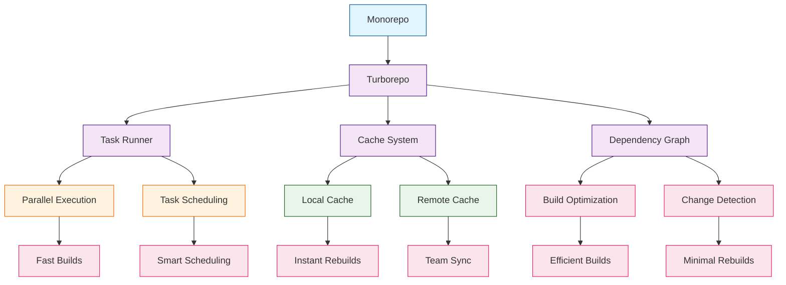

# Turborepo Tutorial: High-Performance Monorepo Build System

> A deep technical walkthrough of Turborepo covering High-Performance Monorepo Build System.

Turborepo[View Repo](https://github.com/vercel/turborepo) is a high-performance build system for JavaScript and TypeScript codebases, written in Rust. It optimizes your monorepo by intelligently caching build outputs and running tasks in parallel, dramatically speeding up your development workflow.

Turborepo enables developers to build scalable monorepos with efficient caching, parallel execution, and smart dependency management, making large codebases feel as fast as small ones.

## Mental Model

## Why This Track Matters

Turborepo is increasingly relevant for developers working with modern AI/ML infrastructure. A deep technical walkthrough of Turborepo covering High-Performance Monorepo Build System, and this track helps you understand the architecture, key patterns, and production considerations.

This track focuses on:

- understanding getting started with turborepo
- understanding workspace configuration
- understanding task pipelines
- understanding caching strategies

## Chapter Guide

Welcome to your journey through high-performance monorepo development! This tutorial explores building and optimizing large-scale JavaScript/TypeScript codebases with Turborepo.

1. **[Chapter 1: Getting Started with Turborepo](01-getting-started.md)** - Installation, setup, and your first monorepo
2. **[Chapter 2: Workspace Configuration](02-workspace-configuration.md)** - Configuring workspaces and packages
3. **[Chapter 3: Task Pipelines](03-task-pipelines.md)** - Defining and running build pipelines
4. **[Chapter 4: Caching Strategies](04-caching-strategies.md)** - Understanding and optimizing the cache system
5. **[Chapter 5: Remote Caching](05-remote-caching.md)** - Setting up team-wide caching
6. **[Chapter 6: Dependency Management](06-dependency-management.md)** - Managing internal and external dependencies
7. **[Chapter 7: CI/CD Integration](07-cicd-integration.md)** - Integrating with continuous integration
8. **[Chapter 8: Performance Optimization](08-performance-optimization.md)** - Advanced optimization techniques

## Current Snapshot (auto-updated)

- repository: [`vercel/turborepo`](https://github.com/vercel/turborepo)
- stars: about **30.2k**
- latest release: [`v2.9.6`](https://github.com/vercel/turborepo/releases/tag/v2.9.6) (published 2026-04-10)

## What You Will Learn

By the end of this tutorial, you'll be able to:

- **Build Scalable Monorepos** - Structure large codebases for optimal performance
- **Implement Smart Caching** - Leverage Turborepo's advanced caching system
- **Optimize Build Pipelines** - Create efficient task execution workflows
- **Configure Workspaces** - Set up and manage multiple packages
- **Use Remote Caching** - Enable team-wide build artifact sharing
- **Integrate with CI/CD** - Automate builds and deployments
- **Monitor Performance** - Track and optimize build performance
- **Scale Large Codebases** - Handle enterprise-scale monorepos

## Prerequisites

- Node.js 16+
- npm or yarn or pnpm
- Basic understanding of monorepos
- Familiarity with package.json and build tools

## What's New in Turborepo v2 (2024-2025)

> **Turborepo 2.x Evolution**: Major enhancements for enterprise monorepo management with Bun support, microfrontends, and advanced caching features.

**Latest Features (v2.6, October 2025):**
- 🏗️ **Microfrontends**: Develop multiple applications on single localhost port
- 📦 **Bun Support**: Full Bun package manager integration with lockfile analysis
- 🔍 **Terminal UI Search**: Quick task focus with `/` command in terminal UI

**v2.5 Features (April 2025):**
- 🔄 **Sidecar Tasks**: Persistent concurrent tasks with `with` command
- ▶️ **Enhanced `--continue`**: Flexible dependency-based task continuation
- 💬 **JSONC Support**: Comments in `turbo.json` configuration
- 🗂️ **Bun Pruning**: `turbo prune` support for Bun repositories
- 🔗 **$TURBO_ROOT$ Variable**: Workspace root references in config
- 📖 **OpenAPI Viewer**: Human-readable Remote Cache API documentation

**v2.4 Features (January 2025):**
- 🏛️ **Experimental Boundaries**: Module boundary enforcement (RFC)
- 🖥️ **Terminal UI Enhancements**: Improved user interface
- 👁️ **Watch Mode Caching**: Experimental caching for file watching

**v2.2 Features (October 2024):**
- 🔍 **Repository Queries**: `turbo query` command for GraphQL queries
- 🛡️ **Cache Safety Diagnostics**: Environment variable and cache config validation
- 🎯 **Zero-Config Affected Packages**: Automatic change detection for GitHub workflows

## Learning Path

### 🟢 Beginner Track
Perfect for developers new to monorepos:
1. Chapters 1-2: Setup and basic workspace configuration
2. Focus on understanding Turborepo fundamentals

### 🟡 Intermediate Track
For developers building multi-package applications:
1. Chapters 3-5: Task pipelines, caching, and remote caching
2. Learn advanced Turborepo features

### 🔴 Advanced Track
For enterprise-scale monorepo development:
1. Chapters 6-8: Dependencies, CI/CD, and performance optimization
2. Master production monorepo management

---

**Ready to supercharge your monorepo? Let's begin with [Chapter 1: Getting Started](01-getting-started.md)!**

## Related Tutorials

- [Activepieces Tutorial](../activepieces-tutorial/)
- [BentoML Tutorial](../bentoml-tutorial/)
- [Chatbox Tutorial](../chatbox-tutorial/)
- [ComfyUI Tutorial](../comfyui-tutorial/)
- [CopilotKit Tutorial](../copilotkit-tutorial/)
## Navigation & Backlinks

- [Start Here: Chapter 1: Getting Started with Turborepo](01-getting-started.md)
- [Back to Main Catalog](../../README.md#-tutorial-catalog)
- [Browse A-Z Tutorial Directory](../../discoverability/tutorial-directory.md)
- [Search by Intent](../../discoverability/query-hub.md)
- [Explore Category Hubs](../../README.md#category-hubs)

*Generated by [AI Codebase Knowledge Builder](https://github.com/The-Pocket/Tutorial-Codebase-Knowledge)*

## Full Chapter Map

1. [Chapter 1: Getting Started with Turborepo](01-getting-started.md)
2. [Chapter 2: Workspace Configuration](02-workspace-configuration.md)
3. [Chapter 3: Task Pipelines](03-task-pipelines.md)
4. [Chapter 4: Caching Strategies](04-caching-strategies.md)
5. [Chapter 5: Remote Caching](05-remote-caching.md)
6. [Chapter 6: Dependency Management](06-dependency-management.md)
7. [Chapter 7: CI/CD Integration](07-cicd-integration.md)
8. [Chapter 8: Performance Optimization](08-performance-optimization.md)

## Source References

- [View Repo](https://github.com/vercel/turborepo)

