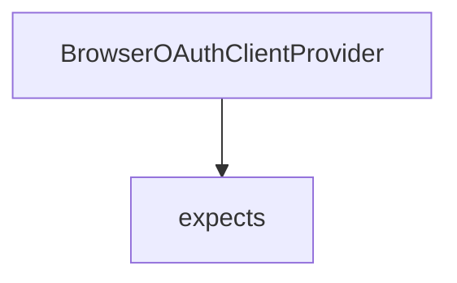

# Chapter 1: Getting Started and Archived Context

Welcome to **Chapter 1: Getting Started and Archived Context**. In this part of **use-mcp Tutorial: React Hook Patterns for MCP Client Integration**, you will build an intuitive mental model first, then move into concrete implementation details and practical production tradeoffs.


This chapter establishes baseline setup and risk framing for an archived dependency.

## Learning Goals

- install and run `use-mcp` quickly in React projects
- evaluate implications of archived upstream maintenance
- decide where `use-mcp` fits in short-term vs long-term roadmaps
- reduce lock-in risk before deep integration

## Baseline Setup

```bash
npm install use-mcp
```

Treat initial adoption as an integration reference layer and keep migration options open.

## Source References

- [use-mcp README](https://github.com/modelcontextprotocol/use-mcp/blob/main/README.md)
- [use-mcp Repository](https://github.com/modelcontextprotocol/use-mcp)

## Summary

You now have a setup and risk baseline for evaluating `use-mcp` usage.

Next: [Chapter 2: Hook Architecture and Connection Lifecycle](02-hook-architecture-and-connection-lifecycle.md)

## Source Code Walkthrough

### `src/auth/browser-provider.ts`

The `BrowserOAuthClientProvider` class in [`src/auth/browser-provider.ts`](https://github.com/modelcontextprotocol/use-mcp/blob/HEAD/src/auth/browser-provider.ts) handles a key part of this chapter's functionality:

```ts
 * Browser-compatible OAuth client provider for MCP using localStorage.
 */
export class BrowserOAuthClientProvider implements OAuthClientProvider {
  readonly serverUrl: string
  readonly storageKeyPrefix: string
  readonly serverUrlHash: string
  readonly clientName: string
  readonly clientUri: string
  readonly callbackUrl: string
  private preventAutoAuth?: boolean
  readonly onPopupWindow: ((url: string, features: string, window: Window | null) => void) | undefined

  constructor(
    serverUrl: string,
    options: {
      storageKeyPrefix?: string
      clientName?: string
      clientUri?: string
      callbackUrl?: string
      preventAutoAuth?: boolean
      onPopupWindow?: (url: string, features: string, window: Window | null) => void
    } = {},
  ) {
    this.serverUrl = serverUrl
    this.storageKeyPrefix = options.storageKeyPrefix || 'mcp:auth'
    this.serverUrlHash = this.hashString(serverUrl)
    this.clientName = options.clientName || 'MCP Browser Client'
    this.clientUri = options.clientUri || (typeof window !== 'undefined' ? window.location.origin : '')
    this.callbackUrl = sanitizeUrl(
      options.callbackUrl ||
        (typeof window !== 'undefined' ? new URL('/oauth/callback', window.location.origin).toString() : '/oauth/callback'),
    )
```

This class is important because it defines how use-mcp Tutorial: React Hook Patterns for MCP Client Integration implements the patterns covered in this chapter.

### `src/auth/browser-provider.ts`

The `expects` interface in [`src/auth/browser-provider.ts`](https://github.com/modelcontextprotocol/use-mcp/blob/HEAD/src/auth/browser-provider.ts) handles a key part of this chapter's functionality:

```ts
      // Cannot signal failure back via SDK auth() directly.
    }
    // Regardless of popup success, the interface expects this method to initiate the redirect.
    // If the popup failed, the user journey stops here until manual action or timeout.
  }

  // --- Helper Methods ---

  /**
   * Retrieves the last URL passed to `redirectToAuthorization`. Useful for manual fallback.
   */
  getLastAttemptedAuthUrl(): string | null {
    const storedUrl = localStorage.getItem(this.getKey('last_auth_url'))
    return storedUrl ? sanitizeUrl(storedUrl) : null
  }

  clearStorage(): number {
    const prefixPattern = `${this.storageKeyPrefix}_${this.serverUrlHash}_`
    const statePattern = `${this.storageKeyPrefix}:state_`
    const keysToRemove: string[] = []
    let count = 0

    for (let i = 0; i < localStorage.length; i++) {
      const key = localStorage.key(i)
      if (!key) continue

      if (key.startsWith(prefixPattern)) {
        keysToRemove.push(key)
      } else if (key.startsWith(statePattern)) {
        try {
          const item = localStorage.getItem(key)
          if (item) {
```

This interface is important because it defines how use-mcp Tutorial: React Hook Patterns for MCP Client Integration implements the patterns covered in this chapter.


## How These Components Connect


