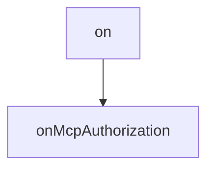

# Chapter 2: Hook Architecture and Connection Lifecycle

Welcome to **Chapter 2: Hook Architecture and Connection Lifecycle**. In this part of **use-mcp Tutorial: React Hook Patterns for MCP Client Integration**, you will build an intuitive mental model first, then move into concrete implementation details and practical production tradeoffs.


This chapter explains core `useMcp` lifecycle and state transitions.

## Learning Goals

- understand lifecycle states (`discovering` to `ready`/`failed`)
- model UI behavior around connection phases
- use imperative controls (`retry`, `disconnect`, `authenticate`) safely
- avoid race conditions in component-driven connection flows

## Lifecycle States

| State | Meaning |
|:------|:--------|
| discovering / connecting / loading | initialization and capability loading |
| pending_auth / authenticating | auth flow in progress |
| ready | operations available |
| failed | terminal error until retry/authentication |

## Source References

- [use-mcp README - API Reference](https://github.com/modelcontextprotocol/use-mcp/blob/main/README.md#api-reference)
- [React Integration README](https://github.com/modelcontextprotocol/use-mcp/blob/main/src/react/README.md)

## Summary

You now have a lifecycle model for robust hook-driven MCP client UX.

Next: [Chapter 3: Authentication, OAuth Callback, and Storage](03-authentication-oauth-callback-and-storage.md)

## Depth Expansion Playbook

## Source Code Walkthrough

### `src/auth/browser-provider.ts`

The `on` interface in [`src/auth/browser-provider.ts`](https://github.com/modelcontextprotocol/use-mcp/blob/HEAD/src/auth/browser-provider.ts) handles a key part of this chapter's functionality:

```ts
// browser-provider.ts
import { OAuthClientInformation, OAuthMetadata, OAuthTokens, OAuthClientMetadata } from '@modelcontextprotocol/sdk/shared/auth.js'
import { OAuthClientProvider } from '@modelcontextprotocol/sdk/client/auth.js'
import { sanitizeUrl } from 'strict-url-sanitise'
// Assuming StoredState is defined in ./types.js and includes fields for provider options
import { StoredState } from './types.js' // Adjust path if necessary

/**
 * Browser-compatible OAuth client provider for MCP using localStorage.
 */
export class BrowserOAuthClientProvider implements OAuthClientProvider {
  readonly serverUrl: string
  readonly storageKeyPrefix: string
  readonly serverUrlHash: string
  readonly clientName: string
  readonly clientUri: string
  readonly callbackUrl: string
  private preventAutoAuth?: boolean
  readonly onPopupWindow: ((url: string, features: string, window: Window | null) => void) | undefined

  constructor(
    serverUrl: string,
    options: {
      storageKeyPrefix?: string
      clientName?: string
      clientUri?: string
      callbackUrl?: string
      preventAutoAuth?: boolean
      onPopupWindow?: (url: string, features: string, window: Window | null) => void
    } = {},
  ) {
```

This interface is important because it defines how use-mcp Tutorial: React Hook Patterns for MCP Client Integration implements the patterns covered in this chapter.

### `src/auth/callback.ts`

The `onMcpAuthorization` function in [`src/auth/callback.ts`](https://github.com/modelcontextprotocol/use-mcp/blob/HEAD/src/auth/callback.ts) handles a key part of this chapter's functionality:

```ts
 * Assumes it's running on the page specified as the callbackUrl.
 */
export async function onMcpAuthorization() {
  const queryParams = new URLSearchParams(window.location.search)
  const code = queryParams.get('code')
  const state = queryParams.get('state')
  const error = queryParams.get('error')
  const errorDescription = queryParams.get('error_description')

  const logPrefix = '[mcp-callback]' // Generic prefix, or derive from stored state later
  console.log(`${logPrefix} Handling callback...`, { code, state, error, errorDescription })

  let provider: BrowserOAuthClientProvider | null = null
  let storedStateData: StoredState | null = null
  const stateKey = state ? `mcp:auth:state_${state}` : null // Reconstruct state key prefix assumption

  try {
    // --- Basic Error Handling ---
    if (error) {
      throw new Error(`OAuth error: ${error} - ${errorDescription || 'No description provided.'}`)
    }
    if (!code) {
      throw new Error('Authorization code not found in callback query parameters.')
    }
    if (!state || !stateKey) {
      throw new Error('State parameter not found or invalid in callback query parameters.')
    }

    // --- Retrieve Stored State & Provider Options ---
    const storedStateJSON = localStorage.getItem(stateKey)
    if (!storedStateJSON) {
      throw new Error(`Invalid or expired state parameter "${state}". No matching state found in storage.`)
```

This function is important because it defines how use-mcp Tutorial: React Hook Patterns for MCP Client Integration implements the patterns covered in this chapter.


## How These Components Connect


