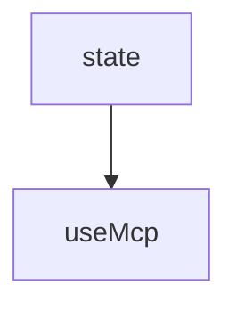

# Chapter 3: Authentication, OAuth Callback, and Storage

Welcome to **Chapter 3: Authentication, OAuth Callback, and Storage**. In this part of **use-mcp Tutorial: React Hook Patterns for MCP Client Integration**, you will build an intuitive mental model first, then move into concrete implementation details and practical production tradeoffs.


This chapter covers auth design details that most often fail in browser MCP integrations.

## Learning Goals

- configure callback URL routing and `onMcpAuthorization` handling
- manage popup-based auth flows with user-triggered fallback options
- scope storage keys to avoid cross-app collisions
- clear token/state material safely for logout and recovery scenarios

## Auth Guardrails

1. ensure callback route matches server OAuth registration exactly
2. provide manual auth-link fallback when popups are blocked
3. use distinct storage key prefixes per environment/app
4. clear cached auth state on repeated token or nonce failures

## Source References

- [use-mcp README - Setting Up OAuth Callback](https://github.com/modelcontextprotocol/use-mcp/blob/main/README.md#setting-up-oauth-callback)
- [React Integration README - Callback Route](https://github.com/modelcontextprotocol/use-mcp/blob/main/src/react/README.md#setting-up-the-oauth-callback-route)

## Summary

You now have a safer OAuth and auth-state handling model for React MCP clients.

Next: [Chapter 4: Tools, Resources, Prompts, and Client Operations](04-tools-resources-prompts-and-client-operations.md)

## Depth Expansion Playbook

## Source Code Walkthrough

### `src/auth/callback.ts`

The `state` interface in [`src/auth/callback.ts`](https://github.com/modelcontextprotocol/use-mcp/blob/HEAD/src/auth/callback.ts) handles a key part of this chapter's functionality:

```ts
  const queryParams = new URLSearchParams(window.location.search)
  const code = queryParams.get('code')
  const state = queryParams.get('state')
  const error = queryParams.get('error')
  const errorDescription = queryParams.get('error_description')

  const logPrefix = '[mcp-callback]' // Generic prefix, or derive from stored state later
  console.log(`${logPrefix} Handling callback...`, { code, state, error, errorDescription })

  let provider: BrowserOAuthClientProvider | null = null
  let storedStateData: StoredState | null = null
  const stateKey = state ? `mcp:auth:state_${state}` : null // Reconstruct state key prefix assumption

  try {
    // --- Basic Error Handling ---
    if (error) {
      throw new Error(`OAuth error: ${error} - ${errorDescription || 'No description provided.'}`)
    }
    if (!code) {
      throw new Error('Authorization code not found in callback query parameters.')
    }
    if (!state || !stateKey) {
      throw new Error('State parameter not found or invalid in callback query parameters.')
    }

    // --- Retrieve Stored State & Provider Options ---
    const storedStateJSON = localStorage.getItem(stateKey)
    if (!storedStateJSON) {
      throw new Error(`Invalid or expired state parameter "${state}". No matching state found in storage.`)
    }
    try {
      storedStateData = JSON.parse(storedStateJSON) as StoredState
```

This interface is important because it defines how use-mcp Tutorial: React Hook Patterns for MCP Client Integration implements the patterns covered in this chapter.

### `src/react/useMcp.ts`

The `useMcp` function in [`src/react/useMcp.ts`](https://github.com/modelcontextprotocol/use-mcp/blob/HEAD/src/react/useMcp.ts) handles a key part of this chapter's functionality:

```ts
// useMcp.ts
import {
  CallToolResultSchema,
  JSONRPCMessage,
  ListToolsResultSchema,
  ListResourcesResultSchema,
  ReadResourceResultSchema,
  ListPromptsResultSchema,
  GetPromptResultSchema,
  Tool,
  Resource,
  ResourceTemplate,
  Prompt,
} from '@modelcontextprotocol/sdk/types.js'
import { useCallback, useEffect, useRef, useState } from 'react'
// Import both transport types
import { SSEClientTransport, SSEClientTransportOptions } from '@modelcontextprotocol/sdk/client/sse.js'
import { StreamableHTTPClientTransport } from '@modelcontextprotocol/sdk/client/streamableHttp.js' // Added
import { Client } from '@modelcontextprotocol/sdk/client/index.js'
import { auth, UnauthorizedError, OAuthClientProvider } from '@modelcontextprotocol/sdk/client/auth.js'
import { sanitizeUrl } from 'strict-url-sanitise'
import { BrowserOAuthClientProvider } from '../auth/browser-provider.js' // Adjust path
import { assert } from '../utils/assert.js' // Adjust path
import type { UseMcpOptions, UseMcpResult } from './types.js' // Adjust path
import type { Transport } from '@modelcontextprotocol/sdk/shared/transport.js' // Added for type safety

const DEFAULT_RECONNECT_DELAY = 3000
const DEFAULT_RETRY_DELAY = 5000
const AUTH_TIMEOUT = 5 * 60 * 1000

```

This function is important because it defines how use-mcp Tutorial: React Hook Patterns for MCP Client Integration implements the patterns covered in this chapter.


## How These Components Connect


