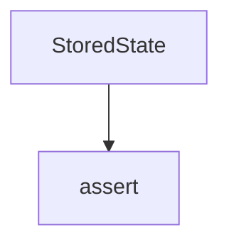

# Chapter 4: Tools, Resources, Prompts, and Client Operations

Welcome to **Chapter 4: Tools, Resources, Prompts, and Client Operations**. In this part of **use-mcp Tutorial: React Hook Patterns for MCP Client Integration**, you will build an intuitive mental model first, then move into concrete implementation details and practical production tradeoffs.


This chapter maps core MCP capability access into reusable React operations.

## Learning Goals

- call tools with explicit argument and error handling patterns
- list/read resources and use templates for contextual data access
- list/get prompts with argument-bound rendering flows
- standardize operation wrappers to reduce component complexity

## Client Operation Surface

| Operation | Hook Method |
|:----------|:------------|
| tool execution | `callTool` |
| resource reads | `listResources`, `readResource` |
| prompt access | `listPrompts`, `getPrompt` |

## Source References

- [use-mcp README - Quick Start](https://github.com/modelcontextprotocol/use-mcp/blob/main/README.md#quick-start)
- [Inspector Example README](https://github.com/modelcontextprotocol/use-mcp/blob/main/examples/inspector/README.md)

## Summary

You now have an operations model for integrating MCP capabilities into React workflows.

Next: [Chapter 5: Transport, Retry, and Reconnect Strategy](05-transport-retry-and-reconnect-strategy.md)

## Depth Expansion Playbook

## Source Code Walkthrough

### `src/auth/types.ts`

The `StoredState` interface in [`src/auth/types.ts`](https://github.com/modelcontextprotocol/use-mcp/blob/HEAD/src/auth/types.ts) handles a key part of this chapter's functionality:

```ts
 * @internal
 */
export interface StoredState {
  expiry: number
  metadata?: OAuthMetadata // Optional: might not be needed if auth() rediscovers
  serverUrlHash: string
  // Add provider options needed on callback:
  providerOptions: {
    serverUrl: string
    storageKeyPrefix: string
    clientName: string
    clientUri: string
    callbackUrl: string
  }
}

```

This interface is important because it defines how use-mcp Tutorial: React Hook Patterns for MCP Client Integration implements the patterns covered in this chapter.

### `src/utils/assert.ts`

The `assert` function in [`src/utils/assert.ts`](https://github.com/modelcontextprotocol/use-mcp/blob/HEAD/src/utils/assert.ts) handles a key part of this chapter's functionality:

```ts
 * @param message The error message to throw if the condition is false.
 */
export function assert(condition: unknown, message: string): asserts condition {
  if (!condition) {
    throw new Error(message)
  }
}

```

This function is important because it defines how use-mcp Tutorial: React Hook Patterns for MCP Client Integration implements the patterns covered in this chapter.


## How These Components Connect


