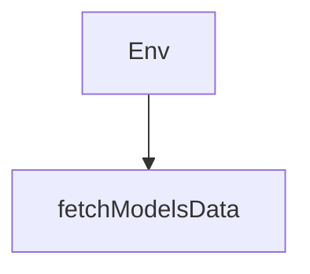

# Chapter 5: Transport, Retry, and Reconnect Strategy

Welcome to **Chapter 5: Transport, Retry, and Reconnect Strategy**. In this part of **use-mcp Tutorial: React Hook Patterns for MCP Client Integration**, you will build an intuitive mental model first, then move into concrete implementation details and practical production tradeoffs.


This chapter focuses on resilience controls for unstable networks and intermittent server availability.

## Learning Goals

- choose transport preference (`auto`, `http`, `sse`) by server behavior
- tune `autoRetry` and `autoReconnect` without overloading endpoints
- distinguish auth failures from transport connectivity failures
- expose clear user-visible retry paths in UI

## Reliability Checklist

1. start with `transportType: auto` unless you need strict transport pinning
2. set bounded retry intervals for both initial connection and reconnect
3. instrument and surface failure reasons before forcing auth retries
4. disable aggressive reconnect loops in high-failure environments

## Source References

- [use-mcp README - Options](https://github.com/modelcontextprotocol/use-mcp/blob/main/README.md#options)
- [React Integration README - Hook Options](https://github.com/modelcontextprotocol/use-mcp/blob/main/src/react/README.md#hook-options-usemcpoptions)

## Summary

You now have a practical resilience model for browser-based MCP client sessions.

Next: [Chapter 6: React Integration Patterns: Chat UI and Inspector](06-react-integration-patterns-chat-ui-and-inspector.md)

## Depth Expansion Playbook

## Source Code Walkthrough

### `examples/chat-ui/api/index.ts`

The `Env` interface in [`examples/chat-ui/api/index.ts`](https://github.com/modelcontextprotocol/use-mcp/blob/HEAD/examples/chat-ui/api/index.ts) handles a key part of this chapter's functionality:

```ts
import { Hono } from 'hono'

interface Env {
  ASSETS: Fetcher
  AI: Ai
}

type message = {
  role: 'system' | 'user' | 'assistant' | 'data'
  content: string
}

const app = new Hono<{ Bindings: Env }>()

// Handle the /api/chat endpoint
app.post('/api/chat', async (c) => {
  try {
    const { messages, reasoning }: { messages: message[]; reasoning: boolean } = await c.req.json()

    const workersai = createWorkersAI({ binding: c.env.AI })

    // Choose model based on reasoning preference
    const model = reasoning
      ? wrapLanguageModel({
          model: workersai('@cf/deepseek-ai/deepseek-r1-distill-qwen-32b'),
          middleware: [
            extractReasoningMiddleware({ tagName: 'think' }),
            //custom middleware to inject <think> tag at the beginning of a reasoning if it is missing
            {
              wrapGenerate: async ({ doGenerate }) => {
                const result = await doGenerate()

```

This interface is important because it defines how use-mcp Tutorial: React Hook Patterns for MCP Client Integration implements the patterns covered in this chapter.

### `examples/chat-ui/scripts/update-models.ts`

The `fetchModelsData` function in [`examples/chat-ui/scripts/update-models.ts`](https://github.com/modelcontextprotocol/use-mcp/blob/HEAD/examples/chat-ui/scripts/update-models.ts) handles a key part of this chapter's functionality:

```ts
type SupportedProvider = (typeof SUPPORTED_PROVIDERS)[number]

async function fetchModelsData(): Promise<ModelsDevData> {
  console.log('Fetching models data from models.dev...')

  const response = await fetch('https://models.dev/api.json')
  if (!response.ok) {
    throw new Error(`Failed to fetch models data: ${response.status} ${response.statusText}`)
  }

  return await response.json()
}

function filterAndTransformModels(data: ModelsDevData) {
  const filtered: Record<SupportedProvider, Record<string, ModelData>> = {
    anthropic: {},
    groq: {},
    openrouter: {},
  }

  // Filter by supported providers
  for (const provider of SUPPORTED_PROVIDERS) {
    if (data[provider] && data[provider].models) {
      filtered[provider] = data[provider].models
    }
  }

  return filtered
}

async function main() {
  try {
```

This function is important because it defines how use-mcp Tutorial: React Hook Patterns for MCP Client Integration implements the patterns covered in this chapter.


## How These Components Connect


