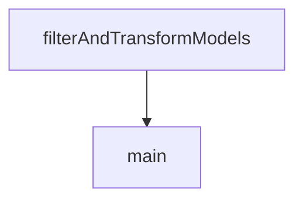

# Chapter 6: React Integration Patterns: Chat UI and Inspector

Welcome to **Chapter 6: React Integration Patterns: Chat UI and Inspector**. In this part of **use-mcp Tutorial: React Hook Patterns for MCP Client Integration**, you will build an intuitive mental model first, then move into concrete implementation details and practical production tradeoffs.


This chapter extracts reusable architecture patterns from official example apps.

## Learning Goals

- compare chat-oriented vs inspector-oriented integration approaches
- reuse server management, tool inspection, and prompt/resource panels
- structure app state to isolate MCP concerns from core product logic
- accelerate UI prototyping with known-good component boundaries

## Example Pattern Highlights

- **Inspector**: capability discovery/debug and operational visibility
- **Chat UI**: conversational tooling and server/session UX
- **Server examples**: reference backends for integration experiments

## Source References

- [Chat UI Example](https://github.com/modelcontextprotocol/use-mcp/blob/main/examples/chat-ui/README.md)
- [Inspector Example](https://github.com/modelcontextprotocol/use-mcp/blob/main/examples/inspector/README.md)
- [Hono MCP Server Example](https://github.com/modelcontextprotocol/use-mcp/blob/main/examples/servers/hono-mcp/README.md)
- [Cloudflare Agents Example](https://github.com/modelcontextprotocol/use-mcp/blob/main/examples/servers/cf-agents/README.md)

## Summary

You now have an example-driven component architecture model for MCP-enabled React apps.

Next: [Chapter 7: Testing, Debugging, and Integration Servers](07-testing-debugging-and-integration-servers.md)

## Source Code Walkthrough

### `examples/chat-ui/scripts/update-models.ts`

The `filterAndTransformModels` function in [`examples/chat-ui/scripts/update-models.ts`](https://github.com/modelcontextprotocol/use-mcp/blob/HEAD/examples/chat-ui/scripts/update-models.ts) handles a key part of this chapter's functionality:

```ts
}

function filterAndTransformModels(data: ModelsDevData) {
  const filtered: Record<SupportedProvider, Record<string, ModelData>> = {
    anthropic: {},
    groq: {},
    openrouter: {},
  }

  // Filter by supported providers
  for (const provider of SUPPORTED_PROVIDERS) {
    if (data[provider] && data[provider].models) {
      filtered[provider] = data[provider].models
    }
  }

  return filtered
}

async function main() {
  try {
    const data = await fetchModelsData()
    const filteredData = filterAndTransformModels(data)

    const outputPath = join(process.cwd(), 'src', 'data', 'models.json')
    writeFileSync(outputPath, JSON.stringify(filteredData, null, 2))

    console.log(`✅ Models data updated successfully at ${outputPath}`)

    // Print summary
    let totalModels = 0
    let toolSupportingModels = 0
```

This function is important because it defines how use-mcp Tutorial: React Hook Patterns for MCP Client Integration implements the patterns covered in this chapter.

### `examples/chat-ui/scripts/update-models.ts`

The `main` function in [`examples/chat-ui/scripts/update-models.ts`](https://github.com/modelcontextprotocol/use-mcp/blob/HEAD/examples/chat-ui/scripts/update-models.ts) handles a key part of this chapter's functionality:

```ts
}

async function main() {
  try {
    const data = await fetchModelsData()
    const filteredData = filterAndTransformModels(data)

    const outputPath = join(process.cwd(), 'src', 'data', 'models.json')
    writeFileSync(outputPath, JSON.stringify(filteredData, null, 2))

    console.log(`✅ Models data updated successfully at ${outputPath}`)

    // Print summary
    let totalModels = 0
    let toolSupportingModels = 0

    for (const [provider, models] of Object.entries(filteredData)) {
      const modelCount = Object.keys(models).length
      const toolModels = Object.values(models).filter((m) => m.tool_call).length

      console.log(`  ${provider}: ${modelCount} models (${toolModels} support tools)`)
      totalModels += modelCount
      toolSupportingModels += toolModels
    }

    console.log(`\nTotal: ${totalModels} models (${toolSupportingModels} support tools)`)
  } catch (error) {
    console.error('❌ Failed to update models data:', error)
    process.exit(1)
  }
}

```

This function is important because it defines how use-mcp Tutorial: React Hook Patterns for MCP Client Integration implements the patterns covered in this chapter.


## How These Components Connect


