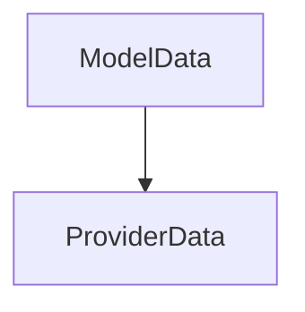

# Chapter 7: Testing, Debugging, and Integration Servers

Welcome to **Chapter 7: Testing, Debugging, and Integration Servers**. In this part of **use-mcp Tutorial: React Hook Patterns for MCP Client Integration**, you will build an intuitive mental model first, then move into concrete implementation details and practical production tradeoffs.


This chapter defines validation strategies for MCP client correctness and regression safety.

## Learning Goals

- run integration tests and local multi-service dev setup effectively
- use debug logs and inspector views to isolate protocol failures
- add server fixtures for compatibility testing across providers
- validate auth + tool/resource/prompt flows end to end

## Validation Loop

1. run headless integration tests for baseline confidence
2. replay flows in headed/debug modes for auth and UX edge cases
3. test against multiple sample servers to detect compatibility drift
4. preserve reproducible fixtures for future migration checks

## Source References

- [Integration Test Guide](https://github.com/modelcontextprotocol/use-mcp/blob/main/test/README.md)
- [Project Guidelines](https://github.com/modelcontextprotocol/use-mcp/blob/main/AGENT.md)

## Summary

You now have a repeatable verification framework for `use-mcp` integrations.

Next: [Chapter 8: Maintenance Risk, Migration, and Production Guidance](08-maintenance-risk-migration-and-production-guidance.md)

## Source Code Walkthrough

### `examples/chat-ui/scripts/update-models.ts`

The `ModelData` interface in [`examples/chat-ui/scripts/update-models.ts`](https://github.com/modelcontextprotocol/use-mcp/blob/HEAD/examples/chat-ui/scripts/update-models.ts) handles a key part of this chapter's functionality:

```ts
import { join } from 'path'

interface ModelData {
  id: string
  name: string
  attachment: boolean
  reasoning: boolean
  temperature: boolean
  tool_call: boolean
  knowledge: string
  release_date: string
  last_updated: string
  modalities: {
    input: string[]
    output: string[]
  }
  open_weights: boolean
  limit: {
    context: number
    output: number
  }
  cost?: {
    input: number
    output: number
    cache_read?: number
    cache_write?: number
  }
}

interface ProviderData {
  models: Record<string, ModelData>
}
```

This interface is important because it defines how use-mcp Tutorial: React Hook Patterns for MCP Client Integration implements the patterns covered in this chapter.

### `examples/chat-ui/scripts/update-models.ts`

The `ProviderData` interface in [`examples/chat-ui/scripts/update-models.ts`](https://github.com/modelcontextprotocol/use-mcp/blob/HEAD/examples/chat-ui/scripts/update-models.ts) handles a key part of this chapter's functionality:

```ts
}

interface ProviderData {
  models: Record<string, ModelData>
}

interface ModelsDevData {
  anthropic: ProviderData
  groq: ProviderData
  openrouter: ProviderData
  [key: string]: ProviderData
}

const SUPPORTED_PROVIDERS = ['anthropic', 'groq', 'openrouter'] as const
type SupportedProvider = (typeof SUPPORTED_PROVIDERS)[number]

async function fetchModelsData(): Promise<ModelsDevData> {
  console.log('Fetching models data from models.dev...')

  const response = await fetch('https://models.dev/api.json')
  if (!response.ok) {
    throw new Error(`Failed to fetch models data: ${response.status} ${response.statusText}`)
  }

  return await response.json()
}

function filterAndTransformModels(data: ModelsDevData) {
  const filtered: Record<SupportedProvider, Record<string, ModelData>> = {
    anthropic: {},
    groq: {},
    openrouter: {},
```

This interface is important because it defines how use-mcp Tutorial: React Hook Patterns for MCP Client Integration implements the patterns covered in this chapter.


## How These Components Connect


