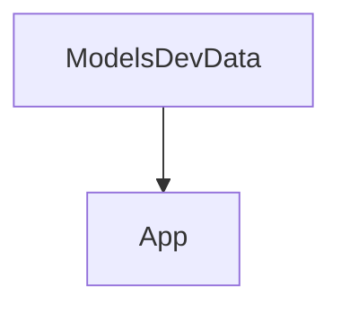

# Chapter 8: Maintenance Risk, Migration, and Production Guidance

Welcome to **Chapter 8: Maintenance Risk, Migration, and Production Guidance**. In this part of **use-mcp Tutorial: React Hook Patterns for MCP Client Integration**, you will build an intuitive mental model first, then move into concrete implementation details and practical production tradeoffs.


This chapter covers long-term operations for teams relying on an archived upstream package.

## Learning Goals

- quantify archived-dependency risk and establish ownership boundaries
- maintain internal patches or forks when required
- define migration plans toward actively maintained MCP client stacks
- preserve compatibility test suites during migration execution

## Migration Controls

| Control | Purpose |
|:--------|:--------|
| dependency freeze policy | prevents accidental breakage from transitive changes |
| fork strategy | enables urgent fixes/security patches |
| compatibility test suite | validates behavior parity during migration |
| phased rollout | limits user-facing disruption |

## Source References

- [use-mcp Repository (Archived)](https://github.com/modelcontextprotocol/use-mcp)
- [use-mcp README](https://github.com/modelcontextprotocol/use-mcp/blob/main/README.md)
- [MCP TypeScript SDK](https://github.com/modelcontextprotocol/typescript-sdk)

## Summary

You now have a pragmatic operating and migration strategy for `use-mcp` deployments.

Return to the [use-mcp Tutorial index](README.md).

## Depth Expansion Playbook

## Source Code Walkthrough

### `examples/chat-ui/scripts/update-models.ts`

The `ModelsDevData` interface in [`examples/chat-ui/scripts/update-models.ts`](https://github.com/modelcontextprotocol/use-mcp/blob/HEAD/examples/chat-ui/scripts/update-models.ts) handles a key part of this chapter's functionality:

```ts
}

interface ModelsDevData {
  anthropic: ProviderData
  groq: ProviderData
  openrouter: ProviderData
  [key: string]: ProviderData
}

const SUPPORTED_PROVIDERS = ['anthropic', 'groq', 'openrouter'] as const
type SupportedProvider = (typeof SUPPORTED_PROVIDERS)[number]

async function fetchModelsData(): Promise<ModelsDevData> {
  console.log('Fetching models data from models.dev...')

  const response = await fetch('https://models.dev/api.json')
  if (!response.ok) {
    throw new Error(`Failed to fetch models data: ${response.status} ${response.statusText}`)
  }

  return await response.json()
}

function filterAndTransformModels(data: ModelsDevData) {
  const filtered: Record<SupportedProvider, Record<string, ModelData>> = {
    anthropic: {},
    groq: {},
    openrouter: {},
  }

  // Filter by supported providers
  for (const provider of SUPPORTED_PROVIDERS) {
```

This interface is important because it defines how use-mcp Tutorial: React Hook Patterns for MCP Client Integration implements the patterns covered in this chapter.

### `examples/chat-ui/src/App.tsx`

The `App` function in [`examples/chat-ui/src/App.tsx`](https://github.com/modelcontextprotocol/use-mcp/blob/HEAD/examples/chat-ui/src/App.tsx) handles a key part of this chapter's functionality:

```tsx
import { BrowserRouter as Router, Routes, Route } from 'react-router-dom'
import ChatApp from './components/ChatApp'
import PkceCallback from './components/PkceCallback.tsx'
import { OAuthCallback } from './components/OAuthCallback.tsx'

function App() {
  return (
    <Router>
      <Routes>
        <Route path="/oauth/groq/callback" element={<PkceCallback provider="groq" />} />
        <Route path="/oauth/openrouter/callback" element={<PkceCallback provider="openrouter" />} />
        <Route path="/oauth/callback" element={<OAuthCallback />} />
        <Route path="/" element={<ChatApp />} />
      </Routes>
    </Router>
  )
}

export default App

```

This function is important because it defines how use-mcp Tutorial: React Hook Patterns for MCP Client Integration implements the patterns covered in this chapter.


## How These Components Connect


