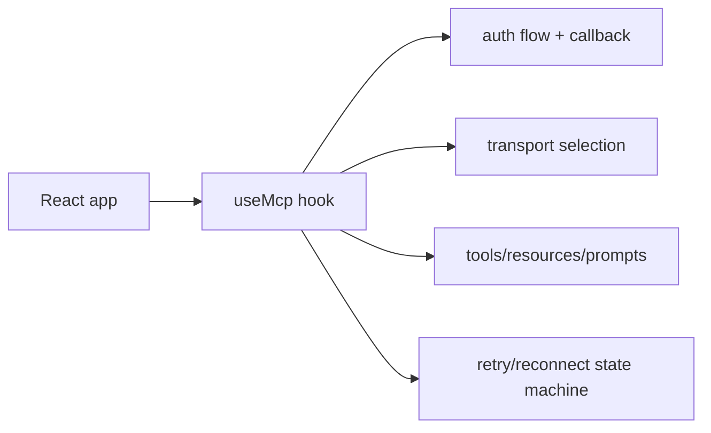

# use-mcp Tutorial: React Hook Patterns for MCP Client Integration

> Learn how to use `modelcontextprotocol/use-mcp` to connect React apps to MCP servers with OAuth-aware flows, tool/resource/prompt access, and resilient transport lifecycle handling.

## Why This Track Matters

`use-mcp` demonstrates a focused React-first client integration model for MCP servers. Even though the repository is archived, its architecture and examples remain useful for teams building custom MCP client experiences in web UIs.

This track focuses on:

- understanding hook-driven MCP connection lifecycle patterns
- implementing OAuth callback and auth-state handling correctly
- using tools/resources/prompts safely from React flows
- planning migration and maintenance strategies for archived upstream code

## Current Snapshot (auto-updated)

- repository: [`modelcontextprotocol/use-mcp`](https://github.com/modelcontextprotocol/use-mcp)
- stars: about **1.0k**
- repository status: **archived**
- latest visible tag: [`v0.0.21`](https://github.com/modelcontextprotocol/use-mcp/tags)
- recent metadata activity: verify current archive metadata in upstream repository
- package baseline: `npm install use-mcp`
- license: MIT

## Mental Model

## Chapter Guide

| Chapter | Key Question | Outcome |
|:--------|:-------------|:--------|
| [01 - Getting Started and Archived Context](01-getting-started-and-archived-context.md) | How should teams evaluate and adopt an archived client library? | Informed baseline |
| [02 - Hook Architecture and Connection Lifecycle](02-hook-architecture-and-connection-lifecycle.md) | How does `useMcp` manage connection state transitions? | Better runtime control |
| [03 - Authentication, OAuth Callback, and Storage](03-authentication-oauth-callback-and-storage.md) | How should OAuth and local storage be handled safely? | Safer auth flows |
| [04 - Tools, Resources, Prompts, and Client Operations](04-tools-resources-prompts-and-client-operations.md) | How do UI components consume MCP capabilities effectively? | Cleaner feature integration |
| [05 - Transport, Retry, and Reconnect Strategy](05-transport-retry-and-reconnect-strategy.md) | How should connection resilience be tuned in production-like usage? | Better reliability |
| [06 - React Integration Patterns: Chat UI and Inspector](06-react-integration-patterns-chat-ui-and-inspector.md) | What architecture patterns emerge from official examples? | Faster implementation |
| [07 - Testing, Debugging, and Integration Servers](07-testing-debugging-and-integration-servers.md) | How do teams validate client behavior and server compatibility? | Higher confidence |
| [08 - Maintenance Risk, Migration, and Production Guidance](08-maintenance-risk-migration-and-production-guidance.md) | How should you operate or migrate away from archived dependencies? | Lower long-term risk |

## What You Will Learn

- how to structure React MCP client state and auth workflows around `useMcp`
- how to expose server tools/resources/prompts safely in user-facing interfaces
- how to validate behavior with inspector/chat example stacks and integration tests
- how to plan migration paths when upstream maintenance is frozen

## Source References

- [use-mcp README](https://github.com/modelcontextprotocol/use-mcp/blob/main/README.md)
- [use-mcp React Integration](https://github.com/modelcontextprotocol/use-mcp/blob/main/src/react/README.md)
- [Inspector Example](https://github.com/modelcontextprotocol/use-mcp/blob/main/examples/inspector/README.md)
- [Chat UI Example](https://github.com/modelcontextprotocol/use-mcp/blob/main/examples/chat-ui/README.md)
- [Cloudflare Agents Example](https://github.com/modelcontextprotocol/use-mcp/blob/main/examples/servers/cf-agents/README.md)
- [Hono MCP Example](https://github.com/modelcontextprotocol/use-mcp/blob/main/examples/servers/hono-mcp/README.md)
- [Integration Test Guide](https://github.com/modelcontextprotocol/use-mcp/blob/main/test/README.md)
- [Project Guidelines](https://github.com/modelcontextprotocol/use-mcp/blob/main/AGENT.md)

## Related Tutorials

- [MCP TypeScript SDK Tutorial](../mcp-typescript-sdk-tutorial/)
- [MCP Use Tutorial](../mcp-use-tutorial/)
- [MCP Ext Apps Tutorial](../mcp-ext-apps-tutorial/)
- [MCP Inspector Tutorial](../mcp-inspector-tutorial/)

---

Start with [Chapter 1: Getting Started and Archived Context](01-getting-started-and-archived-context.md).

## Navigation & Backlinks

- [Start Here: Chapter 1: Getting Started and Archived Context](01-getting-started-and-archived-context.md)
- [Back to Main Catalog](../../README.md#-tutorial-catalog)
- [Browse A-Z Tutorial Directory](../../discoverability/tutorial-directory.md)
- [Search by Intent](../../discoverability/query-hub.md)
- [Explore Category Hubs](../../README.md#category-hubs)

## Full Chapter Map

1. [Chapter 1: Getting Started and Archived Context](01-getting-started-and-archived-context.md)
2. [Chapter 2: Hook Architecture and Connection Lifecycle](02-hook-architecture-and-connection-lifecycle.md)
3. [Chapter 3: Authentication, OAuth Callback, and Storage](03-authentication-oauth-callback-and-storage.md)
4. [Chapter 4: Tools, Resources, Prompts, and Client Operations](04-tools-resources-prompts-and-client-operations.md)
5. [Chapter 5: Transport, Retry, and Reconnect Strategy](05-transport-retry-and-reconnect-strategy.md)
6. [Chapter 6: React Integration Patterns: Chat UI and Inspector](06-react-integration-patterns-chat-ui-and-inspector.md)
7. [Chapter 7: Testing, Debugging, and Integration Servers](07-testing-debugging-and-integration-servers.md)
8. [Chapter 8: Maintenance Risk, Migration, and Production Guidance](08-maintenance-risk-migration-and-production-guidance.md)

*Generated by [AI Codebase Knowledge Builder](https://github.com/The-Pocket/Tutorial-Codebase-Knowledge)*
