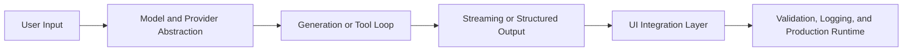

# Vercel AI SDK Tutorial: Production TypeScript AI Apps and Agents

> Build robust AI product features with `vercel/ai`, including streaming, structured outputs, tool loops, framework integration, and production deployment patterns.

## Why This Track Matters

The AI SDK is one of the most widely used TypeScript toolkits for shipping modern AI UX. Teams still need practical guidance on:

- provider-agnostic architecture
- streaming-first UX design
- safe tool-calling workflows
- production reliability and observability

## Current Snapshot (Verified February 11, 2026)

- repository: [`vercel/ai`](https://github.com/vercel/ai)
- stars: about **21.7k**
- latest core package release: `ai@6.0.79` (published February 11, 2026)
- release cadence: frequent package updates across core and provider integrations
- official docs site: [`ai-sdk.dev`](https://ai-sdk.dev)

## Mental Model

## Chapter Guide

| Chapter | Key Question | Outcome |
|:--------|:-------------|:--------|
| [01 - Getting Started](01-getting-started.md) | How do I set up the SDK quickly and safely? | Stable project baseline |
| [02 - Text Generation](02-text-generation.md) | How do I build provider-agnostic generation flows? | Reusable generation primitives |
| [03 - Streaming Responses](03-streaming-responses.md) | How do I design real-time AI UX? | Streaming-ready frontend patterns |
| [04 - Function Calling](04-function-calling.md) | How do tool loops execute reliably? | Safe tool invocation architecture |
| [05 - Structured Outputs](05-structured-outputs.md) | How do I enforce type-safe responses? | Schema-driven response handling |
| [06 - React Integration](06-react-integration.md) | How do SDK hooks fit real UI systems? | Production React integration |
| [07 - Next.js Applications](07-nextjs-applications.md) | How do I build full-stack AI features? | End-to-end app architecture |
| [08 - Production Deployment](08-production-deployment.md) | How do I operate AI SDK apps at scale? | Deployment and observability playbook |

## What You Will Learn

- how to build provider-flexible AI features with strong TypeScript ergonomics
- how to stream responses and tool outputs into responsive interfaces
- how to enforce structured output contracts
- how to deploy and operate AI SDK apps with production controls

## Source References

- [AI SDK Repository](https://github.com/vercel/ai)
- [AI SDK Releases](https://github.com/vercel/ai/releases)
- [AI SDK Docs](https://ai-sdk.dev)

## Related Tutorials

- [OpenAI Python SDK Tutorial](../openai-python-sdk-tutorial/)
- [OpenAI Realtime Agents Tutorial](../openai-realtime-agents-tutorial/)
- [Dyad Tutorial](../dyad-tutorial/)
- [bolt.diy Tutorial](../bolt-diy-tutorial/)

---

Start with [Chapter 1: Getting Started](01-getting-started.md).
