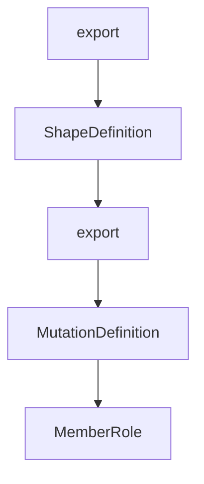

# Chapter 1: Getting Started

Welcome to **Chapter 1: Getting Started**. In this part of **Vibe Kanban Tutorial: Multi-Agent Orchestration Board for Coding Workflows**, you will build an intuitive mental model first, then move into concrete implementation details and practical production tradeoffs.


This chapter gets Vibe Kanban running with your preferred coding agent environment.

## Learning Goals

- launch Vibe Kanban via the CLI bootstrap path
- connect authenticated coding agents
- create first task board workflow
- verify local baseline and resolve startup issues

## Quick Launch

```bash
npx vibe-kanban
```

## Startup Checklist

1. authenticate at least one supported coding agent first
2. launch Vibe Kanban
3. create/import project context
4. add a few tasks to board columns
5. assign tasks to agent workflows

## Common Startup Issues

| Symptom | Likely Cause | First Fix |
|:--------|:-------------|:----------|
| agent unavailable | missing agent auth state | authenticate agent CLI and retry |
| commands fail to run | environment/toolchain mismatch | verify required runtimes and path settings |
| MCP errors | host/port/origin mismatch | review MCP and origin-related settings |

## Source References

- [Vibe Kanban README: Installation](https://github.com/BloopAI/vibe-kanban/blob/main/README.md#installation)
- [Vibe Kanban Docs](https://vibekanban.com/docs)

## Summary

You now have Vibe Kanban up and ready for multi-agent task orchestration.

Next: [Chapter 2: Orchestration Architecture](02-orchestration-architecture.md)

## Depth Expansion Playbook

## Source Code Walkthrough

### `shared/remote-types.ts`

The `export` interface in [`shared/remote-types.ts`](https://github.com/BloopAI/vibe-kanban/blob/HEAD/shared/remote-types.ts) handles a key part of this chapter's functionality:

```ts

// Electric row types
export type JsonValue = number | string | boolean | Array<JsonValue> | { [key in string]?: JsonValue } | null;

export type Project = { id: string, organization_id: string, name: string, color: string, sort_order: number, created_at: string, updated_at: string, };

export type Notification = { id: string, organization_id: string, user_id: string, notification_type: NotificationType, payload: NotificationPayload, issue_id: string | null, comment_id: string | null, seen: boolean, dismissed_at: string | null, created_at: string, };

export type NotificationGroupKind = "single" | "issue_changes" | "status_changes" | "comments" | "reactions" | "issue_deleted";

export type NotificationPayload = { deeplink_path?: string | null, issue_id?: string | null, issue_simple_id?: string | null, issue_title?: string | null, actor_user_id?: string | null, comment_preview?: string | null, old_status_id?: string | null, new_status_id?: string | null, old_status_name?: string | null, new_status_name?: string | null, new_title?: string | null, old_priority?: IssuePriority | null, new_priority?: IssuePriority | null, assignee_user_id?: string | null, emoji?: string | null, };

export type NotificationType = "issue_comment_added" | "issue_status_changed" | "issue_assignee_changed" | "issue_priority_changed" | "issue_unassigned" | "issue_comment_reaction" | "issue_deleted" | "issue_title_changed" | "issue_description_changed";

export type Workspace = { id: string, project_id: string, owner_user_id: string, issue_id: string | null, local_workspace_id: string | null, name: string | null, archived: boolean, files_changed: number | null, lines_added: number | null, lines_removed: number | null, created_at: string, updated_at: string, };

export type ProjectStatus = { id: string, project_id: string, name: string, color: string, sort_order: number, hidden: boolean, created_at: string, };

export type Tag = { id: string, project_id: string, name: string, color: string, };

export type Issue = { id: string, project_id: string, issue_number: number, simple_id: string, status_id: string, title: string, description: string | null, priority: IssuePriority | null, start_date: string | null, target_date: string | null, completed_at: string | null, sort_order: number, parent_issue_id: string | null, parent_issue_sort_order: number | null, extension_metadata: JsonValue, creator_user_id: string | null, created_at: string, updated_at: string, };

export type IssueAssignee = { id: string, issue_id: string, user_id: string, assigned_at: string, };

export type Blob = { id: string, project_id: string, blob_path: string, thumbnail_blob_path: string | null, original_name: string, mime_type: string | null, size_bytes: bigint, hash: string, width: number | null, height: number | null, created_at: string, updated_at: string, };

export type Attachment = { id: string, blob_id: string, issue_id: string | null, comment_id: string | null, created_at: string, expires_at: string | null, };

export type AttachmentWithBlob = { id: string, blob_id: string, issue_id: string | null, comment_id: string | null, created_at: string, expires_at: string | null, blob_path: string, thumbnail_blob_path: string | null, original_name: string, mime_type: string | null, size_bytes: bigint, hash: string, width: number | null, height: number | null, };

export type IssueFollower = { id: string, issue_id: string, user_id: string, };

```

This interface is important because it defines how Vibe Kanban Tutorial: Multi-Agent Orchestration Board for Coding Workflows implements the patterns covered in this chapter.

### `shared/remote-types.ts`

The `ShapeDefinition` interface in [`shared/remote-types.ts`](https://github.com/BloopAI/vibe-kanban/blob/HEAD/shared/remote-types.ts) handles a key part of this chapter's functionality:

```ts

// Shape definition interface
export interface ShapeDefinition<T> {
  readonly table: string;
  readonly params: readonly string[];
  readonly url: string;
  readonly fallbackUrl: string;
  readonly _type: T;  // Phantom field for type inference (not present at runtime)
}

// Helper to create type-safe shape definitions
function defineShape<T>(
  table: string,
  params: readonly string[],
  url: string,
  fallbackUrl: string
): ShapeDefinition<T> {
  return { table, params, url, fallbackUrl } as ShapeDefinition<T>;
}

// Individual shape definitions with embedded types
export const PROJECTS_SHAPE = defineShape<Project>(
  'projects',
  ['organization_id'] as const,
  '/v1/shape/projects',
  '/v1/fallback/projects'
);

export const NOTIFICATIONS_SHAPE = defineShape<Notification>(
  'notifications',
  ['user_id'] as const,
  '/v1/shape/notifications',
```

This interface is important because it defines how Vibe Kanban Tutorial: Multi-Agent Orchestration Board for Coding Workflows implements the patterns covered in this chapter.

### `shared/remote-types.ts`

The `export` interface in [`shared/remote-types.ts`](https://github.com/BloopAI/vibe-kanban/blob/HEAD/shared/remote-types.ts) handles a key part of this chapter's functionality:

```ts

// Electric row types
export type JsonValue = number | string | boolean | Array<JsonValue> | { [key in string]?: JsonValue } | null;

export type Project = { id: string, organization_id: string, name: string, color: string, sort_order: number, created_at: string, updated_at: string, };

export type Notification = { id: string, organization_id: string, user_id: string, notification_type: NotificationType, payload: NotificationPayload, issue_id: string | null, comment_id: string | null, seen: boolean, dismissed_at: string | null, created_at: string, };

export type NotificationGroupKind = "single" | "issue_changes" | "status_changes" | "comments" | "reactions" | "issue_deleted";

export type NotificationPayload = { deeplink_path?: string | null, issue_id?: string | null, issue_simple_id?: string | null, issue_title?: string | null, actor_user_id?: string | null, comment_preview?: string | null, old_status_id?: string | null, new_status_id?: string | null, old_status_name?: string | null, new_status_name?: string | null, new_title?: string | null, old_priority?: IssuePriority | null, new_priority?: IssuePriority | null, assignee_user_id?: string | null, emoji?: string | null, };

export type NotificationType = "issue_comment_added" | "issue_status_changed" | "issue_assignee_changed" | "issue_priority_changed" | "issue_unassigned" | "issue_comment_reaction" | "issue_deleted" | "issue_title_changed" | "issue_description_changed";

export type Workspace = { id: string, project_id: string, owner_user_id: string, issue_id: string | null, local_workspace_id: string | null, name: string | null, archived: boolean, files_changed: number | null, lines_added: number | null, lines_removed: number | null, created_at: string, updated_at: string, };

export type ProjectStatus = { id: string, project_id: string, name: string, color: string, sort_order: number, hidden: boolean, created_at: string, };

export type Tag = { id: string, project_id: string, name: string, color: string, };

export type Issue = { id: string, project_id: string, issue_number: number, simple_id: string, status_id: string, title: string, description: string | null, priority: IssuePriority | null, start_date: string | null, target_date: string | null, completed_at: string | null, sort_order: number, parent_issue_id: string | null, parent_issue_sort_order: number | null, extension_metadata: JsonValue, creator_user_id: string | null, created_at: string, updated_at: string, };

export type IssueAssignee = { id: string, issue_id: string, user_id: string, assigned_at: string, };

export type Blob = { id: string, project_id: string, blob_path: string, thumbnail_blob_path: string | null, original_name: string, mime_type: string | null, size_bytes: bigint, hash: string, width: number | null, height: number | null, created_at: string, updated_at: string, };

export type Attachment = { id: string, blob_id: string, issue_id: string | null, comment_id: string | null, created_at: string, expires_at: string | null, };

export type AttachmentWithBlob = { id: string, blob_id: string, issue_id: string | null, comment_id: string | null, created_at: string, expires_at: string | null, blob_path: string, thumbnail_blob_path: string | null, original_name: string, mime_type: string | null, size_bytes: bigint, hash: string, width: number | null, height: number | null, };

export type IssueFollower = { id: string, issue_id: string, user_id: string, };

```

This interface is important because it defines how Vibe Kanban Tutorial: Multi-Agent Orchestration Board for Coding Workflows implements the patterns covered in this chapter.

### `shared/remote-types.ts`

The `MutationDefinition` interface in [`shared/remote-types.ts`](https://github.com/BloopAI/vibe-kanban/blob/HEAD/shared/remote-types.ts) handles a key part of this chapter's functionality:

```ts

// Mutation definition interface
export interface MutationDefinition<TRow, TCreate = unknown, TUpdate = unknown> {
  readonly name: string;
  readonly url: string;
  readonly _rowType: TRow;  // Phantom field for type inference (not present at runtime)
  readonly _createType: TCreate;  // Phantom field for type inference (not present at runtime)
  readonly _updateType: TUpdate;  // Phantom field for type inference (not present at runtime)
}

// Helper to create type-safe mutation definitions
function defineMutation<TRow, TCreate, TUpdate>(
  name: string,
  url: string
): MutationDefinition<TRow, TCreate, TUpdate> {
  return { name, url } as MutationDefinition<TRow, TCreate, TUpdate>;
}

// Individual mutation definitions
export const PROJECT_MUTATION = defineMutation<Project, CreateProjectRequest, UpdateProjectRequest>(
  'Project',
  '/v1/projects'
);

export const NOTIFICATION_MUTATION = defineMutation<Notification, unknown, UpdateNotificationRequest>(
  'Notification',
  '/v1/notifications'
);

export const TAG_MUTATION = defineMutation<Tag, CreateTagRequest, UpdateTagRequest>(
  'Tag',
  '/v1/tags'
```

This interface is important because it defines how Vibe Kanban Tutorial: Multi-Agent Orchestration Board for Coding Workflows implements the patterns covered in this chapter.


## How These Components Connect


