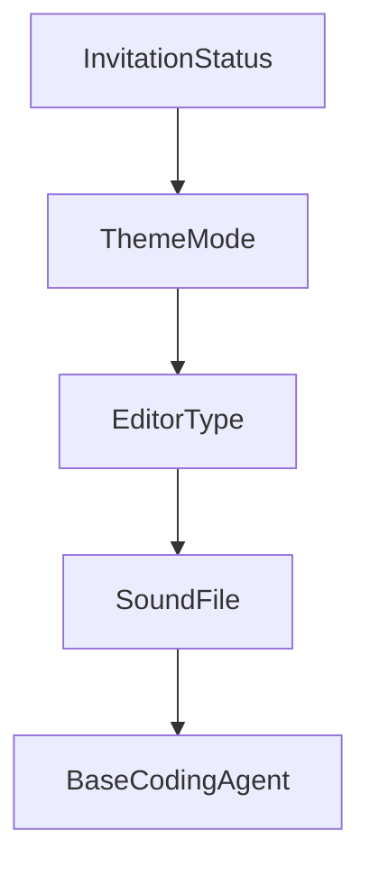

# Chapter 2: Orchestration Architecture

Welcome to **Chapter 2: Orchestration Architecture**. In this part of **Vibe Kanban Tutorial: Multi-Agent Orchestration Board for Coding Workflows**, you will build an intuitive mental model first, then move into concrete implementation details and practical production tradeoffs.


This chapter explains the core architecture that turns Vibe Kanban into a multi-agent command center.

## Learning Goals

- understand board-driven orchestration flow
- map task state to agent execution lifecycle
- reason about switching and sequencing agent runs
- align architecture with review workflow design

## Core System Model

| Layer | Responsibility |
|:------|:---------------|
| board/task layer | task planning, status tracking, ownership visibility |
| orchestration layer | start/stop/switch coding agents and workflows |
| review layer | quick validation, dev-server checks, handoff control |
| config layer | centralize MCP and runtime settings |

## Why This Matters

Vibe Kanban helps teams avoid context fragmentation by keeping planning, execution, and review in one loop.

## Source References

- [Vibe Kanban README: Overview](https://github.com/BloopAI/vibe-kanban/blob/main/README.md#overview)
- [Vibe Kanban Docs](https://vibekanban.com/docs)

## Summary

You now understand how Vibe Kanban coordinates planning and execution across many coding agents.

Next: [Chapter 3: Multi-Agent Execution Strategies](03-multi-agent-execution-strategies.md)

## Source Code Walkthrough

### `shared/types.ts`

The `InvitationStatus` interface in [`shared/types.ts`](https://github.com/BloopAI/vibe-kanban/blob/HEAD/shared/types.ts) handles a key part of this chapter's functionality:

```ts
export enum MemberRole { ADMIN = "ADMIN", MEMBER = "MEMBER" }

export enum InvitationStatus { PENDING = "PENDING", ACCEPTED = "ACCEPTED", DECLINED = "DECLINED", EXPIRED = "EXPIRED" }

export type Organization = { id: string, name: string, slug: string, is_personal: boolean, issue_prefix: string, created_at: string, updated_at: string, };

export type OrganizationWithRole = { id: string, name: string, slug: string, is_personal: boolean, issue_prefix: string, created_at: string, updated_at: string, user_role: MemberRole, };

export type ListOrganizationsResponse = { organizations: Array<OrganizationWithRole>, };

export type GetOrganizationResponse = { organization: Organization, user_role: string, };

export type CreateOrganizationRequest = { name: string, slug: string, };

export type CreateOrganizationResponse = { organization: OrganizationWithRole, };

export type UpdateOrganizationRequest = { name: string, };

export type Invitation = { id: string, organization_id: string, invited_by_user_id: string | null, email: string, role: MemberRole, status: InvitationStatus, token: string, created_at: string, expires_at: string, };

export type CreateInvitationRequest = { email: string, role: MemberRole, };

export type CreateInvitationResponse = { invitation: Invitation, };

export type ListInvitationsResponse = { invitations: Array<Invitation>, };

export type GetInvitationResponse = { id: string, organization_slug: string, role: MemberRole, expires_at: string, };

export type AcceptInvitationResponse = { organization_id: string, organization_slug: string, role: MemberRole, };

export type RevokeInvitationRequest = { invitation_id: string, };

```

This interface is important because it defines how Vibe Kanban Tutorial: Multi-Agent Orchestration Board for Coding Workflows implements the patterns covered in this chapter.

### `shared/types.ts`

The `ThemeMode` interface in [`shared/types.ts`](https://github.com/BloopAI/vibe-kanban/blob/HEAD/shared/types.ts) handles a key part of this chapter's functionality:

```ts
export type SearchMode = "taskform" | "settings";

export type Config = { config_version: string, theme: ThemeMode, executor_profile: ExecutorProfileId, disclaimer_acknowledged: boolean, onboarding_acknowledged: boolean, remote_onboarding_acknowledged: boolean, notifications: NotificationConfig, editor: EditorConfig, github: GitHubConfig, analytics_enabled: boolean, workspace_dir: string | null, last_app_version: string | null, show_release_notes: boolean, language: UiLanguage, git_branch_prefix: string, showcases: ShowcaseState, pr_auto_description_enabled: boolean, pr_auto_description_prompt: string | null, commit_reminder_enabled: boolean, commit_reminder_prompt: string | null, send_message_shortcut: SendMessageShortcut, relay_enabled: boolean, host_nickname: string | null, };

export type NotificationConfig = { sound_enabled: boolean, push_enabled: boolean, sound_file: SoundFile, };

export enum ThemeMode { LIGHT = "LIGHT", DARK = "DARK", SYSTEM = "SYSTEM" }

export type EditorConfig = { editor_type: EditorType, custom_command: string | null, remote_ssh_host: string | null, remote_ssh_user: string | null, auto_install_extension: boolean, };

export enum EditorType { VS_CODE = "VS_CODE", VS_CODE_INSIDERS = "VS_CODE_INSIDERS", CURSOR = "CURSOR", WINDSURF = "WINDSURF", INTELLI_J = "INTELLI_J", ZED = "ZED", XCODE = "XCODE", GOOGLE_ANTIGRAVITY = "GOOGLE_ANTIGRAVITY", CUSTOM = "CUSTOM" }

export type EditorOpenError = { "type": "executable_not_found", executable: string, editor_type: EditorType, } | { "type": "invalid_command", details: string, editor_type: EditorType, } | { "type": "launch_failed", executable: string, details: string, editor_type: EditorType, };

export type GitHubConfig = { pat: string | null, oauth_token: string | null, username: string | null, primary_email: string | null, default_pr_base: string | null, };

export enum SoundFile { ABSTRACT_SOUND1 = "ABSTRACT_SOUND1", ABSTRACT_SOUND2 = "ABSTRACT_SOUND2", ABSTRACT_SOUND3 = "ABSTRACT_SOUND3", ABSTRACT_SOUND4 = "ABSTRACT_SOUND4", COW_MOOING = "COW_MOOING", FAHHHHH = "FAHHHHH", PHONE_VIBRATION = "PHONE_VIBRATION", ROOSTER = "ROOSTER" }

export type UiLanguage = "BROWSER" | "EN" | "FR" | "JA" | "ES" | "KO" | "ZH_HANS" | "ZH_HANT";

export type ShowcaseState = { seen_features: Array<string>, };

export type SendMessageShortcut = "ModifierEnter" | "Enter";

export type GitBranch = { name: string, is_current: boolean, is_remote: boolean, last_commit_date: Date, };

export type QueuedMessage = { 
/**
 * The session this message is queued for
 */
session_id: string, 
/**
```

This interface is important because it defines how Vibe Kanban Tutorial: Multi-Agent Orchestration Board for Coding Workflows implements the patterns covered in this chapter.

### `shared/types.ts`

The `EditorType` interface in [`shared/types.ts`](https://github.com/BloopAI/vibe-kanban/blob/HEAD/shared/types.ts) handles a key part of this chapter's functionality:

```ts
export type GetMcpServerResponse = { mcp_config: McpConfig, config_path: string, };

export type CheckEditorAvailabilityQuery = { editor_type: EditorType, };

export type CheckEditorAvailabilityResponse = { available: boolean, };

export type CheckAgentAvailabilityQuery = { executor: BaseCodingAgent, };

export type AgentPresetOptionsQuery = { executor: BaseCodingAgent, variant: string | null, };

export type CurrentUserResponse = { user_id: string, };

export type StartSpake2EnrollmentRequest = { enrollment_code: string, client_message_b64: string, };

export type FinishSpake2EnrollmentRequest = { enrollment_id: string, client_id: string, client_name: string, client_browser: string, client_os: string, client_device: string, public_key_b64: string, client_proof_b64: string, };

export type StartSpake2EnrollmentResponse = { enrollment_id: string, server_message_b64: string, };

export type FinishSpake2EnrollmentResponse = { signing_session_id: string, server_public_key_b64: string, server_proof_b64: string, };

export type RelayPairedClient = { client_id: string, client_name: string, client_browser: string, client_os: string, client_device: string, };

export type ListRelayPairedClientsResponse = { clients: Array<RelayPairedClient>, };

export type RemoveRelayPairedClientResponse = { removed: boolean, };

export type RefreshRelaySigningSessionRequest = { client_id: string, timestamp: bigint, nonce: string, signature_b64: string, };

export type RefreshRelaySigningSessionResponse = { signing_session_id: string, };

export type CreateFollowUpAttempt = { prompt: string, executor_config: ExecutorConfig, retry_process_id: string | null, force_when_dirty: boolean | null, perform_git_reset: boolean | null, };

```

This interface is important because it defines how Vibe Kanban Tutorial: Multi-Agent Orchestration Board for Coding Workflows implements the patterns covered in this chapter.

### `shared/types.ts`

The `SoundFile` interface in [`shared/types.ts`](https://github.com/BloopAI/vibe-kanban/blob/HEAD/shared/types.ts) handles a key part of this chapter's functionality:

```ts
export type Config = { config_version: string, theme: ThemeMode, executor_profile: ExecutorProfileId, disclaimer_acknowledged: boolean, onboarding_acknowledged: boolean, remote_onboarding_acknowledged: boolean, notifications: NotificationConfig, editor: EditorConfig, github: GitHubConfig, analytics_enabled: boolean, workspace_dir: string | null, last_app_version: string | null, show_release_notes: boolean, language: UiLanguage, git_branch_prefix: string, showcases: ShowcaseState, pr_auto_description_enabled: boolean, pr_auto_description_prompt: string | null, commit_reminder_enabled: boolean, commit_reminder_prompt: string | null, send_message_shortcut: SendMessageShortcut, relay_enabled: boolean, host_nickname: string | null, };

export type NotificationConfig = { sound_enabled: boolean, push_enabled: boolean, sound_file: SoundFile, };

export enum ThemeMode { LIGHT = "LIGHT", DARK = "DARK", SYSTEM = "SYSTEM" }

export type EditorConfig = { editor_type: EditorType, custom_command: string | null, remote_ssh_host: string | null, remote_ssh_user: string | null, auto_install_extension: boolean, };

export enum EditorType { VS_CODE = "VS_CODE", VS_CODE_INSIDERS = "VS_CODE_INSIDERS", CURSOR = "CURSOR", WINDSURF = "WINDSURF", INTELLI_J = "INTELLI_J", ZED = "ZED", XCODE = "XCODE", GOOGLE_ANTIGRAVITY = "GOOGLE_ANTIGRAVITY", CUSTOM = "CUSTOM" }

export type EditorOpenError = { "type": "executable_not_found", executable: string, editor_type: EditorType, } | { "type": "invalid_command", details: string, editor_type: EditorType, } | { "type": "launch_failed", executable: string, details: string, editor_type: EditorType, };

export type GitHubConfig = { pat: string | null, oauth_token: string | null, username: string | null, primary_email: string | null, default_pr_base: string | null, };

export enum SoundFile { ABSTRACT_SOUND1 = "ABSTRACT_SOUND1", ABSTRACT_SOUND2 = "ABSTRACT_SOUND2", ABSTRACT_SOUND3 = "ABSTRACT_SOUND3", ABSTRACT_SOUND4 = "ABSTRACT_SOUND4", COW_MOOING = "COW_MOOING", FAHHHHH = "FAHHHHH", PHONE_VIBRATION = "PHONE_VIBRATION", ROOSTER = "ROOSTER" }

export type UiLanguage = "BROWSER" | "EN" | "FR" | "JA" | "ES" | "KO" | "ZH_HANS" | "ZH_HANT";

export type ShowcaseState = { seen_features: Array<string>, };

export type SendMessageShortcut = "ModifierEnter" | "Enter";

export type GitBranch = { name: string, is_current: boolean, is_remote: boolean, last_commit_date: Date, };

export type QueuedMessage = { 
/**
 * The session this message is queued for
 */
session_id: string, 
/**
 * The follow-up data (message + variant)
 */
```

This interface is important because it defines how Vibe Kanban Tutorial: Multi-Agent Orchestration Board for Coding Workflows implements the patterns covered in this chapter.


## How These Components Connect


