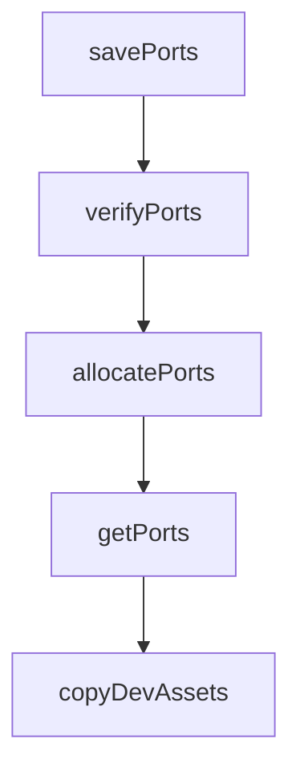

# Chapter 2: Orchestration Architecture

Welcome to **Chapter 2: Orchestration Architecture**. In this part of **Vibe Kanban Tutorial: Multi-Agent Orchestration Board for Coding Workflows**, you will build an intuitive mental model first, then move into concrete implementation details and practical production tradeoffs.


This chapter explains the core architecture that turns Vibe Kanban into a multi-agent command center.

## Learning Goals

- understand board-driven orchestration flow
- map task state to agent execution lifecycle
- reason about switching and sequencing agent runs
- align architecture with review workflow design

## Core System Model

| Layer | Responsibility |
|:------|:---------------|
| board/task layer | task planning, status tracking, ownership visibility |
| orchestration layer | start/stop/switch coding agents and workflows |
| review layer | quick validation, dev-server checks, handoff control |
| config layer | centralize MCP and runtime settings |

## Why This Matters

Vibe Kanban helps teams avoid context fragmentation by keeping planning, execution, and review in one loop.

## Source References

- [Vibe Kanban README: Overview](https://github.com/BloopAI/vibe-kanban/blob/main/README.md#overview)
- [Vibe Kanban Docs](https://vibekanban.com/docs)

## Summary

You now understand how Vibe Kanban coordinates planning and execution across many coding agents.

Next: [Chapter 3: Multi-Agent Execution Strategies](03-multi-agent-execution-strategies.md)

## Depth Expansion Playbook

## Source Code Walkthrough

### `scripts/setup-dev-environment.js`

The `savePorts` function in [`scripts/setup-dev-environment.js`](https://github.com/BloopAI/vibe-kanban/blob/HEAD/scripts/setup-dev-environment.js) handles a key part of this chapter's functionality:

```js
 * Save ports to file
 */
function savePorts(ports) {
  try {
    fs.writeFileSync(PORTS_FILE, JSON.stringify(ports, null, 2));
  } catch (error) {
    console.error("Failed to save ports:", error.message);
    throw error;
  }
}

/**
 * Verify that saved ports are still available
 */
async function verifyPorts(ports) {
  const frontendAvailable = await isPortAvailable(ports.frontend);
  const backendAvailable = await isPortAvailable(ports.backend);
  const previewProxyAvailable = await isPortAvailable(ports.preview_proxy);

  if (process.argv[2] === "get" && (!frontendAvailable || !backendAvailable || !previewProxyAvailable)) {
    console.log(
      `Port availability check failed: frontend:${ports.frontend}=${frontendAvailable}, backend:${ports.backend}=${backendAvailable}, preview_proxy:${ports.preview_proxy}=${previewProxyAvailable}`
    );
  }

  return frontendAvailable && backendAvailable && previewProxyAvailable;
}

/**
 * Allocate ports for development
 */
async function allocatePorts() {
```

This function is important because it defines how Vibe Kanban Tutorial: Multi-Agent Orchestration Board for Coding Workflows implements the patterns covered in this chapter.

### `scripts/setup-dev-environment.js`

The `verifyPorts` function in [`scripts/setup-dev-environment.js`](https://github.com/BloopAI/vibe-kanban/blob/HEAD/scripts/setup-dev-environment.js) handles a key part of this chapter's functionality:

```js
 * Verify that saved ports are still available
 */
async function verifyPorts(ports) {
  const frontendAvailable = await isPortAvailable(ports.frontend);
  const backendAvailable = await isPortAvailable(ports.backend);
  const previewProxyAvailable = await isPortAvailable(ports.preview_proxy);

  if (process.argv[2] === "get" && (!frontendAvailable || !backendAvailable || !previewProxyAvailable)) {
    console.log(
      `Port availability check failed: frontend:${ports.frontend}=${frontendAvailable}, backend:${ports.backend}=${backendAvailable}, preview_proxy:${ports.preview_proxy}=${previewProxyAvailable}`
    );
  }

  return frontendAvailable && backendAvailable && previewProxyAvailable;
}

/**
 * Allocate ports for development
 */
async function allocatePorts() {
  // If PORT env is set, use it for frontend and PORT+1 for backend
  if (process.env.PORT) {
    const frontendPort = parseInt(process.env.PORT, 10);
    const backendPort = frontendPort + 1;
    const previewProxyPort = backendPort + 1;

    const ports = {
      frontend: frontendPort,
      backend: backendPort,
      preview_proxy: previewProxyPort,
      timestamp: new Date().toISOString(),
    };
```

This function is important because it defines how Vibe Kanban Tutorial: Multi-Agent Orchestration Board for Coding Workflows implements the patterns covered in this chapter.

### `scripts/setup-dev-environment.js`

The `allocatePorts` function in [`scripts/setup-dev-environment.js`](https://github.com/BloopAI/vibe-kanban/blob/HEAD/scripts/setup-dev-environment.js) handles a key part of this chapter's functionality:

```js
 * Allocate ports for development
 */
async function allocatePorts() {
  // If PORT env is set, use it for frontend and PORT+1 for backend
  if (process.env.PORT) {
    const frontendPort = parseInt(process.env.PORT, 10);
    const backendPort = frontendPort + 1;
    const previewProxyPort = backendPort + 1;

    const ports = {
      frontend: frontendPort,
      backend: backendPort,
      preview_proxy: previewProxyPort,
      timestamp: new Date().toISOString(),
    };

    if (process.argv[2] === "get") {
      console.log("Using PORT environment variable:");
      console.log(`Frontend: ${ports.frontend}`);
      console.log(`Backend: ${ports.backend}`);
      console.log(`Preview Proxy: ${ports.preview_proxy}`);
    }

    return ports;
  }

  // Try to load existing ports first
  const existingPorts = loadPorts();

  if (existingPorts) {
    // Verify existing ports are still available
    if (await verifyPorts(existingPorts)) {
```

This function is important because it defines how Vibe Kanban Tutorial: Multi-Agent Orchestration Board for Coding Workflows implements the patterns covered in this chapter.

### `scripts/setup-dev-environment.js`

The `getPorts` function in [`scripts/setup-dev-environment.js`](https://github.com/BloopAI/vibe-kanban/blob/HEAD/scripts/setup-dev-environment.js) handles a key part of this chapter's functionality:

```js
 * Get ports (allocate if needed)
 */
async function getPorts() {
  const ports = await allocatePorts();
  copyDevAssets();
  return ports;
}

/**
 * Copy dev_assets_seed to dev_assets
 */
function copyDevAssets() {
  try {
    if (!fs.existsSync(DEV_ASSETS)) {
      // Copy dev_assets_seed to dev_assets
      fs.cpSync(DEV_ASSETS_SEED, DEV_ASSETS, { recursive: true });

      if (process.argv[2] === "get") {
        console.log("Copied dev_assets_seed to dev_assets");
      }
    }
  } catch (error) {
    console.error("Failed to copy dev assets:", error.message);
  }
}

/**
 * Clear saved ports
 */
function clearPorts() {
  try {
    if (fs.existsSync(PORTS_FILE)) {
```

This function is important because it defines how Vibe Kanban Tutorial: Multi-Agent Orchestration Board for Coding Workflows implements the patterns covered in this chapter.


## How These Components Connect


