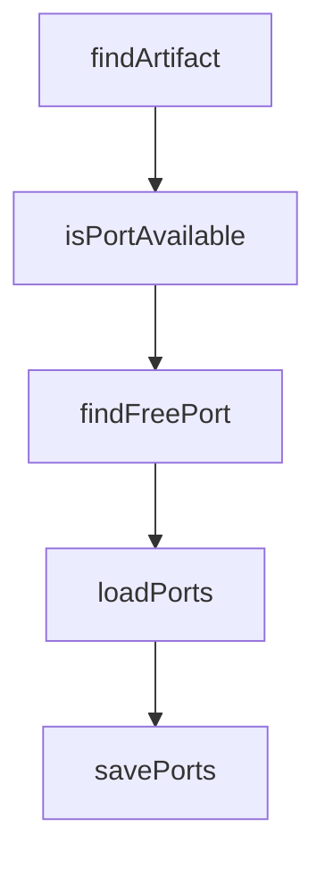

# Chapter 3: Multi-Agent Execution Strategies

Welcome to **Chapter 3: Multi-Agent Execution Strategies**. In this part of **Vibe Kanban Tutorial: Multi-Agent Orchestration Board for Coding Workflows**, you will build an intuitive mental model first, then move into concrete implementation details and practical production tradeoffs.


This chapter focuses on execution patterns that maximize throughput while protecting quality.

## Learning Goals

- choose between parallel and sequential execution modes
- assign tasks by risk and dependency profile
- reduce collisions across agent workstreams
- prevent low-value churn in large agent batches

## Strategy Matrix

| Strategy | Best For | Risk |
|:---------|:---------|:-----|
| parallel tasks | independent tickets and broad exploration | review overhead if poorly scoped |
| sequential pipeline | dependent tasks and staged refactors | slower throughput |
| hybrid mode | mixed backlogs with shared constraints | requires stronger orchestration discipline |

## Practical Rules

1. parallelize only tasks with clear dependency boundaries
2. run critical architectural tasks sequentially with checkpoints
3. reserve human review gates for destructive or high-impact changes

## Source References

- [Vibe Kanban README: parallel/sequential orchestration](https://github.com/BloopAI/vibe-kanban/blob/main/README.md#overview)
- [Vibe Kanban Docs](https://vibekanban.com/docs)

## Summary

You now can structure multi-agent execution for both speed and reliability.

Next: [Chapter 4: MCP and Configuration Control](04-mcp-and-configuration-control.md)

## Source Code Walkthrough

### `scripts/generate-tauri-update-json.js`

The `findArtifact` function in [`scripts/generate-tauri-update-json.js`](https://github.com/BloopAI/vibe-kanban/blob/HEAD/scripts/generate-tauri-update-json.js) handles a key part of this chapter's functionality:

```js
}

function findArtifact(dir) {
  if (!fs.existsSync(dir)) return null;

  const files = fs.readdirSync(dir);
  // Look for .sig files to find the updater artifacts
  const sigFiles = files.filter(f => f.endsWith('.sig'));

  if (sigFiles.length === 0) return null;

  // Prefer .tar.gz (macOS/Linux) over .exe (Windows)
  // Tauri generates: .app.tar.gz + .sig on macOS, .AppImage.tar.gz + .sig on Linux, .exe + .sig on Windows
  const sigFile = sigFiles[0];
  const artifactFile = sigFile.replace(/\.sig$/, '');

  if (!files.includes(artifactFile)) {
    console.error(`Warning: Found ${sigFile} but missing ${artifactFile} in ${dir}`);
    return null;
  }

  return {
    file: artifactFile,
    signature: fs.readFileSync(path.join(dir, sigFile), 'utf-8').trim(),
  };
}

const args = parseArgs();
const version = args.version;
const notes = args.notes || '';
const artifactsDir = args['artifacts-dir'];
const downloadBase = args['download-base'];
```

This function is important because it defines how Vibe Kanban Tutorial: Multi-Agent Orchestration Board for Coding Workflows implements the patterns covered in this chapter.

### `scripts/setup-dev-environment.js`

The `isPortAvailable` function in [`scripts/setup-dev-environment.js`](https://github.com/BloopAI/vibe-kanban/blob/HEAD/scripts/setup-dev-environment.js) handles a key part of this chapter's functionality:

```js
 * Check if a port is available
 */
function isPortAvailable(port) {
  return new Promise((resolve) => {
    const sock = net.createConnection({ port, host: "localhost" });
    sock.on("connect", () => {
      sock.destroy();
      resolve(false);
    });
    sock.on("error", () => resolve(true));
  });
}

/**
 * Find a free port starting from a given port
 */
async function findFreePort(startPort = 3000) {
  let port = startPort;
  while (!(await isPortAvailable(port))) {
    port++;
    if (port > 65535) {
      throw new Error("No available ports found");
    }
  }
  return port;
}

/**
 * Load existing ports from file
 */
function loadPorts() {
  try {
```

This function is important because it defines how Vibe Kanban Tutorial: Multi-Agent Orchestration Board for Coding Workflows implements the patterns covered in this chapter.

### `scripts/setup-dev-environment.js`

The `findFreePort` function in [`scripts/setup-dev-environment.js`](https://github.com/BloopAI/vibe-kanban/blob/HEAD/scripts/setup-dev-environment.js) handles a key part of this chapter's functionality:

```js
 * Find a free port starting from a given port
 */
async function findFreePort(startPort = 3000) {
  let port = startPort;
  while (!(await isPortAvailable(port))) {
    port++;
    if (port > 65535) {
      throw new Error("No available ports found");
    }
  }
  return port;
}

/**
 * Load existing ports from file
 */
function loadPorts() {
  try {
    if (fs.existsSync(PORTS_FILE)) {
      const data = fs.readFileSync(PORTS_FILE, "utf8");
      return JSON.parse(data);
    }
  } catch (error) {
    console.warn("Failed to load existing ports:", error.message);
  }
  return null;
}

/**
 * Save ports to file
 */
function savePorts(ports) {
```

This function is important because it defines how Vibe Kanban Tutorial: Multi-Agent Orchestration Board for Coding Workflows implements the patterns covered in this chapter.

### `scripts/setup-dev-environment.js`

The `loadPorts` function in [`scripts/setup-dev-environment.js`](https://github.com/BloopAI/vibe-kanban/blob/HEAD/scripts/setup-dev-environment.js) handles a key part of this chapter's functionality:

```js
 * Load existing ports from file
 */
function loadPorts() {
  try {
    if (fs.existsSync(PORTS_FILE)) {
      const data = fs.readFileSync(PORTS_FILE, "utf8");
      return JSON.parse(data);
    }
  } catch (error) {
    console.warn("Failed to load existing ports:", error.message);
  }
  return null;
}

/**
 * Save ports to file
 */
function savePorts(ports) {
  try {
    fs.writeFileSync(PORTS_FILE, JSON.stringify(ports, null, 2));
  } catch (error) {
    console.error("Failed to save ports:", error.message);
    throw error;
  }
}

/**
 * Verify that saved ports are still available
 */
async function verifyPorts(ports) {
  const frontendAvailable = await isPortAvailable(ports.frontend);
  const backendAvailable = await isPortAvailable(ports.backend);
```

This function is important because it defines how Vibe Kanban Tutorial: Multi-Agent Orchestration Board for Coding Workflows implements the patterns covered in this chapter.


## How These Components Connect


