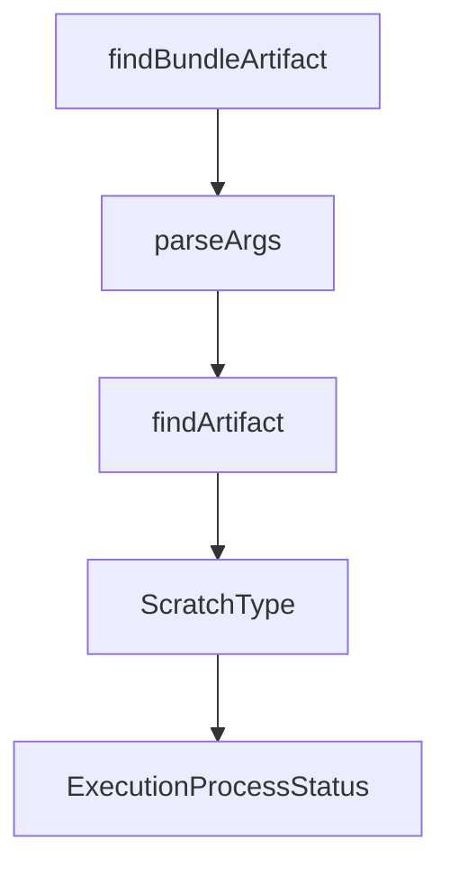

# Chapter 3: Multi-Agent Execution Strategies

Welcome to **Chapter 3: Multi-Agent Execution Strategies**. In this part of **Vibe Kanban Tutorial: Multi-Agent Orchestration Board for Coding Workflows**, you will build an intuitive mental model first, then move into concrete implementation details and practical production tradeoffs.


This chapter focuses on execution patterns that maximize throughput while protecting quality.

## Learning Goals

- choose between parallel and sequential execution modes
- assign tasks by risk and dependency profile
- reduce collisions across agent workstreams
- prevent low-value churn in large agent batches

## Strategy Matrix

| Strategy | Best For | Risk |
|:---------|:---------|:-----|
| parallel tasks | independent tickets and broad exploration | review overhead if poorly scoped |
| sequential pipeline | dependent tasks and staged refactors | slower throughput |
| hybrid mode | mixed backlogs with shared constraints | requires stronger orchestration discipline |

## Practical Rules

1. parallelize only tasks with clear dependency boundaries
2. run critical architectural tasks sequentially with checkpoints
3. reserve human review gates for destructive or high-impact changes

## Source References

- [Vibe Kanban README: parallel/sequential orchestration](https://github.com/BloopAI/vibe-kanban/blob/main/README.md#overview)
- [Vibe Kanban Docs](https://vibekanban.com/docs)

## Summary

You now can structure multi-agent execution for both speed and reliability.

Next: [Chapter 4: MCP and Configuration Control](04-mcp-and-configuration-control.md)

## Depth Expansion Playbook

## Source Code Walkthrough

### `scripts/generate-desktop-manifest.js`

The `findBundleArtifact` function in [`scripts/generate-desktop-manifest.js`](https://github.com/BloopAI/vibe-kanban/blob/HEAD/scripts/generate-desktop-manifest.js) handles a key part of this chapter's functionality:

```js

// Find the main bundle artifact for a platform (skip .sig and installer-only files)
function findBundleArtifact(dir) {
  if (!fs.existsSync(dir)) return null;

  const files = fs.readdirSync(dir);

  // Look for updater artifacts in priority order
  // macOS: .app.tar.gz, Linux: .AppImage.tar.gz, Windows: *-setup.exe
  const tarGz = files.find(
    (f) =>
      (f.endsWith('.app.tar.gz') || f.endsWith('.AppImage.tar.gz')) &&
      !f.endsWith('.sig')
  );
  if (tarGz) {
    const type = tarGz.endsWith('.app.tar.gz')
      ? 'app-tar-gz'
      : 'appimage-tar-gz';
    return { file: tarGz, type };
  }

  // Windows NSIS installer
  const nsis = files.find(
    (f) => f.endsWith('-setup.exe') && !f.endsWith('.sig')
  );
  if (nsis) {
    return { file: nsis, type: 'nsis-exe' };
  }

  return null;
}

```

This function is important because it defines how Vibe Kanban Tutorial: Multi-Agent Orchestration Board for Coding Workflows implements the patterns covered in this chapter.

### `scripts/generate-tauri-update-json.js`

The `parseArgs` function in [`scripts/generate-tauri-update-json.js`](https://github.com/BloopAI/vibe-kanban/blob/HEAD/scripts/generate-tauri-update-json.js) handles a key part of this chapter's functionality:

```js
const path = require('path');

function parseArgs() {
  const args = process.argv.slice(2);
  const parsed = {};
  for (let i = 0; i < args.length; i += 2) {
    const key = args[i].replace(/^--/, '');
    parsed[key] = args[i + 1];
  }
  return parsed;
}

function findArtifact(dir) {
  if (!fs.existsSync(dir)) return null;

  const files = fs.readdirSync(dir);
  // Look for .sig files to find the updater artifacts
  const sigFiles = files.filter(f => f.endsWith('.sig'));

  if (sigFiles.length === 0) return null;

  // Prefer .tar.gz (macOS/Linux) over .exe (Windows)
  // Tauri generates: .app.tar.gz + .sig on macOS, .AppImage.tar.gz + .sig on Linux, .exe + .sig on Windows
  const sigFile = sigFiles[0];
  const artifactFile = sigFile.replace(/\.sig$/, '');

  if (!files.includes(artifactFile)) {
    console.error(`Warning: Found ${sigFile} but missing ${artifactFile} in ${dir}`);
    return null;
  }

  return {
```

This function is important because it defines how Vibe Kanban Tutorial: Multi-Agent Orchestration Board for Coding Workflows implements the patterns covered in this chapter.

### `scripts/generate-tauri-update-json.js`

The `findArtifact` function in [`scripts/generate-tauri-update-json.js`](https://github.com/BloopAI/vibe-kanban/blob/HEAD/scripts/generate-tauri-update-json.js) handles a key part of this chapter's functionality:

```js
}

function findArtifact(dir) {
  if (!fs.existsSync(dir)) return null;

  const files = fs.readdirSync(dir);
  // Look for .sig files to find the updater artifacts
  const sigFiles = files.filter(f => f.endsWith('.sig'));

  if (sigFiles.length === 0) return null;

  // Prefer .tar.gz (macOS/Linux) over .exe (Windows)
  // Tauri generates: .app.tar.gz + .sig on macOS, .AppImage.tar.gz + .sig on Linux, .exe + .sig on Windows
  const sigFile = sigFiles[0];
  const artifactFile = sigFile.replace(/\.sig$/, '');

  if (!files.includes(artifactFile)) {
    console.error(`Warning: Found ${sigFile} but missing ${artifactFile} in ${dir}`);
    return null;
  }

  return {
    file: artifactFile,
    signature: fs.readFileSync(path.join(dir, sigFile), 'utf-8').trim(),
  };
}

const args = parseArgs();
const version = args.version;
const notes = args.notes || '';
const artifactsDir = args['artifacts-dir'];
const downloadBase = args['download-base'];
```

This function is important because it defines how Vibe Kanban Tutorial: Multi-Agent Orchestration Board for Coding Workflows implements the patterns covered in this chapter.

### `shared/types.ts`

The `ScratchType` interface in [`shared/types.ts`](https://github.com/BloopAI/vibe-kanban/blob/HEAD/shared/types.ts) handles a key part of this chapter's functionality:

```ts
export type ScratchPayload = { "type": "DRAFT_TASK", "data": string } | { "type": "DRAFT_FOLLOW_UP", "data": DraftFollowUpData } | { "type": "DRAFT_WORKSPACE", "data": DraftWorkspaceData } | { "type": "DRAFT_ISSUE", "data": DraftIssueData } | { "type": "PREVIEW_SETTINGS", "data": PreviewSettingsData } | { "type": "WORKSPACE_NOTES", "data": WorkspaceNotesData } | { "type": "UI_PREFERENCES", "data": UiPreferencesData } | { "type": "PROJECT_REPO_DEFAULTS", "data": ProjectRepoDefaultsData };

export enum ScratchType { DRAFT_TASK = "DRAFT_TASK", DRAFT_FOLLOW_UP = "DRAFT_FOLLOW_UP", DRAFT_WORKSPACE = "DRAFT_WORKSPACE", DRAFT_ISSUE = "DRAFT_ISSUE", PREVIEW_SETTINGS = "PREVIEW_SETTINGS", WORKSPACE_NOTES = "WORKSPACE_NOTES", UI_PREFERENCES = "UI_PREFERENCES", PROJECT_REPO_DEFAULTS = "PROJECT_REPO_DEFAULTS" }

export type Scratch = { id: string, payload: ScratchPayload, created_at: string, updated_at: string, };

export type CreateScratch = { payload: ScratchPayload, };

export type UpdateScratch = { payload: ScratchPayload, };

export type Workspace = { id: string, task_id: string | null, container_ref: string | null, branch: string, setup_completed_at: string | null, created_at: string, updated_at: string, archived: boolean, pinned: boolean, name: string | null, worktree_deleted: boolean, };

export type WorkspaceWithStatus = { is_running: boolean, is_errored: boolean, id: string, task_id: string | null, container_ref: string | null, branch: string, setup_completed_at: string | null, created_at: string, updated_at: string, archived: boolean, pinned: boolean, name: string | null, worktree_deleted: boolean, };

export type Session = { id: string, workspace_id: string, name: string | null, executor: string | null, agent_working_dir: string | null, created_at: string, updated_at: string, };

export type ExecutionProcess = { id: string, session_id: string, run_reason: ExecutionProcessRunReason, executor_action: ExecutorAction, status: ExecutionProcessStatus, exit_code: bigint | null, 
/**
 * dropped: true if this process is excluded from the current
 * history view (due to restore/trimming). Hidden from logs/timeline;
 * still listed in the Processes tab.
 */
dropped: boolean, started_at: string, completed_at: string | null, created_at: string, updated_at: string, };

export enum ExecutionProcessStatus { running = "running", completed = "completed", failed = "failed", killed = "killed" }

export type ExecutionProcessRunReason = "setupscript" | "cleanupscript" | "archivescript" | "codingagent" | "devserver";

export type ExecutionProcessRepoState = { id: string, execution_process_id: string, repo_id: string, before_head_commit: string | null, after_head_commit: string | null, merge_commit: string | null, created_at: Date, updated_at: Date, };

export type Merge = { "type": "direct" } & DirectMerge | { "type": "pr" } & PrMerge;

```

This interface is important because it defines how Vibe Kanban Tutorial: Multi-Agent Orchestration Board for Coding Workflows implements the patterns covered in this chapter.


## How These Components Connect


