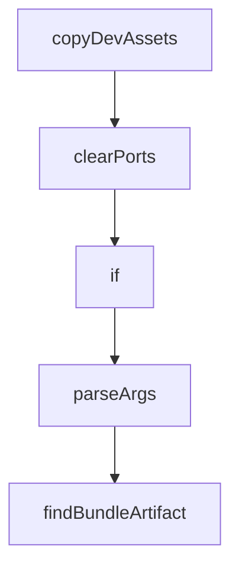

# Chapter 4: MCP and Configuration Control

Welcome to **Chapter 4: MCP and Configuration Control**. In this part of **Vibe Kanban Tutorial: Multi-Agent Orchestration Board for Coding Workflows**, you will build an intuitive mental model first, then move into concrete implementation details and practical production tradeoffs.


This chapter covers how Vibe Kanban centralizes MCP and runtime configuration to reduce agent drift.

## Learning Goals

- manage coding-agent MCP settings from one control surface
- apply host/port/origin settings safely for local and hosted deployments
- troubleshoot common configuration mismatches
- enforce stable team defaults

## Key Config Domains

| Domain | Example Variables |
|:-------|:------------------|
| network/runtime | `HOST`, `PORT`, `BACKEND_PORT`, `FRONTEND_PORT` |
| MCP connectivity | `MCP_HOST`, `MCP_PORT` |
| hosted deployment | `VK_ALLOWED_ORIGINS` |
| operational toggles | `DISABLE_WORKTREE_CLEANUP` |

## Control Practices

- treat configuration as versioned infrastructure
- separate dev defaults from production settings
- validate MCP and origin rules before broad rollout

## Source References

- [Vibe Kanban README: Environment Variables](https://github.com/BloopAI/vibe-kanban/blob/main/README.md#environment-variables)
- [Vibe Kanban Docs: configuration](https://vibekanban.com/docs/configuration-customisation)

## Summary

You now have a practical model for MCP/runtime configuration governance in Vibe Kanban.

Next: [Chapter 5: Review and Quality Gates](05-review-and-quality-gates.md)

## Source Code Walkthrough

### `scripts/setup-dev-environment.js`

The `copyDevAssets` function in [`scripts/setup-dev-environment.js`](https://github.com/BloopAI/vibe-kanban/blob/HEAD/scripts/setup-dev-environment.js) handles a key part of this chapter's functionality:

```js
async function getPorts() {
  const ports = await allocatePorts();
  copyDevAssets();
  return ports;
}

/**
 * Copy dev_assets_seed to dev_assets
 */
function copyDevAssets() {
  try {
    if (!fs.existsSync(DEV_ASSETS)) {
      // Copy dev_assets_seed to dev_assets
      fs.cpSync(DEV_ASSETS_SEED, DEV_ASSETS, { recursive: true });

      if (process.argv[2] === "get") {
        console.log("Copied dev_assets_seed to dev_assets");
      }
    }
  } catch (error) {
    console.error("Failed to copy dev assets:", error.message);
  }
}

/**
 * Clear saved ports
 */
function clearPorts() {
  try {
    if (fs.existsSync(PORTS_FILE)) {
      fs.unlinkSync(PORTS_FILE);
      console.log("Cleared saved dev ports");
```

This function is important because it defines how Vibe Kanban Tutorial: Multi-Agent Orchestration Board for Coding Workflows implements the patterns covered in this chapter.

### `scripts/setup-dev-environment.js`

The `clearPorts` function in [`scripts/setup-dev-environment.js`](https://github.com/BloopAI/vibe-kanban/blob/HEAD/scripts/setup-dev-environment.js) handles a key part of this chapter's functionality:

```js
 * Clear saved ports
 */
function clearPorts() {
  try {
    if (fs.existsSync(PORTS_FILE)) {
      fs.unlinkSync(PORTS_FILE);
      console.log("Cleared saved dev ports");
    } else {
      console.log("No saved ports to clear");
    }
  } catch (error) {
    console.error("Failed to clear ports:", error.message);
  }
}

// CLI interface
if (require.main === module) {
  const command = process.argv[2];

  switch (command) {
    case "get":
      getPorts()
        .then((ports) => {
          console.log(JSON.stringify(ports));
        })
        .catch(console.error);
      break;

    case "clear":
      clearPorts();
      break;

```

This function is important because it defines how Vibe Kanban Tutorial: Multi-Agent Orchestration Board for Coding Workflows implements the patterns covered in this chapter.

### `scripts/setup-dev-environment.js`

The `if` interface in [`scripts/setup-dev-environment.js`](https://github.com/BloopAI/vibe-kanban/blob/HEAD/scripts/setup-dev-environment.js) handles a key part of this chapter's functionality:

```js

/**
 * Check if a port is available
 */
function isPortAvailable(port) {
  return new Promise((resolve) => {
    const sock = net.createConnection({ port, host: "localhost" });
    sock.on("connect", () => {
      sock.destroy();
      resolve(false);
    });
    sock.on("error", () => resolve(true));
  });
}

/**
 * Find a free port starting from a given port
 */
async function findFreePort(startPort = 3000) {
  let port = startPort;
  while (!(await isPortAvailable(port))) {
    port++;
    if (port > 65535) {
      throw new Error("No available ports found");
    }
  }
  return port;
}

/**
 * Load existing ports from file
 */
```

This interface is important because it defines how Vibe Kanban Tutorial: Multi-Agent Orchestration Board for Coding Workflows implements the patterns covered in this chapter.

### `scripts/generate-desktop-manifest.js`

The `parseArgs` function in [`scripts/generate-desktop-manifest.js`](https://github.com/BloopAI/vibe-kanban/blob/HEAD/scripts/generate-desktop-manifest.js) handles a key part of this chapter's functionality:

```js
const crypto = require('crypto');

function parseArgs() {
  const args = process.argv.slice(2);
  const parsed = {};
  for (let i = 0; i < args.length; i += 2) {
    const key = args[i].replace(/^--/, '');
    parsed[key] = args[i + 1];
  }
  return parsed;
}

// Find the main bundle artifact for a platform (skip .sig and installer-only files)
function findBundleArtifact(dir) {
  if (!fs.existsSync(dir)) return null;

  const files = fs.readdirSync(dir);

  // Look for updater artifacts in priority order
  // macOS: .app.tar.gz, Linux: .AppImage.tar.gz, Windows: *-setup.exe
  const tarGz = files.find(
    (f) =>
      (f.endsWith('.app.tar.gz') || f.endsWith('.AppImage.tar.gz')) &&
      !f.endsWith('.sig')
  );
  if (tarGz) {
    const type = tarGz.endsWith('.app.tar.gz')
      ? 'app-tar-gz'
      : 'appimage-tar-gz';
    return { file: tarGz, type };
  }

```

This function is important because it defines how Vibe Kanban Tutorial: Multi-Agent Orchestration Board for Coding Workflows implements the patterns covered in this chapter.


## How These Components Connect


