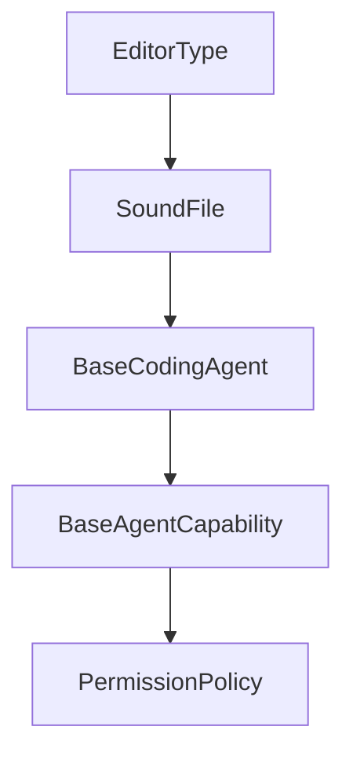

# Chapter 4: MCP and Configuration Control

Welcome to **Chapter 4: MCP and Configuration Control**. In this part of **Vibe Kanban Tutorial: Multi-Agent Orchestration Board for Coding Workflows**, you will build an intuitive mental model first, then move into concrete implementation details and practical production tradeoffs.


This chapter covers how Vibe Kanban centralizes MCP and runtime configuration to reduce agent drift.

## Learning Goals

- manage coding-agent MCP settings from one control surface
- apply host/port/origin settings safely for local and hosted deployments
- troubleshoot common configuration mismatches
- enforce stable team defaults

## Key Config Domains

| Domain | Example Variables |
|:-------|:------------------|
| network/runtime | `HOST`, `PORT`, `BACKEND_PORT`, `FRONTEND_PORT` |
| MCP connectivity | `MCP_HOST`, `MCP_PORT` |
| hosted deployment | `VK_ALLOWED_ORIGINS` |
| operational toggles | `DISABLE_WORKTREE_CLEANUP` |

## Control Practices

- treat configuration as versioned infrastructure
- separate dev defaults from production settings
- validate MCP and origin rules before broad rollout

## Source References

- [Vibe Kanban README: Environment Variables](https://github.com/BloopAI/vibe-kanban/blob/main/README.md#environment-variables)
- [Vibe Kanban Docs: configuration](https://vibekanban.com/docs/configuration-customisation)

## Summary

You now have a practical model for MCP/runtime configuration governance in Vibe Kanban.

Next: [Chapter 5: Review and Quality Gates](05-review-and-quality-gates.md)

## Depth Expansion Playbook

## Source Code Walkthrough

### `shared/types.ts`

The `EditorType` interface in [`shared/types.ts`](https://github.com/BloopAI/vibe-kanban/blob/HEAD/shared/types.ts) handles a key part of this chapter's functionality:

```ts
export type GetMcpServerResponse = { mcp_config: McpConfig, config_path: string, };

export type CheckEditorAvailabilityQuery = { editor_type: EditorType, };

export type CheckEditorAvailabilityResponse = { available: boolean, };

export type CheckAgentAvailabilityQuery = { executor: BaseCodingAgent, };

export type AgentPresetOptionsQuery = { executor: BaseCodingAgent, variant: string | null, };

export type CurrentUserResponse = { user_id: string, };

export type StartSpake2EnrollmentRequest = { enrollment_code: string, client_message_b64: string, };

export type FinishSpake2EnrollmentRequest = { enrollment_id: string, client_id: string, client_name: string, client_browser: string, client_os: string, client_device: string, public_key_b64: string, client_proof_b64: string, };

export type StartSpake2EnrollmentResponse = { enrollment_id: string, server_message_b64: string, };

export type FinishSpake2EnrollmentResponse = { signing_session_id: string, server_public_key_b64: string, server_proof_b64: string, };

export type RelayPairedClient = { client_id: string, client_name: string, client_browser: string, client_os: string, client_device: string, };

export type ListRelayPairedClientsResponse = { clients: Array<RelayPairedClient>, };

export type RemoveRelayPairedClientResponse = { removed: boolean, };

export type RefreshRelaySigningSessionRequest = { client_id: string, timestamp: bigint, nonce: string, signature_b64: string, };

export type RefreshRelaySigningSessionResponse = { signing_session_id: string, };

export type CreateFollowUpAttempt = { prompt: string, executor_config: ExecutorConfig, retry_process_id: string | null, force_when_dirty: boolean | null, perform_git_reset: boolean | null, };

```

This interface is important because it defines how Vibe Kanban Tutorial: Multi-Agent Orchestration Board for Coding Workflows implements the patterns covered in this chapter.

### `shared/types.ts`

The `SoundFile` interface in [`shared/types.ts`](https://github.com/BloopAI/vibe-kanban/blob/HEAD/shared/types.ts) handles a key part of this chapter's functionality:

```ts
export type Config = { config_version: string, theme: ThemeMode, executor_profile: ExecutorProfileId, disclaimer_acknowledged: boolean, onboarding_acknowledged: boolean, remote_onboarding_acknowledged: boolean, notifications: NotificationConfig, editor: EditorConfig, github: GitHubConfig, analytics_enabled: boolean, workspace_dir: string | null, last_app_version: string | null, show_release_notes: boolean, language: UiLanguage, git_branch_prefix: string, showcases: ShowcaseState, pr_auto_description_enabled: boolean, pr_auto_description_prompt: string | null, commit_reminder_enabled: boolean, commit_reminder_prompt: string | null, send_message_shortcut: SendMessageShortcut, relay_enabled: boolean, host_nickname: string | null, };

export type NotificationConfig = { sound_enabled: boolean, push_enabled: boolean, sound_file: SoundFile, };

export enum ThemeMode { LIGHT = "LIGHT", DARK = "DARK", SYSTEM = "SYSTEM" }

export type EditorConfig = { editor_type: EditorType, custom_command: string | null, remote_ssh_host: string | null, remote_ssh_user: string | null, auto_install_extension: boolean, };

export enum EditorType { VS_CODE = "VS_CODE", VS_CODE_INSIDERS = "VS_CODE_INSIDERS", CURSOR = "CURSOR", WINDSURF = "WINDSURF", INTELLI_J = "INTELLI_J", ZED = "ZED", XCODE = "XCODE", GOOGLE_ANTIGRAVITY = "GOOGLE_ANTIGRAVITY", CUSTOM = "CUSTOM" }

export type EditorOpenError = { "type": "executable_not_found", executable: string, editor_type: EditorType, } | { "type": "invalid_command", details: string, editor_type: EditorType, } | { "type": "launch_failed", executable: string, details: string, editor_type: EditorType, };

export type GitHubConfig = { pat: string | null, oauth_token: string | null, username: string | null, primary_email: string | null, default_pr_base: string | null, };

export enum SoundFile { ABSTRACT_SOUND1 = "ABSTRACT_SOUND1", ABSTRACT_SOUND2 = "ABSTRACT_SOUND2", ABSTRACT_SOUND3 = "ABSTRACT_SOUND3", ABSTRACT_SOUND4 = "ABSTRACT_SOUND4", COW_MOOING = "COW_MOOING", FAHHHHH = "FAHHHHH", PHONE_VIBRATION = "PHONE_VIBRATION", ROOSTER = "ROOSTER" }

export type UiLanguage = "BROWSER" | "EN" | "FR" | "JA" | "ES" | "KO" | "ZH_HANS" | "ZH_HANT";

export type ShowcaseState = { seen_features: Array<string>, };

export type SendMessageShortcut = "ModifierEnter" | "Enter";

export type GitBranch = { name: string, is_current: boolean, is_remote: boolean, last_commit_date: Date, };

export type QueuedMessage = { 
/**
 * The session this message is queued for
 */
session_id: string, 
/**
 * The follow-up data (message + variant)
 */
```

This interface is important because it defines how Vibe Kanban Tutorial: Multi-Agent Orchestration Board for Coding Workflows implements the patterns covered in this chapter.

### `shared/types.ts`

The `BaseCodingAgent` interface in [`shared/types.ts`](https://github.com/BloopAI/vibe-kanban/blob/HEAD/shared/types.ts) handles a key part of this chapter's functionality:

```ts
 * Capabilities supported per executor (e.g., { "CLAUDE_CODE": ["SESSION_FORK"] })
 */
capabilities: { [key in string]?: Array<BaseAgentCapability> }, shared_api_base: string | null, preview_proxy_port: number | null, executors: { [key in BaseCodingAgent]?: ExecutorProfile }, };

export type Environment = { os_type: string, os_version: string, os_architecture: string, bitness: string, };

export type McpServerQuery = { executor: BaseCodingAgent, };

export type UpdateMcpServersBody = { servers: { [key in string]?: JsonValue }, };

export type GetMcpServerResponse = { mcp_config: McpConfig, config_path: string, };

export type CheckEditorAvailabilityQuery = { editor_type: EditorType, };

export type CheckEditorAvailabilityResponse = { available: boolean, };

export type CheckAgentAvailabilityQuery = { executor: BaseCodingAgent, };

export type AgentPresetOptionsQuery = { executor: BaseCodingAgent, variant: string | null, };

export type CurrentUserResponse = { user_id: string, };

export type StartSpake2EnrollmentRequest = { enrollment_code: string, client_message_b64: string, };

export type FinishSpake2EnrollmentRequest = { enrollment_id: string, client_id: string, client_name: string, client_browser: string, client_os: string, client_device: string, public_key_b64: string, client_proof_b64: string, };

export type StartSpake2EnrollmentResponse = { enrollment_id: string, server_message_b64: string, };

export type FinishSpake2EnrollmentResponse = { signing_session_id: string, server_public_key_b64: string, server_proof_b64: string, };

export type RelayPairedClient = { client_id: string, client_name: string, client_browser: string, client_os: string, client_device: string, };

```

This interface is important because it defines how Vibe Kanban Tutorial: Multi-Agent Orchestration Board for Coding Workflows implements the patterns covered in this chapter.

### `shared/types.ts`

The `BaseAgentCapability` interface in [`shared/types.ts`](https://github.com/BloopAI/vibe-kanban/blob/HEAD/shared/types.ts) handles a key part of this chapter's functionality:

```ts
 * Capabilities supported per executor (e.g., { "CLAUDE_CODE": ["SESSION_FORK"] })
 */
capabilities: { [key in string]?: Array<BaseAgentCapability> }, shared_api_base: string | null, preview_proxy_port: number | null, executors: { [key in BaseCodingAgent]?: ExecutorProfile }, };

export type Environment = { os_type: string, os_version: string, os_architecture: string, bitness: string, };

export type McpServerQuery = { executor: BaseCodingAgent, };

export type UpdateMcpServersBody = { servers: { [key in string]?: JsonValue }, };

export type GetMcpServerResponse = { mcp_config: McpConfig, config_path: string, };

export type CheckEditorAvailabilityQuery = { editor_type: EditorType, };

export type CheckEditorAvailabilityResponse = { available: boolean, };

export type CheckAgentAvailabilityQuery = { executor: BaseCodingAgent, };

export type AgentPresetOptionsQuery = { executor: BaseCodingAgent, variant: string | null, };

export type CurrentUserResponse = { user_id: string, };

export type StartSpake2EnrollmentRequest = { enrollment_code: string, client_message_b64: string, };

export type FinishSpake2EnrollmentRequest = { enrollment_id: string, client_id: string, client_name: string, client_browser: string, client_os: string, client_device: string, public_key_b64: string, client_proof_b64: string, };

export type StartSpake2EnrollmentResponse = { enrollment_id: string, server_message_b64: string, };

export type FinishSpake2EnrollmentResponse = { signing_session_id: string, server_public_key_b64: string, server_proof_b64: string, };

export type RelayPairedClient = { client_id: string, client_name: string, client_browser: string, client_os: string, client_device: string, };

```

This interface is important because it defines how Vibe Kanban Tutorial: Multi-Agent Orchestration Board for Coding Workflows implements the patterns covered in this chapter.


## How These Components Connect


