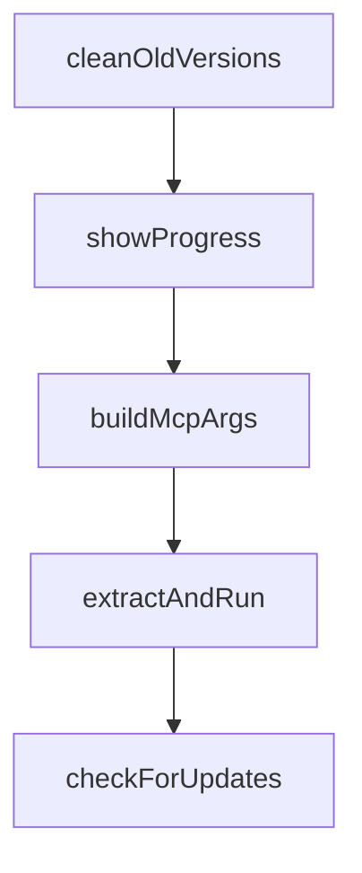

# Chapter 5: Review and Quality Gates

Welcome to **Chapter 5: Review and Quality Gates**. In this part of **Vibe Kanban Tutorial: Multi-Agent Orchestration Board for Coding Workflows**, you will build an intuitive mental model first, then move into concrete implementation details and practical production tradeoffs.


This chapter defines the human-in-the-loop controls that keep multi-agent output production-ready.

## Learning Goals

- run fast review loops across many agent tasks
- use dev-server checks during handoff
- standardize merge-readiness criteria
- reduce regressions in parallel agent workflows

## Suggested Gate Sequence

1. agent task completion signal on board
2. quick diff and intent review
3. run project validation checks
4. promote to merge-ready state

## Merge-Readiness Checklist

- scope matches original task request
- no hidden destructive changes
- tests/lint/build pass
- reviewer notes are captured for future prompts

## Source References

- [Vibe Kanban README: review and dev server workflow](https://github.com/BloopAI/vibe-kanban/blob/main/README.md#overview)
- [Vibe Kanban Discussions](https://github.com/BloopAI/vibe-kanban/discussions)

## Summary

You now have a high-throughput review model for multi-agent task output.

Next: [Chapter 6: Remote Access and Self-Hosting](06-remote-access-and-self-hosting.md)

## Source Code Walkthrough

### `npx-cli/src/cli.ts`

The `cleanOldVersions` function in [`npx-cli/src/cli.ts`](https://github.com/BloopAI/vibe-kanban/blob/HEAD/npx-cli/src/cli.ts) handles a key part of this chapter's functionality:

```ts

// Remove old version directories from the binary cache
function cleanOldVersions(): void {
  try {
    const entries = fs.readdirSync(CACHE_DIR, {
      withFileTypes: true,
    });
    for (const entry of entries) {
      if (entry.isDirectory() && entry.name !== BINARY_TAG) {
        const oldDir = path.join(CACHE_DIR, entry.name);
        fs.rmSync(oldDir, { recursive: true, force: true });
      }
    }
  } catch {
    // Ignore cleanup errors — not critical
  }
}

function showProgress(downloaded: number, total: number): void {
  const percent = total ? Math.round((downloaded / total) * 100) : 0;
  const mb = (downloaded / (1024 * 1024)).toFixed(1);
  const totalMb = total ? (total / (1024 * 1024)).toFixed(1) : "?";
  process.stderr.write(
    `\r   Downloading: ${mb}MB / ${totalMb}MB (${percent}%)`,
  );
}

function buildMcpArgs(args: string[]): string[] {
  return args.length > 0 ? args : ["--mode", "global"];
}

async function extractAndRun(
```

This function is important because it defines how Vibe Kanban Tutorial: Multi-Agent Orchestration Board for Coding Workflows implements the patterns covered in this chapter.

### `npx-cli/src/cli.ts`

The `showProgress` function in [`npx-cli/src/cli.ts`](https://github.com/BloopAI/vibe-kanban/blob/HEAD/npx-cli/src/cli.ts) handles a key part of this chapter's functionality:

```ts
}

function showProgress(downloaded: number, total: number): void {
  const percent = total ? Math.round((downloaded / total) * 100) : 0;
  const mb = (downloaded / (1024 * 1024)).toFixed(1);
  const totalMb = total ? (total / (1024 * 1024)).toFixed(1) : "?";
  process.stderr.write(
    `\r   Downloading: ${mb}MB / ${totalMb}MB (${percent}%)`,
  );
}

function buildMcpArgs(args: string[]): string[] {
  return args.length > 0 ? args : ["--mode", "global"];
}

async function extractAndRun(
  baseName: string,
  launch: (binPath: string) => void,
): Promise<void> {
  const binName = getBinaryName(baseName);
  const binPath = path.join(versionCacheDir, binName);
  const zipPath = path.join(versionCacheDir, `${baseName}.zip`);

  // Clean old binary if exists
  try {
    if (fs.existsSync(binPath)) {
      fs.unlinkSync(binPath);
    }
  } catch (err: unknown) {
    if (process.env.VIBE_KANBAN_DEBUG) {
      const msg = err instanceof Error ? err.message : String(err);
      console.warn(`Warning: Could not delete existing binary: ${msg}`);
```

This function is important because it defines how Vibe Kanban Tutorial: Multi-Agent Orchestration Board for Coding Workflows implements the patterns covered in this chapter.

### `npx-cli/src/cli.ts`

The `buildMcpArgs` function in [`npx-cli/src/cli.ts`](https://github.com/BloopAI/vibe-kanban/blob/HEAD/npx-cli/src/cli.ts) handles a key part of this chapter's functionality:

```ts
}

function buildMcpArgs(args: string[]): string[] {
  return args.length > 0 ? args : ["--mode", "global"];
}

async function extractAndRun(
  baseName: string,
  launch: (binPath: string) => void,
): Promise<void> {
  const binName = getBinaryName(baseName);
  const binPath = path.join(versionCacheDir, binName);
  const zipPath = path.join(versionCacheDir, `${baseName}.zip`);

  // Clean old binary if exists
  try {
    if (fs.existsSync(binPath)) {
      fs.unlinkSync(binPath);
    }
  } catch (err: unknown) {
    if (process.env.VIBE_KANBAN_DEBUG) {
      const msg = err instanceof Error ? err.message : String(err);
      console.warn(`Warning: Could not delete existing binary: ${msg}`);
    }
  }

  // Download if not cached
  if (!fs.existsSync(zipPath)) {
    console.error(`Downloading ${baseName}...`);
    try {
      await ensureBinary(platformDir, baseName, showProgress);
      console.error(""); // newline after progress
```

This function is important because it defines how Vibe Kanban Tutorial: Multi-Agent Orchestration Board for Coding Workflows implements the patterns covered in this chapter.

### `npx-cli/src/cli.ts`

The `extractAndRun` function in [`npx-cli/src/cli.ts`](https://github.com/BloopAI/vibe-kanban/blob/HEAD/npx-cli/src/cli.ts) handles a key part of this chapter's functionality:

```ts
}

async function extractAndRun(
  baseName: string,
  launch: (binPath: string) => void,
): Promise<void> {
  const binName = getBinaryName(baseName);
  const binPath = path.join(versionCacheDir, binName);
  const zipPath = path.join(versionCacheDir, `${baseName}.zip`);

  // Clean old binary if exists
  try {
    if (fs.existsSync(binPath)) {
      fs.unlinkSync(binPath);
    }
  } catch (err: unknown) {
    if (process.env.VIBE_KANBAN_DEBUG) {
      const msg = err instanceof Error ? err.message : String(err);
      console.warn(`Warning: Could not delete existing binary: ${msg}`);
    }
  }

  // Download if not cached
  if (!fs.existsSync(zipPath)) {
    console.error(`Downloading ${baseName}...`);
    try {
      await ensureBinary(platformDir, baseName, showProgress);
      console.error(""); // newline after progress
    } catch (err: unknown) {
      const msg = err instanceof Error ? err.message : String(err);
      console.error(`\nDownload failed: ${msg}`);
      process.exit(1);
```

This function is important because it defines how Vibe Kanban Tutorial: Multi-Agent Orchestration Board for Coding Workflows implements the patterns covered in this chapter.


## How These Components Connect


