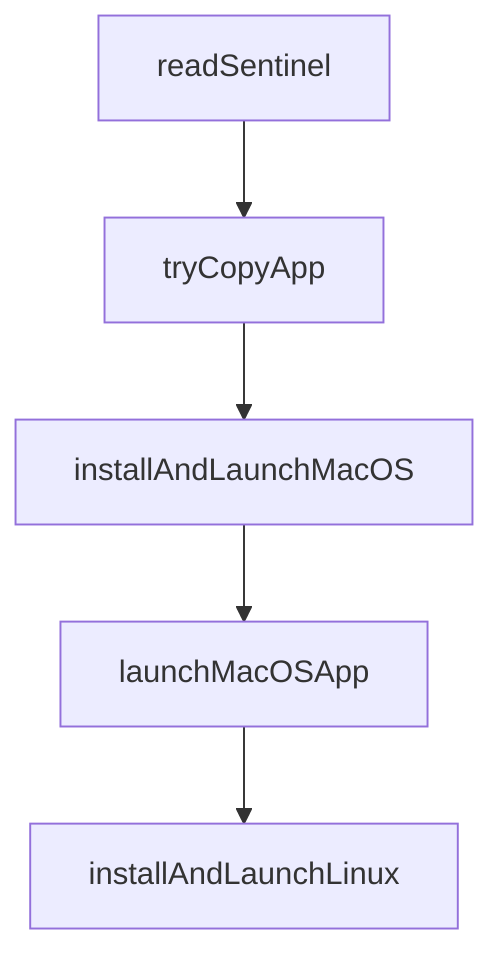

# Chapter 5: Review and Quality Gates

Welcome to **Chapter 5: Review and Quality Gates**. In this part of **Vibe Kanban Tutorial: Multi-Agent Orchestration Board for Coding Workflows**, you will build an intuitive mental model first, then move into concrete implementation details and practical production tradeoffs.


This chapter defines the human-in-the-loop controls that keep multi-agent output production-ready.

## Learning Goals

- run fast review loops across many agent tasks
- use dev-server checks during handoff
- standardize merge-readiness criteria
- reduce regressions in parallel agent workflows

## Suggested Gate Sequence

1. agent task completion signal on board
2. quick diff and intent review
3. run project validation checks
4. promote to merge-ready state

## Merge-Readiness Checklist

- scope matches original task request
- no hidden destructive changes
- tests/lint/build pass
- reviewer notes are captured for future prompts

## Source References

- [Vibe Kanban README: review and dev server workflow](https://github.com/BloopAI/vibe-kanban/blob/main/README.md#overview)
- [Vibe Kanban Discussions](https://github.com/BloopAI/vibe-kanban/discussions)

## Summary

You now have a high-throughput review model for multi-agent task output.

Next: [Chapter 6: Remote Access and Self-Hosting](06-remote-access-and-self-hosting.md)

## Depth Expansion Playbook

## Source Code Walkthrough

### `npx-cli/src/desktop.ts`

The `readSentinel` function in [`npx-cli/src/desktop.ts`](https://github.com/BloopAI/vibe-kanban/blob/HEAD/npx-cli/src/desktop.ts) handles a key part of this chapter's functionality:

```ts
}

function readSentinel(dir: string): SentinelMeta | null {
  const sentinelPath = path.join(dir, '.installed');
  if (!fs.existsSync(sentinelPath)) return null;
  try {
    return JSON.parse(
      fs.readFileSync(sentinelPath, 'utf-8')
    ) as SentinelMeta;
  } catch {
    return null;
  }
}

// Try to copy the .app to a destination directory, returning the final path on success
function tryCopyApp(
  srcAppPath: string,
  destDir: string
): string | null {
  try {
    const appName = path.basename(srcAppPath);
    const destAppPath = path.join(destDir, appName);

    // Ensure destination directory exists
    fs.mkdirSync(destDir, { recursive: true });

    // Remove existing app at destination if present
    if (fs.existsSync(destAppPath)) {
      fs.rmSync(destAppPath, { recursive: true, force: true });
    }

    // Use cp -R for macOS .app bundles (preserves symlinks and metadata)
```

This function is important because it defines how Vibe Kanban Tutorial: Multi-Agent Orchestration Board for Coding Workflows implements the patterns covered in this chapter.

### `npx-cli/src/desktop.ts`

The `tryCopyApp` function in [`npx-cli/src/desktop.ts`](https://github.com/BloopAI/vibe-kanban/blob/HEAD/npx-cli/src/desktop.ts) handles a key part of this chapter's functionality:

```ts

// Try to copy the .app to a destination directory, returning the final path on success
function tryCopyApp(
  srcAppPath: string,
  destDir: string
): string | null {
  try {
    const appName = path.basename(srcAppPath);
    const destAppPath = path.join(destDir, appName);

    // Ensure destination directory exists
    fs.mkdirSync(destDir, { recursive: true });

    // Remove existing app at destination if present
    if (fs.existsSync(destAppPath)) {
      fs.rmSync(destAppPath, { recursive: true, force: true });
    }

    // Use cp -R for macOS .app bundles (preserves symlinks and metadata)
    execSync(`cp -R "${srcAppPath}" "${destAppPath}"`, {
      stdio: 'pipe',
    });

    return destAppPath;
  } catch {
    return null;
  }
}

// macOS: extract .app.tar.gz, copy to /Applications, remove quarantine, launch with `open`
async function installAndLaunchMacOS(
  bundleInfo: DesktopBundleInfo
```

This function is important because it defines how Vibe Kanban Tutorial: Multi-Agent Orchestration Board for Coding Workflows implements the patterns covered in this chapter.

### `npx-cli/src/desktop.ts`

The `installAndLaunchMacOS` function in [`npx-cli/src/desktop.ts`](https://github.com/BloopAI/vibe-kanban/blob/HEAD/npx-cli/src/desktop.ts) handles a key part of this chapter's functionality:

```ts

// macOS: extract .app.tar.gz, copy to /Applications, remove quarantine, launch with `open`
async function installAndLaunchMacOS(
  bundleInfo: DesktopBundleInfo
): Promise<number> {
  const { archivePath, dir } = bundleInfo;

  const sentinel = readSentinel(dir);
  if (sentinel?.appPath && fs.existsSync(sentinel.appPath)) {
    return launchMacOSApp(sentinel.appPath);
  }

  if (!archivePath || !fs.existsSync(archivePath)) {
    throw new Error('No archive to extract for macOS desktop app');
  }

  extractTarGz(archivePath, dir);

  const appName = fs.readdirSync(dir).find((f) => f.endsWith('.app'));
  if (!appName) {
    throw new Error(
      `No .app bundle found in ${dir} after extraction`
    );
  }

  const extractedAppPath = path.join(dir, appName);

  // Try to install to /Applications, then ~/Applications, then fall back to cache dir
  const userApplications = path.join(os.homedir(), 'Applications');
  const finalAppPath =
    tryCopyApp(extractedAppPath, '/Applications') ??
    tryCopyApp(extractedAppPath, userApplications) ??
```

This function is important because it defines how Vibe Kanban Tutorial: Multi-Agent Orchestration Board for Coding Workflows implements the patterns covered in this chapter.

### `npx-cli/src/desktop.ts`

The `launchMacOSApp` function in [`npx-cli/src/desktop.ts`](https://github.com/BloopAI/vibe-kanban/blob/HEAD/npx-cli/src/desktop.ts) handles a key part of this chapter's functionality:

```ts
  const sentinel = readSentinel(dir);
  if (sentinel?.appPath && fs.existsSync(sentinel.appPath)) {
    return launchMacOSApp(sentinel.appPath);
  }

  if (!archivePath || !fs.existsSync(archivePath)) {
    throw new Error('No archive to extract for macOS desktop app');
  }

  extractTarGz(archivePath, dir);

  const appName = fs.readdirSync(dir).find((f) => f.endsWith('.app'));
  if (!appName) {
    throw new Error(
      `No .app bundle found in ${dir} after extraction`
    );
  }

  const extractedAppPath = path.join(dir, appName);

  // Try to install to /Applications, then ~/Applications, then fall back to cache dir
  const userApplications = path.join(os.homedir(), 'Applications');
  const finalAppPath =
    tryCopyApp(extractedAppPath, '/Applications') ??
    tryCopyApp(extractedAppPath, userApplications) ??
    extractedAppPath;

  // Clean up extracted copy if we successfully copied elsewhere
  if (finalAppPath !== extractedAppPath) {
    try {
      fs.rmSync(extractedAppPath, { recursive: true, force: true });
    } catch {}
```

This function is important because it defines how Vibe Kanban Tutorial: Multi-Agent Orchestration Board for Coding Workflows implements the patterns covered in this chapter.


## How These Components Connect


