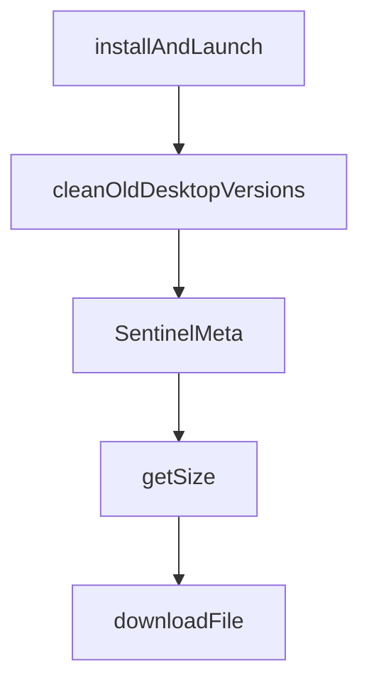

# Chapter 6: Remote Access and Self-Hosting

Welcome to **Chapter 6: Remote Access and Self-Hosting**. In this part of **Vibe Kanban Tutorial: Multi-Agent Orchestration Board for Coding Workflows**, you will build an intuitive mental model first, then move into concrete implementation details and practical production tradeoffs.


This chapter covers remote deployment patterns, editor integration, and secure remote operations.

## Learning Goals

- expose remote Vibe Kanban instances safely
- configure SSH-based project opening workflows
- use origin controls for reverse-proxy deployments
- support distributed teams with shared remote infrastructure

## Remote Operation Pattern

| Capability | Approach |
|:-----------|:---------|
| remote UI access | tunnel/proxy (Cloudflare Tunnel, ngrok, etc.) |
| remote project editing | configure remote SSH host/user integration |
| browser security | set explicit `VK_ALLOWED_ORIGINS` |

## Source References

- [Vibe Kanban README: Self-Hosting](https://github.com/BloopAI/vibe-kanban/blob/main/README.md#self-hosting)
- [Vibe Kanban README: Remote Deployment](https://github.com/BloopAI/vibe-kanban/blob/main/README.md#remote-deployment)
- [Vibe Kanban Self-Hosting Guide](https://vibekanban.com/docs/self-hosting)

## Summary

You now know how to run Vibe Kanban beyond a single local machine safely.

Next: [Chapter 7: Development and Source Build Workflow](07-development-and-source-build-workflow.md)

## Depth Expansion Playbook

## Source Code Walkthrough

### `npx-cli/src/desktop.ts`

The `installAndLaunch` function in [`npx-cli/src/desktop.ts`](https://github.com/BloopAI/vibe-kanban/blob/HEAD/npx-cli/src/desktop.ts) handles a key part of this chapter's functionality:

```ts

// macOS: extract .app.tar.gz, copy to /Applications, remove quarantine, launch with `open`
async function installAndLaunchMacOS(
  bundleInfo: DesktopBundleInfo
): Promise<number> {
  const { archivePath, dir } = bundleInfo;

  const sentinel = readSentinel(dir);
  if (sentinel?.appPath && fs.existsSync(sentinel.appPath)) {
    return launchMacOSApp(sentinel.appPath);
  }

  if (!archivePath || !fs.existsSync(archivePath)) {
    throw new Error('No archive to extract for macOS desktop app');
  }

  extractTarGz(archivePath, dir);

  const appName = fs.readdirSync(dir).find((f) => f.endsWith('.app'));
  if (!appName) {
    throw new Error(
      `No .app bundle found in ${dir} after extraction`
    );
  }

  const extractedAppPath = path.join(dir, appName);

  // Try to install to /Applications, then ~/Applications, then fall back to cache dir
  const userApplications = path.join(os.homedir(), 'Applications');
  const finalAppPath =
    tryCopyApp(extractedAppPath, '/Applications') ??
    tryCopyApp(extractedAppPath, userApplications) ??
```

This function is important because it defines how Vibe Kanban Tutorial: Multi-Agent Orchestration Board for Coding Workflows implements the patterns covered in this chapter.

### `npx-cli/src/desktop.ts`

The `cleanOldDesktopVersions` function in [`npx-cli/src/desktop.ts`](https://github.com/BloopAI/vibe-kanban/blob/HEAD/npx-cli/src/desktop.ts) handles a key part of this chapter's functionality:

```ts
}

export function cleanOldDesktopVersions(
  desktopBaseDir: string,
  currentTag: string
): void {
  try {
    const entries = fs.readdirSync(desktopBaseDir, {
      withFileTypes: true,
    });
    for (const entry of entries) {
      if (entry.isDirectory() && entry.name !== currentTag) {
        const oldDir = path.join(desktopBaseDir, entry.name);
        try {
          fs.rmSync(oldDir, { recursive: true, force: true });
        } catch {
          // Ignore errors (e.g. EBUSY on Windows if app is running)
        }
      }
    }
  } catch {
    // Ignore cleanup errors
  }
}

```

This function is important because it defines how Vibe Kanban Tutorial: Multi-Agent Orchestration Board for Coding Workflows implements the patterns covered in this chapter.

### `npx-cli/src/desktop.ts`

The `SentinelMeta` interface in [`npx-cli/src/desktop.ts`](https://github.com/BloopAI/vibe-kanban/blob/HEAD/npx-cli/src/desktop.ts) handles a key part of this chapter's functionality:

```ts
type TauriPlatform = string | null;

interface SentinelMeta {
  type: string;
  appPath: string;
}

const PLATFORM_MAP: Record<string, string> = {
  'macos-arm64': 'darwin-aarch64',
  'macos-x64': 'darwin-x86_64',
  'linux-x64': 'linux-x86_64',
  'linux-arm64': 'linux-aarch64',
  'windows-x64': 'windows-x86_64',
  'windows-arm64': 'windows-aarch64',
};

// Map NPX-style platform names to Tauri-style platform names
export function getTauriPlatform(
  npxPlatformDir: string
): TauriPlatform {
  return PLATFORM_MAP[npxPlatformDir] || null;
}

// Extract .tar.gz using system tar (available on macOS, Linux, and Windows 10+)
function extractTarGz(archivePath: string, destDir: string): void {
  execSync(`tar -xzf "${archivePath}" -C "${destDir}"`, {
    stdio: 'pipe',
  });
}

function writeSentinel(dir: string, meta: SentinelMeta): void {
  fs.writeFileSync(
```

This interface is important because it defines how Vibe Kanban Tutorial: Multi-Agent Orchestration Board for Coding Workflows implements the patterns covered in this chapter.

### `packages/local-web/tailwind.new.config.js`

The `getSize` function in [`packages/local-web/tailwind.new.config.js`](https://github.com/BloopAI/vibe-kanban/blob/HEAD/packages/local-web/tailwind.new.config.js) handles a key part of this chapter's functionality:

```js
const chatMaxWidth = '48rem';

function getSize(sizeLabel, multiplier = 1) {

  return sizes[sizeLabel] * multiplier + "rem";
}

module.exports = {
  darkMode: ["class"],
  important: false,
  content: [
    './pages/**/*.{ts,tsx}',
    './components/**/*.{ts,tsx}',
    './app/**/*.{ts,tsx}',
    './src/**/*.{ts,tsx}',
    '../web-core/src/**/*.{ts,tsx}',
    '../remote-web/src/**/*.{ts,tsx}',
    '../ui/src/**/*.{ts,tsx}',
    "node_modules/@rjsf/shadcn/src/**/*.{js,ts,jsx,tsx,mdx}"
  ],
  safelist: [
    'xl:hidden',
    'xl:relative',
    'xl:inset-auto',
    'xl:z-auto',
    'xl:h-full',
    'xl:w-[800px]',
    'xl:flex',
    'xl:flex-1',
    'xl:min-w-0',
    'xl:overflow-y-auto',
    'xl:opacity-100',
```

This function is important because it defines how Vibe Kanban Tutorial: Multi-Agent Orchestration Board for Coding Workflows implements the patterns covered in this chapter.


## How These Components Connect


