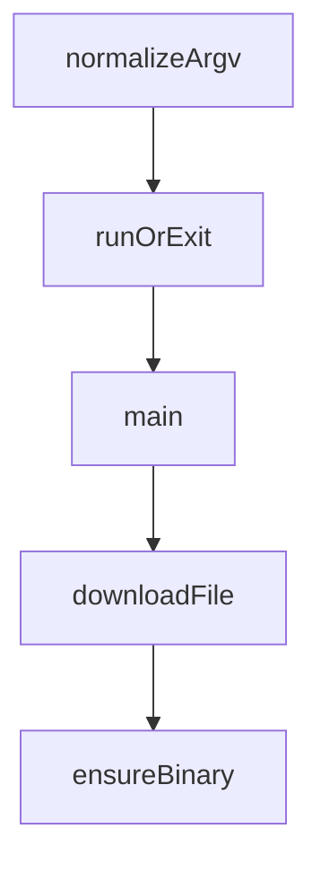

# Chapter 6: Remote Access and Self-Hosting

Welcome to **Chapter 6: Remote Access and Self-Hosting**. In this part of **Vibe Kanban Tutorial: Multi-Agent Orchestration Board for Coding Workflows**, you will build an intuitive mental model first, then move into concrete implementation details and practical production tradeoffs.


This chapter covers remote deployment patterns, editor integration, and secure remote operations.

## Learning Goals

- expose remote Vibe Kanban instances safely
- configure SSH-based project opening workflows
- use origin controls for reverse-proxy deployments
- support distributed teams with shared remote infrastructure

## Remote Operation Pattern

| Capability | Approach |
|:-----------|:---------|
| remote UI access | tunnel/proxy (Cloudflare Tunnel, ngrok, etc.) |
| remote project editing | configure remote SSH host/user integration |
| browser security | set explicit `VK_ALLOWED_ORIGINS` |

## Source References

- [Vibe Kanban README: Self-Hosting](https://github.com/BloopAI/vibe-kanban/blob/main/README.md#self-hosting)
- [Vibe Kanban README: Remote Deployment](https://github.com/BloopAI/vibe-kanban/blob/main/README.md#remote-deployment)
- [Vibe Kanban Self-Hosting Guide](https://vibekanban.com/docs/self-hosting)

## Summary

You now know how to run Vibe Kanban beyond a single local machine safely.

Next: [Chapter 7: Development and Source Build Workflow](07-development-and-source-build-workflow.md)

## Source Code Walkthrough

### `npx-cli/src/cli.ts`

The `normalizeArgv` function in [`npx-cli/src/cli.ts`](https://github.com/BloopAI/vibe-kanban/blob/HEAD/npx-cli/src/cli.ts) handles a key part of this chapter's functionality:

```ts
}

function normalizeArgv(argv: string[]): string[] {
  const args = argv.slice(2);
  const mcpFlagIndex = args.indexOf("--mcp");
  if (mcpFlagIndex === -1) {
    return argv;
  }

  const normalizedArgs = [
    ...args.slice(0, mcpFlagIndex),
    "mcp",
    ...args.slice(mcpFlagIndex + 1),
  ];

  return [...argv.slice(0, 2), ...normalizedArgs];
}

function runOrExit(task: Promise<void>): void {
  void task.catch((err: unknown) => {
    const msg = err instanceof Error ? err.message : String(err);
    console.error("Fatal error:", msg);
    if (process.env.VIBE_KANBAN_DEBUG && err instanceof Error) {
      console.error(err.stack);
    }
    process.exit(1);
  });
}

async function main(): Promise<void> {
  fs.mkdirSync(versionCacheDir, { recursive: true });
  const cli = cac("vibe-kanban");
```

This function is important because it defines how Vibe Kanban Tutorial: Multi-Agent Orchestration Board for Coding Workflows implements the patterns covered in this chapter.

### `npx-cli/src/cli.ts`

The `runOrExit` function in [`npx-cli/src/cli.ts`](https://github.com/BloopAI/vibe-kanban/blob/HEAD/npx-cli/src/cli.ts) handles a key part of this chapter's functionality:

```ts
}

function runOrExit(task: Promise<void>): void {
  void task.catch((err: unknown) => {
    const msg = err instanceof Error ? err.message : String(err);
    console.error("Fatal error:", msg);
    if (process.env.VIBE_KANBAN_DEBUG && err instanceof Error) {
      console.error(err.stack);
    }
    process.exit(1);
  });
}

async function main(): Promise<void> {
  fs.mkdirSync(versionCacheDir, { recursive: true });
  const cli = cac("vibe-kanban");

  cli
    .command("[...args]", "Launch the local vibe-kanban app")
    .option("--desktop", "Launch the desktop app instead of browser mode")
    .allowUnknownOptions()
    .action((_args: string[], options: RootOptions) => {
      runOrExit(runMain(Boolean(options.desktop)));
    });

  cli
    .command("review [...args]", "Run the review CLI")
    .allowUnknownOptions()
    .action((args: string[]) => {
      runOrExit(runReview(args));
    });

```

This function is important because it defines how Vibe Kanban Tutorial: Multi-Agent Orchestration Board for Coding Workflows implements the patterns covered in this chapter.

### `npx-cli/src/cli.ts`

The `main` function in [`npx-cli/src/cli.ts`](https://github.com/BloopAI/vibe-kanban/blob/HEAD/npx-cli/src/cli.ts) handles a key part of this chapter's functionality:

```ts
}

async function main(): Promise<void> {
  fs.mkdirSync(versionCacheDir, { recursive: true });
  const cli = cac("vibe-kanban");

  cli
    .command("[...args]", "Launch the local vibe-kanban app")
    .option("--desktop", "Launch the desktop app instead of browser mode")
    .allowUnknownOptions()
    .action((_args: string[], options: RootOptions) => {
      runOrExit(runMain(Boolean(options.desktop)));
    });

  cli
    .command("review [...args]", "Run the review CLI")
    .allowUnknownOptions()
    .action((args: string[]) => {
      runOrExit(runReview(args));
    });

  cli
    .command("mcp [...args]", "Run the MCP server")
    .allowUnknownOptions()
    .action((args: string[]) => {
      runOrExit(runMcp(args));
    });

  cli.help();
  cli.version(CLI_VERSION);
  cli.parse(normalizeArgv(process.argv));
}
```

This function is important because it defines how Vibe Kanban Tutorial: Multi-Agent Orchestration Board for Coding Workflows implements the patterns covered in this chapter.

### `npx-cli/src/download.ts`

The `downloadFile` function in [`npx-cli/src/download.ts`](https://github.com/BloopAI/vibe-kanban/blob/HEAD/npx-cli/src/download.ts) handles a key part of this chapter's functionality:

```ts
}

function downloadFile(
  url: string,
  destPath: string,
  expectedSha256: string | undefined,
  onProgress?: ProgressCallback
): Promise<string> {
  const tempPath = destPath + '.tmp';
  return new Promise((resolve, reject) => {
    const file = fs.createWriteStream(tempPath);
    const hash = crypto.createHash('sha256');

    const cleanup = () => {
      try {
        fs.unlinkSync(tempPath);
      } catch {}
    };

    https
      .get(url, (res) => {
        if (res.statusCode === 301 || res.statusCode === 302) {
          file.close();
          cleanup();
          return downloadFile(
            res.headers.location!,
            destPath,
            expectedSha256,
            onProgress
          )
            .then(resolve)
            .catch(reject);
```

This function is important because it defines how Vibe Kanban Tutorial: Multi-Agent Orchestration Board for Coding Workflows implements the patterns covered in this chapter.


## How These Components Connect


