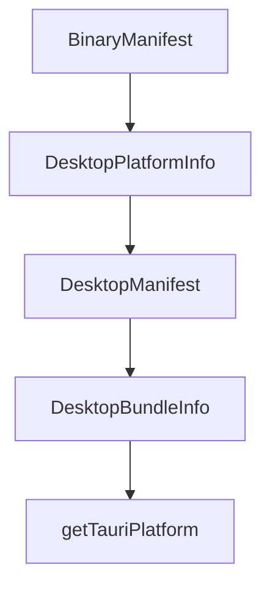

# Chapter 7: Development and Source Build Workflow

Welcome to **Chapter 7: Development and Source Build Workflow**. In this part of **Vibe Kanban Tutorial: Multi-Agent Orchestration Board for Coding Workflows**, you will build an intuitive mental model first, then move into concrete implementation details and practical production tradeoffs.


This chapter targets contributors building and extending Vibe Kanban from source.

## Learning Goals

- set up prerequisite toolchain for development
- run local dev server reliably
- build frontend/source artifacts for release testing
- understand contributor expectations before submitting changes

## Development Prerequisites

From README:

- Rust (stable)
- Node.js >= 18
- pnpm >= 8
- optional dev tools: `cargo-watch`, `sqlx-cli`

## Common Commands

```bash
pnpm i
pnpm run dev
```

## Build and Debug Paths

- frontend-only build through `frontend` workspace
- macOS local build script for source test workflows

## Source References

- [Vibe Kanban README: Development](https://github.com/BloopAI/vibe-kanban/blob/main/README.md#development)
- [Vibe Kanban README: Build from source](https://github.com/BloopAI/vibe-kanban/blob/main/README.md#build-from-source-macos)

## Summary

You now have a contributor-ready workflow for iterating on Vibe Kanban itself.

Next: [Chapter 8: Production Operations and Governance](08-production-operations-and-governance.md)

## Source Code Walkthrough

### `npx-cli/src/download.ts`

The `BinaryManifest` interface in [`npx-cli/src/download.ts`](https://github.com/BloopAI/vibe-kanban/blob/HEAD/npx-cli/src/download.ts) handles a key part of this chapter's functionality:

```ts
}

export interface BinaryManifest {
  latest?: string;
  platforms: Record<string, Record<string, BinaryInfo>>;
}

export interface DesktopPlatformInfo {
  file: string;
  sha256: string;
  type: string | null;
}

export interface DesktopManifest {
  platforms: Record<string, DesktopPlatformInfo>;
}

export interface DesktopBundleInfo {
  archivePath: string | null;
  dir: string;
  type: string | null;
}

type ProgressCallback = (downloaded: number, total: number) => void;

function fetchJson<T>(url: string): Promise<T> {
  return new Promise((resolve, reject) => {
    https
      .get(url, (res) => {
        if (res.statusCode === 301 || res.statusCode === 302) {
          return fetchJson<T>(res.headers.location!)
            .then(resolve)
```

This interface is important because it defines how Vibe Kanban Tutorial: Multi-Agent Orchestration Board for Coding Workflows implements the patterns covered in this chapter.

### `npx-cli/src/download.ts`

The `DesktopPlatformInfo` interface in [`npx-cli/src/download.ts`](https://github.com/BloopAI/vibe-kanban/blob/HEAD/npx-cli/src/download.ts) handles a key part of this chapter's functionality:

```ts
}

export interface DesktopPlatformInfo {
  file: string;
  sha256: string;
  type: string | null;
}

export interface DesktopManifest {
  platforms: Record<string, DesktopPlatformInfo>;
}

export interface DesktopBundleInfo {
  archivePath: string | null;
  dir: string;
  type: string | null;
}

type ProgressCallback = (downloaded: number, total: number) => void;

function fetchJson<T>(url: string): Promise<T> {
  return new Promise((resolve, reject) => {
    https
      .get(url, (res) => {
        if (res.statusCode === 301 || res.statusCode === 302) {
          return fetchJson<T>(res.headers.location!)
            .then(resolve)
            .catch(reject);
        }
        if (res.statusCode !== 200) {
          return reject(new Error(`HTTP ${res.statusCode} fetching ${url}`));
        }
```

This interface is important because it defines how Vibe Kanban Tutorial: Multi-Agent Orchestration Board for Coding Workflows implements the patterns covered in this chapter.

### `npx-cli/src/download.ts`

The `DesktopManifest` interface in [`npx-cli/src/download.ts`](https://github.com/BloopAI/vibe-kanban/blob/HEAD/npx-cli/src/download.ts) handles a key part of this chapter's functionality:

```ts
}

export interface DesktopManifest {
  platforms: Record<string, DesktopPlatformInfo>;
}

export interface DesktopBundleInfo {
  archivePath: string | null;
  dir: string;
  type: string | null;
}

type ProgressCallback = (downloaded: number, total: number) => void;

function fetchJson<T>(url: string): Promise<T> {
  return new Promise((resolve, reject) => {
    https
      .get(url, (res) => {
        if (res.statusCode === 301 || res.statusCode === 302) {
          return fetchJson<T>(res.headers.location!)
            .then(resolve)
            .catch(reject);
        }
        if (res.statusCode !== 200) {
          return reject(new Error(`HTTP ${res.statusCode} fetching ${url}`));
        }
        let data = '';
        res.on('data', (chunk: string) => (data += chunk));
        res.on('end', () => {
          try {
            resolve(JSON.parse(data) as T);
          } catch {
```

This interface is important because it defines how Vibe Kanban Tutorial: Multi-Agent Orchestration Board for Coding Workflows implements the patterns covered in this chapter.

### `npx-cli/src/download.ts`

The `DesktopBundleInfo` interface in [`npx-cli/src/download.ts`](https://github.com/BloopAI/vibe-kanban/blob/HEAD/npx-cli/src/download.ts) handles a key part of this chapter's functionality:

```ts
}

export interface DesktopBundleInfo {
  archivePath: string | null;
  dir: string;
  type: string | null;
}

type ProgressCallback = (downloaded: number, total: number) => void;

function fetchJson<T>(url: string): Promise<T> {
  return new Promise((resolve, reject) => {
    https
      .get(url, (res) => {
        if (res.statusCode === 301 || res.statusCode === 302) {
          return fetchJson<T>(res.headers.location!)
            .then(resolve)
            .catch(reject);
        }
        if (res.statusCode !== 200) {
          return reject(new Error(`HTTP ${res.statusCode} fetching ${url}`));
        }
        let data = '';
        res.on('data', (chunk: string) => (data += chunk));
        res.on('end', () => {
          try {
            resolve(JSON.parse(data) as T);
          } catch {
            reject(new Error(`Failed to parse JSON from ${url}`));
          }
        });
      })
```

This interface is important because it defines how Vibe Kanban Tutorial: Multi-Agent Orchestration Board for Coding Workflows implements the patterns covered in this chapter.


## How These Components Connect


