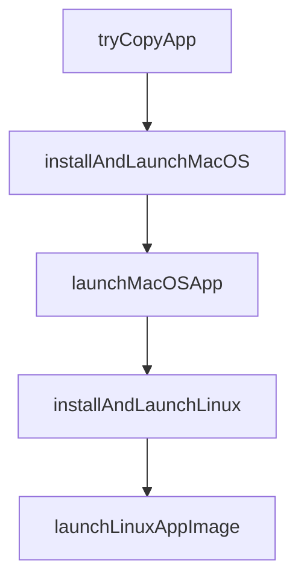

# Chapter 8: Production Operations and Governance

Welcome to **Chapter 8: Production Operations and Governance**. In this part of **Vibe Kanban Tutorial: Multi-Agent Orchestration Board for Coding Workflows**, you will build an intuitive mental model first, then move into concrete implementation details and practical production tradeoffs.


This chapter defines operational and governance practices for production Vibe Kanban deployments.

## Learning Goals

- establish secure rollout strategy for multi-agent orchestration
- govern configuration and infrastructure changes safely
- define team-level quality and escalation policies
- maintain reliability as agent volume grows

## Governance Baseline

| Area | Recommended Baseline |
|:-----|:---------------------|
| execution policy | define which tasks can run parallel vs gated |
| config governance | version all runtime/MCP settings |
| review gates | enforce merge readiness checks per task type |
| observability | track throughput, failures, and regressions by board column |
| upgrades | stage new versions in pilot environment first |

## Source References

- [Vibe Kanban Repository](https://github.com/BloopAI/vibe-kanban)
- [Vibe Kanban Docs](https://vibekanban.com/docs)
- [Vibe Kanban Discussions](https://github.com/BloopAI/vibe-kanban/discussions)

## Summary

You now have a full operational runbook for managing coding-agent orchestration with Vibe Kanban.

Continue with the [Opcode Tutorial](../opcode-tutorial/) for GUI-native Claude Code workflows.

## Source Code Walkthrough

### `npx-cli/src/desktop.ts`

The `tryCopyApp` function in [`npx-cli/src/desktop.ts`](https://github.com/BloopAI/vibe-kanban/blob/HEAD/npx-cli/src/desktop.ts) handles a key part of this chapter's functionality:

```ts

// Try to copy the .app to a destination directory, returning the final path on success
function tryCopyApp(
  srcAppPath: string,
  destDir: string
): string | null {
  try {
    const appName = path.basename(srcAppPath);
    const destAppPath = path.join(destDir, appName);

    // Ensure destination directory exists
    fs.mkdirSync(destDir, { recursive: true });

    // Remove existing app at destination if present
    if (fs.existsSync(destAppPath)) {
      fs.rmSync(destAppPath, { recursive: true, force: true });
    }

    // Use cp -R for macOS .app bundles (preserves symlinks and metadata)
    execSync(`cp -R "${srcAppPath}" "${destAppPath}"`, {
      stdio: 'pipe',
    });

    return destAppPath;
  } catch {
    return null;
  }
}

// macOS: extract .app.tar.gz, copy to /Applications, remove quarantine, launch with `open`
async function installAndLaunchMacOS(
  bundleInfo: DesktopBundleInfo
```

This function is important because it defines how Vibe Kanban Tutorial: Multi-Agent Orchestration Board for Coding Workflows implements the patterns covered in this chapter.

### `npx-cli/src/desktop.ts`

The `installAndLaunchMacOS` function in [`npx-cli/src/desktop.ts`](https://github.com/BloopAI/vibe-kanban/blob/HEAD/npx-cli/src/desktop.ts) handles a key part of this chapter's functionality:

```ts

// macOS: extract .app.tar.gz, copy to /Applications, remove quarantine, launch with `open`
async function installAndLaunchMacOS(
  bundleInfo: DesktopBundleInfo
): Promise<number> {
  const { archivePath, dir } = bundleInfo;

  const sentinel = readSentinel(dir);
  if (sentinel?.appPath && fs.existsSync(sentinel.appPath)) {
    return launchMacOSApp(sentinel.appPath);
  }

  if (!archivePath || !fs.existsSync(archivePath)) {
    throw new Error('No archive to extract for macOS desktop app');
  }

  extractTarGz(archivePath, dir);

  const appName = fs.readdirSync(dir).find((f) => f.endsWith('.app'));
  if (!appName) {
    throw new Error(
      `No .app bundle found in ${dir} after extraction`
    );
  }

  const extractedAppPath = path.join(dir, appName);

  // Try to install to /Applications, then ~/Applications, then fall back to cache dir
  const userApplications = path.join(os.homedir(), 'Applications');
  const finalAppPath =
    tryCopyApp(extractedAppPath, '/Applications') ??
    tryCopyApp(extractedAppPath, userApplications) ??
```

This function is important because it defines how Vibe Kanban Tutorial: Multi-Agent Orchestration Board for Coding Workflows implements the patterns covered in this chapter.

### `npx-cli/src/desktop.ts`

The `launchMacOSApp` function in [`npx-cli/src/desktop.ts`](https://github.com/BloopAI/vibe-kanban/blob/HEAD/npx-cli/src/desktop.ts) handles a key part of this chapter's functionality:

```ts
  const sentinel = readSentinel(dir);
  if (sentinel?.appPath && fs.existsSync(sentinel.appPath)) {
    return launchMacOSApp(sentinel.appPath);
  }

  if (!archivePath || !fs.existsSync(archivePath)) {
    throw new Error('No archive to extract for macOS desktop app');
  }

  extractTarGz(archivePath, dir);

  const appName = fs.readdirSync(dir).find((f) => f.endsWith('.app'));
  if (!appName) {
    throw new Error(
      `No .app bundle found in ${dir} after extraction`
    );
  }

  const extractedAppPath = path.join(dir, appName);

  // Try to install to /Applications, then ~/Applications, then fall back to cache dir
  const userApplications = path.join(os.homedir(), 'Applications');
  const finalAppPath =
    tryCopyApp(extractedAppPath, '/Applications') ??
    tryCopyApp(extractedAppPath, userApplications) ??
    extractedAppPath;

  // Clean up extracted copy if we successfully copied elsewhere
  if (finalAppPath !== extractedAppPath) {
    try {
      fs.rmSync(extractedAppPath, { recursive: true, force: true });
    } catch {}
```

This function is important because it defines how Vibe Kanban Tutorial: Multi-Agent Orchestration Board for Coding Workflows implements the patterns covered in this chapter.

### `npx-cli/src/desktop.ts`

The `installAndLaunchLinux` function in [`npx-cli/src/desktop.ts`](https://github.com/BloopAI/vibe-kanban/blob/HEAD/npx-cli/src/desktop.ts) handles a key part of this chapter's functionality:

```ts

// Linux: extract AppImage.tar.gz, chmod +x, run
async function installAndLaunchLinux(
  bundleInfo: DesktopBundleInfo
): Promise<number> {
  const { archivePath, dir } = bundleInfo;

  const sentinel = readSentinel(dir);
  if (sentinel?.appPath && fs.existsSync(sentinel.appPath)) {
    return launchLinuxAppImage(sentinel.appPath);
  }

  if (!archivePath || !fs.existsSync(archivePath)) {
    throw new Error('No archive to extract for Linux desktop app');
  }

  extractTarGz(archivePath, dir);

  const appImage = fs
    .readdirSync(dir)
    .find((f) => f.endsWith('.AppImage'));
  if (!appImage) {
    throw new Error(`No .AppImage found in ${dir} after extraction`);
  }

  const appImagePath = path.join(dir, appImage);
  fs.chmodSync(appImagePath, 0o755);

  writeSentinel(dir, {
    type: 'appimage-tar-gz',
    appPath: appImagePath,
  });
```

This function is important because it defines how Vibe Kanban Tutorial: Multi-Agent Orchestration Board for Coding Workflows implements the patterns covered in this chapter.


## How These Components Connect


