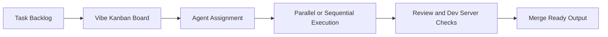

# Vibe Kanban Tutorial: Multi-Agent Orchestration Board for Coding Workflows

> Learn how to use `BloopAI/vibe-kanban` to coordinate Claude Code, Codex, Gemini CLI, and other coding agents through a unified orchestration workspace.

## Why This Track Matters

Vibe Kanban addresses one of the hardest 2026 engineering problems: coordinating many coding agents without losing task context, review control, or operational safety.

This track focuses on:

- launching and using Vibe Kanban quickly
- orchestrating multiple coding agents in parallel/sequential flows
- managing MCP config and workspace lifecycle centrally
- operating Vibe Kanban in remote and self-hosted setups

## Current Snapshot (Verified February 12, 2026)

- repository: [`BloopAI/vibe-kanban`](https://github.com/BloopAI/vibe-kanban)
- stars: about **21.0k**
- latest release: [`v0.1.11-20260211154151`](https://github.com/BloopAI/vibe-kanban/releases/tag/v0.1.11-20260211154151)
- recent activity: updates on **February 11, 2026**
- project positioning: command center for multi-agent coding execution and review

## Mental Model

## Chapter Guide

| Chapter | Key Question | Outcome |
|:--------|:-------------|:--------|
| [01 - Getting Started](01-getting-started.md) | How do I run Vibe Kanban fast? | Working baseline |
| [02 - Orchestration Architecture](02-orchestration-architecture.md) | How does Vibe Kanban coordinate coding agents? | Runtime mental model |
| [03 - Multi-Agent Execution Strategies](03-multi-agent-execution-strategies.md) | How do I run parallel and sequential agent workflows safely? | Better execution planning |
| [04 - MCP and Configuration Control](04-mcp-and-configuration-control.md) | How do I centralize and govern agent configs? | Config governance baseline |
| [05 - Review and Quality Gates](05-review-and-quality-gates.md) | How should teams review agent outputs quickly? | Reliable QA workflow |
| [06 - Remote Access and Self-Hosting](06-remote-access-and-self-hosting.md) | How do I run Vibe Kanban on remote infrastructure? | Remote operations model |
| [07 - Development and Source Build Workflow](07-development-and-source-build-workflow.md) | How do contributors build and extend Vibe Kanban? | Contributor readiness |
| [08 - Production Operations and Governance](08-production-operations-and-governance.md) | How do teams operationalize Vibe Kanban at scale? | Production runbook |

## What You Will Learn

- how to orchestrate multiple coding agents through one workflow surface
- how to control MCP configuration and execution safety centrally
- how to run review and validation loops with less overhead
- how to deploy Vibe Kanban for remote and production team usage

## Source References

- [Vibe Kanban Repository](https://github.com/BloopAI/vibe-kanban)
- [Vibe Kanban Docs](https://vibekanban.com/docs)
- [Vibe Kanban Self-Hosting](https://vibekanban.com/docs/self-hosting)
- [Vibe Kanban README](https://github.com/BloopAI/vibe-kanban/blob/main/README.md)

## Related Tutorials

- [Superset Terminal Tutorial](../superset-terminal-tutorial/)
- [OpenCode Tutorial](../opencode-tutorial/)
- [Goose Tutorial](../goose-tutorial/)
- [Opcode Tutorial](../opcode-tutorial/)

---

Start with [Chapter 1: Getting Started](01-getting-started.md).
