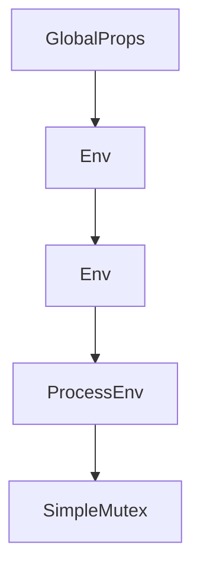

# Chapter 1: Getting Started and Deployment Paths

Welcome to **Chapter 1: Getting Started and Deployment Paths**. In this part of **VibeSDK Tutorial: Build a Vibe-Coding Platform on Cloudflare**, you will build an intuitive mental model first, then move into concrete implementation details and practical production tradeoffs.


This chapter gets `cloudflare/vibesdk` running in a local development loop, then maps the path to production-style deployment.

## Learning Goals

By the end of this chapter, you should be able to:

- pick the right deployment mode for your team stage
- complete a first-time setup without hidden blockers
- validate the platform end-to-end after bootstrapping
- prepare environment variables and Cloudflare resources for future production rollout

## Deployment Modes

| Mode | Best For | Required Inputs | Tradeoffs |
|:-----|:---------|:----------------|:----------|
| local-only | architecture changes and feature development | Node.js 18+, Bun, Docker, local env vars | fast iteration, but no production route checks |
| deploy-button bootstrap | fastest hosted trial and stakeholder demos | Cloudflare account + setup wizard | minimal setup effort, less explicit infra control |
| scripted deployment | repeatable team environments and CI | managed secrets, explicit `wrangler` strategy, rollout process | highest control, highest operational overhead |

## Prerequisites You Should Verify First

- Node.js 18+
- Bun installed (`bun --version`)
- Docker Desktop or equivalent runtime running
- Cloudflare account with API token permissions for Workers, KV, D1, R2, and Containers
- optional custom domain (recommended for production deployment and nicer preview URLs)

If you are using Cloudflare WARP and local previews fail, upstream docs note this can interfere with anonymous Cloudflared tunnels. Disable full-mode WARP while debugging local previews.

## Fast Setup Path

```bash
bun install
bun run setup
bun run db:migrate:local
bun run dev
```

`bun run setup` is the most important step. It collects credentials, creates/binds resources, and writes local configuration files.

## What the Setup Script Configures

| Area | Typical Outputs |
|:-----|:----------------|
| account identity | `CLOUDFLARE_ACCOUNT_ID`, `CLOUDFLARE_API_TOKEN` |
| secrets baseline | `JWT_SECRET`, `WEBHOOK_SECRET`, encryption-related vars |
| AI routing | provider keys, optional AI Gateway token plumbing |
| storage/bindings | KV, D1, R2 resource IDs and `wrangler.jsonc` updates |
| local runtime | `.dev.vars`, local migration readiness |

## Environment Variable Strategy

Split variables into explicit tiers early:

- local dev: `.dev.vars`
- production deploy: `.prod.vars` or your managed secret store
- CI: pipeline-bound secrets with least privilege

Avoid reusing production tokens in local development.

## First Validation Checklist

After startup, validate all four before moving on:

1. authentication flow works (email or OAuth path)
2. generation starts and phase/status updates stream in UI
3. preview URL loads generated app
4. a test deploy/export path succeeds (or fails with clear, expected config messages)

## Common Early Failures and Fixes

| Failure | Typical Root Cause | First Fix |
|:--------|:-------------------|:----------|
| D1/KV/R2 unauthorized | missing API token permissions or plan limits | regenerate token with required scopes, then rerun setup |
| preview URL unavailable | Cloudflared tunnel timing or network interference | wait/retry, disable WARP full mode, confirm Docker runtime |
| generation fails quickly | model/provider mismatch in config | verify keys and provider mapping in `worker/agents/inferutils/config.ts` |
| deploy-from-chat unavailable | missing custom domain + dispatch setup | complete initial remote deployment and domain wiring |

## Recommended Graduation Path

1. run local-only until generation and preview loops are stable
2. deploy a staging instance with production-like bindings
3. enable controlled user access and monitor runtime behavior
4. promote to production after cost, reliability, and governance checks pass

## Source References

- [VibeSDK Setup Guide](https://github.com/cloudflare/vibesdk/blob/main/docs/setup.md)
- [VibeSDK Repository](https://github.com/cloudflare/vibesdk)

## Summary

You now have a practical bootstrap playbook for VibeSDK and a clear path from local development to managed deployment.

Next: [Chapter 2: System Architecture](02-system-architecture.md)

## Source Code Walkthrough

### `worker-configuration.d.ts`

The `GlobalProps` interface in [`worker-configuration.d.ts`](https://github.com/cloudflare/vibesdk/blob/HEAD/worker-configuration.d.ts) handles a key part of this chapter's functionality:

```ts
// Generated by Wrangler by running `wrangler types --include-runtime false` (hash: a642a922d864b198e53ecdb5fcd29dff)
declare namespace Cloudflare {
	interface GlobalProps {
		mainModule: typeof import("./worker/index");
		durableNamespaces: "CodeGeneratorAgent" | "UserAppSandboxService" | "DORateLimitStore";
	}
	interface Env {
		VibecoderStore: KVNamespace;
		TEMPLATES_REPOSITORY: "https://github.com/cloudflare/vibesdk-templates";
		ALLOWED_EMAIL: "";
		DISPATCH_NAMESPACE: "vibesdk-default-namespace";
		ENABLE_READ_REPLICAS: "true";
		CLOUDFLARE_AI_GATEWAY: "vibesdk-gateway";
		PLATFORM_CAPABILITIES: {"features":{"app":{"enabled":true},"presentation":{"enabled":false},"general":{"enabled":false}},"version":"1.0.0"};
		ANTHROPIC_API_KEY: string;
		OPENAI_API_KEY: string;
		GOOGLE_AI_STUDIO_API_KEY: string;
		OPENROUTER_API_KEY: string;
		CEREBRAS_API_KEY: string;
		GROQ_API_KEY: string;
		GOOGLE_VERTEX_AI_API_KEY: string;
		PLATFORM_MODEL_PROVIDERS: string;
		SANDBOX_SERVICE_API_KEY: string;
		SANDBOX_SERVICE_TYPE: string;
		SANDBOX_SERVICE_URL: string;
		CLOUDFLARE_API_TOKEN: string;
		CLOUDFLARE_ACCOUNT_ID: string;
		CLOUDFLARE_AI_GATEWAY_URL: string;
		CLOUDFLARE_AI_GATEWAY_TOKEN: string;
		SERPAPI_KEY: string;
		GOOGLE_CLIENT_SECRET: string;
		GOOGLE_CLIENT_ID: string;
```

This interface is important because it defines how VibeSDK Tutorial: Build a Vibe-Coding Platform on Cloudflare implements the patterns covered in this chapter.

### `worker-configuration.d.ts`

The `Env` interface in [`worker-configuration.d.ts`](https://github.com/cloudflare/vibesdk/blob/HEAD/worker-configuration.d.ts) handles a key part of this chapter's functionality:

```ts
		durableNamespaces: "CodeGeneratorAgent" | "UserAppSandboxService" | "DORateLimitStore";
	}
	interface Env {
		VibecoderStore: KVNamespace;
		TEMPLATES_REPOSITORY: "https://github.com/cloudflare/vibesdk-templates";
		ALLOWED_EMAIL: "";
		DISPATCH_NAMESPACE: "vibesdk-default-namespace";
		ENABLE_READ_REPLICAS: "true";
		CLOUDFLARE_AI_GATEWAY: "vibesdk-gateway";
		PLATFORM_CAPABILITIES: {"features":{"app":{"enabled":true},"presentation":{"enabled":false},"general":{"enabled":false}},"version":"1.0.0"};
		ANTHROPIC_API_KEY: string;
		OPENAI_API_KEY: string;
		GOOGLE_AI_STUDIO_API_KEY: string;
		OPENROUTER_API_KEY: string;
		CEREBRAS_API_KEY: string;
		GROQ_API_KEY: string;
		GOOGLE_VERTEX_AI_API_KEY: string;
		PLATFORM_MODEL_PROVIDERS: string;
		SANDBOX_SERVICE_API_KEY: string;
		SANDBOX_SERVICE_TYPE: string;
		SANDBOX_SERVICE_URL: string;
		CLOUDFLARE_API_TOKEN: string;
		CLOUDFLARE_ACCOUNT_ID: string;
		CLOUDFLARE_AI_GATEWAY_URL: string;
		CLOUDFLARE_AI_GATEWAY_TOKEN: string;
		SERPAPI_KEY: string;
		GOOGLE_CLIENT_SECRET: string;
		GOOGLE_CLIENT_ID: string;
		GITHUB_CLIENT_ID: string;
		GITHUB_CLIENT_SECRET: string;
		JWT_SECRET: string;
		AI_PROXY_JWT_SECRET: string;
```

This interface is important because it defines how VibeSDK Tutorial: Build a Vibe-Coding Platform on Cloudflare implements the patterns covered in this chapter.

### `worker-configuration.d.ts`

The `Env` interface in [`worker-configuration.d.ts`](https://github.com/cloudflare/vibesdk/blob/HEAD/worker-configuration.d.ts) handles a key part of this chapter's functionality:

```ts
		durableNamespaces: "CodeGeneratorAgent" | "UserAppSandboxService" | "DORateLimitStore";
	}
	interface Env {
		VibecoderStore: KVNamespace;
		TEMPLATES_REPOSITORY: "https://github.com/cloudflare/vibesdk-templates";
		ALLOWED_EMAIL: "";
		DISPATCH_NAMESPACE: "vibesdk-default-namespace";
		ENABLE_READ_REPLICAS: "true";
		CLOUDFLARE_AI_GATEWAY: "vibesdk-gateway";
		PLATFORM_CAPABILITIES: {"features":{"app":{"enabled":true},"presentation":{"enabled":false},"general":{"enabled":false}},"version":"1.0.0"};
		ANTHROPIC_API_KEY: string;
		OPENAI_API_KEY: string;
		GOOGLE_AI_STUDIO_API_KEY: string;
		OPENROUTER_API_KEY: string;
		CEREBRAS_API_KEY: string;
		GROQ_API_KEY: string;
		GOOGLE_VERTEX_AI_API_KEY: string;
		PLATFORM_MODEL_PROVIDERS: string;
		SANDBOX_SERVICE_API_KEY: string;
		SANDBOX_SERVICE_TYPE: string;
		SANDBOX_SERVICE_URL: string;
		CLOUDFLARE_API_TOKEN: string;
		CLOUDFLARE_ACCOUNT_ID: string;
		CLOUDFLARE_AI_GATEWAY_URL: string;
		CLOUDFLARE_AI_GATEWAY_TOKEN: string;
		SERPAPI_KEY: string;
		GOOGLE_CLIENT_SECRET: string;
		GOOGLE_CLIENT_ID: string;
		GITHUB_CLIENT_ID: string;
		GITHUB_CLIENT_SECRET: string;
		JWT_SECRET: string;
		AI_PROXY_JWT_SECRET: string;
```

This interface is important because it defines how VibeSDK Tutorial: Build a Vibe-Coding Platform on Cloudflare implements the patterns covered in this chapter.

### `worker-configuration.d.ts`

The `ProcessEnv` interface in [`worker-configuration.d.ts`](https://github.com/cloudflare/vibesdk/blob/HEAD/worker-configuration.d.ts) handles a key part of this chapter's functionality:

```ts
};
declare namespace NodeJS {
	interface ProcessEnv extends StringifyValues<Pick<Cloudflare.Env, "TEMPLATES_REPOSITORY" | "ALLOWED_EMAIL" | "DISPATCH_NAMESPACE" | "ENABLE_READ_REPLICAS" | "CLOUDFLARE_AI_GATEWAY" | "PLATFORM_CAPABILITIES" | "ANTHROPIC_API_KEY" | "OPENAI_API_KEY" | "GOOGLE_AI_STUDIO_API_KEY" | "OPENROUTER_API_KEY" | "CEREBRAS_API_KEY" | "GROQ_API_KEY" | "GOOGLE_VERTEX_AI_API_KEY" | "PLATFORM_MODEL_PROVIDERS" | "SANDBOX_SERVICE_API_KEY" | "SANDBOX_SERVICE_TYPE" | "SANDBOX_SERVICE_URL" | "CLOUDFLARE_API_TOKEN" | "CLOUDFLARE_ACCOUNT_ID" | "CLOUDFLARE_AI_GATEWAY_URL" | "CLOUDFLARE_AI_GATEWAY_TOKEN" | "SERPAPI_KEY" | "GOOGLE_CLIENT_SECRET" | "GOOGLE_CLIENT_ID" | "GITHUB_CLIENT_ID" | "GITHUB_CLIENT_SECRET" | "JWT_SECRET" | "AI_PROXY_JWT_SECRET" | "ENTROPY_KEY" | "ENVIRONMENT" | "SECRETS_ENCRYPTION_KEY" | "MAX_SANDBOX_INSTANCES" | "SANDBOX_INSTANCE_TYPE" | "CUSTOM_DOMAIN" | "CUSTOM_PREVIEW_DOMAIN" | "ALLOCATION_STRATEGY" | "GITHUB_EXPORTER_CLIENT_ID" | "GITHUB_EXPORTER_CLIENT_SECRET" | "CF_ACCESS_ID" | "CF_ACCESS_SECRET" | "SENTRY_DSN" | "USE_TUNNEL_FOR_PREVIEW" | "USE_CLOUDFLARE_IMAGES">> {}
}

```

This interface is important because it defines how VibeSDK Tutorial: Build a Vibe-Coding Platform on Cloudflare implements the patterns covered in this chapter.


## How These Components Connect


