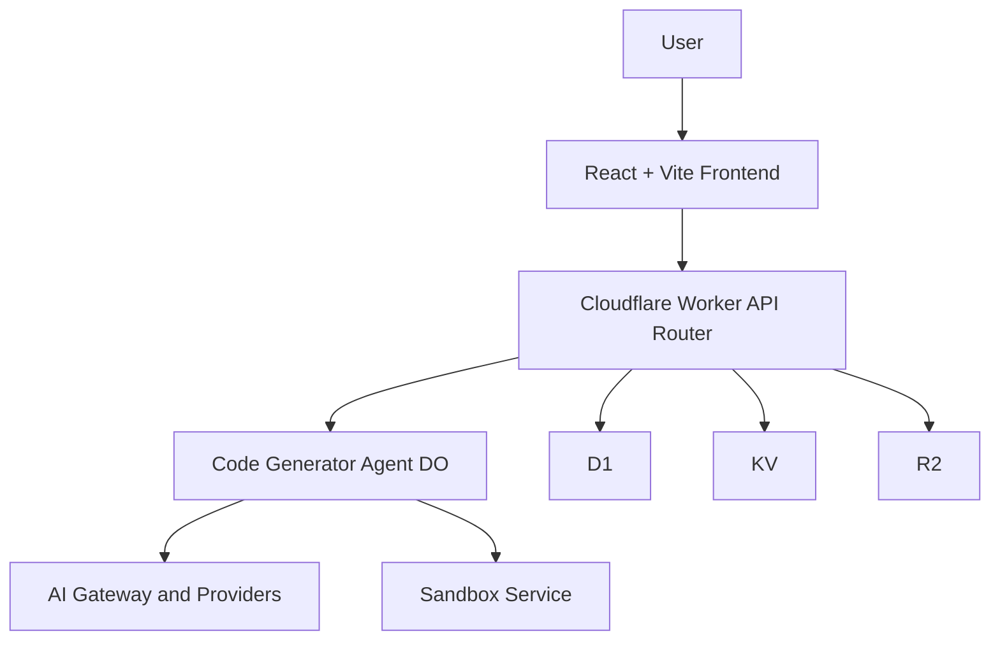

# Chapter 2: System Architecture

VibeSDK combines a React frontend, Worker API plane, Durable Object orchestration, and Cloudflare-managed infrastructure into one app-generation platform.

## Learning Goals

By the end of this chapter, you should be able to:

- explain how user requests become generated/deployed applications
- identify where state lives across the platform
- distinguish responsibilities between API, orchestration, and runtime layers
- navigate the main code locations confidently

## High-Level Topology

## Layer Responsibilities

| Layer | Core Responsibilities | Typical Code Locations |
|:------|:----------------------|:-----------------------|
| frontend | prompt input, live status UI, preview controls, auth UX | `src/` |
| API plane | request auth, routing, app/session endpoints | `worker/api/`, `worker/app.ts` |
| orchestration | phase engine, generation loops, state transitions | `worker/agents/` |
| data and infra | relational state, cache/session data, artifacts, runtime bindings | `wrangler.jsonc`, D1/KV/R2 bindings |
| execution runtime | preview container lifecycle, deployment actions | sandbox and dispatch service paths |

## Why Durable Objects Are Central

Generation sessions need ordered, stateful, resumable execution. Durable Objects provide per-session state and deterministic event handling so VibeSDK can support long-lived agent workflows without forcing fragile client-side orchestration.

## End-to-End Flow (Simplified)

1. user submits prompt from frontend
2. API validates identity/session and routes to agent
3. Durable Object agent runs blueprint and phase logic
4. model calls route through AI Gateway/provider config
5. generated output is assembled and sent to sandbox runtime
6. preview/deploy events stream back to UI in real time

## State Surfaces to Understand

| State Type | Where It Lives | Why It Matters |
|:-----------|:---------------|:---------------|
| user/app metadata | D1 | source of truth for account and app records |
| session/transient keys | KV | fast lookups and ephemeral coordination |
| generated assets/templates | R2 | persistent artifact storage and handoff |
| in-flight generation state | Durable Object state | continuity for active build sessions |

## Key Code Areas to Read First

- `worker/agents/` for orchestration internals
- `worker/api/` for control-plane contracts
- `worker/agents/inferutils/config.ts` for model routing setup
- `wrangler.jsonc` for Cloudflare binding topology
- `src/` for frontend event and status handling

## Architecture Review Checklist

Before extending the platform, verify:

- where new state should persist (D1 vs KV vs DO vs R2)
- whether the change belongs in API plane or agent orchestration
- how failures will surface back to user-facing status
- whether new dependencies alter deployment or permission requirements

## Source References

- [Architecture Diagrams](https://github.com/cloudflare/vibesdk/blob/main/docs/architecture-diagrams.md)
- [VibeSDK Repository](https://github.com/cloudflare/vibesdk)

## Summary

You now have a clear system map for VibeSDK and can reason about where to implement changes without cross-layer confusion.

Next: [Chapter 3: AI Pipeline and Phase Engine](03-ai-pipeline-and-phase-engine.md)
