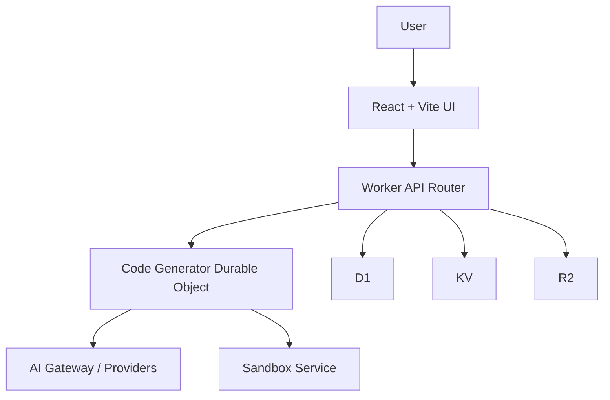

# Chapter 2: System Architecture

VibeSDK combines a React frontend, Worker API control plane, and Durable Object orchestration for long-running generation workflows.

## Topology

## Layer Responsibilities

| Layer | Components |
|:------|:-----------|
| frontend | routes, chat/workspace UI, preview controls |
| API plane | auth, routing, controller endpoints |
| orchestration | stateful generation agent and phase transitions |
| infra plane | D1/KV/R2, containers, dispatch namespaces |

## Why Durable Objects

The generation engine needs ordered event handling and session continuity. Durable Objects provide deterministic per-session state transitions without forcing client-side orchestration.

## Key Code Areas

- `worker/index.ts`, `worker/app.ts`
- `worker/agents/`
- `worker/api/`
- `wrangler.jsonc`
- `src/features/` and `src/routes/`

## Summary

You now understand where state, execution, and UI responsibilities are separated in VibeSDK.

Next: [Chapter 3: AI Pipeline and Phase Engine](03-ai-pipeline-and-phase-engine.md)
