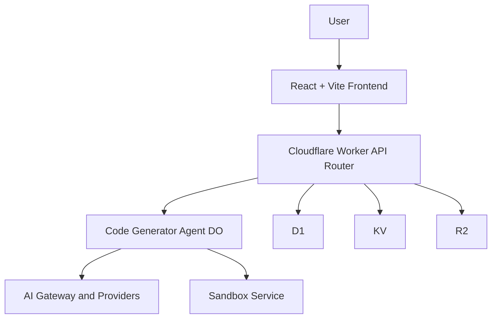

# Chapter 2: System Architecture

Welcome to **Chapter 2: System Architecture**. In this part of **VibeSDK Tutorial: Build a Vibe-Coding Platform on Cloudflare**, you will build an intuitive mental model first, then move into concrete implementation details and practical production tradeoffs.

VibeSDK combines a React frontend, Worker API plane, Durable Object orchestration, and Cloudflare-managed infrastructure into one app-generation platform.

## Learning Goals

By the end of this chapter, you should be able to:

- explain how user requests become generated/deployed applications
- identify where state lives across the platform
- distinguish responsibilities between API, orchestration, and runtime layers
- navigate the main code locations confidently

## High-Level Topology

## Layer Responsibilities

| Layer | Core Responsibilities | Typical Code Locations |
|:------|:----------------------|:-----------------------|
| frontend | prompt input, live status UI, preview controls, auth UX | `src/` |
| API plane | request auth, routing, app/session endpoints | `worker/api/`, `worker/app.ts` |
| orchestration | phase engine, generation loops, state transitions | `worker/agents/` |
| data and infra | relational state, cache/session data, artifacts, runtime bindings | `wrangler.jsonc`, D1/KV/R2 bindings |
| execution runtime | preview container lifecycle, deployment actions | sandbox and dispatch service paths |

## Why Durable Objects Are Central

Generation sessions need ordered, stateful, resumable execution. Durable Objects provide per-session state and deterministic event handling so VibeSDK can support long-lived agent workflows without forcing fragile client-side orchestration.

## End-to-End Flow (Simplified)

1. user submits prompt from frontend
2. API validates identity/session and routes to agent
3. Durable Object agent runs blueprint and phase logic
4. model calls route through AI Gateway/provider config
5. generated output is assembled and sent to sandbox runtime
6. preview/deploy events stream back to UI in real time

## State Surfaces to Understand

| State Type | Where It Lives | Why It Matters |
|:-----------|:---------------|:---------------|
| user/app metadata | D1 | source of truth for account and app records |
| session/transient keys | KV | fast lookups and ephemeral coordination |
| generated assets/templates | R2 | persistent artifact storage and handoff |
| in-flight generation state | Durable Object state | continuity for active build sessions |

## Key Code Areas to Read First

- `worker/agents/` for orchestration internals
- `worker/api/` for control-plane contracts
- `worker/agents/inferutils/config.ts` for model routing setup
- `wrangler.jsonc` for Cloudflare binding topology
- `src/` for frontend event and status handling

## Architecture Review Checklist

Before extending the platform, verify:

- where new state should persist (D1 vs KV vs DO vs R2)
- whether the change belongs in API plane or agent orchestration
- how failures will surface back to user-facing status
- whether new dependencies alter deployment or permission requirements

## Source References

- [Architecture Diagrams](https://github.com/cloudflare/vibesdk/blob/main/docs/architecture-diagrams.md)
- [VibeSDK Repository](https://github.com/cloudflare/vibesdk)

## Summary

You now have a clear system map for VibeSDK and can reason about where to implement changes without cross-layer confusion.

Next: [Chapter 3: AI Pipeline and Phase Engine](03-ai-pipeline-and-phase-engine.md)

## Depth Expansion Playbook

<!-- depth-expansion-v2 -->

This chapter is expanded to v1-style depth for production-grade learning and implementation quality.

### Strategic Context

- tutorial: **VibeSDK Tutorial: Build a Vibe-Coding Platform on Cloudflare**
- tutorial slug: **vibesdk-tutorial**
- chapter focus: **Chapter 2: System Architecture**
- system context: **Vibesdk Tutorial**
- objective: move from surface-level usage to repeatable engineering operation

### Architecture Decomposition

1. Define the runtime boundary for `Chapter 2: System Architecture`.
2. Separate control-plane decisions from data-plane execution.
3. Capture input contracts, transformation points, and output contracts.
4. Trace state transitions across request lifecycle stages.
5. Identify extension hooks and policy interception points.
6. Map ownership boundaries for team and automation workflows.
7. Specify rollback and recovery paths for unsafe changes.
8. Track observability signals for correctness, latency, and cost.

### Operator Decision Matrix

| Decision Area | Low-Risk Path | High-Control Path | Tradeoff |
|:--------------|:--------------|:------------------|:---------|
| Runtime mode | managed defaults | explicit policy config | speed vs control |
| State handling | local ephemeral | durable persisted state | simplicity vs auditability |
| Tool integration | direct API use | mediated adapter layer | velocity vs governance |
| Rollout method | manual change | staged + canary rollout | effort vs safety |
| Incident response | best effort logs | runbooks + SLO alerts | cost vs reliability |

### Failure Modes and Countermeasures

| Failure Mode | Early Signal | Root Cause Pattern | Countermeasure |
|:-------------|:-------------|:-------------------|:---------------|
| stale context | inconsistent outputs | missing refresh window | enforce context TTL and refresh hooks |
| policy drift | unexpected execution | ad hoc overrides | centralize policy profiles |
| auth mismatch | 401/403 bursts | credential sprawl | rotation schedule + scope minimization |
| schema breakage | parser/validation errors | unmanaged upstream changes | contract tests per release |
| retry storms | queue congestion | no backoff controls | jittered backoff + circuit breakers |
| silent regressions | quality drop without alerts | weak baseline metrics | eval harness with thresholds |

### Implementation Runbook

1. Establish a reproducible baseline environment.
2. Capture chapter-specific success criteria before changes.
3. Implement minimal viable path with explicit interfaces.
4. Add observability before expanding feature scope.
5. Run deterministic tests for happy-path behavior.
6. Inject failure scenarios for negative-path validation.
7. Compare output quality against baseline snapshots.
8. Promote through staged environments with rollback gates.
9. Record operational lessons in release notes.

### Quality Gate Checklist

- [ ] chapter-level assumptions are explicit and testable
- [ ] API/tool boundaries are documented with input/output examples
- [ ] failure handling includes retry, timeout, and fallback policy
- [ ] security controls include auth scopes and secret rotation plans
- [ ] observability includes logs, metrics, traces, and alert thresholds
- [ ] deployment guidance includes canary and rollback paths
- [ ] docs include links to upstream sources and related tracks
- [ ] post-release verification confirms expected behavior under load

### Source Alignment

- [VibeSDK Repository](https://github.com/cloudflare/vibesdk)
- [VibeSDK Releases](https://github.com/cloudflare/vibesdk/releases)
- [VibeSDK Setup Guide](https://github.com/cloudflare/vibesdk/blob/main/docs/setup.md)
- [VibeSDK SDK Documentation](https://github.com/cloudflare/vibesdk/blob/main/sdk/README.md)
- [Live Demo](https://build.cloudflare.dev/)

### Cross-Tutorial Connection Map

- [bolt.diy Tutorial](../bolt-diy-tutorial/)
- [Dyad Tutorial](../dyad-tutorial/)
- [Vercel AI Tutorial](../vercel-ai-tutorial/)
- [OpenHands Tutorial](../openhands-tutorial/)
- [Chapter 1: Getting Started and Deployment Paths](01-getting-started-and-deployment-paths.md)

### Advanced Practice Exercises

1. Build a minimal end-to-end implementation for `Chapter 2: System Architecture`.
2. Add instrumentation and measure baseline latency and error rate.
3. Introduce one controlled failure and confirm graceful recovery.
4. Add policy constraints and verify they are enforced consistently.
5. Run a staged rollout and document rollback decision criteria.

### Review Questions

1. Which execution boundary matters most for this chapter and why?
2. What signal detects regressions earliest in your environment?
3. What tradeoff did you make between delivery speed and governance?
4. How would you recover from the highest-impact failure mode?
5. What must be automated before scaling to team-wide adoption?

### Scenario Playbook 1: Chapter 2: System Architecture

- tutorial context: **VibeSDK Tutorial: Build a Vibe-Coding Platform on Cloudflare**
- trigger condition: incoming request volume spikes after release
- initial hypothesis: identify the smallest reproducible failure boundary
- immediate action: protect user-facing stability before optimization work
- engineering control: introduce adaptive concurrency limits and queue bounds
- verification target: latency p95 and p99 stay within defined SLO windows
- rollback trigger: pre-defined quality gate fails for two consecutive checks
- communication step: publish incident status with owner and ETA
- learning capture: add postmortem and convert findings into automated tests

### Scenario Playbook 2: Chapter 2: System Architecture

- tutorial context: **VibeSDK Tutorial: Build a Vibe-Coding Platform on Cloudflare**
- trigger condition: tool dependency latency increases under concurrency
- initial hypothesis: identify the smallest reproducible failure boundary
- immediate action: protect user-facing stability before optimization work
- engineering control: enable staged retries with jitter and circuit breaker fallback
- verification target: error budget burn rate remains below escalation threshold
- rollback trigger: pre-defined quality gate fails for two consecutive checks
- communication step: publish incident status with owner and ETA
- learning capture: add postmortem and convert findings into automated tests

### Scenario Playbook 3: Chapter 2: System Architecture

- tutorial context: **VibeSDK Tutorial: Build a Vibe-Coding Platform on Cloudflare**
- trigger condition: schema updates introduce incompatible payloads
- initial hypothesis: identify the smallest reproducible failure boundary
- immediate action: protect user-facing stability before optimization work
- engineering control: pin schema versions and add compatibility shims
- verification target: throughput remains stable under target concurrency
- rollback trigger: pre-defined quality gate fails for two consecutive checks
- communication step: publish incident status with owner and ETA
- learning capture: add postmortem and convert findings into automated tests

### Scenario Playbook 4: Chapter 2: System Architecture

- tutorial context: **VibeSDK Tutorial: Build a Vibe-Coding Platform on Cloudflare**
- trigger condition: environment parity drifts between staging and production
- initial hypothesis: identify the smallest reproducible failure boundary
- immediate action: protect user-facing stability before optimization work
- engineering control: restore environment parity via immutable config promotion
- verification target: retry volume stays bounded without feedback loops
- rollback trigger: pre-defined quality gate fails for two consecutive checks
- communication step: publish incident status with owner and ETA
- learning capture: add postmortem and convert findings into automated tests

### Scenario Playbook 5: Chapter 2: System Architecture

- tutorial context: **VibeSDK Tutorial: Build a Vibe-Coding Platform on Cloudflare**
- trigger condition: access policy changes reduce successful execution rates
- initial hypothesis: identify the smallest reproducible failure boundary
- immediate action: protect user-facing stability before optimization work
- engineering control: re-scope credentials and rotate leaked or stale keys
- verification target: data integrity checks pass across write/read cycles
- rollback trigger: pre-defined quality gate fails for two consecutive checks
- communication step: publish incident status with owner and ETA
- learning capture: add postmortem and convert findings into automated tests

### Scenario Playbook 6: Chapter 2: System Architecture

- tutorial context: **VibeSDK Tutorial: Build a Vibe-Coding Platform on Cloudflare**
- trigger condition: background jobs accumulate and exceed processing windows
- initial hypothesis: identify the smallest reproducible failure boundary
- immediate action: protect user-facing stability before optimization work
- engineering control: activate degradation mode to preserve core user paths
- verification target: audit logs capture all control-plane mutations
- rollback trigger: pre-defined quality gate fails for two consecutive checks
- communication step: publish incident status with owner and ETA
- learning capture: add postmortem and convert findings into automated tests

### Scenario Playbook 7: Chapter 2: System Architecture

- tutorial context: **VibeSDK Tutorial: Build a Vibe-Coding Platform on Cloudflare**
- trigger condition: incoming request volume spikes after release
- initial hypothesis: identify the smallest reproducible failure boundary
- immediate action: protect user-facing stability before optimization work
- engineering control: introduce adaptive concurrency limits and queue bounds
- verification target: latency p95 and p99 stay within defined SLO windows
- rollback trigger: pre-defined quality gate fails for two consecutive checks
- communication step: publish incident status with owner and ETA
- learning capture: add postmortem and convert findings into automated tests

### Scenario Playbook 8: Chapter 2: System Architecture

- tutorial context: **VibeSDK Tutorial: Build a Vibe-Coding Platform on Cloudflare**
- trigger condition: tool dependency latency increases under concurrency
- initial hypothesis: identify the smallest reproducible failure boundary
- immediate action: protect user-facing stability before optimization work
- engineering control: enable staged retries with jitter and circuit breaker fallback
- verification target: error budget burn rate remains below escalation threshold
- rollback trigger: pre-defined quality gate fails for two consecutive checks
- communication step: publish incident status with owner and ETA
- learning capture: add postmortem and convert findings into automated tests

### Scenario Playbook 9: Chapter 2: System Architecture

- tutorial context: **VibeSDK Tutorial: Build a Vibe-Coding Platform on Cloudflare**
- trigger condition: schema updates introduce incompatible payloads
- initial hypothesis: identify the smallest reproducible failure boundary
- immediate action: protect user-facing stability before optimization work
- engineering control: pin schema versions and add compatibility shims
- verification target: throughput remains stable under target concurrency
- rollback trigger: pre-defined quality gate fails for two consecutive checks
- communication step: publish incident status with owner and ETA
- learning capture: add postmortem and convert findings into automated tests

### Scenario Playbook 10: Chapter 2: System Architecture

- tutorial context: **VibeSDK Tutorial: Build a Vibe-Coding Platform on Cloudflare**
- trigger condition: environment parity drifts between staging and production
- initial hypothesis: identify the smallest reproducible failure boundary
- immediate action: protect user-facing stability before optimization work
- engineering control: restore environment parity via immutable config promotion
- verification target: retry volume stays bounded without feedback loops
- rollback trigger: pre-defined quality gate fails for two consecutive checks
- communication step: publish incident status with owner and ETA
- learning capture: add postmortem and convert findings into automated tests

### Scenario Playbook 11: Chapter 2: System Architecture

- tutorial context: **VibeSDK Tutorial: Build a Vibe-Coding Platform on Cloudflare**
- trigger condition: access policy changes reduce successful execution rates
- initial hypothesis: identify the smallest reproducible failure boundary
- immediate action: protect user-facing stability before optimization work
- engineering control: re-scope credentials and rotate leaked or stale keys
- verification target: data integrity checks pass across write/read cycles
- rollback trigger: pre-defined quality gate fails for two consecutive checks
- communication step: publish incident status with owner and ETA
- learning capture: add postmortem and convert findings into automated tests

### Scenario Playbook 12: Chapter 2: System Architecture

- tutorial context: **VibeSDK Tutorial: Build a Vibe-Coding Platform on Cloudflare**
- trigger condition: background jobs accumulate and exceed processing windows
- initial hypothesis: identify the smallest reproducible failure boundary
- immediate action: protect user-facing stability before optimization work
- engineering control: activate degradation mode to preserve core user paths
- verification target: audit logs capture all control-plane mutations
- rollback trigger: pre-defined quality gate fails for two consecutive checks
- communication step: publish incident status with owner and ETA
- learning capture: add postmortem and convert findings into automated tests

### Scenario Playbook 13: Chapter 2: System Architecture

- tutorial context: **VibeSDK Tutorial: Build a Vibe-Coding Platform on Cloudflare**
- trigger condition: incoming request volume spikes after release
- initial hypothesis: identify the smallest reproducible failure boundary
- immediate action: protect user-facing stability before optimization work
- engineering control: introduce adaptive concurrency limits and queue bounds
- verification target: latency p95 and p99 stay within defined SLO windows
- rollback trigger: pre-defined quality gate fails for two consecutive checks
- communication step: publish incident status with owner and ETA
- learning capture: add postmortem and convert findings into automated tests

### Scenario Playbook 14: Chapter 2: System Architecture

- tutorial context: **VibeSDK Tutorial: Build a Vibe-Coding Platform on Cloudflare**
- trigger condition: tool dependency latency increases under concurrency
- initial hypothesis: identify the smallest reproducible failure boundary
- immediate action: protect user-facing stability before optimization work
- engineering control: enable staged retries with jitter and circuit breaker fallback
- verification target: error budget burn rate remains below escalation threshold
- rollback trigger: pre-defined quality gate fails for two consecutive checks
- communication step: publish incident status with owner and ETA
- learning capture: add postmortem and convert findings into automated tests

### Scenario Playbook 15: Chapter 2: System Architecture

- tutorial context: **VibeSDK Tutorial: Build a Vibe-Coding Platform on Cloudflare**
- trigger condition: schema updates introduce incompatible payloads
- initial hypothesis: identify the smallest reproducible failure boundary
- immediate action: protect user-facing stability before optimization work
- engineering control: pin schema versions and add compatibility shims
- verification target: throughput remains stable under target concurrency
- rollback trigger: pre-defined quality gate fails for two consecutive checks
- communication step: publish incident status with owner and ETA
- learning capture: add postmortem and convert findings into automated tests

### Scenario Playbook 16: Chapter 2: System Architecture

- tutorial context: **VibeSDK Tutorial: Build a Vibe-Coding Platform on Cloudflare**
- trigger condition: environment parity drifts between staging and production
- initial hypothesis: identify the smallest reproducible failure boundary
- immediate action: protect user-facing stability before optimization work
- engineering control: restore environment parity via immutable config promotion
- verification target: retry volume stays bounded without feedback loops
- rollback trigger: pre-defined quality gate fails for two consecutive checks
- communication step: publish incident status with owner and ETA
- learning capture: add postmortem and convert findings into automated tests

### Scenario Playbook 17: Chapter 2: System Architecture

- tutorial context: **VibeSDK Tutorial: Build a Vibe-Coding Platform on Cloudflare**
- trigger condition: access policy changes reduce successful execution rates
- initial hypothesis: identify the smallest reproducible failure boundary
- immediate action: protect user-facing stability before optimization work
- engineering control: re-scope credentials and rotate leaked or stale keys
- verification target: data integrity checks pass across write/read cycles
- rollback trigger: pre-defined quality gate fails for two consecutive checks
- communication step: publish incident status with owner and ETA
- learning capture: add postmortem and convert findings into automated tests

### Scenario Playbook 18: Chapter 2: System Architecture

- tutorial context: **VibeSDK Tutorial: Build a Vibe-Coding Platform on Cloudflare**
- trigger condition: background jobs accumulate and exceed processing windows
- initial hypothesis: identify the smallest reproducible failure boundary
- immediate action: protect user-facing stability before optimization work
- engineering control: activate degradation mode to preserve core user paths
- verification target: audit logs capture all control-plane mutations
- rollback trigger: pre-defined quality gate fails for two consecutive checks
- communication step: publish incident status with owner and ETA
- learning capture: add postmortem and convert findings into automated tests

### Scenario Playbook 19: Chapter 2: System Architecture

- tutorial context: **VibeSDK Tutorial: Build a Vibe-Coding Platform on Cloudflare**
- trigger condition: incoming request volume spikes after release
- initial hypothesis: identify the smallest reproducible failure boundary
- immediate action: protect user-facing stability before optimization work
- engineering control: introduce adaptive concurrency limits and queue bounds
- verification target: latency p95 and p99 stay within defined SLO windows
- rollback trigger: pre-defined quality gate fails for two consecutive checks
- communication step: publish incident status with owner and ETA
- learning capture: add postmortem and convert findings into automated tests

### Scenario Playbook 20: Chapter 2: System Architecture

- tutorial context: **VibeSDK Tutorial: Build a Vibe-Coding Platform on Cloudflare**
- trigger condition: tool dependency latency increases under concurrency
- initial hypothesis: identify the smallest reproducible failure boundary
- immediate action: protect user-facing stability before optimization work
- engineering control: enable staged retries with jitter and circuit breaker fallback
- verification target: error budget burn rate remains below escalation threshold
- rollback trigger: pre-defined quality gate fails for two consecutive checks
- communication step: publish incident status with owner and ETA
- learning capture: add postmortem and convert findings into automated tests

### Scenario Playbook 21: Chapter 2: System Architecture

- tutorial context: **VibeSDK Tutorial: Build a Vibe-Coding Platform on Cloudflare**
- trigger condition: schema updates introduce incompatible payloads
- initial hypothesis: identify the smallest reproducible failure boundary
- immediate action: protect user-facing stability before optimization work
- engineering control: pin schema versions and add compatibility shims
- verification target: throughput remains stable under target concurrency
- rollback trigger: pre-defined quality gate fails for two consecutive checks
- communication step: publish incident status with owner and ETA
- learning capture: add postmortem and convert findings into automated tests

### Scenario Playbook 22: Chapter 2: System Architecture

- tutorial context: **VibeSDK Tutorial: Build a Vibe-Coding Platform on Cloudflare**
- trigger condition: environment parity drifts between staging and production
- initial hypothesis: identify the smallest reproducible failure boundary
- immediate action: protect user-facing stability before optimization work
- engineering control: restore environment parity via immutable config promotion
- verification target: retry volume stays bounded without feedback loops
- rollback trigger: pre-defined quality gate fails for two consecutive checks
- communication step: publish incident status with owner and ETA
- learning capture: add postmortem and convert findings into automated tests

### Scenario Playbook 23: Chapter 2: System Architecture

- tutorial context: **VibeSDK Tutorial: Build a Vibe-Coding Platform on Cloudflare**
- trigger condition: access policy changes reduce successful execution rates
- initial hypothesis: identify the smallest reproducible failure boundary
- immediate action: protect user-facing stability before optimization work
- engineering control: re-scope credentials and rotate leaked or stale keys
- verification target: data integrity checks pass across write/read cycles
- rollback trigger: pre-defined quality gate fails for two consecutive checks
- communication step: publish incident status with owner and ETA
- learning capture: add postmortem and convert findings into automated tests

### Scenario Playbook 24: Chapter 2: System Architecture

- tutorial context: **VibeSDK Tutorial: Build a Vibe-Coding Platform on Cloudflare**
- trigger condition: background jobs accumulate and exceed processing windows
- initial hypothesis: identify the smallest reproducible failure boundary
- immediate action: protect user-facing stability before optimization work
- engineering control: activate degradation mode to preserve core user paths
- verification target: audit logs capture all control-plane mutations
- rollback trigger: pre-defined quality gate fails for two consecutive checks
- communication step: publish incident status with owner and ETA
- learning capture: add postmortem and convert findings into automated tests

### Scenario Playbook 25: Chapter 2: System Architecture

- tutorial context: **VibeSDK Tutorial: Build a Vibe-Coding Platform on Cloudflare**
- trigger condition: incoming request volume spikes after release
- initial hypothesis: identify the smallest reproducible failure boundary
- immediate action: protect user-facing stability before optimization work
- engineering control: introduce adaptive concurrency limits and queue bounds
- verification target: latency p95 and p99 stay within defined SLO windows
- rollback trigger: pre-defined quality gate fails for two consecutive checks
- communication step: publish incident status with owner and ETA
- learning capture: add postmortem and convert findings into automated tests

### Scenario Playbook 26: Chapter 2: System Architecture

- tutorial context: **VibeSDK Tutorial: Build a Vibe-Coding Platform on Cloudflare**
- trigger condition: tool dependency latency increases under concurrency
- initial hypothesis: identify the smallest reproducible failure boundary
- immediate action: protect user-facing stability before optimization work
- engineering control: enable staged retries with jitter and circuit breaker fallback
- verification target: error budget burn rate remains below escalation threshold
- rollback trigger: pre-defined quality gate fails for two consecutive checks
- communication step: publish incident status with owner and ETA
- learning capture: add postmortem and convert findings into automated tests

### Scenario Playbook 27: Chapter 2: System Architecture

- tutorial context: **VibeSDK Tutorial: Build a Vibe-Coding Platform on Cloudflare**
- trigger condition: schema updates introduce incompatible payloads
- initial hypothesis: identify the smallest reproducible failure boundary
- immediate action: protect user-facing stability before optimization work
- engineering control: pin schema versions and add compatibility shims
- verification target: throughput remains stable under target concurrency
- rollback trigger: pre-defined quality gate fails for two consecutive checks
- communication step: publish incident status with owner and ETA
- learning capture: add postmortem and convert findings into automated tests

### Scenario Playbook 28: Chapter 2: System Architecture

- tutorial context: **VibeSDK Tutorial: Build a Vibe-Coding Platform on Cloudflare**
- trigger condition: environment parity drifts between staging and production
- initial hypothesis: identify the smallest reproducible failure boundary
- immediate action: protect user-facing stability before optimization work
- engineering control: restore environment parity via immutable config promotion
- verification target: retry volume stays bounded without feedback loops
- rollback trigger: pre-defined quality gate fails for two consecutive checks
- communication step: publish incident status with owner and ETA
- learning capture: add postmortem and convert findings into automated tests

### Scenario Playbook 29: Chapter 2: System Architecture

- tutorial context: **VibeSDK Tutorial: Build a Vibe-Coding Platform on Cloudflare**
- trigger condition: access policy changes reduce successful execution rates
- initial hypothesis: identify the smallest reproducible failure boundary
- immediate action: protect user-facing stability before optimization work
- engineering control: re-scope credentials and rotate leaked or stale keys
- verification target: data integrity checks pass across write/read cycles
- rollback trigger: pre-defined quality gate fails for two consecutive checks
- communication step: publish incident status with owner and ETA
- learning capture: add postmortem and convert findings into automated tests

### Scenario Playbook 30: Chapter 2: System Architecture

- tutorial context: **VibeSDK Tutorial: Build a Vibe-Coding Platform on Cloudflare**
- trigger condition: background jobs accumulate and exceed processing windows
- initial hypothesis: identify the smallest reproducible failure boundary
- immediate action: protect user-facing stability before optimization work
- engineering control: activate degradation mode to preserve core user paths
- verification target: audit logs capture all control-plane mutations
- rollback trigger: pre-defined quality gate fails for two consecutive checks
- communication step: publish incident status with owner and ETA
- learning capture: add postmortem and convert findings into automated tests

### Scenario Playbook 31: Chapter 2: System Architecture

- tutorial context: **VibeSDK Tutorial: Build a Vibe-Coding Platform on Cloudflare**
- trigger condition: incoming request volume spikes after release
- initial hypothesis: identify the smallest reproducible failure boundary
- immediate action: protect user-facing stability before optimization work
- engineering control: introduce adaptive concurrency limits and queue bounds
- verification target: latency p95 and p99 stay within defined SLO windows
- rollback trigger: pre-defined quality gate fails for two consecutive checks
- communication step: publish incident status with owner and ETA
- learning capture: add postmortem and convert findings into automated tests

### Scenario Playbook 32: Chapter 2: System Architecture

- tutorial context: **VibeSDK Tutorial: Build a Vibe-Coding Platform on Cloudflare**
- trigger condition: tool dependency latency increases under concurrency
- initial hypothesis: identify the smallest reproducible failure boundary
- immediate action: protect user-facing stability before optimization work
- engineering control: enable staged retries with jitter and circuit breaker fallback
- verification target: error budget burn rate remains below escalation threshold
- rollback trigger: pre-defined quality gate fails for two consecutive checks
- communication step: publish incident status with owner and ETA
- learning capture: add postmortem and convert findings into automated tests

### Scenario Playbook 33: Chapter 2: System Architecture

- tutorial context: **VibeSDK Tutorial: Build a Vibe-Coding Platform on Cloudflare**
- trigger condition: schema updates introduce incompatible payloads
- initial hypothesis: identify the smallest reproducible failure boundary
- immediate action: protect user-facing stability before optimization work
- engineering control: pin schema versions and add compatibility shims
- verification target: throughput remains stable under target concurrency
- rollback trigger: pre-defined quality gate fails for two consecutive checks
- communication step: publish incident status with owner and ETA
- learning capture: add postmortem and convert findings into automated tests

## What Problem Does This Solve?

Most teams struggle here because the hard part is not writing more code, but deciding clear boundaries for `graph`, `User`, `React` so behavior stays predictable as complexity grows.

In practical terms, this chapter helps you avoid three common failures:

- coupling core logic too tightly to one implementation path
- missing the handoff boundaries between setup, execution, and validation
- shipping changes without clear rollback or observability strategy

After working through this chapter, you should be able to reason about `Chapter 2: System Architecture` as an operating subsystem inside **VibeSDK Tutorial: Build a Vibe-Coding Platform on Cloudflare**, with explicit contracts for inputs, state transitions, and outputs.

Use the implementation notes around `Vite`, `Frontend`, `Cloudflare` as your checklist when adapting these patterns to your own repository.

## How it Works Under the Hood

Under the hood, `Chapter 2: System Architecture` usually follows a repeatable control path:

1. **Context bootstrap**: initialize runtime config and prerequisites for `graph`.
2. **Input normalization**: shape incoming data so `User` receives stable contracts.
3. **Core execution**: run the main logic branch and propagate intermediate state through `React`.
4. **Policy and safety checks**: enforce limits, auth scopes, and failure boundaries.
5. **Output composition**: return canonical result payloads for downstream consumers.
6. **Operational telemetry**: emit logs/metrics needed for debugging and performance tuning.

When debugging, walk this sequence in order and confirm each stage has explicit success/failure conditions.

## Source Walkthrough

Use the following upstream sources to verify implementation details while reading this chapter:

- [VibeSDK Repository](https://github.com/cloudflare/vibesdk)
  Why it matters: authoritative reference on `VibeSDK Repository` (github.com).
- [VibeSDK Releases](https://github.com/cloudflare/vibesdk/releases)
  Why it matters: authoritative reference on `VibeSDK Releases` (github.com).
- [VibeSDK Setup Guide](https://github.com/cloudflare/vibesdk/blob/main/docs/setup.md)
  Why it matters: authoritative reference on `VibeSDK Setup Guide` (github.com).
- [VibeSDK SDK Documentation](https://github.com/cloudflare/vibesdk/blob/main/sdk/README.md)
  Why it matters: authoritative reference on `VibeSDK SDK Documentation` (github.com).
- [Live Demo](https://build.cloudflare.dev/)
  Why it matters: authoritative reference on `Live Demo` (build.cloudflare.dev).

Suggested trace strategy:
- search upstream code for `graph` and `User` to map concrete implementation paths
- compare docs claims against actual runtime/config code before reusing patterns in production

## Chapter Connections

- [Tutorial Index](index.md)
- [Previous Chapter: Chapter 1: Getting Started and Deployment Paths](01-getting-started-and-deployment-paths.md)
- [Next Chapter: Chapter 3: AI Pipeline and Phase Engine](03-ai-pipeline-and-phase-engine.md)
- [Main Catalog](../../README.md#-tutorial-catalog)
- [A-Z Tutorial Directory](../../discoverability/tutorial-directory.md)
