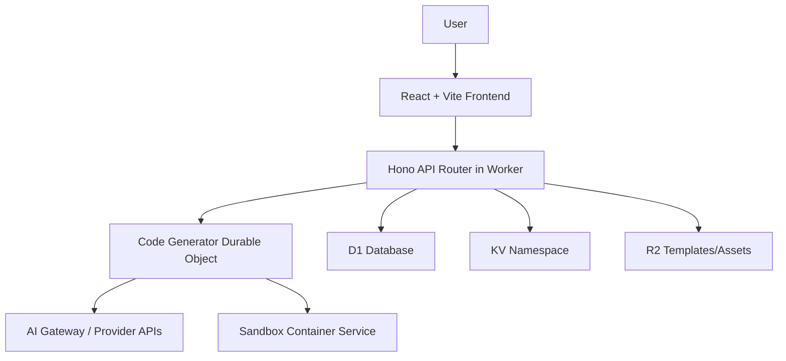

# Chapter 2: System Architecture

VibeSDK uses a split architecture: React UI on the front, Worker APIs in the middle, and Durable Object agents coordinating generation state.

## High-Level Topology

## Runtime Layers

| Layer | Primary Components |
|:------|:-------------------|
| UI | React routes, chat workspace, live preview panel |
| API | Worker router, auth middleware, platform controllers |
| Agent orchestration | `CodeGeneratorAgent` state machine in Durable Objects |
| Infrastructure | D1, KV, R2, dispatch namespaces, containers |

## Why Durable Objects Matter Here

The generation lifecycle is multi-step and stateful. Durable Objects give each active session consistent state, ordered events, and deterministic transitions across phase updates.

## Key Files to Read First

- `worker/index.ts` and `worker/app.ts`
- `worker/agents/`
- `wrangler.jsonc`
- `src/routes/` and `src/features/`

## Tradeoffs

- strong Cloudflare-native integration speeds platform assembly
- platform coupling increases migration cost if you leave the stack
- persistent agent state simplifies operations but requires strict versioned migrations

## Summary

You now understand where VibeSDK's UI, APIs, orchestration logic, and storage responsibilities live.

Next: [Chapter 3: AI Pipeline and Phase Engine](03-ai-pipeline-and-phase-engine.md)
